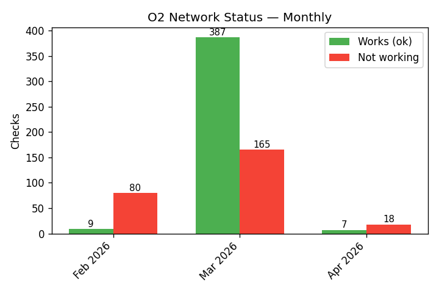

# O2 Live-Check Log

| Date | Time | TZ | Address | Status | Result |
| --- | --- | --- | --- | --- | --- |
| 7 Feb 2026 | 01:11 | Berlin | Egger Straße, 94469 Deggendorf, Deutschland | outage | Ergebnis für: Egger Straße, 94469 Deggendorf Eine Basisstation in der Nähe funktioniert im Moment nicht einwandfrei. - Der technische Support arbeitet an der Wiederherstellung der vollständigen Netzfunktionalität Für eine schnelle Lösung helfen oft auch folgende Tipps: - Handy neu starten - Prüfen, ob „Nicht stören“, „Ruhe“ bzw. „Flugmodus“ aktiviert ist - Sicherstellen, dass „Mobile Daten“ aktiviert sind - WLAN-Anrufe aktivieren Update um 01:06 (halbstündliche bis einstündliche Aktualisierung). Möchtest du mehr zu den Tipps erfahren? Auf unserer Hilfeseite haben wir weitere Informationen für dich bereitgestelt. Ich bin von dieser Störung betroffen bzw. möchte eine Störung melden und darüber auf dem Laufenden gehalten werden Jetzt melden |
| 7 Feb 2026 | 01:15 | Berlin | Egger Straße, 94469 Deggendorf, Deutschland | outage | Ergebnis für: Egger Straße, 94469 Deggendorf Eine Basisstation in der Nähe funktioniert im Moment nicht einwandfrei. - Der technische Support arbeitet an der Wiederherstellung der vollständigen Netzfunktionalität Für eine schnelle Lösung helfen oft auch folgende Tipps: - Handy neu starten - Prüfen, ob „Nicht stören“, „Ruhe“ bzw. „Flugmodus“ aktiviert ist - Sicherstellen, dass „Mobile Daten“ aktiviert sind - WLAN-Anrufe aktivieren Update um 01:06 (halbstündliche bis einstündliche Aktualisierung). Möchtest du mehr zu den Tipps erfahren? Auf unserer Hilfeseite haben wir weitere Informationen für dich bereitgestelt. Ich bin von dieser Störung betroffen bzw. möchte eine Störung melden und darüber auf dem Laufenden gehalten werden Jetzt melden |
| 7 Feb 2026 | 02:45 | Berlin | Egger Straße, 94469 Deggendorf, Deutschland | outage | Ergebnis für: Egger Straße, 94469 Deggendorf Eine Basisstation in der Nähe funktioniert im Moment nicht einwandfrei. - Der technische Support arbeitet an der Wiederherstellung der vollständigen Netzfunktionalität Für eine schnelle Lösung helfen oft auch folgende Tipps: - Handy neu starten - Prüfen, ob „Nicht stören“, „Ruhe“ bzw. „Flugmodus“ aktiviert ist - Sicherstellen, dass „Mobile Daten“ aktiviert sind - WLAN-Anrufe aktivieren Update um 02:36 (halbstündliche bis einstündliche Aktualisierung). Möchtest du mehr zu den Tipps erfahren? Auf unserer Hilfeseite haben wir weitere Informationen für dich bereitgestelt. Ich bin von dieser Störung betroffen bzw. möchte eine Störung melden und darüber auf dem Laufenden gehalten werden Jetzt melden |
| 7 Feb 2026 | 07:38 | Berlin | Egger Straße, 94469 Deggendorf, Deutschland | outage | Ergebnis für: Egger Straße, 94469 Deggendorf Eine Basisstation in der Nähe funktioniert im Moment nicht einwandfrei. - Der technische Support arbeitet an der Wiederherstellung der vollständigen Netzfunktionalität Für eine schnelle Lösung helfen oft auch folgende Tipps: - Handy neu starten - Prüfen, ob „Nicht stören“, „Ruhe“ bzw. „Flugmodus“ aktiviert ist - Sicherstellen, dass „Mobile Daten“ aktiviert sind - WLAN-Anrufe aktivieren Update um 07:36 (halbstündliche bis einstündliche Aktualisierung). Möchtest du mehr zu den Tipps erfahren? Auf unserer Hilfeseite haben wir weitere Informationen für dich bereitgestelt. Ich bin von dieser Störung betroffen bzw. möchte eine Störung melden und darüber auf dem Laufenden gehalten werden Jetzt melden |
| 7 Feb 2026 | 13:41 | Berlin | Egger Straße, 94469 Deggendorf, Deutschland | outage | Ergebnis für: Egger Straße, 94469 Deggendorf Eine Basisstation in der Nähe funktioniert im Moment nicht einwandfrei. - Der technische Support arbeitet an der Wiederherstellung der vollständigen Netzfunktionalität Für eine schnelle Lösung helfen oft auch folgende Tipps: - Handy neu starten - Prüfen, ob „Nicht stören“, „Ruhe“ bzw. „Flugmodus“ aktiviert ist - Sicherstellen, dass „Mobile Daten“ aktiviert sind - WLAN-Anrufe aktivieren Update um 13:35 (halbstündliche bis einstündliche Aktualisierung). Möchtest du mehr zu den Tipps erfahren? Auf unserer Hilfeseite haben wir weitere Informationen für dich bereitgestelt. Ich bin von dieser Störung betroffen bzw. möchte eine Störung melden und darüber auf dem Laufenden gehalten werden Jetzt melden |
| 7 Feb 2026 | 19:31 | Berlin | Egger Straße, 94469 Deggendorf, Deutschland | outage | Ergebnis für: Egger Straße, 94469 Deggendorf Eine Basisstation in der Nähe funktioniert im Moment nicht einwandfrei. - Der technische Support arbeitet an der Wiederherstellung der vollständigen Netzfunktionalität Für eine schnelle Lösung helfen oft auch folgende Tipps: - Handy neu starten - Prüfen, ob „Nicht stören“, „Ruhe“ bzw. „Flugmodus“ aktiviert ist - Sicherstellen, dass „Mobile Daten“ aktiviert sind - WLAN-Anrufe aktivieren Update um 19:06 (halbstündliche bis einstündliche Aktualisierung). Möchtest du mehr zu den Tipps erfahren? Auf unserer Hilfeseite haben wir weitere Informationen für dich bereitgestelt. Ich bin von dieser Störung betroffen bzw. möchte eine Störung melden und darüber auf dem Laufenden gehalten werden Jetzt melden |
| 8 Feb 2026 | 03:11 | Berlin | Egger Straße, 94469 Deggendorf, Deutschland | outage | Ergebnis für: Egger Straße, 94469 Deggendorf Eine Basisstation in der Nähe funktioniert im Moment nicht einwandfrei. - Der technische Support arbeitet an der Wiederherstellung der vollständigen Netzfunktionalität Für eine schnelle Lösung helfen oft auch folgende Tipps: - Handy neu starten - Prüfen, ob „Nicht stören“, „Ruhe“ bzw. „Flugmodus“ aktiviert ist - Sicherstellen, dass „Mobile Daten“ aktiviert sind - WLAN-Anrufe aktivieren Update um 03:06 (halbstündliche bis einstündliche Aktualisierung). Möchtest du mehr zu den Tipps erfahren? Auf unserer Hilfeseite haben wir weitere Informationen für dich bereitgestelt. Ich bin von dieser Störung betroffen bzw. möchte eine Störung melden und darüber auf dem Laufenden gehalten werden Jetzt melden |
| 8 Feb 2026 | 07:45 | Berlin | Egger Straße, 94469 Deggendorf, Deutschland | outage | Ergebnis für: Egger Straße, 94469 Deggendorf Eine Basisstation in der Nähe funktioniert im Moment nicht einwandfrei. - Der technische Support arbeitet an der Wiederherstellung der vollständigen Netzfunktionalität Für eine schnelle Lösung helfen oft auch folgende Tipps: - Handy neu starten - Prüfen, ob „Nicht stören“, „Ruhe“ bzw. „Flugmodus“ aktiviert ist - Sicherstellen, dass „Mobile Daten“ aktiviert sind - WLAN-Anrufe aktivieren Update um 07:36 (halbstündliche bis einstündliche Aktualisierung). Möchtest du mehr zu den Tipps erfahren? Auf unserer Hilfeseite haben wir weitere Informationen für dich bereitgestelt. Ich bin von dieser Störung betroffen bzw. möchte eine Störung melden und darüber auf dem Laufenden gehalten werden Jetzt melden |
| 8 Feb 2026 | 13:42 | Berlin | Egger Straße, 94469 Deggendorf, Deutschland | outage | Ergebnis für: Egger Straße, 94469 Deggendorf Eine Basisstation in der Nähe funktioniert im Moment nicht einwandfrei. - Der technische Support arbeitet an der Wiederherstellung der vollständigen Netzfunktionalität Für eine schnelle Lösung helfen oft auch folgende Tipps: - Handy neu starten - Prüfen, ob „Nicht stören“, „Ruhe“ bzw. „Flugmodus“ aktiviert ist - Sicherstellen, dass „Mobile Daten“ aktiviert sind - WLAN-Anrufe aktivieren Update um 13:36 (halbstündliche bis einstündliche Aktualisierung). Möchtest du mehr zu den Tipps erfahren? Auf unserer Hilfeseite haben wir weitere Informationen für dich bereitgestelt. Ich bin von dieser Störung betroffen bzw. möchte eine Störung melden und darüber auf dem Laufenden gehalten werden Jetzt melden |
| 8 Feb 2026 | 19:32 | Berlin | Egger Straße, 94469 Deggendorf, Deutschland | outage | Ergebnis für: Egger Straße, 94469 Deggendorf Eine Basisstation in der Nähe funktioniert im Moment nicht einwandfrei. - Der technische Support arbeitet an der Wiederherstellung der vollständigen Netzfunktionalität Für eine schnelle Lösung helfen oft auch folgende Tipps: - Handy neu starten - Prüfen, ob „Nicht stören“, „Ruhe“ bzw. „Flugmodus“ aktiviert ist - Sicherstellen, dass „Mobile Daten“ aktiviert sind - WLAN-Anrufe aktivieren Update um 19:06 (halbstündliche bis einstündliche Aktualisierung). Möchtest du mehr zu den Tipps erfahren? Auf unserer Hilfeseite haben wir weitere Informationen für dich bereitgestelt. Ich bin von dieser Störung betroffen bzw. möchte eine Störung melden und darüber auf dem Laufenden gehalten werden Jetzt melden |
| 9 Feb 2026 | 02:56 | Berlin | Egger Straße, 94469 Deggendorf, Deutschland | outage | Ergebnis für: Egger Straße, 94469 Deggendorf Eine Basisstation in der Nähe funktioniert im Moment nicht einwandfrei. - Der technische Support arbeitet an der Wiederherstellung der vollständigen Netzfunktionalität Für eine schnelle Lösung helfen oft auch folgende Tipps: - Handy neu starten - Prüfen, ob „Nicht stören“, „Ruhe“ bzw. „Flugmodus“ aktiviert ist - Sicherstellen, dass „Mobile Daten“ aktiviert sind - WLAN-Anrufe aktivieren Update um 02:36 (halbstündliche bis einstündliche Aktualisierung). Möchtest du mehr zu den Tipps erfahren? Auf unserer Hilfeseite haben wir weitere Informationen für dich bereitgestelt. Ich bin von dieser Störung betroffen bzw. möchte eine Störung melden und darüber auf dem Laufenden gehalten werden Jetzt melden |
| 9 Feb 2026 | 08:01 | Berlin | Egger Straße, 94469 Deggendorf, Deutschland | outage | Ergebnis für: Egger Straße, 94469 Deggendorf Eine Basisstation in der Nähe funktioniert im Moment nicht einwandfrei. - Der technische Support arbeitet an der Wiederherstellung der vollständigen Netzfunktionalität Für eine schnelle Lösung helfen oft auch folgende Tipps: - Handy neu starten - Prüfen, ob „Nicht stören“, „Ruhe“ bzw. „Flugmodus“ aktiviert ist - Sicherstellen, dass „Mobile Daten“ aktiviert sind - WLAN-Anrufe aktivieren Update um 07:36 (halbstündliche bis einstündliche Aktualisierung). Möchtest du mehr zu den Tipps erfahren? Auf unserer Hilfeseite haben wir weitere Informationen für dich bereitgestelt. Ich bin von dieser Störung betroffen bzw. möchte eine Störung melden und darüber auf dem Laufenden gehalten werden Jetzt melden |
| 9 Feb 2026 | 14:02 | Berlin | Egger Straße, 94469 Deggendorf, Deutschland | error |  |
| 10 Feb 2026 | 06:50 | Berlin | Egger Straße, 94469 Deggendorf, Deutschland | outage | Ergebnis für: Egger Straße, 94469 Deggendorf Eine Basisstation in der Nähe meldet Einschränkungen. Telefonieren und surfen mag möglicherweise nicht einwandfrei funktionieren. Der Grund ist entweder eine Überlastsituation, also zu viele Mobilfunknutzer gleichzeitig in einem bestimmten Bereich. Oder es handelt sich hier um eine andere Störung. Für eine schnelle Lösung helfen oft auch folgende Tipps: - Handy neu starten - Prüfen, ob „Nicht stören“, „Ruhe“ bzw. „Flugmodus“ aktiviert ist - Sicherstellen, dass „Mobile Daten“ aktiviert sind - WLAN-Anrufe aktivieren Update um 06:36 (halbstündliche bis einstündliche Aktualisierung). Möchtest du mehr zu den Tipps erfahren? Auf unserer Hilfeseite haben wir weitere Informationen für dich bereitgestelt. Ich bin von dieser Störung betroffen bzw. möchte eine Störung melden und darüber auf dem Laufenden gehalten werden Jetzt melden |
| 10 Feb 2026 | 08:00 | Berlin | Egger Straße, 94469 Deggendorf, Deutschland | outage | Ergebnis für: Egger Straße, 94469 Deggendorf Eine Basisstation in der Nähe meldet Einschränkungen. Telefonieren und surfen mag möglicherweise nicht einwandfrei funktionieren. Der Grund ist entweder eine Überlastsituation, also zu viele Mobilfunknutzer gleichzeitig in einem bestimmten Bereich. Oder es handelt sich hier um eine andere Störung. Für eine schnelle Lösung helfen oft auch folgende Tipps: - Handy neu starten - Prüfen, ob „Nicht stören“, „Ruhe“ bzw. „Flugmodus“ aktiviert ist - Sicherstellen, dass „Mobile Daten“ aktiviert sind - WLAN-Anrufe aktivieren Update um 07:36 (halbstündliche bis einstündliche Aktualisierung). Möchtest du mehr zu den Tipps erfahren? Auf unserer Hilfeseite haben wir weitere Informationen für dich bereitgestelt. Ich bin von dieser Störung betroffen bzw. möchte eine Störung melden und darüber auf dem Laufenden gehalten werden Jetzt melden |
| 10 Feb 2026 | 14:05 | Berlin | Egger Straße, 94469 Deggendorf, Deutschland | outage | Ergebnis für: Egger Straße, 94469 Deggendorf Eine Basisstation in der Nähe meldet Einschränkungen. Telefonieren und surfen mag möglicherweise nicht einwandfrei funktionieren. Der Grund ist entweder eine Überlastsituation, also zu viele Mobilfunknutzer gleichzeitig in einem bestimmten Bereich. Oder es handelt sich hier um eine andere Störung. Für eine schnelle Lösung helfen oft auch folgende Tipps: - Handy neu starten - Prüfen, ob „Nicht stören“, „Ruhe“ bzw. „Flugmodus“ aktiviert ist - Sicherstellen, dass „Mobile Daten“ aktiviert sind - WLAN-Anrufe aktivieren Update um 13:36 (halbstündliche bis einstündliche Aktualisierung). Möchtest du mehr zu den Tipps erfahren? Auf unserer Hilfeseite haben wir weitere Informationen für dich bereitgestelt. Ich bin von dieser Störung betroffen bzw. möchte eine Störung melden und darüber auf dem Laufenden gehalten werden Jetzt melden |
| 10 Feb 2026 | 20:02 | Berlin | Egger Straße, 94469 Deggendorf, Deutschland | outage | Ergebnis für: Egger Straße, 94469 Deggendorf Eine Basisstation in der Nähe meldet Einschränkungen. Telefonieren und surfen mag möglicherweise nicht einwandfrei funktionieren. Der Grund ist entweder eine Überlastsituation, also zu viele Mobilfunknutzer gleichzeitig in einem bestimmten Bereich. Oder es handelt sich hier um eine andere Störung. Für eine schnelle Lösung helfen oft auch folgende Tipps: - Handy neu starten - Prüfen, ob „Nicht stören“, „Ruhe“ bzw. „Flugmodus“ aktiviert ist - Sicherstellen, dass „Mobile Daten“ aktiviert sind - WLAN-Anrufe aktivieren Update um 19:36 (halbstündliche bis einstündliche Aktualisierung). Möchtest du mehr zu den Tipps erfahren? Auf unserer Hilfeseite haben wir weitere Informationen für dich bereitgestelt. Ich bin von dieser Störung betroffen bzw. möchte eine Störung melden und darüber auf dem Laufenden gehalten werden Jetzt melden |
| 11 Feb 2026 | 03:02 | Berlin | Egger Straße, 94469 Deggendorf, Deutschland | outage | Ergebnis für: Egger Straße, 94469 Deggendorf Eine Basisstation in der Nähe meldet Einschränkungen. Telefonieren und surfen mag möglicherweise nicht einwandfrei funktionieren. Der Grund ist entweder eine Überlastsituation, also zu viele Mobilfunknutzer gleichzeitig in einem bestimmten Bereich. Oder es handelt sich hier um eine andere Störung. Für eine schnelle Lösung helfen oft auch folgende Tipps: - Handy neu starten - Prüfen, ob „Nicht stören“, „Ruhe“ bzw. „Flugmodus“ aktiviert ist - Sicherstellen, dass „Mobile Daten“ aktiviert sind - WLAN-Anrufe aktivieren Update um 02:36 (halbstündliche bis einstündliche Aktualisierung). Möchtest du mehr zu den Tipps erfahren? Auf unserer Hilfeseite haben wir weitere Informationen für dich bereitgestelt. Ich bin von dieser Störung betroffen bzw. möchte eine Störung melden und darüber auf dem Laufenden gehalten werden Jetzt melden |
| 11 Feb 2026 | 07:58 | Berlin | Egger Straße, 94469 Deggendorf, Deutschland | outage | Ergebnis für: Egger Straße, 94469 Deggendorf Eine Basisstation in der Nähe meldet Einschränkungen. Telefonieren und surfen mag möglicherweise nicht einwandfrei funktionieren. Der Grund ist entweder eine Überlastsituation, also zu viele Mobilfunknutzer gleichzeitig in einem bestimmten Bereich. Oder es handelt sich hier um eine andere Störung. Für eine schnelle Lösung helfen oft auch folgende Tipps: - Handy neu starten - Prüfen, ob „Nicht stören“, „Ruhe“ bzw. „Flugmodus“ aktiviert ist - Sicherstellen, dass „Mobile Daten“ aktiviert sind - WLAN-Anrufe aktivieren Update um 07:36 (halbstündliche bis einstündliche Aktualisierung). Möchtest du mehr zu den Tipps erfahren? Auf unserer Hilfeseite haben wir weitere Informationen für dich bereitgestelt. Ich bin von dieser Störung betroffen bzw. möchte eine Störung melden und darüber auf dem Laufenden gehalten werden Jetzt melden |
| 11 Feb 2026 | 14:02 | Berlin | Egger Straße, 94469 Deggendorf, Deutschland | outage | Ergebnis für: Egger Straße, 94469 Deggendorf Eine Basisstation in der Nähe meldet Einschränkungen. Telefonieren und surfen mag möglicherweise nicht einwandfrei funktionieren. Der Grund ist entweder eine Überlastsituation, also zu viele Mobilfunknutzer gleichzeitig in einem bestimmten Bereich. Oder es handelt sich hier um eine andere Störung. Für eine schnelle Lösung helfen oft auch folgende Tipps: - Handy neu starten - Prüfen, ob „Nicht stören“, „Ruhe“ bzw. „Flugmodus“ aktiviert ist - Sicherstellen, dass „Mobile Daten“ aktiviert sind - WLAN-Anrufe aktivieren Update um 13:03 (halbstündliche bis einstündliche Aktualisierung). Möchtest du mehr zu den Tipps erfahren? Auf unserer Hilfeseite haben wir weitere Informationen für dich bereitgestelt. Ich bin von dieser Störung betroffen bzw. möchte eine Störung melden und darüber auf dem Laufenden gehalten werden Jetzt melden |
| 11 Feb 2026 | 19:59 | Berlin | Egger Straße, 94469 Deggendorf, Deutschland | outage | Ergebnis für: Egger Straße, 94469 Deggendorf Eine Basisstation in der Nähe meldet Einschränkungen. Telefonieren und surfen mag möglicherweise nicht einwandfrei funktionieren. Der Grund ist entweder eine Überlastsituation, also zu viele Mobilfunknutzer gleichzeitig in einem bestimmten Bereich. Oder es handelt sich hier um eine andere Störung. Für eine schnelle Lösung helfen oft auch folgende Tipps: - Handy neu starten - Prüfen, ob „Nicht stören“, „Ruhe“ bzw. „Flugmodus“ aktiviert ist - Sicherstellen, dass „Mobile Daten“ aktiviert sind - WLAN-Anrufe aktivieren Update um 19:36 (halbstündliche bis einstündliche Aktualisierung). Möchtest du mehr zu den Tipps erfahren? Auf unserer Hilfeseite haben wir weitere Informationen für dich bereitgestelt. Ich bin von dieser Störung betroffen bzw. möchte eine Störung melden und darüber auf dem Laufenden gehalten werden Jetzt melden |
| 12 Feb 2026 | 02:55 | Berlin | Egger Straße, 94469 Deggendorf, Deutschland | outage | Ergebnis für: Egger Straße, 94469 Deggendorf Eine Basisstation in der Nähe meldet Einschränkungen. Telefonieren und surfen mag möglicherweise nicht einwandfrei funktionieren. Der Grund ist entweder eine Überlastsituation, also zu viele Mobilfunknutzer gleichzeitig in einem bestimmten Bereich. Oder es handelt sich hier um eine andere Störung. Für eine schnelle Lösung helfen oft auch folgende Tipps: - Handy neu starten - Prüfen, ob „Nicht stören“, „Ruhe“ bzw. „Flugmodus“ aktiviert ist - Sicherstellen, dass „Mobile Daten“ aktiviert sind - WLAN-Anrufe aktivieren Update um 02:36 (halbstündliche bis einstündliche Aktualisierung). Möchtest du mehr zu den Tipps erfahren? Auf unserer Hilfeseite haben wir weitere Informationen für dich bereitgestelt. Ich bin von dieser Störung betroffen bzw. möchte eine Störung melden und darüber auf dem Laufenden gehalten werden Jetzt melden |
| 12 Feb 2026 | 07:58 | Berlin | Egger Straße, 94469 Deggendorf, Deutschland | outage | Ergebnis für: Egger Straße, 94469 Deggendorf Eine Basisstation in der Nähe meldet Einschränkungen. Telefonieren und surfen mag möglicherweise nicht einwandfrei funktionieren. Der Grund ist entweder eine Überlastsituation, also zu viele Mobilfunknutzer gleichzeitig in einem bestimmten Bereich. Oder es handelt sich hier um eine andere Störung. Für eine schnelle Lösung helfen oft auch folgende Tipps: - Handy neu starten - Prüfen, ob „Nicht stören“, „Ruhe“ bzw. „Flugmodus“ aktiviert ist - Sicherstellen, dass „Mobile Daten“ aktiviert sind - WLAN-Anrufe aktivieren Update um 07:36 (halbstündliche bis einstündliche Aktualisierung). Möchtest du mehr zu den Tipps erfahren? Auf unserer Hilfeseite haben wir weitere Informationen für dich bereitgestelt. Ich bin von dieser Störung betroffen bzw. möchte eine Störung melden und darüber auf dem Laufenden gehalten werden Jetzt melden |
| 12 Feb 2026 | 14:00 | Berlin | Egger Straße, 94469 Deggendorf, Deutschland | outage | Ergebnis für: Egger Straße, 94469 Deggendorf Eine Basisstation in der Nähe meldet Einschränkungen. Telefonieren und surfen mag möglicherweise nicht einwandfrei funktionieren. Der Grund ist entweder eine Überlastsituation, also zu viele Mobilfunknutzer gleichzeitig in einem bestimmten Bereich. Oder es handelt sich hier um eine andere Störung. Für eine schnelle Lösung helfen oft auch folgende Tipps: - Handy neu starten - Prüfen, ob „Nicht stören“, „Ruhe“ bzw. „Flugmodus“ aktiviert ist - Sicherstellen, dass „Mobile Daten“ aktiviert sind - WLAN-Anrufe aktivieren Update um 13:36 (halbstündliche bis einstündliche Aktualisierung). Möchtest du mehr zu den Tipps erfahren? Auf unserer Hilfeseite haben wir weitere Informationen für dich bereitgestelt. Ich bin von dieser Störung betroffen bzw. möchte eine Störung melden und darüber auf dem Laufenden gehalten werden Jetzt melden |
| 12 Feb 2026 | 19:59 | Berlin | Egger Straße, 94469 Deggendorf, Deutschland | outage | Ergebnis für: Egger Straße, 94469 Deggendorf Eine Basisstation in der Nähe meldet Einschränkungen. Telefonieren und surfen mag möglicherweise nicht einwandfrei funktionieren. Der Grund ist entweder eine Überlastsituation, also zu viele Mobilfunknutzer gleichzeitig in einem bestimmten Bereich. Oder es handelt sich hier um eine andere Störung. Für eine schnelle Lösung helfen oft auch folgende Tipps: - Handy neu starten - Prüfen, ob „Nicht stören“, „Ruhe“ bzw. „Flugmodus“ aktiviert ist - Sicherstellen, dass „Mobile Daten“ aktiviert sind - WLAN-Anrufe aktivieren Update um 19:36 (halbstündliche bis einstündliche Aktualisierung). Möchtest du mehr zu den Tipps erfahren? Auf unserer Hilfeseite haben wir weitere Informationen für dich bereitgestelt. Ich bin von dieser Störung betroffen bzw. möchte eine Störung melden und darüber auf dem Laufenden gehalten werden Jetzt melden |
| 13 Feb 2026 | 02:57 | Berlin | Egger Straße, 94469 Deggendorf, Deutschland | outage | Ergebnis für: Egger Straße, 94469 Deggendorf Eine Basisstation in der Nähe meldet Einschränkungen. Telefonieren und surfen mag möglicherweise nicht einwandfrei funktionieren. Der Grund ist entweder eine Überlastsituation, also zu viele Mobilfunknutzer gleichzeitig in einem bestimmten Bereich. Oder es handelt sich hier um eine andere Störung. Für eine schnelle Lösung helfen oft auch folgende Tipps: - Handy neu starten - Prüfen, ob „Nicht stören“, „Ruhe“ bzw. „Flugmodus“ aktiviert ist - Sicherstellen, dass „Mobile Daten“ aktiviert sind - WLAN-Anrufe aktivieren Update um 02:36 (halbstündliche bis einstündliche Aktualisierung). Möchtest du mehr zu den Tipps erfahren? Auf unserer Hilfeseite haben wir weitere Informationen für dich bereitgestelt. Ich bin von dieser Störung betroffen bzw. möchte eine Störung melden und darüber auf dem Laufenden gehalten werden Jetzt melden |
| 13 Feb 2026 | 07:55 | Berlin | Egger Straße, 94469 Deggendorf, Deutschland | outage | Ergebnis für: Egger Straße, 94469 Deggendorf Eine Basisstation in der Nähe meldet Einschränkungen. Telefonieren und surfen mag möglicherweise nicht einwandfrei funktionieren. Der Grund ist entweder eine Überlastsituation, also zu viele Mobilfunknutzer gleichzeitig in einem bestimmten Bereich. Oder es handelt sich hier um eine andere Störung. Für eine schnelle Lösung helfen oft auch folgende Tipps: - Handy neu starten - Prüfen, ob „Nicht stören“, „Ruhe“ bzw. „Flugmodus“ aktiviert ist - Sicherstellen, dass „Mobile Daten“ aktiviert sind - WLAN-Anrufe aktivieren Update um 07:36 (halbstündliche bis einstündliche Aktualisierung). Möchtest du mehr zu den Tipps erfahren? Auf unserer Hilfeseite haben wir weitere Informationen für dich bereitgestelt. Ich bin von dieser Störung betroffen bzw. möchte eine Störung melden und darüber auf dem Laufenden gehalten werden Jetzt melden |
| 13 Feb 2026 | 13:52 | Berlin | Egger Straße, 94469 Deggendorf, Deutschland | outage | Ergebnis für: Egger Straße, 94469 Deggendorf Eine Basisstation in der Nähe meldet Einschränkungen. Telefonieren und surfen mag möglicherweise nicht einwandfrei funktionieren. Der Grund ist entweder eine Überlastsituation, also zu viele Mobilfunknutzer gleichzeitig in einem bestimmten Bereich. Oder es handelt sich hier um eine andere Störung. Für eine schnelle Lösung helfen oft auch folgende Tipps: - Handy neu starten - Prüfen, ob „Nicht stören“, „Ruhe“ bzw. „Flugmodus“ aktiviert ist - Sicherstellen, dass „Mobile Daten“ aktiviert sind - WLAN-Anrufe aktivieren Update um 13:36 (halbstündliche bis einstündliche Aktualisierung). Möchtest du mehr zu den Tipps erfahren? Auf unserer Hilfeseite haben wir weitere Informationen für dich bereitgestelt. Ich bin von dieser Störung betroffen bzw. möchte eine Störung melden und darüber auf dem Laufenden gehalten werden Jetzt melden |
| 13 Feb 2026 | 19:43 | Berlin | Egger Straße, 94469 Deggendorf, Deutschland | outage | Ergebnis für: Egger Straße, 94469 Deggendorf Eine Basisstation in der Nähe meldet Einschränkungen. Telefonieren und surfen mag möglicherweise nicht einwandfrei funktionieren. Der Grund ist entweder eine Überlastsituation, also zu viele Mobilfunknutzer gleichzeitig in einem bestimmten Bereich. Oder es handelt sich hier um eine andere Störung. Für eine schnelle Lösung helfen oft auch folgende Tipps: - Handy neu starten - Prüfen, ob „Nicht stören“, „Ruhe“ bzw. „Flugmodus“ aktiviert ist - Sicherstellen, dass „Mobile Daten“ aktiviert sind - WLAN-Anrufe aktivieren Update um 19:36 (halbstündliche bis einstündliche Aktualisierung). Möchtest du mehr zu den Tipps erfahren? Auf unserer Hilfeseite haben wir weitere Informationen für dich bereitgestelt. Ich bin von dieser Störung betroffen bzw. möchte eine Störung melden und darüber auf dem Laufenden gehalten werden Jetzt melden |
| 14 Feb 2026 | 02:47 | Berlin | Egger Straße, 94469 Deggendorf, Deutschland | outage | Ergebnis für: Egger Straße, 94469 Deggendorf Eine Basisstation in der Nähe meldet Einschränkungen. Telefonieren und surfen mag möglicherweise nicht einwandfrei funktionieren. Der Grund ist entweder eine Überlastsituation, also zu viele Mobilfunknutzer gleichzeitig in einem bestimmten Bereich. Oder es handelt sich hier um eine andere Störung. Für eine schnelle Lösung helfen oft auch folgende Tipps: - Handy neu starten - Prüfen, ob „Nicht stören“, „Ruhe“ bzw. „Flugmodus“ aktiviert ist - Sicherstellen, dass „Mobile Daten“ aktiviert sind - WLAN-Anrufe aktivieren Update um 02:36 (halbstündliche bis einstündliche Aktualisierung). Möchtest du mehr zu den Tipps erfahren? Auf unserer Hilfeseite haben wir weitere Informationen für dich bereitgestelt. Ich bin von dieser Störung betroffen bzw. möchte eine Störung melden und darüber auf dem Laufenden gehalten werden Jetzt melden |
| 14 Feb 2026 | 07:40 | Berlin | Egger Straße, 94469 Deggendorf, Deutschland | outage | Ergebnis für: Egger Straße, 94469 Deggendorf Eine Basisstation in der Nähe meldet Einschränkungen. Telefonieren und surfen mag möglicherweise nicht einwandfrei funktionieren. Der Grund ist entweder eine Überlastsituation, also zu viele Mobilfunknutzer gleichzeitig in einem bestimmten Bereich. Oder es handelt sich hier um eine andere Störung. Für eine schnelle Lösung helfen oft auch folgende Tipps: - Handy neu starten - Prüfen, ob „Nicht stören“, „Ruhe“ bzw. „Flugmodus“ aktiviert ist - Sicherstellen, dass „Mobile Daten“ aktiviert sind - WLAN-Anrufe aktivieren Update um 07:36 (halbstündliche bis einstündliche Aktualisierung). Möchtest du mehr zu den Tipps erfahren? Auf unserer Hilfeseite haben wir weitere Informationen für dich bereitgestelt. Ich bin von dieser Störung betroffen bzw. möchte eine Störung melden und darüber auf dem Laufenden gehalten werden Jetzt melden |
| 14 Feb 2026 | 13:40 | Berlin | Egger Straße, 94469 Deggendorf, Deutschland | error |  |
| 14 Feb 2026 | 19:30 | Berlin | Egger Straße, 94469 Deggendorf, Deutschland | outage | Ergebnis für: Egger Straße, 94469 Deggendorf Eine Basisstation in der Nähe meldet Einschränkungen. Telefonieren und surfen mag möglicherweise nicht einwandfrei funktionieren. Der Grund ist entweder eine Überlastsituation, also zu viele Mobilfunknutzer gleichzeitig in einem bestimmten Bereich. Oder es handelt sich hier um eine andere Störung. Für eine schnelle Lösung helfen oft auch folgende Tipps: - Handy neu starten - Prüfen, ob „Nicht stören“, „Ruhe“ bzw. „Flugmodus“ aktiviert ist - Sicherstellen, dass „Mobile Daten“ aktiviert sind - WLAN-Anrufe aktivieren Update um 19:06 (halbstündliche bis einstündliche Aktualisierung). Möchtest du mehr zu den Tipps erfahren? Auf unserer Hilfeseite haben wir weitere Informationen für dich bereitgestelt. Ich bin von dieser Störung betroffen bzw. möchte eine Störung melden und darüber auf dem Laufenden gehalten werden Jetzt melden |
| 15 Feb 2026 | 02:57 | Berlin | Egger Straße, 94469 Deggendorf, Deutschland | outage | Ergebnis für: Egger Straße, 94469 Deggendorf Eine Basisstation in der Nähe meldet Einschränkungen. Telefonieren und surfen mag möglicherweise nicht einwandfrei funktionieren. Der Grund ist entweder eine Überlastsituation, also zu viele Mobilfunknutzer gleichzeitig in einem bestimmten Bereich. Oder es handelt sich hier um eine andere Störung. Für eine schnelle Lösung helfen oft auch folgende Tipps: - Handy neu starten - Prüfen, ob „Nicht stören“, „Ruhe“ bzw. „Flugmodus“ aktiviert ist - Sicherstellen, dass „Mobile Daten“ aktiviert sind - WLAN-Anrufe aktivieren Update um 02:36 (halbstündliche bis einstündliche Aktualisierung). Möchtest du mehr zu den Tipps erfahren? Auf unserer Hilfeseite haben wir weitere Informationen für dich bereitgestelt. Ich bin von dieser Störung betroffen bzw. möchte eine Störung melden und darüber auf dem Laufenden gehalten werden Jetzt melden |
| 15 Feb 2026 | 07:47 | Berlin | Egger Straße, 94469 Deggendorf, Deutschland | outage | Ergebnis für: Egger Straße, 94469 Deggendorf Eine Basisstation in der Nähe meldet Einschränkungen. Telefonieren und surfen mag möglicherweise nicht einwandfrei funktionieren. Der Grund ist entweder eine Überlastsituation, also zu viele Mobilfunknutzer gleichzeitig in einem bestimmten Bereich. Oder es handelt sich hier um eine andere Störung. Für eine schnelle Lösung helfen oft auch folgende Tipps: - Handy neu starten - Prüfen, ob „Nicht stören“, „Ruhe“ bzw. „Flugmodus“ aktiviert ist - Sicherstellen, dass „Mobile Daten“ aktiviert sind - WLAN-Anrufe aktivieren Update um 07:36 (halbstündliche bis einstündliche Aktualisierung). Möchtest du mehr zu den Tipps erfahren? Auf unserer Hilfeseite haben wir weitere Informationen für dich bereitgestelt. Ich bin von dieser Störung betroffen bzw. möchte eine Störung melden und darüber auf dem Laufenden gehalten werden Jetzt melden |
| 15 Feb 2026 | 13:42 | Berlin | Egger Straße, 94469 Deggendorf, Deutschland | outage | Ergebnis für: Egger Straße, 94469 Deggendorf Eine Basisstation in der Nähe meldet Einschränkungen. Telefonieren und surfen mag möglicherweise nicht einwandfrei funktionieren. Der Grund ist entweder eine Überlastsituation, also zu viele Mobilfunknutzer gleichzeitig in einem bestimmten Bereich. Oder es handelt sich hier um eine andere Störung. Für eine schnelle Lösung helfen oft auch folgende Tipps: - Handy neu starten - Prüfen, ob „Nicht stören“, „Ruhe“ bzw. „Flugmodus“ aktiviert ist - Sicherstellen, dass „Mobile Daten“ aktiviert sind - WLAN-Anrufe aktivieren Update um 13:38 (halbstündliche bis einstündliche Aktualisierung). Möchtest du mehr zu den Tipps erfahren? Auf unserer Hilfeseite haben wir weitere Informationen für dich bereitgestelt. Ich bin von dieser Störung betroffen bzw. möchte eine Störung melden und darüber auf dem Laufenden gehalten werden Jetzt melden |
| 15 Feb 2026 | 19:31 | Berlin | Egger Straße, 94469 Deggendorf, Deutschland | outage | Ergebnis für: Egger Straße, 94469 Deggendorf Eine Basisstation in der Nähe meldet Einschränkungen. Telefonieren und surfen mag möglicherweise nicht einwandfrei funktionieren. Der Grund ist entweder eine Überlastsituation, also zu viele Mobilfunknutzer gleichzeitig in einem bestimmten Bereich. Oder es handelt sich hier um eine andere Störung. Für eine schnelle Lösung helfen oft auch folgende Tipps: - Handy neu starten - Prüfen, ob „Nicht stören“, „Ruhe“ bzw. „Flugmodus“ aktiviert ist - Sicherstellen, dass „Mobile Daten“ aktiviert sind - WLAN-Anrufe aktivieren Update um 19:07 (halbstündliche bis einstündliche Aktualisierung). Möchtest du mehr zu den Tipps erfahren? Auf unserer Hilfeseite haben wir weitere Informationen für dich bereitgestelt. Ich bin von dieser Störung betroffen bzw. möchte eine Störung melden und darüber auf dem Laufenden gehalten werden Jetzt melden |
| 16 Feb 2026 | 02:53 | Berlin | Egger Straße, 94469 Deggendorf, Deutschland | outage | Ergebnis für: Egger Straße, 94469 Deggendorf Eine Basisstation in der Nähe meldet Einschränkungen. Telefonieren und surfen mag möglicherweise nicht einwandfrei funktionieren. Der Grund ist entweder eine Überlastsituation, also zu viele Mobilfunknutzer gleichzeitig in einem bestimmten Bereich. Oder es handelt sich hier um eine andere Störung. Für eine schnelle Lösung helfen oft auch folgende Tipps: - Handy neu starten - Prüfen, ob „Nicht stören“, „Ruhe“ bzw. „Flugmodus“ aktiviert ist - Sicherstellen, dass „Mobile Daten“ aktiviert sind - WLAN-Anrufe aktivieren Update um 02:36 (halbstündliche bis einstündliche Aktualisierung). Möchtest du mehr zu den Tipps erfahren? Auf unserer Hilfeseite haben wir weitere Informationen für dich bereitgestelt. Ich bin von dieser Störung betroffen bzw. möchte eine Störung melden und darüber auf dem Laufenden gehalten werden Jetzt melden |
| 16 Feb 2026 | 07:59 | Berlin | Egger Straße, 94469 Deggendorf, Deutschland | outage | Ergebnis für: Egger Straße, 94469 Deggendorf Eine Basisstation in der Nähe meldet Einschränkungen. Telefonieren und surfen mag möglicherweise nicht einwandfrei funktionieren. Der Grund ist entweder eine Überlastsituation, also zu viele Mobilfunknutzer gleichzeitig in einem bestimmten Bereich. Oder es handelt sich hier um eine andere Störung. Für eine schnelle Lösung helfen oft auch folgende Tipps: - Handy neu starten - Prüfen, ob „Nicht stören“, „Ruhe“ bzw. „Flugmodus“ aktiviert ist - Sicherstellen, dass „Mobile Daten“ aktiviert sind - WLAN-Anrufe aktivieren Update um 07:36 (halbstündliche bis einstündliche Aktualisierung). Möchtest du mehr zu den Tipps erfahren? Auf unserer Hilfeseite haben wir weitere Informationen für dich bereitgestelt. Ich bin von dieser Störung betroffen bzw. möchte eine Störung melden und darüber auf dem Laufenden gehalten werden Jetzt melden |
| 16 Feb 2026 | 13:56 | Berlin | Egger Straße, 94469 Deggendorf, Deutschland | ok | Ergebnis für: Egger Straße, 94469 Deggendorf Unser Netz funktioniert störungsfrei. Wenn wir an einer Basisstation in der Nähe arbeiten, informieren wir darüber an dieser Stelle. Update um 13:36 (halbstündliche bis einstündliche Aktualisierung). Für eine schnelle Lösung helfen oft auch folgende Tipps: Handy neu starten Prüfen, ob „Nicht stören“, „Ruhe“ bzw. „Flugmodus“ aktiviert ist Sicherstellen, dass „Mobile Daten“ aktiviert sind WLAN-Anrufe aktivieren Möchtest du mehr zu den Tipps erfahren? Auf unserer Hilfeseite haben wir weitere Informationen für dich bereitgestelt. Keine Lösung gefunden? Störung melden Du willst selbst prüfen, wie dein Mobilfunk- oder Festnetzanschluss aktuell läuft? Lade dir die o2 myService App herunter. Sie führt automatisch Tests für deine Anschlüsse durch und gibt dir eine erste schnelle Hilfestellung. JETZT BEI Google Play Laden im App Store |
| 16 Feb 2026 | 19:38 | Berlin | Egger Straße, 94469 Deggendorf, Deutschland | ok | Ergebnis für: Egger Straße, 94469 Deggendorf Unser Netz funktioniert störungsfrei. Wenn wir an einer Basisstation in der Nähe arbeiten, informieren wir darüber an dieser Stelle. Update um 19:36 (halbstündliche bis einstündliche Aktualisierung). Für eine schnelle Lösung helfen oft auch folgende Tipps: Handy neu starten Prüfen, ob „Nicht stören“, „Ruhe“ bzw. „Flugmodus“ aktiviert ist Sicherstellen, dass „Mobile Daten“ aktiviert sind WLAN-Anrufe aktivieren Möchtest du mehr zu den Tipps erfahren? Auf unserer Hilfeseite haben wir weitere Informationen für dich bereitgestelt. Keine Lösung gefunden? Störung melden Du willst selbst prüfen, wie dein Mobilfunk- oder Festnetzanschluss aktuell läuft? Lade dir die o2 myService App herunter. Sie führt automatisch Tests für deine Anschlüsse durch und gibt dir eine erste schnelle Hilfestellung. JETZT BEI Google Play Laden im App Store |
| 17 Feb 2026 | 02:51 | Berlin | Egger Straße, 94469 Deggendorf, Deutschland | ok | Ergebnis für: Egger Straße, 94469 Deggendorf Unser Netz funktioniert störungsfrei. Wenn wir an einer Basisstation in der Nähe arbeiten, informieren wir darüber an dieser Stelle. Update um 02:36 (halbstündliche bis einstündliche Aktualisierung). Für eine schnelle Lösung helfen oft auch folgende Tipps: Handy neu starten Prüfen, ob „Nicht stören“, „Ruhe“ bzw. „Flugmodus“ aktiviert ist Sicherstellen, dass „Mobile Daten“ aktiviert sind WLAN-Anrufe aktivieren Möchtest du mehr zu den Tipps erfahren? Auf unserer Hilfeseite haben wir weitere Informationen für dich bereitgestelt. Keine Lösung gefunden? Störung melden Du willst selbst prüfen, wie dein Mobilfunk- oder Festnetzanschluss aktuell läuft? Lade dir die o2 myService App herunter. Sie führt automatisch Tests für deine Anschlüsse durch und gibt dir eine erste schnelle Hilfestellung. JETZT BEI Google Play Laden im App Store |
| 17 Feb 2026 | 07:55 | Berlin | Egger Straße, 94469 Deggendorf, Deutschland | ok | Ergebnis für: Egger Straße, 94469 Deggendorf Unser Netz funktioniert störungsfrei. Wenn wir an einer Basisstation in der Nähe arbeiten, informieren wir darüber an dieser Stelle. Update um 07:36 (halbstündliche bis einstündliche Aktualisierung). Für eine schnelle Lösung helfen oft auch folgende Tipps: Handy neu starten Prüfen, ob „Nicht stören“, „Ruhe“ bzw. „Flugmodus“ aktiviert ist Sicherstellen, dass „Mobile Daten“ aktiviert sind WLAN-Anrufe aktivieren Möchtest du mehr zu den Tipps erfahren? Auf unserer Hilfeseite haben wir weitere Informationen für dich bereitgestelt. Keine Lösung gefunden? Störung melden Du willst selbst prüfen, wie dein Mobilfunk- oder Festnetzanschluss aktuell läuft? Lade dir die o2 myService App herunter. Sie führt automatisch Tests für deine Anschlüsse durch und gibt dir eine erste schnelle Hilfestellung. JETZT BEI Google Play Laden im App Store |
| 17 Feb 2026 | 13:56 | Berlin | Egger Straße, 94469 Deggendorf, Deutschland | outage | Ergebnis für: Egger Straße, 94469 Deggendorf Eine Basisstation in der Nähe meldet Einschränkungen. Telefonieren und surfen mag möglicherweise nicht einwandfrei funktionieren. Der Grund ist entweder eine Überlastsituation, also zu viele Mobilfunknutzer gleichzeitig in einem bestimmten Bereich. Oder es handelt sich hier um eine andere Störung. Für eine schnelle Lösung helfen oft auch folgende Tipps: - Handy neu starten - Prüfen, ob „Nicht stören“, „Ruhe“ bzw. „Flugmodus“ aktiviert ist - Sicherstellen, dass „Mobile Daten“ aktiviert sind - WLAN-Anrufe aktivieren Update um 13:36 (halbstündliche bis einstündliche Aktualisierung). Möchtest du mehr zu den Tipps erfahren? Auf unserer Hilfeseite haben wir weitere Informationen für dich bereitgestelt. Ich bin von dieser Störung betroffen bzw. möchte eine Störung melden und darüber auf dem Laufenden gehalten werden Jetzt melden |
| 17 Feb 2026 | 19:54 | Berlin | Egger Straße, 94469 Deggendorf, Deutschland | outage | Ergebnis für: Egger Straße, 94469 Deggendorf Eine Basisstation in der Nähe meldet Einschränkungen. Telefonieren und surfen mag möglicherweise nicht einwandfrei funktionieren. Der Grund ist entweder eine Überlastsituation, also zu viele Mobilfunknutzer gleichzeitig in einem bestimmten Bereich. Oder es handelt sich hier um eine andere Störung. Für eine schnelle Lösung helfen oft auch folgende Tipps: - Handy neu starten - Prüfen, ob „Nicht stören“, „Ruhe“ bzw. „Flugmodus“ aktiviert ist - Sicherstellen, dass „Mobile Daten“ aktiviert sind - WLAN-Anrufe aktivieren Update um 19:37 (halbstündliche bis einstündliche Aktualisierung). Möchtest du mehr zu den Tipps erfahren? Auf unserer Hilfeseite haben wir weitere Informationen für dich bereitgestelt. Ich bin von dieser Störung betroffen bzw. möchte eine Störung melden und darüber auf dem Laufenden gehalten werden Jetzt melden |
| 18 Feb 2026 | 02:55 | Berlin | Egger Straße, 94469 Deggendorf, Deutschland | outage | Ergebnis für: Egger Straße, 94469 Deggendorf Eine Basisstation in der Nähe meldet Einschränkungen. Telefonieren und surfen mag möglicherweise nicht einwandfrei funktionieren. Der Grund ist entweder eine Überlastsituation, also zu viele Mobilfunknutzer gleichzeitig in einem bestimmten Bereich. Oder es handelt sich hier um eine andere Störung. Für eine schnelle Lösung helfen oft auch folgende Tipps: - Handy neu starten - Prüfen, ob „Nicht stören“, „Ruhe“ bzw. „Flugmodus“ aktiviert ist - Sicherstellen, dass „Mobile Daten“ aktiviert sind - WLAN-Anrufe aktivieren Update um 02:36 (halbstündliche bis einstündliche Aktualisierung). Möchtest du mehr zu den Tipps erfahren? Auf unserer Hilfeseite haben wir weitere Informationen für dich bereitgestelt. Ich bin von dieser Störung betroffen bzw. möchte eine Störung melden und darüber auf dem Laufenden gehalten werden Jetzt melden |
| 18 Feb 2026 | 08:03 | Berlin | Egger Straße, 94469 Deggendorf, Deutschland | outage | Ergebnis für: Egger Straße, 94469 Deggendorf Eine Basisstation in der Nähe meldet Einschränkungen. Telefonieren und surfen mag möglicherweise nicht einwandfrei funktionieren. Der Grund ist entweder eine Überlastsituation, also zu viele Mobilfunknutzer gleichzeitig in einem bestimmten Bereich. Oder es handelt sich hier um eine andere Störung. Für eine schnelle Lösung helfen oft auch folgende Tipps: - Handy neu starten - Prüfen, ob „Nicht stören“, „Ruhe“ bzw. „Flugmodus“ aktiviert ist - Sicherstellen, dass „Mobile Daten“ aktiviert sind - WLAN-Anrufe aktivieren Update um 07:36 (halbstündliche bis einstündliche Aktualisierung). Möchtest du mehr zu den Tipps erfahren? Auf unserer Hilfeseite haben wir weitere Informationen für dich bereitgestelt. Ich bin von dieser Störung betroffen bzw. möchte eine Störung melden und darüber auf dem Laufenden gehalten werden Jetzt melden |
| 18 Feb 2026 | 13:58 | Berlin | Egger Straße, 94469 Deggendorf, Deutschland | ok | Ergebnis für: Egger Straße, 94469 Deggendorf Unser Netz funktioniert störungsfrei. Wenn wir an einer Basisstation in der Nähe arbeiten, informieren wir darüber an dieser Stelle. We should have the mast working again by 13:57 today. Für eine schnelle Lösung helfen oft auch folgende Tipps: Handy neu starten Prüfen, ob „Nicht stören“, „Ruhe“ bzw. „Flugmodus“ aktiviert ist Sicherstellen, dass „Mobile Daten“ aktiviert sind WLAN-Anrufe aktivieren Möchtest du mehr zu den Tipps erfahren? Auf unserer Hilfeseite haben wir weitere Informationen für dich bereitgestelt. Keine Lösung gefunden? Störung melden Du willst selbst prüfen, wie dein Mobilfunk- oder Festnetzanschluss aktuell läuft? Lade dir die o2 myService App herunter. Sie führt automatisch Tests für deine Anschlüsse durch und gibt dir eine erste schnelle Hilfestellung. JETZT BEI Google Play Laden im App Store |
| 18 Feb 2026 | 19:50 | Berlin | Egger Straße, 94469 Deggendorf, Deutschland | outage | Ergebnis für: Egger Straße, 94469 Deggendorf Eine Basisstation in der Nähe meldet Einschränkungen. Telefonieren und surfen mag möglicherweise nicht einwandfrei funktionieren. Der Grund ist entweder eine Überlastsituation, also zu viele Mobilfunknutzer gleichzeitig in einem bestimmten Bereich. Oder es handelt sich hier um eine andere Störung. Für eine schnelle Lösung helfen oft auch folgende Tipps: - Handy neu starten - Prüfen, ob „Nicht stören“, „Ruhe“ bzw. „Flugmodus“ aktiviert ist - Sicherstellen, dass „Mobile Daten“ aktiviert sind - WLAN-Anrufe aktivieren Update um 19:39 (halbstündliche bis einstündliche Aktualisierung). Möchtest du mehr zu den Tipps erfahren? Auf unserer Hilfeseite haben wir weitere Informationen für dich bereitgestelt. Ich bin von dieser Störung betroffen bzw. möchte eine Störung melden und darüber auf dem Laufenden gehalten werden Jetzt melden |
| 19 Feb 2026 | 02:54 | Berlin | Egger Straße, 94469 Deggendorf, Deutschland | outage | Ergebnis für: Egger Straße, 94469 Deggendorf Eine Basisstation in der Nähe meldet Einschränkungen. Telefonieren und surfen mag möglicherweise nicht einwandfrei funktionieren. Der Grund ist entweder eine Überlastsituation, also zu viele Mobilfunknutzer gleichzeitig in einem bestimmten Bereich. Oder es handelt sich hier um eine andere Störung. Für eine schnelle Lösung helfen oft auch folgende Tipps: - Handy neu starten - Prüfen, ob „Nicht stören“, „Ruhe“ bzw. „Flugmodus“ aktiviert ist - Sicherstellen, dass „Mobile Daten“ aktiviert sind - WLAN-Anrufe aktivieren Update um 02:36 (halbstündliche bis einstündliche Aktualisierung). Möchtest du mehr zu den Tipps erfahren? Auf unserer Hilfeseite haben wir weitere Informationen für dich bereitgestelt. Ich bin von dieser Störung betroffen bzw. möchte eine Störung melden und darüber auf dem Laufenden gehalten werden Jetzt melden |
| 19 Feb 2026 | 07:57 | Berlin | Egger Straße, 94469 Deggendorf, Deutschland | outage | Ergebnis für: Egger Straße, 94469 Deggendorf Eine Basisstation in der Nähe meldet Einschränkungen. Telefonieren und surfen mag möglicherweise nicht einwandfrei funktionieren. Der Grund ist entweder eine Überlastsituation, also zu viele Mobilfunknutzer gleichzeitig in einem bestimmten Bereich. Oder es handelt sich hier um eine andere Störung. Für eine schnelle Lösung helfen oft auch folgende Tipps: - Handy neu starten - Prüfen, ob „Nicht stören“, „Ruhe“ bzw. „Flugmodus“ aktiviert ist - Sicherstellen, dass „Mobile Daten“ aktiviert sind - WLAN-Anrufe aktivieren Update um 07:36 (halbstündliche bis einstündliche Aktualisierung). Möchtest du mehr zu den Tipps erfahren? Auf unserer Hilfeseite haben wir weitere Informationen für dich bereitgestelt. Ich bin von dieser Störung betroffen bzw. möchte eine Störung melden und darüber auf dem Laufenden gehalten werden Jetzt melden |
| 19 Feb 2026 | 13:58 | Berlin | Egger Straße, 94469 Deggendorf, Deutschland | outage | Ergebnis für: Egger Straße, 94469 Deggendorf Eine Basisstation in der Nähe meldet Einschränkungen. Telefonieren und surfen mag möglicherweise nicht einwandfrei funktionieren. Der Grund ist entweder eine Überlastsituation, also zu viele Mobilfunknutzer gleichzeitig in einem bestimmten Bereich. Oder es handelt sich hier um eine andere Störung. Für eine schnelle Lösung helfen oft auch folgende Tipps: - Handy neu starten - Prüfen, ob „Nicht stören“, „Ruhe“ bzw. „Flugmodus“ aktiviert ist - Sicherstellen, dass „Mobile Daten“ aktiviert sind - WLAN-Anrufe aktivieren Update um 13:36 (halbstündliche bis einstündliche Aktualisierung). Möchtest du mehr zu den Tipps erfahren? Auf unserer Hilfeseite haben wir weitere Informationen für dich bereitgestelt. Ich bin von dieser Störung betroffen bzw. möchte eine Störung melden und darüber auf dem Laufenden gehalten werden Jetzt melden |
| 19 Feb 2026 | 19:46 | Berlin | Egger Straße, 94469 Deggendorf, Deutschland | outage | Ergebnis für: Egger Straße, 94469 Deggendorf Eine Basisstation in der Nähe meldet Einschränkungen. Telefonieren und surfen mag möglicherweise nicht einwandfrei funktionieren. Der Grund ist entweder eine Überlastsituation, also zu viele Mobilfunknutzer gleichzeitig in einem bestimmten Bereich. Oder es handelt sich hier um eine andere Störung. Für eine schnelle Lösung helfen oft auch folgende Tipps: - Handy neu starten - Prüfen, ob „Nicht stören“, „Ruhe“ bzw. „Flugmodus“ aktiviert ist - Sicherstellen, dass „Mobile Daten“ aktiviert sind - WLAN-Anrufe aktivieren Update um 19:36 (halbstündliche bis einstündliche Aktualisierung). Möchtest du mehr zu den Tipps erfahren? Auf unserer Hilfeseite haben wir weitere Informationen für dich bereitgestelt. Ich bin von dieser Störung betroffen bzw. möchte eine Störung melden und darüber auf dem Laufenden gehalten werden Jetzt melden |
| 20 Feb 2026 | 02:50 | Berlin | Egger Straße, 94469 Deggendorf, Deutschland | outage | Ergebnis für: Egger Straße, 94469 Deggendorf Eine Basisstation in der Nähe meldet Einschränkungen. Telefonieren und surfen mag möglicherweise nicht einwandfrei funktionieren. Der Grund ist entweder eine Überlastsituation, also zu viele Mobilfunknutzer gleichzeitig in einem bestimmten Bereich. Oder es handelt sich hier um eine andere Störung. Für eine schnelle Lösung helfen oft auch folgende Tipps: - Handy neu starten - Prüfen, ob „Nicht stören“, „Ruhe“ bzw. „Flugmodus“ aktiviert ist - Sicherstellen, dass „Mobile Daten“ aktiviert sind - WLAN-Anrufe aktivieren Update um 02:37 (halbstündliche bis einstündliche Aktualisierung). Möchtest du mehr zu den Tipps erfahren? Auf unserer Hilfeseite haben wir weitere Informationen für dich bereitgestelt. Ich bin von dieser Störung betroffen bzw. möchte eine Störung melden und darüber auf dem Laufenden gehalten werden Jetzt melden |
| 20 Feb 2026 | 07:53 | Berlin | Egger Straße, 94469 Deggendorf, Deutschland | outage | Ergebnis für: Egger Straße, 94469 Deggendorf Eine Basisstation in der Nähe meldet Einschränkungen. Telefonieren und surfen mag möglicherweise nicht einwandfrei funktionieren. Der Grund ist entweder eine Überlastsituation, also zu viele Mobilfunknutzer gleichzeitig in einem bestimmten Bereich. Oder es handelt sich hier um eine andere Störung. Für eine schnelle Lösung helfen oft auch folgende Tipps: - Handy neu starten - Prüfen, ob „Nicht stören“, „Ruhe“ bzw. „Flugmodus“ aktiviert ist - Sicherstellen, dass „Mobile Daten“ aktiviert sind - WLAN-Anrufe aktivieren Update um 07:36 (halbstündliche bis einstündliche Aktualisierung). Möchtest du mehr zu den Tipps erfahren? Auf unserer Hilfeseite haben wir weitere Informationen für dich bereitgestelt. Ich bin von dieser Störung betroffen bzw. möchte eine Störung melden und darüber auf dem Laufenden gehalten werden Jetzt melden |
| 20 Feb 2026 | 13:52 | Berlin | Egger Straße, 94469 Deggendorf, Deutschland | ok | Ergebnis für: Egger Straße, 94469 Deggendorf Unser Netz funktioniert störungsfrei. Wenn wir an einer Basisstation in der Nähe arbeiten, informieren wir darüber an dieser Stelle. We should have the mast working again by 13:52 today. Für eine schnelle Lösung helfen oft auch folgende Tipps: Handy neu starten Prüfen, ob „Nicht stören“, „Ruhe“ bzw. „Flugmodus“ aktiviert ist Sicherstellen, dass „Mobile Daten“ aktiviert sind WLAN-Anrufe aktivieren Möchtest du mehr zu den Tipps erfahren? Auf unserer Hilfeseite haben wir weitere Informationen für dich bereitgestelt. Keine Lösung gefunden? Störung melden Du willst selbst prüfen, wie dein Mobilfunk- oder Festnetzanschluss aktuell läuft? Lade dir die o2 myService App herunter. Sie führt automatisch Tests für deine Anschlüsse durch und gibt dir eine erste schnelle Hilfestellung. JETZT BEI Google Play Laden im App Store |
| 20 Feb 2026 | 19:41 | Berlin | Egger Straße, 94469 Deggendorf, Deutschland | ok | Ergebnis für: Egger Straße, 94469 Deggendorf Unser Netz funktioniert störungsfrei. Wenn wir an einer Basisstation in der Nähe arbeiten, informieren wir darüber an dieser Stelle. Update um 19:36 (halbstündliche bis einstündliche Aktualisierung). Für eine schnelle Lösung helfen oft auch folgende Tipps: Handy neu starten Prüfen, ob „Nicht stören“, „Ruhe“ bzw. „Flugmodus“ aktiviert ist Sicherstellen, dass „Mobile Daten“ aktiviert sind WLAN-Anrufe aktivieren Möchtest du mehr zu den Tipps erfahren? Auf unserer Hilfeseite haben wir weitere Informationen für dich bereitgestelt. Keine Lösung gefunden? Störung melden Du willst selbst prüfen, wie dein Mobilfunk- oder Festnetzanschluss aktuell läuft? Lade dir die o2 myService App herunter. Sie führt automatisch Tests für deine Anschlüsse durch und gibt dir eine erste schnelle Hilfestellung. JETZT BEI Google Play Laden im App Store |
| 21 Feb 2026 | 02:45 | Berlin | Egger Straße, 94469 Deggendorf, Deutschland | ok | Ergebnis für: Egger Straße, 94469 Deggendorf Unser Netz funktioniert störungsfrei. Wenn wir an einer Basisstation in der Nähe arbeiten, informieren wir darüber an dieser Stelle. Update um 02:36 (halbstündliche bis einstündliche Aktualisierung). Für eine schnelle Lösung helfen oft auch folgende Tipps: Handy neu starten Prüfen, ob „Nicht stören“, „Ruhe“ bzw. „Flugmodus“ aktiviert ist Sicherstellen, dass „Mobile Daten“ aktiviert sind WLAN-Anrufe aktivieren Möchtest du mehr zu den Tipps erfahren? Auf unserer Hilfeseite haben wir weitere Informationen für dich bereitgestelt. Keine Lösung gefunden? Störung melden Du willst selbst prüfen, wie dein Mobilfunk- oder Festnetzanschluss aktuell läuft? Lade dir die o2 myService App herunter. Sie führt automatisch Tests für deine Anschlüsse durch und gibt dir eine erste schnelle Hilfestellung. JETZT BEI Google Play Laden im App Store |
| 21 Feb 2026 | 07:38 | Berlin | Egger Straße, 94469 Deggendorf, Deutschland | ok | Ergebnis für: Egger Straße, 94469 Deggendorf Unser Netz funktioniert störungsfrei. Wenn wir an einer Basisstation in der Nähe arbeiten, informieren wir darüber an dieser Stelle. Update um 07:36 (halbstündliche bis einstündliche Aktualisierung). Für eine schnelle Lösung helfen oft auch folgende Tipps: Handy neu starten Prüfen, ob „Nicht stören“, „Ruhe“ bzw. „Flugmodus“ aktiviert ist Sicherstellen, dass „Mobile Daten“ aktiviert sind WLAN-Anrufe aktivieren Möchtest du mehr zu den Tipps erfahren? Auf unserer Hilfeseite haben wir weitere Informationen für dich bereitgestelt. Keine Lösung gefunden? Störung melden Du willst selbst prüfen, wie dein Mobilfunk- oder Festnetzanschluss aktuell läuft? Lade dir die o2 myService App herunter. Sie führt automatisch Tests für deine Anschlüsse durch und gibt dir eine erste schnelle Hilfestellung. JETZT BEI Google Play Laden im App Store |
| 21 Feb 2026 | 13:40 | Berlin | Egger Straße, 94469 Deggendorf, Deutschland | outage | Ergebnis für: Egger Straße, 94469 Deggendorf Eine Basisstation in der Nähe meldet Einschränkungen. Telefonieren und surfen mag möglicherweise nicht einwandfrei funktionieren. Der Grund ist entweder eine Überlastsituation, also zu viele Mobilfunknutzer gleichzeitig in einem bestimmten Bereich. Oder es handelt sich hier um eine andere Störung. Für eine schnelle Lösung helfen oft auch folgende Tipps: - Handy neu starten - Prüfen, ob „Nicht stören“, „Ruhe“ bzw. „Flugmodus“ aktiviert ist - Sicherstellen, dass „Mobile Daten“ aktiviert sind - WLAN-Anrufe aktivieren Update um 13:36 (halbstündliche bis einstündliche Aktualisierung). Möchtest du mehr zu den Tipps erfahren? Auf unserer Hilfeseite haben wir weitere Informationen für dich bereitgestelt. Ich bin von dieser Störung betroffen bzw. möchte eine Störung melden und darüber auf dem Laufenden gehalten werden Jetzt melden |
| 21 Feb 2026 | 19:30 | Berlin | Egger Straße, 94469 Deggendorf, Deutschland | outage | Ergebnis für: Egger Straße, 94469 Deggendorf Eine Basisstation in der Nähe meldet Einschränkungen. Telefonieren und surfen mag möglicherweise nicht einwandfrei funktionieren. Der Grund ist entweder eine Überlastsituation, also zu viele Mobilfunknutzer gleichzeitig in einem bestimmten Bereich. Oder es handelt sich hier um eine andere Störung. Für eine schnelle Lösung helfen oft auch folgende Tipps: - Handy neu starten - Prüfen, ob „Nicht stören“, „Ruhe“ bzw. „Flugmodus“ aktiviert ist - Sicherstellen, dass „Mobile Daten“ aktiviert sind - WLAN-Anrufe aktivieren Update um 19:06 (halbstündliche bis einstündliche Aktualisierung). Möchtest du mehr zu den Tipps erfahren? Auf unserer Hilfeseite haben wir weitere Informationen für dich bereitgestelt. Ich bin von dieser Störung betroffen bzw. möchte eine Störung melden und darüber auf dem Laufenden gehalten werden Jetzt melden |
| 22 Feb 2026 | 02:53 | Berlin | Egger Straße, 94469 Deggendorf, Deutschland | outage | Ergebnis für: Egger Straße, 94469 Deggendorf Eine Basisstation in der Nähe meldet Einschränkungen. Telefonieren und surfen mag möglicherweise nicht einwandfrei funktionieren. Der Grund ist entweder eine Überlastsituation, also zu viele Mobilfunknutzer gleichzeitig in einem bestimmten Bereich. Oder es handelt sich hier um eine andere Störung. Für eine schnelle Lösung helfen oft auch folgende Tipps: - Handy neu starten - Prüfen, ob „Nicht stören“, „Ruhe“ bzw. „Flugmodus“ aktiviert ist - Sicherstellen, dass „Mobile Daten“ aktiviert sind - WLAN-Anrufe aktivieren Update um 02:36 (halbstündliche bis einstündliche Aktualisierung). Möchtest du mehr zu den Tipps erfahren? Auf unserer Hilfeseite haben wir weitere Informationen für dich bereitgestelt. Ich bin von dieser Störung betroffen bzw. möchte eine Störung melden und darüber auf dem Laufenden gehalten werden Jetzt melden |
| 22 Feb 2026 | 07:42 | Berlin | Egger Straße, 94469 Deggendorf, Deutschland | outage | Ergebnis für: Egger Straße, 94469 Deggendorf Eine Basisstation in der Nähe meldet Einschränkungen. Telefonieren und surfen mag möglicherweise nicht einwandfrei funktionieren. Der Grund ist entweder eine Überlastsituation, also zu viele Mobilfunknutzer gleichzeitig in einem bestimmten Bereich. Oder es handelt sich hier um eine andere Störung. Für eine schnelle Lösung helfen oft auch folgende Tipps: - Handy neu starten - Prüfen, ob „Nicht stören“, „Ruhe“ bzw. „Flugmodus“ aktiviert ist - Sicherstellen, dass „Mobile Daten“ aktiviert sind - WLAN-Anrufe aktivieren Update um 07:35 (halbstündliche bis einstündliche Aktualisierung). Möchtest du mehr zu den Tipps erfahren? Auf unserer Hilfeseite haben wir weitere Informationen für dich bereitgestelt. Ich bin von dieser Störung betroffen bzw. möchte eine Störung melden und darüber auf dem Laufenden gehalten werden Jetzt melden |
| 22 Feb 2026 | 13:42 | Berlin | Egger Straße, 94469 Deggendorf, Deutschland | outage | Ergebnis für: Egger Straße, 94469 Deggendorf Eine Basisstation in der Nähe meldet Einschränkungen. Telefonieren und surfen mag möglicherweise nicht einwandfrei funktionieren. Der Grund ist entweder eine Überlastsituation, also zu viele Mobilfunknutzer gleichzeitig in einem bestimmten Bereich. Oder es handelt sich hier um eine andere Störung. Für eine schnelle Lösung helfen oft auch folgende Tipps: - Handy neu starten - Prüfen, ob „Nicht stören“, „Ruhe“ bzw. „Flugmodus“ aktiviert ist - Sicherstellen, dass „Mobile Daten“ aktiviert sind - WLAN-Anrufe aktivieren Update um 13:36 (halbstündliche bis einstündliche Aktualisierung). Möchtest du mehr zu den Tipps erfahren? Auf unserer Hilfeseite haben wir weitere Informationen für dich bereitgestelt. Ich bin von dieser Störung betroffen bzw. möchte eine Störung melden und darüber auf dem Laufenden gehalten werden Jetzt melden |
| 22 Feb 2026 | 19:31 | Berlin | Egger Straße, 94469 Deggendorf, Deutschland | outage | Ergebnis für: Egger Straße, 94469 Deggendorf Eine Basisstation in der Nähe meldet Einschränkungen. Telefonieren und surfen mag möglicherweise nicht einwandfrei funktionieren. Der Grund ist entweder eine Überlastsituation, also zu viele Mobilfunknutzer gleichzeitig in einem bestimmten Bereich. Oder es handelt sich hier um eine andere Störung. Für eine schnelle Lösung helfen oft auch folgende Tipps: - Handy neu starten - Prüfen, ob „Nicht stören“, „Ruhe“ bzw. „Flugmodus“ aktiviert ist - Sicherstellen, dass „Mobile Daten“ aktiviert sind - WLAN-Anrufe aktivieren Update um 19:06 (halbstündliche bis einstündliche Aktualisierung). Möchtest du mehr zu den Tipps erfahren? Auf unserer Hilfeseite haben wir weitere Informationen für dich bereitgestelt. Ich bin von dieser Störung betroffen bzw. möchte eine Störung melden und darüber auf dem Laufenden gehalten werden Jetzt melden |
| 23 Feb 2026 | 02:53 | Berlin | Egger Straße, 94469 Deggendorf, Deutschland | outage | Ergebnis für: Egger Straße, 94469 Deggendorf Eine Basisstation in der Nähe meldet Einschränkungen. Telefonieren und surfen mag möglicherweise nicht einwandfrei funktionieren. Der Grund ist entweder eine Überlastsituation, also zu viele Mobilfunknutzer gleichzeitig in einem bestimmten Bereich. Oder es handelt sich hier um eine andere Störung. Für eine schnelle Lösung helfen oft auch folgende Tipps: - Handy neu starten - Prüfen, ob „Nicht stören“, „Ruhe“ bzw. „Flugmodus“ aktiviert ist - Sicherstellen, dass „Mobile Daten“ aktiviert sind - WLAN-Anrufe aktivieren Update um 02:36 (halbstündliche bis einstündliche Aktualisierung). Möchtest du mehr zu den Tipps erfahren? Auf unserer Hilfeseite haben wir weitere Informationen für dich bereitgestelt. Ich bin von dieser Störung betroffen bzw. möchte eine Störung melden und darüber auf dem Laufenden gehalten werden Jetzt melden |
| 23 Feb 2026 | 08:00 | Berlin | Egger Straße, 94469 Deggendorf, Deutschland | outage | Ergebnis für: Egger Straße, 94469 Deggendorf Eine Basisstation in der Nähe meldet Einschränkungen. Telefonieren und surfen mag möglicherweise nicht einwandfrei funktionieren. Der Grund ist entweder eine Überlastsituation, also zu viele Mobilfunknutzer gleichzeitig in einem bestimmten Bereich. Oder es handelt sich hier um eine andere Störung. Für eine schnelle Lösung helfen oft auch folgende Tipps: - Handy neu starten - Prüfen, ob „Nicht stören“, „Ruhe“ bzw. „Flugmodus“ aktiviert ist - Sicherstellen, dass „Mobile Daten“ aktiviert sind - WLAN-Anrufe aktivieren Update um 07:36 (halbstündliche bis einstündliche Aktualisierung). Möchtest du mehr zu den Tipps erfahren? Auf unserer Hilfeseite haben wir weitere Informationen für dich bereitgestelt. Ich bin von dieser Störung betroffen bzw. möchte eine Störung melden und darüber auf dem Laufenden gehalten werden Jetzt melden |
| 23 Feb 2026 | 13:57 | Berlin | Egger Straße, 94469 Deggendorf, Deutschland | outage | Ergebnis für: Egger Straße, 94469 Deggendorf Eine Basisstation in der Nähe meldet Einschränkungen. Telefonieren und surfen mag möglicherweise nicht einwandfrei funktionieren. Der Grund ist entweder eine Überlastsituation, also zu viele Mobilfunknutzer gleichzeitig in einem bestimmten Bereich. Oder es handelt sich hier um eine andere Störung. Für eine schnelle Lösung helfen oft auch folgende Tipps: - Handy neu starten - Prüfen, ob „Nicht stören“, „Ruhe“ bzw. „Flugmodus“ aktiviert ist - Sicherstellen, dass „Mobile Daten“ aktiviert sind - WLAN-Anrufe aktivieren Update um 13:36 (halbstündliche bis einstündliche Aktualisierung). Möchtest du mehr zu den Tipps erfahren? Auf unserer Hilfeseite haben wir weitere Informationen für dich bereitgestelt. Ich bin von dieser Störung betroffen bzw. möchte eine Störung melden und darüber auf dem Laufenden gehalten werden Jetzt melden |
| 23 Feb 2026 | 19:59 | Berlin | Egger Straße, 94469 Deggendorf, Deutschland | outage | Ergebnis für: Egger Straße, 94469 Deggendorf Eine Basisstation in der Nähe meldet Einschränkungen. Telefonieren und surfen mag möglicherweise nicht einwandfrei funktionieren. Der Grund ist entweder eine Überlastsituation, also zu viele Mobilfunknutzer gleichzeitig in einem bestimmten Bereich. Oder es handelt sich hier um eine andere Störung. Für eine schnelle Lösung helfen oft auch folgende Tipps: - Handy neu starten - Prüfen, ob „Nicht stören“, „Ruhe“ bzw. „Flugmodus“ aktiviert ist - Sicherstellen, dass „Mobile Daten“ aktiviert sind - WLAN-Anrufe aktivieren Update um 19:36 (halbstündliche bis einstündliche Aktualisierung). Möchtest du mehr zu den Tipps erfahren? Auf unserer Hilfeseite haben wir weitere Informationen für dich bereitgestelt. Ich bin von dieser Störung betroffen bzw. möchte eine Störung melden und darüber auf dem Laufenden gehalten werden Jetzt melden |
| 24 Feb 2026 | 03:13 | Berlin | Egger Straße, 94469 Deggendorf, Deutschland | outage | Ergebnis für: Egger Straße, 94469 Deggendorf Eine Basisstation in der Nähe meldet Einschränkungen. Telefonieren und surfen mag möglicherweise nicht einwandfrei funktionieren. Der Grund ist entweder eine Überlastsituation, also zu viele Mobilfunknutzer gleichzeitig in einem bestimmten Bereich. Oder es handelt sich hier um eine andere Störung. Für eine schnelle Lösung helfen oft auch folgende Tipps: - Handy neu starten - Prüfen, ob „Nicht stören“, „Ruhe“ bzw. „Flugmodus“ aktiviert ist - Sicherstellen, dass „Mobile Daten“ aktiviert sind - WLAN-Anrufe aktivieren Update um 03:06 (halbstündliche bis einstündliche Aktualisierung). Möchtest du mehr zu den Tipps erfahren? Auf unserer Hilfeseite haben wir weitere Informationen für dich bereitgestelt. Ich bin von dieser Störung betroffen bzw. möchte eine Störung melden und darüber auf dem Laufenden gehalten werden Jetzt melden |
| 24 Feb 2026 | 07:57 | Berlin | Egger Straße, 94469 Deggendorf, Deutschland | outage | Ergebnis für: Egger Straße, 94469 Deggendorf Eine Basisstation in der Nähe meldet Einschränkungen. Telefonieren und surfen mag möglicherweise nicht einwandfrei funktionieren. Der Grund ist entweder eine Überlastsituation, also zu viele Mobilfunknutzer gleichzeitig in einem bestimmten Bereich. Oder es handelt sich hier um eine andere Störung. Für eine schnelle Lösung helfen oft auch folgende Tipps: - Handy neu starten - Prüfen, ob „Nicht stören“, „Ruhe“ bzw. „Flugmodus“ aktiviert ist - Sicherstellen, dass „Mobile Daten“ aktiviert sind - WLAN-Anrufe aktivieren Update um 07:36 (halbstündliche bis einstündliche Aktualisierung). Möchtest du mehr zu den Tipps erfahren? Auf unserer Hilfeseite haben wir weitere Informationen für dich bereitgestelt. Ich bin von dieser Störung betroffen bzw. möchte eine Störung melden und darüber auf dem Laufenden gehalten werden Jetzt melden |
| 24 Feb 2026 | 13:58 | Berlin | Egger Straße, 94469 Deggendorf, Deutschland | outage | Ergebnis für: Egger Straße, 94469 Deggendorf Eine Basisstation in der Nähe meldet Einschränkungen. Telefonieren und surfen mag möglicherweise nicht einwandfrei funktionieren. Der Grund ist entweder eine Überlastsituation, also zu viele Mobilfunknutzer gleichzeitig in einem bestimmten Bereich. Oder es handelt sich hier um eine andere Störung. Für eine schnelle Lösung helfen oft auch folgende Tipps: - Handy neu starten - Prüfen, ob „Nicht stören“, „Ruhe“ bzw. „Flugmodus“ aktiviert ist - Sicherstellen, dass „Mobile Daten“ aktiviert sind - WLAN-Anrufe aktivieren Update um 13:36 (halbstündliche bis einstündliche Aktualisierung). Möchtest du mehr zu den Tipps erfahren? Auf unserer Hilfeseite haben wir weitere Informationen für dich bereitgestelt. Ich bin von dieser Störung betroffen bzw. möchte eine Störung melden und darüber auf dem Laufenden gehalten werden Jetzt melden |
| 24 Feb 2026 | 20:15 | Berlin | Egger Straße, 94469 Deggendorf, Deutschland | outage | Ergebnis für: Egger Straße, 94469 Deggendorf Eine Basisstation in der Nähe meldet Einschränkungen. Telefonieren und surfen mag möglicherweise nicht einwandfrei funktionieren. Der Grund ist entweder eine Überlastsituation, also zu viele Mobilfunknutzer gleichzeitig in einem bestimmten Bereich. Oder es handelt sich hier um eine andere Störung. Für eine schnelle Lösung helfen oft auch folgende Tipps: - Handy neu starten - Prüfen, ob „Nicht stören“, „Ruhe“ bzw. „Flugmodus“ aktiviert ist - Sicherstellen, dass „Mobile Daten“ aktiviert sind - WLAN-Anrufe aktivieren Update um 20:06 (halbstündliche bis einstündliche Aktualisierung). Möchtest du mehr zu den Tipps erfahren? Auf unserer Hilfeseite haben wir weitere Informationen für dich bereitgestelt. Ich bin von dieser Störung betroffen bzw. möchte eine Störung melden und darüber auf dem Laufenden gehalten werden Jetzt melden |
| 25 Feb 2026 | 02:53 | Berlin | Egger Straße, 94469 Deggendorf, Deutschland | outage | Ergebnis für: Egger Straße, 94469 Deggendorf Eine Basisstation in der Nähe meldet Einschränkungen. Telefonieren und surfen mag möglicherweise nicht einwandfrei funktionieren. Der Grund ist entweder eine Überlastsituation, also zu viele Mobilfunknutzer gleichzeitig in einem bestimmten Bereich. Oder es handelt sich hier um eine andere Störung. Für eine schnelle Lösung helfen oft auch folgende Tipps: - Handy neu starten - Prüfen, ob „Nicht stören“, „Ruhe“ bzw. „Flugmodus“ aktiviert ist - Sicherstellen, dass „Mobile Daten“ aktiviert sind - WLAN-Anrufe aktivieren Update um 02:36 (halbstündliche bis einstündliche Aktualisierung). Möchtest du mehr zu den Tipps erfahren? Auf unserer Hilfeseite haben wir weitere Informationen für dich bereitgestelt. Ich bin von dieser Störung betroffen bzw. möchte eine Störung melden und darüber auf dem Laufenden gehalten werden Jetzt melden |
| 25 Feb 2026 | 08:02 | Berlin | Egger Straße, 94469 Deggendorf, Deutschland | outage | Ergebnis für: Egger Straße, 94469 Deggendorf Eine Basisstation in der Nähe meldet Einschränkungen. Telefonieren und surfen mag möglicherweise nicht einwandfrei funktionieren. Der Grund ist entweder eine Überlastsituation, also zu viele Mobilfunknutzer gleichzeitig in einem bestimmten Bereich. Oder es handelt sich hier um eine andere Störung. Für eine schnelle Lösung helfen oft auch folgende Tipps: - Handy neu starten - Prüfen, ob „Nicht stören“, „Ruhe“ bzw. „Flugmodus“ aktiviert ist - Sicherstellen, dass „Mobile Daten“ aktiviert sind - WLAN-Anrufe aktivieren Update um 07:36 (halbstündliche bis einstündliche Aktualisierung). Möchtest du mehr zu den Tipps erfahren? Auf unserer Hilfeseite haben wir weitere Informationen für dich bereitgestelt. Ich bin von dieser Störung betroffen bzw. möchte eine Störung melden und darüber auf dem Laufenden gehalten werden Jetzt melden |
| 25 Feb 2026 | 13:57 | Berlin | Egger Straße, 94469 Deggendorf, Deutschland | outage | Ergebnis für: Egger Straße, 94469 Deggendorf Eine Basisstation in der Nähe meldet Einschränkungen. Telefonieren und surfen mag möglicherweise nicht einwandfrei funktionieren. Der Grund ist entweder eine Überlastsituation, also zu viele Mobilfunknutzer gleichzeitig in einem bestimmten Bereich. Oder es handelt sich hier um eine andere Störung. Für eine schnelle Lösung helfen oft auch folgende Tipps: - Handy neu starten - Prüfen, ob „Nicht stören“, „Ruhe“ bzw. „Flugmodus“ aktiviert ist - Sicherstellen, dass „Mobile Daten“ aktiviert sind - WLAN-Anrufe aktivieren Update um 13:36 (halbstündliche bis einstündliche Aktualisierung). Möchtest du mehr zu den Tipps erfahren? Auf unserer Hilfeseite haben wir weitere Informationen für dich bereitgestelt. Ich bin von dieser Störung betroffen bzw. möchte eine Störung melden und darüber auf dem Laufenden gehalten werden Jetzt melden |
| 25 Feb 2026 | 20:02 | Berlin | Egger Straße, 94469 Deggendorf, Deutschland | outage | Ergebnis für: Egger Straße, 94469 Deggendorf Eine Basisstation in der Nähe meldet Einschränkungen. Telefonieren und surfen mag möglicherweise nicht einwandfrei funktionieren. Der Grund ist entweder eine Überlastsituation, also zu viele Mobilfunknutzer gleichzeitig in einem bestimmten Bereich. Oder es handelt sich hier um eine andere Störung. Für eine schnelle Lösung helfen oft auch folgende Tipps: - Handy neu starten - Prüfen, ob „Nicht stören“, „Ruhe“ bzw. „Flugmodus“ aktiviert ist - Sicherstellen, dass „Mobile Daten“ aktiviert sind - WLAN-Anrufe aktivieren Update um 19:36 (halbstündliche bis einstündliche Aktualisierung). Möchtest du mehr zu den Tipps erfahren? Auf unserer Hilfeseite haben wir weitere Informationen für dich bereitgestelt. Ich bin von dieser Störung betroffen bzw. möchte eine Störung melden und darüber auf dem Laufenden gehalten werden Jetzt melden |
| 26 Feb 2026 | 02:49 | Berlin | Egger Straße, 94469 Deggendorf, Deutschland | outage | Ergebnis für: Egger Straße, 94469 Deggendorf Eine Basisstation in der Nähe meldet Einschränkungen. Telefonieren und surfen mag möglicherweise nicht einwandfrei funktionieren. Der Grund ist entweder eine Überlastsituation, also zu viele Mobilfunknutzer gleichzeitig in einem bestimmten Bereich. Oder es handelt sich hier um eine andere Störung. Für eine schnelle Lösung helfen oft auch folgende Tipps: - Handy neu starten - Prüfen, ob „Nicht stören“, „Ruhe“ bzw. „Flugmodus“ aktiviert ist - Sicherstellen, dass „Mobile Daten“ aktiviert sind - WLAN-Anrufe aktivieren Update um 02:36 (halbstündliche bis einstündliche Aktualisierung). Möchtest du mehr zu den Tipps erfahren? Auf unserer Hilfeseite haben wir weitere Informationen für dich bereitgestelt. Ich bin von dieser Störung betroffen bzw. möchte eine Störung melden und darüber auf dem Laufenden gehalten werden Jetzt melden |
| 26 Feb 2026 | 07:57 | Berlin | Egger Straße, 94469 Deggendorf, Deutschland | error |  |
| 26 Feb 2026 | 13:58 | Berlin | Egger Straße, 94469 Deggendorf, Deutschland | outage | Ergebnis für: Egger Straße, 94469 Deggendorf Eine Basisstation in der Nähe meldet Einschränkungen. Telefonieren und surfen mag möglicherweise nicht einwandfrei funktionieren. Der Grund ist entweder eine Überlastsituation, also zu viele Mobilfunknutzer gleichzeitig in einem bestimmten Bereich. Oder es handelt sich hier um eine andere Störung. Für eine schnelle Lösung helfen oft auch folgende Tipps: - Handy neu starten - Prüfen, ob „Nicht stören“, „Ruhe“ bzw. „Flugmodus“ aktiviert ist - Sicherstellen, dass „Mobile Daten“ aktiviert sind - WLAN-Anrufe aktivieren Update um 13:36 (halbstündliche bis einstündliche Aktualisierung). Möchtest du mehr zu den Tipps erfahren? Auf unserer Hilfeseite haben wir weitere Informationen für dich bereitgestelt. Ich bin von dieser Störung betroffen bzw. möchte eine Störung melden und darüber auf dem Laufenden gehalten werden Jetzt melden |
| 26 Feb 2026 | 19:48 | Berlin | Egger Straße, 94469 Deggendorf, Deutschland | outage | Ergebnis für: Egger Straße, 94469 Deggendorf Eine Basisstation in der Nähe meldet Einschränkungen. Telefonieren und surfen mag möglicherweise nicht einwandfrei funktionieren. Der Grund ist entweder eine Überlastsituation, also zu viele Mobilfunknutzer gleichzeitig in einem bestimmten Bereich. Oder es handelt sich hier um eine andere Störung. Für eine schnelle Lösung helfen oft auch folgende Tipps: - Handy neu starten - Prüfen, ob „Nicht stören“, „Ruhe“ bzw. „Flugmodus“ aktiviert ist - Sicherstellen, dass „Mobile Daten“ aktiviert sind - WLAN-Anrufe aktivieren Update um 19:36 (halbstündliche bis einstündliche Aktualisierung). Möchtest du mehr zu den Tipps erfahren? Auf unserer Hilfeseite haben wir weitere Informationen für dich bereitgestelt. Ich bin von dieser Störung betroffen bzw. möchte eine Störung melden und darüber auf dem Laufenden gehalten werden Jetzt melden |
| 27 Feb 2026 | 02:48 | Berlin | Egger Straße, 94469 Deggendorf, Deutschland | outage | Ergebnis für: Egger Straße, 94469 Deggendorf Eine Basisstation in der Nähe meldet Einschränkungen. Telefonieren und surfen mag möglicherweise nicht einwandfrei funktionieren. Der Grund ist entweder eine Überlastsituation, also zu viele Mobilfunknutzer gleichzeitig in einem bestimmten Bereich. Oder es handelt sich hier um eine andere Störung. Für eine schnelle Lösung helfen oft auch folgende Tipps: - Handy neu starten - Prüfen, ob „Nicht stören“, „Ruhe“ bzw. „Flugmodus“ aktiviert ist - Sicherstellen, dass „Mobile Daten“ aktiviert sind - WLAN-Anrufe aktivieren Update um 02:36 (halbstündliche bis einstündliche Aktualisierung). Möchtest du mehr zu den Tipps erfahren? Auf unserer Hilfeseite haben wir weitere Informationen für dich bereitgestelt. Ich bin von dieser Störung betroffen bzw. möchte eine Störung melden und darüber auf dem Laufenden gehalten werden Jetzt melden |
| 27 Feb 2026 | 07:49 | Berlin | Egger Straße, 94469 Deggendorf, Deutschland | outage | Ergebnis für: Egger Straße, 94469 Deggendorf Eine Basisstation in der Nähe meldet Einschränkungen. Telefonieren und surfen mag möglicherweise nicht einwandfrei funktionieren. Der Grund ist entweder eine Überlastsituation, also zu viele Mobilfunknutzer gleichzeitig in einem bestimmten Bereich. Oder es handelt sich hier um eine andere Störung. Für eine schnelle Lösung helfen oft auch folgende Tipps: - Handy neu starten - Prüfen, ob „Nicht stören“, „Ruhe“ bzw. „Flugmodus“ aktiviert ist - Sicherstellen, dass „Mobile Daten“ aktiviert sind - WLAN-Anrufe aktivieren Update um 07:36 (halbstündliche bis einstündliche Aktualisierung). Möchtest du mehr zu den Tipps erfahren? Auf unserer Hilfeseite haben wir weitere Informationen für dich bereitgestelt. Ich bin von dieser Störung betroffen bzw. möchte eine Störung melden und darüber auf dem Laufenden gehalten werden Jetzt melden |
| 27 Feb 2026 | 13:52 | Berlin | Egger Straße, 94469 Deggendorf, Deutschland | outage | Ergebnis für: Egger Straße, 94469 Deggendorf Eine Basisstation in der Nähe meldet Einschränkungen. Telefonieren und surfen mag möglicherweise nicht einwandfrei funktionieren. Der Grund ist entweder eine Überlastsituation, also zu viele Mobilfunknutzer gleichzeitig in einem bestimmten Bereich. Oder es handelt sich hier um eine andere Störung. Für eine schnelle Lösung helfen oft auch folgende Tipps: - Handy neu starten - Prüfen, ob „Nicht stören“, „Ruhe“ bzw. „Flugmodus“ aktiviert ist - Sicherstellen, dass „Mobile Daten“ aktiviert sind - WLAN-Anrufe aktivieren Update um 13:36 (halbstündliche bis einstündliche Aktualisierung). Möchtest du mehr zu den Tipps erfahren? Auf unserer Hilfeseite haben wir weitere Informationen für dich bereitgestelt. Ich bin von dieser Störung betroffen bzw. möchte eine Störung melden und darüber auf dem Laufenden gehalten werden Jetzt melden |
| 27 Feb 2026 | 19:37 | Berlin | Egger Straße, 94469 Deggendorf, Deutschland | outage | Ergebnis für: Egger Straße, 94469 Deggendorf Eine Basisstation in der Nähe meldet Einschränkungen. Telefonieren und surfen mag möglicherweise nicht einwandfrei funktionieren. Der Grund ist entweder eine Überlastsituation, also zu viele Mobilfunknutzer gleichzeitig in einem bestimmten Bereich. Oder es handelt sich hier um eine andere Störung. Für eine schnelle Lösung helfen oft auch folgende Tipps: - Handy neu starten - Prüfen, ob „Nicht stören“, „Ruhe“ bzw. „Flugmodus“ aktiviert ist - Sicherstellen, dass „Mobile Daten“ aktiviert sind - WLAN-Anrufe aktivieren Update um 19:36 (halbstündliche bis einstündliche Aktualisierung). Möchtest du mehr zu den Tipps erfahren? Auf unserer Hilfeseite haben wir weitere Informationen für dich bereitgestelt. Ich bin von dieser Störung betroffen bzw. möchte eine Störung melden und darüber auf dem Laufenden gehalten werden Jetzt melden |
| 28 Feb 2026 | 02:29 | Berlin | Egger Straße, 94469 Deggendorf, Deutschland | outage | Ergebnis für: Egger Straße, 94469 Deggendorf Eine Basisstation in der Nähe meldet Einschränkungen. Telefonieren und surfen mag möglicherweise nicht einwandfrei funktionieren. Der Grund ist entweder eine Überlastsituation, also zu viele Mobilfunknutzer gleichzeitig in einem bestimmten Bereich. Oder es handelt sich hier um eine andere Störung. Für eine schnelle Lösung helfen oft auch folgende Tipps: - Handy neu starten - Prüfen, ob „Nicht stören“, „Ruhe“ bzw. „Flugmodus“ aktiviert ist - Sicherstellen, dass „Mobile Daten“ aktiviert sind - WLAN-Anrufe aktivieren Update um 02:06 (halbstündliche bis einstündliche Aktualisierung). Möchtest du mehr zu den Tipps erfahren? Auf unserer Hilfeseite haben wir weitere Informationen für dich bereitgestelt. Ich bin von dieser Störung betroffen bzw. möchte eine Störung melden und darüber auf dem Laufenden gehalten werden Jetzt melden |
| 28 Feb 2026 | 07:34 | Berlin | Egger Straße, 94469 Deggendorf, Deutschland | outage | Ergebnis für: Egger Straße, 94469 Deggendorf Eine Basisstation in der Nähe meldet Einschränkungen. Telefonieren und surfen mag möglicherweise nicht einwandfrei funktionieren. Der Grund ist entweder eine Überlastsituation, also zu viele Mobilfunknutzer gleichzeitig in einem bestimmten Bereich. Oder es handelt sich hier um eine andere Störung. Für eine schnelle Lösung helfen oft auch folgende Tipps: - Handy neu starten - Prüfen, ob „Nicht stören“, „Ruhe“ bzw. „Flugmodus“ aktiviert ist - Sicherstellen, dass „Mobile Daten“ aktiviert sind - WLAN-Anrufe aktivieren Update um 07:07 (halbstündliche bis einstündliche Aktualisierung). Möchtest du mehr zu den Tipps erfahren? Auf unserer Hilfeseite haben wir weitere Informationen für dich bereitgestelt. Ich bin von dieser Störung betroffen bzw. möchte eine Störung melden und darüber auf dem Laufenden gehalten werden Jetzt melden |
| 28 Feb 2026 | 13:38 | Berlin | Egger Straße, 94469 Deggendorf, Deutschland | outage | Ergebnis für: Egger Straße, 94469 Deggendorf Eine Basisstation in der Nähe meldet Einschränkungen. Telefonieren und surfen mag möglicherweise nicht einwandfrei funktionieren. Der Grund ist entweder eine Überlastsituation, also zu viele Mobilfunknutzer gleichzeitig in einem bestimmten Bereich. Oder es handelt sich hier um eine andere Störung. Für eine schnelle Lösung helfen oft auch folgende Tipps: - Handy neu starten - Prüfen, ob „Nicht stören“, „Ruhe“ bzw. „Flugmodus“ aktiviert ist - Sicherstellen, dass „Mobile Daten“ aktiviert sind - WLAN-Anrufe aktivieren Update um 13:36 (halbstündliche bis einstündliche Aktualisierung). Möchtest du mehr zu den Tipps erfahren? Auf unserer Hilfeseite haben wir weitere Informationen für dich bereitgestelt. Ich bin von dieser Störung betroffen bzw. möchte eine Störung melden und darüber auf dem Laufenden gehalten werden Jetzt melden |
| 28 Feb 2026 | 19:29 | Berlin | Egger Straße, 94469 Deggendorf, Deutschland | outage | Ergebnis für: Egger Straße, 94469 Deggendorf Eine Basisstation in der Nähe meldet Einschränkungen. Telefonieren und surfen mag möglicherweise nicht einwandfrei funktionieren. Der Grund ist entweder eine Überlastsituation, also zu viele Mobilfunknutzer gleichzeitig in einem bestimmten Bereich. Oder es handelt sich hier um eine andere Störung. Für eine schnelle Lösung helfen oft auch folgende Tipps: - Handy neu starten - Prüfen, ob „Nicht stören“, „Ruhe“ bzw. „Flugmodus“ aktiviert ist - Sicherstellen, dass „Mobile Daten“ aktiviert sind - WLAN-Anrufe aktivieren Update um 19:07 (halbstündliche bis einstündliche Aktualisierung). Möchtest du mehr zu den Tipps erfahren? Auf unserer Hilfeseite haben wir weitere Informationen für dich bereitgestelt. Ich bin von dieser Störung betroffen bzw. möchte eine Störung melden und darüber auf dem Laufenden gehalten werden Jetzt melden |
| 1 Mar 2026 | 02:59 | Berlin | Egger Straße, 94469 Deggendorf, Deutschland | outage | Ergebnis für: Egger Straße, 94469 Deggendorf Eine Basisstation in der Nähe meldet Einschränkungen. Telefonieren und surfen mag möglicherweise nicht einwandfrei funktionieren. Der Grund ist entweder eine Überlastsituation, also zu viele Mobilfunknutzer gleichzeitig in einem bestimmten Bereich. Oder es handelt sich hier um eine andere Störung. Für eine schnelle Lösung helfen oft auch folgende Tipps: - Handy neu starten - Prüfen, ob „Nicht stören“, „Ruhe“ bzw. „Flugmodus“ aktiviert ist - Sicherstellen, dass „Mobile Daten“ aktiviert sind - WLAN-Anrufe aktivieren Update um 02:36 (halbstündliche bis einstündliche Aktualisierung). Möchtest du mehr zu den Tipps erfahren? Auf unserer Hilfeseite haben wir weitere Informationen für dich bereitgestelt. Ich bin von dieser Störung betroffen bzw. möchte eine Störung melden und darüber auf dem Laufenden gehalten werden Jetzt melden |
| 1 Mar 2026 | 07:41 | Berlin | Egger Straße, 94469 Deggendorf, Deutschland | outage | Ergebnis für: Egger Straße, 94469 Deggendorf Eine Basisstation in der Nähe meldet Einschränkungen. Telefonieren und surfen mag möglicherweise nicht einwandfrei funktionieren. Der Grund ist entweder eine Überlastsituation, also zu viele Mobilfunknutzer gleichzeitig in einem bestimmten Bereich. Oder es handelt sich hier um eine andere Störung. Für eine schnelle Lösung helfen oft auch folgende Tipps: - Handy neu starten - Prüfen, ob „Nicht stören“, „Ruhe“ bzw. „Flugmodus“ aktiviert ist - Sicherstellen, dass „Mobile Daten“ aktiviert sind - WLAN-Anrufe aktivieren Update um 07:36 (halbstündliche bis einstündliche Aktualisierung). Möchtest du mehr zu den Tipps erfahren? Auf unserer Hilfeseite haben wir weitere Informationen für dich bereitgestelt. Ich bin von dieser Störung betroffen bzw. möchte eine Störung melden und darüber auf dem Laufenden gehalten werden Jetzt melden |
| 1 Mar 2026 | 13:41 | Berlin | Egger Straße, 94469 Deggendorf, Deutschland | outage | Ergebnis für: Egger Straße, 94469 Deggendorf Eine Basisstation in der Nähe meldet Einschränkungen. Telefonieren und surfen mag möglicherweise nicht einwandfrei funktionieren. Der Grund ist entweder eine Überlastsituation, also zu viele Mobilfunknutzer gleichzeitig in einem bestimmten Bereich. Oder es handelt sich hier um eine andere Störung. Für eine schnelle Lösung helfen oft auch folgende Tipps: - Handy neu starten - Prüfen, ob „Nicht stören“, „Ruhe“ bzw. „Flugmodus“ aktiviert ist - Sicherstellen, dass „Mobile Daten“ aktiviert sind - WLAN-Anrufe aktivieren Update um 13:36 (halbstündliche bis einstündliche Aktualisierung). Möchtest du mehr zu den Tipps erfahren? Auf unserer Hilfeseite haben wir weitere Informationen für dich bereitgestelt. Ich bin von dieser Störung betroffen bzw. möchte eine Störung melden und darüber auf dem Laufenden gehalten werden Jetzt melden |
| 1 Mar 2026 | 19:29 | Berlin | Egger Straße, 94469 Deggendorf, Deutschland | outage | Ergebnis für: Egger Straße, 94469 Deggendorf Eine Basisstation in der Nähe meldet Einschränkungen. Telefonieren und surfen mag möglicherweise nicht einwandfrei funktionieren. Der Grund ist entweder eine Überlastsituation, also zu viele Mobilfunknutzer gleichzeitig in einem bestimmten Bereich. Oder es handelt sich hier um eine andere Störung. Für eine schnelle Lösung helfen oft auch folgende Tipps: - Handy neu starten - Prüfen, ob „Nicht stören“, „Ruhe“ bzw. „Flugmodus“ aktiviert ist - Sicherstellen, dass „Mobile Daten“ aktiviert sind - WLAN-Anrufe aktivieren Update um 19:07 (halbstündliche bis einstündliche Aktualisierung). Möchtest du mehr zu den Tipps erfahren? Auf unserer Hilfeseite haben wir weitere Informationen für dich bereitgestelt. Ich bin von dieser Störung betroffen bzw. möchte eine Störung melden und darüber auf dem Laufenden gehalten werden Jetzt melden |
| 2 Mar 2026 | 02:51 | Berlin | Egger Straße, 94469 Deggendorf, Deutschland | outage | Ergebnis für: Egger Straße, 94469 Deggendorf Eine Basisstation in der Nähe meldet Einschränkungen. Telefonieren und surfen mag möglicherweise nicht einwandfrei funktionieren. Der Grund ist entweder eine Überlastsituation, also zu viele Mobilfunknutzer gleichzeitig in einem bestimmten Bereich. Oder es handelt sich hier um eine andere Störung. Für eine schnelle Lösung helfen oft auch folgende Tipps: - Handy neu starten - Prüfen, ob „Nicht stören“, „Ruhe“ bzw. „Flugmodus“ aktiviert ist - Sicherstellen, dass „Mobile Daten“ aktiviert sind - WLAN-Anrufe aktivieren Update um 02:36 (halbstündliche bis einstündliche Aktualisierung). Möchtest du mehr zu den Tipps erfahren? Auf unserer Hilfeseite haben wir weitere Informationen für dich bereitgestelt. Ich bin von dieser Störung betroffen bzw. möchte eine Störung melden und darüber auf dem Laufenden gehalten werden Jetzt melden |
| 2 Mar 2026 | 07:54 | Berlin | Egger Straße, 94469 Deggendorf, Deutschland | outage | Ergebnis für: Egger Straße, 94469 Deggendorf Eine Basisstation in der Nähe meldet Einschränkungen. Telefonieren und surfen mag möglicherweise nicht einwandfrei funktionieren. Der Grund ist entweder eine Überlastsituation, also zu viele Mobilfunknutzer gleichzeitig in einem bestimmten Bereich. Oder es handelt sich hier um eine andere Störung. Für eine schnelle Lösung helfen oft auch folgende Tipps: - Handy neu starten - Prüfen, ob „Nicht stören“, „Ruhe“ bzw. „Flugmodus“ aktiviert ist - Sicherstellen, dass „Mobile Daten“ aktiviert sind - WLAN-Anrufe aktivieren Update um 07:36 (halbstündliche bis einstündliche Aktualisierung). Möchtest du mehr zu den Tipps erfahren? Auf unserer Hilfeseite haben wir weitere Informationen für dich bereitgestelt. Ich bin von dieser Störung betroffen bzw. möchte eine Störung melden und darüber auf dem Laufenden gehalten werden Jetzt melden |
| 2 Mar 2026 | 13:52 | Berlin | Egger Straße, 94469 Deggendorf, Deutschland | outage | Ergebnis für: Egger Straße, 94469 Deggendorf Eine Basisstation in der Nähe meldet Einschränkungen. Telefonieren und surfen mag möglicherweise nicht einwandfrei funktionieren. Der Grund ist entweder eine Überlastsituation, also zu viele Mobilfunknutzer gleichzeitig in einem bestimmten Bereich. Oder es handelt sich hier um eine andere Störung. Für eine schnelle Lösung helfen oft auch folgende Tipps: - Handy neu starten - Prüfen, ob „Nicht stören“, „Ruhe“ bzw. „Flugmodus“ aktiviert ist - Sicherstellen, dass „Mobile Daten“ aktiviert sind - WLAN-Anrufe aktivieren Update um 13:36 (halbstündliche bis einstündliche Aktualisierung). Möchtest du mehr zu den Tipps erfahren? Auf unserer Hilfeseite haben wir weitere Informationen für dich bereitgestelt. Ich bin von dieser Störung betroffen bzw. möchte eine Störung melden und darüber auf dem Laufenden gehalten werden Jetzt melden |
| 2 Mar 2026 | 19:42 | Berlin | Egger Straße, 94469 Deggendorf, Deutschland | outage | Ergebnis für: Egger Straße, 94469 Deggendorf Eine Basisstation in der Nähe meldet Einschränkungen. Telefonieren und surfen mag möglicherweise nicht einwandfrei funktionieren. Der Grund ist entweder eine Überlastsituation, also zu viele Mobilfunknutzer gleichzeitig in einem bestimmten Bereich. Oder es handelt sich hier um eine andere Störung. Für eine schnelle Lösung helfen oft auch folgende Tipps: - Handy neu starten - Prüfen, ob „Nicht stören“, „Ruhe“ bzw. „Flugmodus“ aktiviert ist - Sicherstellen, dass „Mobile Daten“ aktiviert sind - WLAN-Anrufe aktivieren Update um 19:36 (halbstündliche bis einstündliche Aktualisierung). Möchtest du mehr zu den Tipps erfahren? Auf unserer Hilfeseite haben wir weitere Informationen für dich bereitgestelt. Ich bin von dieser Störung betroffen bzw. möchte eine Störung melden und darüber auf dem Laufenden gehalten werden Jetzt melden |
| 3 Mar 2026 | 02:52 | Berlin | Egger Straße, 94469 Deggendorf, Deutschland | outage | Ergebnis für: Egger Straße, 94469 Deggendorf Eine Basisstation in der Nähe meldet Einschränkungen. Telefonieren und surfen mag möglicherweise nicht einwandfrei funktionieren. Der Grund ist entweder eine Überlastsituation, also zu viele Mobilfunknutzer gleichzeitig in einem bestimmten Bereich. Oder es handelt sich hier um eine andere Störung. Für eine schnelle Lösung helfen oft auch folgende Tipps: - Handy neu starten - Prüfen, ob „Nicht stören“, „Ruhe“ bzw. „Flugmodus“ aktiviert ist - Sicherstellen, dass „Mobile Daten“ aktiviert sind - WLAN-Anrufe aktivieren Update um 02:36 (halbstündliche bis einstündliche Aktualisierung). Möchtest du mehr zu den Tipps erfahren? Auf unserer Hilfeseite haben wir weitere Informationen für dich bereitgestelt. Ich bin von dieser Störung betroffen bzw. möchte eine Störung melden und darüber auf dem Laufenden gehalten werden Jetzt melden |
| 3 Mar 2026 | 07:45 | Berlin | Egger Straße, 94469 Deggendorf, Deutschland | outage | Ergebnis für: Egger Straße, 94469 Deggendorf Eine Basisstation in der Nähe meldet Einschränkungen. Telefonieren und surfen mag möglicherweise nicht einwandfrei funktionieren. Der Grund ist entweder eine Überlastsituation, also zu viele Mobilfunknutzer gleichzeitig in einem bestimmten Bereich. Oder es handelt sich hier um eine andere Störung. Für eine schnelle Lösung helfen oft auch folgende Tipps: - Handy neu starten - Prüfen, ob „Nicht stören“, „Ruhe“ bzw. „Flugmodus“ aktiviert ist - Sicherstellen, dass „Mobile Daten“ aktiviert sind - WLAN-Anrufe aktivieren Update um 07:36 (halbstündliche bis einstündliche Aktualisierung). Möchtest du mehr zu den Tipps erfahren? Auf unserer Hilfeseite haben wir weitere Informationen für dich bereitgestelt. Ich bin von dieser Störung betroffen bzw. möchte eine Störung melden und darüber auf dem Laufenden gehalten werden Jetzt melden |
| 3 Mar 2026 | 13:50 | Berlin | Egger Straße, 94469 Deggendorf, Deutschland | outage | Ergebnis für: Egger Straße, 94469 Deggendorf Eine Basisstation in der Nähe meldet Einschränkungen. Telefonieren und surfen mag möglicherweise nicht einwandfrei funktionieren. Der Grund ist entweder eine Überlastsituation, also zu viele Mobilfunknutzer gleichzeitig in einem bestimmten Bereich. Oder es handelt sich hier um eine andere Störung. Für eine schnelle Lösung helfen oft auch folgende Tipps: - Handy neu starten - Prüfen, ob „Nicht stören“, „Ruhe“ bzw. „Flugmodus“ aktiviert ist - Sicherstellen, dass „Mobile Daten“ aktiviert sind - WLAN-Anrufe aktivieren Update um 13:36 (halbstündliche bis einstündliche Aktualisierung). Möchtest du mehr zu den Tipps erfahren? Auf unserer Hilfeseite haben wir weitere Informationen für dich bereitgestelt. Ich bin von dieser Störung betroffen bzw. möchte eine Störung melden und darüber auf dem Laufenden gehalten werden Jetzt melden |
| 3 Mar 2026 | 19:43 | Berlin | Egger Straße, 94469 Deggendorf, Deutschland | outage | Ergebnis für: Egger Straße, 94469 Deggendorf Eine Basisstation in der Nähe meldet Einschränkungen. Telefonieren und surfen mag möglicherweise nicht einwandfrei funktionieren. Der Grund ist entweder eine Überlastsituation, also zu viele Mobilfunknutzer gleichzeitig in einem bestimmten Bereich. Oder es handelt sich hier um eine andere Störung. Für eine schnelle Lösung helfen oft auch folgende Tipps: - Handy neu starten - Prüfen, ob „Nicht stören“, „Ruhe“ bzw. „Flugmodus“ aktiviert ist - Sicherstellen, dass „Mobile Daten“ aktiviert sind - WLAN-Anrufe aktivieren Update um 19:36 (halbstündliche bis einstündliche Aktualisierung). Möchtest du mehr zu den Tipps erfahren? Auf unserer Hilfeseite haben wir weitere Informationen für dich bereitgestelt. Ich bin von dieser Störung betroffen bzw. möchte eine Störung melden und darüber auf dem Laufenden gehalten werden Jetzt melden |
| 4 Mar 2026 | 02:47 | Berlin | Egger Straße, 94469 Deggendorf, Deutschland | outage | Ergebnis für: Egger Straße, 94469 Deggendorf Eine Basisstation in der Nähe meldet Einschränkungen. Telefonieren und surfen mag möglicherweise nicht einwandfrei funktionieren. Der Grund ist entweder eine Überlastsituation, also zu viele Mobilfunknutzer gleichzeitig in einem bestimmten Bereich. Oder es handelt sich hier um eine andere Störung. Für eine schnelle Lösung helfen oft auch folgende Tipps: - Handy neu starten - Prüfen, ob „Nicht stören“, „Ruhe“ bzw. „Flugmodus“ aktiviert ist - Sicherstellen, dass „Mobile Daten“ aktiviert sind - WLAN-Anrufe aktivieren Update um 02:36 (halbstündliche bis einstündliche Aktualisierung). Möchtest du mehr zu den Tipps erfahren? Auf unserer Hilfeseite haben wir weitere Informationen für dich bereitgestelt. Ich bin von dieser Störung betroffen bzw. möchte eine Störung melden und darüber auf dem Laufenden gehalten werden Jetzt melden |
| 4 Mar 2026 | 07:42 | Berlin | Egger Straße, 94469 Deggendorf, Deutschland | outage | Ergebnis für: Egger Straße, 94469 Deggendorf Eine Basisstation in der Nähe meldet Einschränkungen. Telefonieren und surfen mag möglicherweise nicht einwandfrei funktionieren. Der Grund ist entweder eine Überlastsituation, also zu viele Mobilfunknutzer gleichzeitig in einem bestimmten Bereich. Oder es handelt sich hier um eine andere Störung. Für eine schnelle Lösung helfen oft auch folgende Tipps: - Handy neu starten - Prüfen, ob „Nicht stören“, „Ruhe“ bzw. „Flugmodus“ aktiviert ist - Sicherstellen, dass „Mobile Daten“ aktiviert sind - WLAN-Anrufe aktivieren Update um 07:36 (halbstündliche bis einstündliche Aktualisierung). Möchtest du mehr zu den Tipps erfahren? Auf unserer Hilfeseite haben wir weitere Informationen für dich bereitgestelt. Ich bin von dieser Störung betroffen bzw. möchte eine Störung melden und darüber auf dem Laufenden gehalten werden Jetzt melden |
| 4 Mar 2026 | 13:49 | Berlin | Egger Straße, 94469 Deggendorf, Deutschland | outage | Ergebnis für: Egger Straße, 94469 Deggendorf Eine Basisstation in der Nähe meldet Einschränkungen. Telefonieren und surfen mag möglicherweise nicht einwandfrei funktionieren. Der Grund ist entweder eine Überlastsituation, also zu viele Mobilfunknutzer gleichzeitig in einem bestimmten Bereich. Oder es handelt sich hier um eine andere Störung. Für eine schnelle Lösung helfen oft auch folgende Tipps: - Handy neu starten - Prüfen, ob „Nicht stören“, „Ruhe“ bzw. „Flugmodus“ aktiviert ist - Sicherstellen, dass „Mobile Daten“ aktiviert sind - WLAN-Anrufe aktivieren Update um 13:36 (halbstündliche bis einstündliche Aktualisierung). Möchtest du mehr zu den Tipps erfahren? Auf unserer Hilfeseite haben wir weitere Informationen für dich bereitgestelt. Ich bin von dieser Störung betroffen bzw. möchte eine Störung melden und darüber auf dem Laufenden gehalten werden Jetzt melden |
| 4 Mar 2026 | 19:43 | Berlin | Egger Straße, 94469 Deggendorf, Deutschland | error |  |
| 5 Mar 2026 | 02:49 | Berlin | Egger Straße, 94469 Deggendorf, Deutschland | outage | Ergebnis für: Egger Straße, 94469 Deggendorf Eine Basisstation in der Nähe meldet Einschränkungen. Telefonieren und surfen mag möglicherweise nicht einwandfrei funktionieren. Der Grund ist entweder eine Überlastsituation, also zu viele Mobilfunknutzer gleichzeitig in einem bestimmten Bereich. Oder es handelt sich hier um eine andere Störung. Für eine schnelle Lösung helfen oft auch folgende Tipps: - Handy neu starten - Prüfen, ob „Nicht stören“, „Ruhe“ bzw. „Flugmodus“ aktiviert ist - Sicherstellen, dass „Mobile Daten“ aktiviert sind - WLAN-Anrufe aktivieren Update um 02:36 (halbstündliche bis einstündliche Aktualisierung). Möchtest du mehr zu den Tipps erfahren? Auf unserer Hilfeseite haben wir weitere Informationen für dich bereitgestelt. Ich bin von dieser Störung betroffen bzw. möchte eine Störung melden und darüber auf dem Laufenden gehalten werden Jetzt melden |
| 5 Mar 2026 | 07:46 | Berlin | Egger Straße, 94469 Deggendorf, Deutschland | outage | Ergebnis für: Egger Straße, 94469 Deggendorf Eine Basisstation in der Nähe meldet Einschränkungen. Telefonieren und surfen mag möglicherweise nicht einwandfrei funktionieren. Der Grund ist entweder eine Überlastsituation, also zu viele Mobilfunknutzer gleichzeitig in einem bestimmten Bereich. Oder es handelt sich hier um eine andere Störung. Für eine schnelle Lösung helfen oft auch folgende Tipps: - Handy neu starten - Prüfen, ob „Nicht stören“, „Ruhe“ bzw. „Flugmodus“ aktiviert ist - Sicherstellen, dass „Mobile Daten“ aktiviert sind - WLAN-Anrufe aktivieren Update um 07:36 (halbstündliche bis einstündliche Aktualisierung). Möchtest du mehr zu den Tipps erfahren? Auf unserer Hilfeseite haben wir weitere Informationen für dich bereitgestelt. Ich bin von dieser Störung betroffen bzw. möchte eine Störung melden und darüber auf dem Laufenden gehalten werden Jetzt melden |
| 5 Mar 2026 | 13:53 | Berlin | Egger Straße, 94469 Deggendorf, Deutschland | outage | Ergebnis für: Egger Straße, 94469 Deggendorf Eine Basisstation in der Nähe meldet Einschränkungen. Telefonieren und surfen mag möglicherweise nicht einwandfrei funktionieren. Der Grund ist entweder eine Überlastsituation, also zu viele Mobilfunknutzer gleichzeitig in einem bestimmten Bereich. Oder es handelt sich hier um eine andere Störung. Für eine schnelle Lösung helfen oft auch folgende Tipps: - Handy neu starten - Prüfen, ob „Nicht stören“, „Ruhe“ bzw. „Flugmodus“ aktiviert ist - Sicherstellen, dass „Mobile Daten“ aktiviert sind - WLAN-Anrufe aktivieren Update um 13:37 (halbstündliche bis einstündliche Aktualisierung). Möchtest du mehr zu den Tipps erfahren? Auf unserer Hilfeseite haben wir weitere Informationen für dich bereitgestelt. Ich bin von dieser Störung betroffen bzw. möchte eine Störung melden und darüber auf dem Laufenden gehalten werden Jetzt melden |
| 5 Mar 2026 | 20:14 | Berlin | Egger Straße, 94469 Deggendorf, Deutschland | outage | Ergebnis für: Egger Straße, 94469 Deggendorf Eine Basisstation in der Nähe meldet Einschränkungen. Telefonieren und surfen mag möglicherweise nicht einwandfrei funktionieren. Der Grund ist entweder eine Überlastsituation, also zu viele Mobilfunknutzer gleichzeitig in einem bestimmten Bereich. Oder es handelt sich hier um eine andere Störung. Für eine schnelle Lösung helfen oft auch folgende Tipps: - Handy neu starten - Prüfen, ob „Nicht stören“, „Ruhe“ bzw. „Flugmodus“ aktiviert ist - Sicherstellen, dass „Mobile Daten“ aktiviert sind - WLAN-Anrufe aktivieren Update um 20:07 (halbstündliche bis einstündliche Aktualisierung). Möchtest du mehr zu den Tipps erfahren? Auf unserer Hilfeseite haben wir weitere Informationen für dich bereitgestelt. Ich bin von dieser Störung betroffen bzw. möchte eine Störung melden und darüber auf dem Laufenden gehalten werden Jetzt melden |
| 5 Mar 2026 | 22:00 | Berlin | Egger Straße, 94469 Deggendorf, Deutschland | outage | Ergebnis für: Egger Straße, 94469 Deggendorf Eine Basisstation in der Nähe meldet Einschränkungen. Telefonieren und surfen mag möglicherweise nicht einwandfrei funktionieren. Der Grund ist entweder eine Überlastsituation, also zu viele Mobilfunknutzer gleichzeitig in einem bestimmten Bereich. Oder es handelt sich hier um eine andere Störung. Für eine schnelle Lösung helfen oft auch folgende Tipps: - Handy neu starten - Prüfen, ob „Nicht stören“, „Ruhe“ bzw. „Flugmodus“ aktiviert ist - Sicherstellen, dass „Mobile Daten“ aktiviert sind - WLAN-Anrufe aktivieren Update um 21:36 (halbstündliche bis einstündliche Aktualisierung). Möchtest du mehr zu den Tipps erfahren? Auf unserer Hilfeseite haben wir weitere Informationen für dich bereitgestelt. Ich bin von dieser Störung betroffen bzw. möchte eine Störung melden und darüber auf dem Laufenden gehalten werden Jetzt melden |
| 5 Mar 2026 | 22:34 | Berlin | Egger Straße, 94469 Deggendorf, Deutschland | outage | Ergebnis für: Egger Straße, 94469 Deggendorf Eine Basisstation in der Nähe meldet Einschränkungen. Telefonieren und surfen mag möglicherweise nicht einwandfrei funktionieren. Der Grund ist entweder eine Überlastsituation, also zu viele Mobilfunknutzer gleichzeitig in einem bestimmten Bereich. Oder es handelt sich hier um eine andere Störung. Für eine schnelle Lösung helfen oft auch folgende Tipps: - Handy neu starten - Prüfen, ob „Nicht stören“, „Ruhe“ bzw. „Flugmodus“ aktiviert ist - Sicherstellen, dass „Mobile Daten“ aktiviert sind - WLAN-Anrufe aktivieren Update um 22:06 (halbstündliche bis einstündliche Aktualisierung). Möchtest du mehr zu den Tipps erfahren? Auf unserer Hilfeseite haben wir weitere Informationen für dich bereitgestelt. Ich bin von dieser Störung betroffen bzw. möchte eine Störung melden und darüber auf dem Laufenden gehalten werden Jetzt melden |
| 5 Mar 2026 | 22:35 | Berlin | Egger Straße, 94469 Deggendorf, Deutschland | outage | Ergebnis für: Egger Straße, 94469 Deggendorf Eine Basisstation in der Nähe meldet Einschränkungen. Telefonieren und surfen mag möglicherweise nicht einwandfrei funktionieren. Der Grund ist entweder eine Überlastsituation, also zu viele Mobilfunknutzer gleichzeitig in einem bestimmten Bereich. Oder es handelt sich hier um eine andere Störung. Für eine schnelle Lösung helfen oft auch folgende Tipps: - Handy neu starten - Prüfen, ob „Nicht stören“, „Ruhe“ bzw. „Flugmodus“ aktiviert ist - Sicherstellen, dass „Mobile Daten“ aktiviert sind - WLAN-Anrufe aktivieren Update um 22:06 (halbstündliche bis einstündliche Aktualisierung). Möchtest du mehr zu den Tipps erfahren? Auf unserer Hilfeseite haben wir weitere Informationen für dich bereitgestelt. Ich bin von dieser Störung betroffen bzw. möchte eine Störung melden und darüber auf dem Laufenden gehalten werden Jetzt melden |
| 5 Mar 2026 | 23:18 | Berlin | Egger Straße, 94469 Deggendorf, Deutschland | outage | Ergebnis für: Egger Straße, 94469 Deggendorf Eine Basisstation in der Nähe meldet Einschränkungen. Telefonieren und surfen mag möglicherweise nicht einwandfrei funktionieren. Der Grund ist entweder eine Überlastsituation, also zu viele Mobilfunknutzer gleichzeitig in einem bestimmten Bereich. Oder es handelt sich hier um eine andere Störung. Für eine schnelle Lösung helfen oft auch folgende Tipps: - Handy neu starten - Prüfen, ob „Nicht stören“, „Ruhe“ bzw. „Flugmodus“ aktiviert ist - Sicherstellen, dass „Mobile Daten“ aktiviert sind - WLAN-Anrufe aktivieren Update um 23:06 (halbstündliche bis einstündliche Aktualisierung). Möchtest du mehr zu den Tipps erfahren? Auf unserer Hilfeseite haben wir weitere Informationen für dich bereitgestelt. Ich bin von dieser Störung betroffen bzw. möchte eine Störung melden und darüber auf dem Laufenden gehalten werden Jetzt melden |
| 6 Mar 2026 | 00:43 | Berlin | Egger Straße, 94469 Deggendorf, Deutschland | outage | Ergebnis für: Egger Straße, 94469 Deggendorf Eine Basisstation in der Nähe meldet Einschränkungen. Telefonieren und surfen mag möglicherweise nicht einwandfrei funktionieren. Der Grund ist entweder eine Überlastsituation, also zu viele Mobilfunknutzer gleichzeitig in einem bestimmten Bereich. Oder es handelt sich hier um eine andere Störung. Für eine schnelle Lösung helfen oft auch folgende Tipps: - Handy neu starten - Prüfen, ob „Nicht stören“, „Ruhe“ bzw. „Flugmodus“ aktiviert ist - Sicherstellen, dass „Mobile Daten“ aktiviert sind - WLAN-Anrufe aktivieren Update um 00:36 (halbstündliche bis einstündliche Aktualisierung). Möchtest du mehr zu den Tipps erfahren? Auf unserer Hilfeseite haben wir weitere Informationen für dich bereitgestelt. Ich bin von dieser Störung betroffen bzw. möchte eine Störung melden und darüber auf dem Laufenden gehalten werden Jetzt melden |
| 6 Mar 2026 | 02:04 | Berlin | Egger Straße, 94469 Deggendorf, Deutschland | outage | Ergebnis für: Egger Straße, 94469 Deggendorf Eine Basisstation in der Nähe meldet Einschränkungen. Telefonieren und surfen mag möglicherweise nicht einwandfrei funktionieren. Der Grund ist entweder eine Überlastsituation, also zu viele Mobilfunknutzer gleichzeitig in einem bestimmten Bereich. Oder es handelt sich hier um eine andere Störung. Für eine schnelle Lösung helfen oft auch folgende Tipps: - Handy neu starten - Prüfen, ob „Nicht stören“, „Ruhe“ bzw. „Flugmodus“ aktiviert ist - Sicherstellen, dass „Mobile Daten“ aktiviert sind - WLAN-Anrufe aktivieren Update um 01:36 (halbstündliche bis einstündliche Aktualisierung). Möchtest du mehr zu den Tipps erfahren? Auf unserer Hilfeseite haben wir weitere Informationen für dich bereitgestelt. Ich bin von dieser Störung betroffen bzw. möchte eine Störung melden und darüber auf dem Laufenden gehalten werden Jetzt melden |
| 6 Mar 2026 | 04:58 | Berlin | Egger Straße, 94469 Deggendorf, Deutschland | outage | Ergebnis für: Egger Straße, 94469 Deggendorf Eine Basisstation in der Nähe meldet Einschränkungen. Telefonieren und surfen mag möglicherweise nicht einwandfrei funktionieren. Der Grund ist entweder eine Überlastsituation, also zu viele Mobilfunknutzer gleichzeitig in einem bestimmten Bereich. Oder es handelt sich hier um eine andere Störung. Für eine schnelle Lösung helfen oft auch folgende Tipps: - Handy neu starten - Prüfen, ob „Nicht stören“, „Ruhe“ bzw. „Flugmodus“ aktiviert ist - Sicherstellen, dass „Mobile Daten“ aktiviert sind - WLAN-Anrufe aktivieren Update um 04:36 (halbstündliche bis einstündliche Aktualisierung). Möchtest du mehr zu den Tipps erfahren? Auf unserer Hilfeseite haben wir weitere Informationen für dich bereitgestelt. Ich bin von dieser Störung betroffen bzw. möchte eine Störung melden und darüber auf dem Laufenden gehalten werden Jetzt melden |
| 6 Mar 2026 | 06:07 | Berlin | Egger Straße, 94469 Deggendorf, Deutschland | outage | Ergebnis für: Egger Straße, 94469 Deggendorf Eine Basisstation in der Nähe meldet Einschränkungen. Telefonieren und surfen mag möglicherweise nicht einwandfrei funktionieren. Der Grund ist entweder eine Überlastsituation, also zu viele Mobilfunknutzer gleichzeitig in einem bestimmten Bereich. Oder es handelt sich hier um eine andere Störung. Für eine schnelle Lösung helfen oft auch folgende Tipps: - Handy neu starten - Prüfen, ob „Nicht stören“, „Ruhe“ bzw. „Flugmodus“ aktiviert ist - Sicherstellen, dass „Mobile Daten“ aktiviert sind - WLAN-Anrufe aktivieren Update um 06:06 (halbstündliche bis einstündliche Aktualisierung). Möchtest du mehr zu den Tipps erfahren? Auf unserer Hilfeseite haben wir weitere Informationen für dich bereitgestelt. Ich bin von dieser Störung betroffen bzw. möchte eine Störung melden und darüber auf dem Laufenden gehalten werden Jetzt melden |
| 6 Mar 2026 | 07:32 | Berlin | Egger Straße, 94469 Deggendorf, Deutschland | outage | Ergebnis für: Egger Straße, 94469 Deggendorf Eine Basisstation in der Nähe meldet Einschränkungen. Telefonieren und surfen mag möglicherweise nicht einwandfrei funktionieren. Der Grund ist entweder eine Überlastsituation, also zu viele Mobilfunknutzer gleichzeitig in einem bestimmten Bereich. Oder es handelt sich hier um eine andere Störung. Für eine schnelle Lösung helfen oft auch folgende Tipps: - Handy neu starten - Prüfen, ob „Nicht stören“, „Ruhe“ bzw. „Flugmodus“ aktiviert ist - Sicherstellen, dass „Mobile Daten“ aktiviert sind - WLAN-Anrufe aktivieren Update um 07:06 (halbstündliche bis einstündliche Aktualisierung). Möchtest du mehr zu den Tipps erfahren? Auf unserer Hilfeseite haben wir weitere Informationen für dich bereitgestelt. Ich bin von dieser Störung betroffen bzw. möchte eine Störung melden und darüber auf dem Laufenden gehalten werden Jetzt melden |
| 6 Mar 2026 | 08:31 | Berlin | Egger Straße, 94469 Deggendorf, Deutschland | outage | Ergebnis für: Egger Straße, 94469 Deggendorf Eine Basisstation in der Nähe meldet Einschränkungen. Telefonieren und surfen mag möglicherweise nicht einwandfrei funktionieren. Der Grund ist entweder eine Überlastsituation, also zu viele Mobilfunknutzer gleichzeitig in einem bestimmten Bereich. Oder es handelt sich hier um eine andere Störung. Für eine schnelle Lösung helfen oft auch folgende Tipps: - Handy neu starten - Prüfen, ob „Nicht stören“, „Ruhe“ bzw. „Flugmodus“ aktiviert ist - Sicherstellen, dass „Mobile Daten“ aktiviert sind - WLAN-Anrufe aktivieren Update um 08:06 (halbstündliche bis einstündliche Aktualisierung). Möchtest du mehr zu den Tipps erfahren? Auf unserer Hilfeseite haben wir weitere Informationen für dich bereitgestelt. Ich bin von dieser Störung betroffen bzw. möchte eine Störung melden und darüber auf dem Laufenden gehalten werden Jetzt melden |
| 6 Mar 2026 | 09:23 | Berlin | Egger Straße, 94469 Deggendorf, Deutschland | outage | Ergebnis für: Egger Straße, 94469 Deggendorf Eine Basisstation in der Nähe meldet Einschränkungen. Telefonieren und surfen mag möglicherweise nicht einwandfrei funktionieren. Der Grund ist entweder eine Überlastsituation, also zu viele Mobilfunknutzer gleichzeitig in einem bestimmten Bereich. Oder es handelt sich hier um eine andere Störung. Für eine schnelle Lösung helfen oft auch folgende Tipps: - Handy neu starten - Prüfen, ob „Nicht stören“, „Ruhe“ bzw. „Flugmodus“ aktiviert ist - Sicherstellen, dass „Mobile Daten“ aktiviert sind - WLAN-Anrufe aktivieren Update um 09:07 (halbstündliche bis einstündliche Aktualisierung). Möchtest du mehr zu den Tipps erfahren? Auf unserer Hilfeseite haben wir weitere Informationen für dich bereitgestelt. Ich bin von dieser Störung betroffen bzw. möchte eine Störung melden und darüber auf dem Laufenden gehalten werden Jetzt melden |
| 6 Mar 2026 | 10:26 | Berlin | Egger Straße, 94469 Deggendorf, Deutschland | outage | Ergebnis für: Egger Straße, 94469 Deggendorf Eine Basisstation in der Nähe meldet Einschränkungen. Telefonieren und surfen mag möglicherweise nicht einwandfrei funktionieren. Der Grund ist entweder eine Überlastsituation, also zu viele Mobilfunknutzer gleichzeitig in einem bestimmten Bereich. Oder es handelt sich hier um eine andere Störung. Für eine schnelle Lösung helfen oft auch folgende Tipps: - Handy neu starten - Prüfen, ob „Nicht stören“, „Ruhe“ bzw. „Flugmodus“ aktiviert ist - Sicherstellen, dass „Mobile Daten“ aktiviert sind - WLAN-Anrufe aktivieren Update um 10:06 (halbstündliche bis einstündliche Aktualisierung). Möchtest du mehr zu den Tipps erfahren? Auf unserer Hilfeseite haben wir weitere Informationen für dich bereitgestelt. Ich bin von dieser Störung betroffen bzw. möchte eine Störung melden und darüber auf dem Laufenden gehalten werden Jetzt melden |
| 6 Mar 2026 | 11:22 | Berlin | Egger Straße, 94469 Deggendorf, Deutschland | outage | Ergebnis für: Egger Straße, 94469 Deggendorf Eine Basisstation in der Nähe meldet Einschränkungen. Telefonieren und surfen mag möglicherweise nicht einwandfrei funktionieren. Der Grund ist entweder eine Überlastsituation, also zu viele Mobilfunknutzer gleichzeitig in einem bestimmten Bereich. Oder es handelt sich hier um eine andere Störung. Für eine schnelle Lösung helfen oft auch folgende Tipps: - Handy neu starten - Prüfen, ob „Nicht stören“, „Ruhe“ bzw. „Flugmodus“ aktiviert ist - Sicherstellen, dass „Mobile Daten“ aktiviert sind - WLAN-Anrufe aktivieren Update um 11:06 (halbstündliche bis einstündliche Aktualisierung). Möchtest du mehr zu den Tipps erfahren? Auf unserer Hilfeseite haben wir weitere Informationen für dich bereitgestelt. Ich bin von dieser Störung betroffen bzw. möchte eine Störung melden und darüber auf dem Laufenden gehalten werden Jetzt melden |
| 6 Mar 2026 | 12:19 | Berlin | Egger Straße, 94469 Deggendorf, Deutschland | outage | Ergebnis für: Egger Straße, 94469 Deggendorf Eine Basisstation in der Nähe meldet Einschränkungen. Telefonieren und surfen mag möglicherweise nicht einwandfrei funktionieren. Der Grund ist entweder eine Überlastsituation, also zu viele Mobilfunknutzer gleichzeitig in einem bestimmten Bereich. Oder es handelt sich hier um eine andere Störung. Für eine schnelle Lösung helfen oft auch folgende Tipps: - Handy neu starten - Prüfen, ob „Nicht stören“, „Ruhe“ bzw. „Flugmodus“ aktiviert ist - Sicherstellen, dass „Mobile Daten“ aktiviert sind - WLAN-Anrufe aktivieren Update um 12:05 (halbstündliche bis einstündliche Aktualisierung). Möchtest du mehr zu den Tipps erfahren? Auf unserer Hilfeseite haben wir weitere Informationen für dich bereitgestelt. Ich bin von dieser Störung betroffen bzw. möchte eine Störung melden und darüber auf dem Laufenden gehalten werden Jetzt melden |
| 6 Mar 2026 | 13:27 | Berlin | Egger Straße, 94469 Deggendorf, Deutschland | outage | Ergebnis für: Egger Straße, 94469 Deggendorf Eine Basisstation in der Nähe meldet Einschränkungen. Telefonieren und surfen mag möglicherweise nicht einwandfrei funktionieren. Der Grund ist entweder eine Überlastsituation, also zu viele Mobilfunknutzer gleichzeitig in einem bestimmten Bereich. Oder es handelt sich hier um eine andere Störung. Für eine schnelle Lösung helfen oft auch folgende Tipps: - Handy neu starten - Prüfen, ob „Nicht stören“, „Ruhe“ bzw. „Flugmodus“ aktiviert ist - Sicherstellen, dass „Mobile Daten“ aktiviert sind - WLAN-Anrufe aktivieren Update um 13:06 (halbstündliche bis einstündliche Aktualisierung). Möchtest du mehr zu den Tipps erfahren? Auf unserer Hilfeseite haben wir weitere Informationen für dich bereitgestelt. Ich bin von dieser Störung betroffen bzw. möchte eine Störung melden und darüber auf dem Laufenden gehalten werden Jetzt melden |
| 6 Mar 2026 | 14:45 | Berlin | Egger Straße, 94469 Deggendorf, Deutschland | outage | Ergebnis für: Egger Straße, 94469 Deggendorf Eine Basisstation in der Nähe meldet Einschränkungen. Telefonieren und surfen mag möglicherweise nicht einwandfrei funktionieren. Der Grund ist entweder eine Überlastsituation, also zu viele Mobilfunknutzer gleichzeitig in einem bestimmten Bereich. Oder es handelt sich hier um eine andere Störung. Für eine schnelle Lösung helfen oft auch folgende Tipps: - Handy neu starten - Prüfen, ob „Nicht stören“, „Ruhe“ bzw. „Flugmodus“ aktiviert ist - Sicherstellen, dass „Mobile Daten“ aktiviert sind - WLAN-Anrufe aktivieren Update um 14:36 (halbstündliche bis einstündliche Aktualisierung). Möchtest du mehr zu den Tipps erfahren? Auf unserer Hilfeseite haben wir weitere Informationen für dich bereitgestelt. Ich bin von dieser Störung betroffen bzw. möchte eine Störung melden und darüber auf dem Laufenden gehalten werden Jetzt melden |
| 6 Mar 2026 | 15:27 | Berlin | Egger Straße, 94469 Deggendorf, Deutschland | outage | Ergebnis für: Egger Straße, 94469 Deggendorf Eine Basisstation in der Nähe meldet Einschränkungen. Telefonieren und surfen mag möglicherweise nicht einwandfrei funktionieren. Der Grund ist entweder eine Überlastsituation, also zu viele Mobilfunknutzer gleichzeitig in einem bestimmten Bereich. Oder es handelt sich hier um eine andere Störung. Für eine schnelle Lösung helfen oft auch folgende Tipps: - Handy neu starten - Prüfen, ob „Nicht stören“, „Ruhe“ bzw. „Flugmodus“ aktiviert ist - Sicherstellen, dass „Mobile Daten“ aktiviert sind - WLAN-Anrufe aktivieren Update um 15:06 (halbstündliche bis einstündliche Aktualisierung). Möchtest du mehr zu den Tipps erfahren? Auf unserer Hilfeseite haben wir weitere Informationen für dich bereitgestelt. Ich bin von dieser Störung betroffen bzw. möchte eine Störung melden und darüber auf dem Laufenden gehalten werden Jetzt melden |
| 6 Mar 2026 | 16:25 | Berlin | Egger Straße, 94469 Deggendorf, Deutschland | outage | Ergebnis für: Egger Straße, 94469 Deggendorf Eine Basisstation in der Nähe meldet Einschränkungen. Telefonieren und surfen mag möglicherweise nicht einwandfrei funktionieren. Der Grund ist entweder eine Überlastsituation, also zu viele Mobilfunknutzer gleichzeitig in einem bestimmten Bereich. Oder es handelt sich hier um eine andere Störung. Für eine schnelle Lösung helfen oft auch folgende Tipps: - Handy neu starten - Prüfen, ob „Nicht stören“, „Ruhe“ bzw. „Flugmodus“ aktiviert ist - Sicherstellen, dass „Mobile Daten“ aktiviert sind - WLAN-Anrufe aktivieren Update um 16:21 (halbstündliche bis einstündliche Aktualisierung). Möchtest du mehr zu den Tipps erfahren? Auf unserer Hilfeseite haben wir weitere Informationen für dich bereitgestelt. Ich bin von dieser Störung betroffen bzw. möchte eine Störung melden und darüber auf dem Laufenden gehalten werden Jetzt melden |
| 6 Mar 2026 | 17:25 | Berlin | Egger Straße, 94469 Deggendorf, Deutschland | outage | Ergebnis für: Egger Straße, 94469 Deggendorf Eine Basisstation in der Nähe meldet Einschränkungen. Telefonieren und surfen mag möglicherweise nicht einwandfrei funktionieren. Der Grund ist entweder eine Überlastsituation, also zu viele Mobilfunknutzer gleichzeitig in einem bestimmten Bereich. Oder es handelt sich hier um eine andere Störung. Für eine schnelle Lösung helfen oft auch folgende Tipps: - Handy neu starten - Prüfen, ob „Nicht stören“, „Ruhe“ bzw. „Flugmodus“ aktiviert ist - Sicherstellen, dass „Mobile Daten“ aktiviert sind - WLAN-Anrufe aktivieren Update um 17:06 (halbstündliche bis einstündliche Aktualisierung). Möchtest du mehr zu den Tipps erfahren? Auf unserer Hilfeseite haben wir weitere Informationen für dich bereitgestelt. Ich bin von dieser Störung betroffen bzw. möchte eine Störung melden und darüber auf dem Laufenden gehalten werden Jetzt melden |
| 6 Mar 2026 | 18:26 | Berlin | Egger Straße, 94469 Deggendorf, Deutschland | outage | Ergebnis für: Egger Straße, 94469 Deggendorf Eine Basisstation in der Nähe meldet Einschränkungen. Telefonieren und surfen mag möglicherweise nicht einwandfrei funktionieren. Der Grund ist entweder eine Überlastsituation, also zu viele Mobilfunknutzer gleichzeitig in einem bestimmten Bereich. Oder es handelt sich hier um eine andere Störung. Für eine schnelle Lösung helfen oft auch folgende Tipps: - Handy neu starten - Prüfen, ob „Nicht stören“, „Ruhe“ bzw. „Flugmodus“ aktiviert ist - Sicherstellen, dass „Mobile Daten“ aktiviert sind - WLAN-Anrufe aktivieren Update um 18:06 (halbstündliche bis einstündliche Aktualisierung). Möchtest du mehr zu den Tipps erfahren? Auf unserer Hilfeseite haben wir weitere Informationen für dich bereitgestelt. Ich bin von dieser Störung betroffen bzw. möchte eine Störung melden und darüber auf dem Laufenden gehalten werden Jetzt melden |
| 6 Mar 2026 | 19:28 | Berlin | Egger Straße, 94469 Deggendorf, Deutschland | outage | Ergebnis für: Egger Straße, 94469 Deggendorf Eine Basisstation in der Nähe meldet Einschränkungen. Telefonieren und surfen mag möglicherweise nicht einwandfrei funktionieren. Der Grund ist entweder eine Überlastsituation, also zu viele Mobilfunknutzer gleichzeitig in einem bestimmten Bereich. Oder es handelt sich hier um eine andere Störung. Für eine schnelle Lösung helfen oft auch folgende Tipps: - Handy neu starten - Prüfen, ob „Nicht stören“, „Ruhe“ bzw. „Flugmodus“ aktiviert ist - Sicherstellen, dass „Mobile Daten“ aktiviert sind - WLAN-Anrufe aktivieren Update um 19:06 (halbstündliche bis einstündliche Aktualisierung). Möchtest du mehr zu den Tipps erfahren? Auf unserer Hilfeseite haben wir weitere Informationen für dich bereitgestelt. Ich bin von dieser Störung betroffen bzw. möchte eine Störung melden und darüber auf dem Laufenden gehalten werden Jetzt melden |
| 6 Mar 2026 | 20:26 | Berlin | Egger Straße, 94469 Deggendorf, Deutschland | outage | Ergebnis für: Egger Straße, 94469 Deggendorf Eine Basisstation in der Nähe meldet Einschränkungen. Telefonieren und surfen mag möglicherweise nicht einwandfrei funktionieren. Der Grund ist entweder eine Überlastsituation, also zu viele Mobilfunknutzer gleichzeitig in einem bestimmten Bereich. Oder es handelt sich hier um eine andere Störung. Für eine schnelle Lösung helfen oft auch folgende Tipps: - Handy neu starten - Prüfen, ob „Nicht stören“, „Ruhe“ bzw. „Flugmodus“ aktiviert ist - Sicherstellen, dass „Mobile Daten“ aktiviert sind - WLAN-Anrufe aktivieren Update um 20:06 (halbstündliche bis einstündliche Aktualisierung). Möchtest du mehr zu den Tipps erfahren? Auf unserer Hilfeseite haben wir weitere Informationen für dich bereitgestelt. Ich bin von dieser Störung betroffen bzw. möchte eine Störung melden und darüber auf dem Laufenden gehalten werden Jetzt melden |
| 6 Mar 2026 | 21:18 | Berlin | Egger Straße, 94469 Deggendorf, Deutschland | outage | Ergebnis für: Egger Straße, 94469 Deggendorf Eine Basisstation in der Nähe meldet Einschränkungen. Telefonieren und surfen mag möglicherweise nicht einwandfrei funktionieren. Der Grund ist entweder eine Überlastsituation, also zu viele Mobilfunknutzer gleichzeitig in einem bestimmten Bereich. Oder es handelt sich hier um eine andere Störung. Für eine schnelle Lösung helfen oft auch folgende Tipps: - Handy neu starten - Prüfen, ob „Nicht stören“, „Ruhe“ bzw. „Flugmodus“ aktiviert ist - Sicherstellen, dass „Mobile Daten“ aktiviert sind - WLAN-Anrufe aktivieren Update um 21:06 (halbstündliche bis einstündliche Aktualisierung). Möchtest du mehr zu den Tipps erfahren? Auf unserer Hilfeseite haben wir weitere Informationen für dich bereitgestelt. Ich bin von dieser Störung betroffen bzw. möchte eine Störung melden und darüber auf dem Laufenden gehalten werden Jetzt melden |
| 6 Mar 2026 | 22:18 | Berlin | Egger Straße, 94469 Deggendorf, Deutschland | outage | Ergebnis für: Egger Straße, 94469 Deggendorf Eine Basisstation in der Nähe meldet Einschränkungen. Telefonieren und surfen mag möglicherweise nicht einwandfrei funktionieren. Der Grund ist entweder eine Überlastsituation, also zu viele Mobilfunknutzer gleichzeitig in einem bestimmten Bereich. Oder es handelt sich hier um eine andere Störung. Für eine schnelle Lösung helfen oft auch folgende Tipps: - Handy neu starten - Prüfen, ob „Nicht stören“, „Ruhe“ bzw. „Flugmodus“ aktiviert ist - Sicherstellen, dass „Mobile Daten“ aktiviert sind - WLAN-Anrufe aktivieren Update um 22:07 (halbstündliche bis einstündliche Aktualisierung). Möchtest du mehr zu den Tipps erfahren? Auf unserer Hilfeseite haben wir weitere Informationen für dich bereitgestelt. Ich bin von dieser Störung betroffen bzw. möchte eine Störung melden und darüber auf dem Laufenden gehalten werden Jetzt melden |
| 6 Mar 2026 | 23:15 | Berlin | Egger Straße, 94469 Deggendorf, Deutschland | outage | Ergebnis für: Egger Straße, 94469 Deggendorf Eine Basisstation in der Nähe meldet Einschränkungen. Telefonieren und surfen mag möglicherweise nicht einwandfrei funktionieren. Der Grund ist entweder eine Überlastsituation, also zu viele Mobilfunknutzer gleichzeitig in einem bestimmten Bereich. Oder es handelt sich hier um eine andere Störung. Für eine schnelle Lösung helfen oft auch folgende Tipps: - Handy neu starten - Prüfen, ob „Nicht stören“, „Ruhe“ bzw. „Flugmodus“ aktiviert ist - Sicherstellen, dass „Mobile Daten“ aktiviert sind - WLAN-Anrufe aktivieren Update um 23:06 (halbstündliche bis einstündliche Aktualisierung). Möchtest du mehr zu den Tipps erfahren? Auf unserer Hilfeseite haben wir weitere Informationen für dich bereitgestelt. Ich bin von dieser Störung betroffen bzw. möchte eine Störung melden und darüber auf dem Laufenden gehalten werden Jetzt melden |
| 7 Mar 2026 | 00:17 | Berlin | Egger Straße, 94469 Deggendorf, Deutschland | outage | Ergebnis für: Egger Straße, 94469 Deggendorf Eine Basisstation in der Nähe meldet Einschränkungen. Telefonieren und surfen mag möglicherweise nicht einwandfrei funktionieren. Der Grund ist entweder eine Überlastsituation, also zu viele Mobilfunknutzer gleichzeitig in einem bestimmten Bereich. Oder es handelt sich hier um eine andere Störung. Für eine schnelle Lösung helfen oft auch folgende Tipps: - Handy neu starten - Prüfen, ob „Nicht stören“, „Ruhe“ bzw. „Flugmodus“ aktiviert ist - Sicherstellen, dass „Mobile Daten“ aktiviert sind - WLAN-Anrufe aktivieren Update um 00:06 (halbstündliche bis einstündliche Aktualisierung). Möchtest du mehr zu den Tipps erfahren? Auf unserer Hilfeseite haben wir weitere Informationen für dich bereitgestelt. Ich bin von dieser Störung betroffen bzw. möchte eine Störung melden und darüber auf dem Laufenden gehalten werden Jetzt melden |
| 7 Mar 2026 | 01:56 | Berlin | Egger Straße, 94469 Deggendorf, Deutschland | outage | Ergebnis für: Egger Straße, 94469 Deggendorf Eine Basisstation in der Nähe meldet Einschränkungen. Telefonieren und surfen mag möglicherweise nicht einwandfrei funktionieren. Der Grund ist entweder eine Überlastsituation, also zu viele Mobilfunknutzer gleichzeitig in einem bestimmten Bereich. Oder es handelt sich hier um eine andere Störung. Für eine schnelle Lösung helfen oft auch folgende Tipps: - Handy neu starten - Prüfen, ob „Nicht stören“, „Ruhe“ bzw. „Flugmodus“ aktiviert ist - Sicherstellen, dass „Mobile Daten“ aktiviert sind - WLAN-Anrufe aktivieren Update um 01:36 (halbstündliche bis einstündliche Aktualisierung). Möchtest du mehr zu den Tipps erfahren? Auf unserer Hilfeseite haben wir weitere Informationen für dich bereitgestelt. Ich bin von dieser Störung betroffen bzw. möchte eine Störung melden und darüber auf dem Laufenden gehalten werden Jetzt melden |
| 7 Mar 2026 | 04:09 | Berlin | Egger Straße, 94469 Deggendorf, Deutschland | outage | Ergebnis für: Egger Straße, 94469 Deggendorf Eine Basisstation in der Nähe meldet Einschränkungen. Telefonieren und surfen mag möglicherweise nicht einwandfrei funktionieren. Der Grund ist entweder eine Überlastsituation, also zu viele Mobilfunknutzer gleichzeitig in einem bestimmten Bereich. Oder es handelt sich hier um eine andere Störung. Für eine schnelle Lösung helfen oft auch folgende Tipps: - Handy neu starten - Prüfen, ob „Nicht stören“, „Ruhe“ bzw. „Flugmodus“ aktiviert ist - Sicherstellen, dass „Mobile Daten“ aktiviert sind - WLAN-Anrufe aktivieren Update um 04:06 (halbstündliche bis einstündliche Aktualisierung). Möchtest du mehr zu den Tipps erfahren? Auf unserer Hilfeseite haben wir weitere Informationen für dich bereitgestelt. Ich bin von dieser Störung betroffen bzw. möchte eine Störung melden und darüber auf dem Laufenden gehalten werden Jetzt melden |
| 7 Mar 2026 | 05:53 | Berlin | Egger Straße, 94469 Deggendorf, Deutschland | outage | Ergebnis für: Egger Straße, 94469 Deggendorf Eine Basisstation in der Nähe meldet Einschränkungen. Telefonieren und surfen mag möglicherweise nicht einwandfrei funktionieren. Der Grund ist entweder eine Überlastsituation, also zu viele Mobilfunknutzer gleichzeitig in einem bestimmten Bereich. Oder es handelt sich hier um eine andere Störung. Für eine schnelle Lösung helfen oft auch folgende Tipps: - Handy neu starten - Prüfen, ob „Nicht stören“, „Ruhe“ bzw. „Flugmodus“ aktiviert ist - Sicherstellen, dass „Mobile Daten“ aktiviert sind - WLAN-Anrufe aktivieren Update um 05:36 (halbstündliche bis einstündliche Aktualisierung). Möchtest du mehr zu den Tipps erfahren? Auf unserer Hilfeseite haben wir weitere Informationen für dich bereitgestelt. Ich bin von dieser Störung betroffen bzw. möchte eine Störung melden und darüber auf dem Laufenden gehalten werden Jetzt melden |
| 7 Mar 2026 | 06:30 | Berlin | Egger Straße, 94469 Deggendorf, Deutschland | outage | Ergebnis für: Egger Straße, 94469 Deggendorf Eine Basisstation in der Nähe meldet Einschränkungen. Telefonieren und surfen mag möglicherweise nicht einwandfrei funktionieren. Der Grund ist entweder eine Überlastsituation, also zu viele Mobilfunknutzer gleichzeitig in einem bestimmten Bereich. Oder es handelt sich hier um eine andere Störung. Für eine schnelle Lösung helfen oft auch folgende Tipps: - Handy neu starten - Prüfen, ob „Nicht stören“, „Ruhe“ bzw. „Flugmodus“ aktiviert ist - Sicherstellen, dass „Mobile Daten“ aktiviert sind - WLAN-Anrufe aktivieren Update um 06:06 (halbstündliche bis einstündliche Aktualisierung). Möchtest du mehr zu den Tipps erfahren? Auf unserer Hilfeseite haben wir weitere Informationen für dich bereitgestelt. Ich bin von dieser Störung betroffen bzw. möchte eine Störung melden und darüber auf dem Laufenden gehalten werden Jetzt melden |
| 7 Mar 2026 | 07:23 | Berlin | Egger Straße, 94469 Deggendorf, Deutschland | outage | Ergebnis für: Egger Straße, 94469 Deggendorf Eine Basisstation in der Nähe meldet Einschränkungen. Telefonieren und surfen mag möglicherweise nicht einwandfrei funktionieren. Der Grund ist entweder eine Überlastsituation, also zu viele Mobilfunknutzer gleichzeitig in einem bestimmten Bereich. Oder es handelt sich hier um eine andere Störung. Für eine schnelle Lösung helfen oft auch folgende Tipps: - Handy neu starten - Prüfen, ob „Nicht stören“, „Ruhe“ bzw. „Flugmodus“ aktiviert ist - Sicherstellen, dass „Mobile Daten“ aktiviert sind - WLAN-Anrufe aktivieren Update um 07:06 (halbstündliche bis einstündliche Aktualisierung). Möchtest du mehr zu den Tipps erfahren? Auf unserer Hilfeseite haben wir weitere Informationen für dich bereitgestelt. Ich bin von dieser Störung betroffen bzw. möchte eine Störung melden und darüber auf dem Laufenden gehalten werden Jetzt melden |
| 7 Mar 2026 | 08:20 | Berlin | Egger Straße, 94469 Deggendorf, Deutschland | outage | Ergebnis für: Egger Straße, 94469 Deggendorf Eine Basisstation in der Nähe meldet Einschränkungen. Telefonieren und surfen mag möglicherweise nicht einwandfrei funktionieren. Der Grund ist entweder eine Überlastsituation, also zu viele Mobilfunknutzer gleichzeitig in einem bestimmten Bereich. Oder es handelt sich hier um eine andere Störung. Für eine schnelle Lösung helfen oft auch folgende Tipps: - Handy neu starten - Prüfen, ob „Nicht stören“, „Ruhe“ bzw. „Flugmodus“ aktiviert ist - Sicherstellen, dass „Mobile Daten“ aktiviert sind - WLAN-Anrufe aktivieren Update um 08:06 (halbstündliche bis einstündliche Aktualisierung). Möchtest du mehr zu den Tipps erfahren? Auf unserer Hilfeseite haben wir weitere Informationen für dich bereitgestelt. Ich bin von dieser Störung betroffen bzw. möchte eine Störung melden und darüber auf dem Laufenden gehalten werden Jetzt melden |
| 7 Mar 2026 | 09:16 | Berlin | Egger Straße, 94469 Deggendorf, Deutschland | outage | Ergebnis für: Egger Straße, 94469 Deggendorf Eine Basisstation in der Nähe meldet Einschränkungen. Telefonieren und surfen mag möglicherweise nicht einwandfrei funktionieren. Der Grund ist entweder eine Überlastsituation, also zu viele Mobilfunknutzer gleichzeitig in einem bestimmten Bereich. Oder es handelt sich hier um eine andere Störung. Für eine schnelle Lösung helfen oft auch folgende Tipps: - Handy neu starten - Prüfen, ob „Nicht stören“, „Ruhe“ bzw. „Flugmodus“ aktiviert ist - Sicherstellen, dass „Mobile Daten“ aktiviert sind - WLAN-Anrufe aktivieren Update um 09:06 (halbstündliche bis einstündliche Aktualisierung). Möchtest du mehr zu den Tipps erfahren? Auf unserer Hilfeseite haben wir weitere Informationen für dich bereitgestelt. Ich bin von dieser Störung betroffen bzw. möchte eine Störung melden und darüber auf dem Laufenden gehalten werden Jetzt melden |
| 7 Mar 2026 | 10:17 | Berlin | Egger Straße, 94469 Deggendorf, Deutschland | outage | Ergebnis für: Egger Straße, 94469 Deggendorf Eine Basisstation in der Nähe meldet Einschränkungen. Telefonieren und surfen mag möglicherweise nicht einwandfrei funktionieren. Der Grund ist entweder eine Überlastsituation, also zu viele Mobilfunknutzer gleichzeitig in einem bestimmten Bereich. Oder es handelt sich hier um eine andere Störung. Für eine schnelle Lösung helfen oft auch folgende Tipps: - Handy neu starten - Prüfen, ob „Nicht stören“, „Ruhe“ bzw. „Flugmodus“ aktiviert ist - Sicherstellen, dass „Mobile Daten“ aktiviert sind - WLAN-Anrufe aktivieren Update um 10:06 (halbstündliche bis einstündliche Aktualisierung). Möchtest du mehr zu den Tipps erfahren? Auf unserer Hilfeseite haben wir weitere Informationen für dich bereitgestelt. Ich bin von dieser Störung betroffen bzw. möchte eine Störung melden und darüber auf dem Laufenden gehalten werden Jetzt melden |
| 7 Mar 2026 | 11:12 | Berlin | Egger Straße, 94469 Deggendorf, Deutschland | outage | Ergebnis für: Egger Straße, 94469 Deggendorf Eine Basisstation in der Nähe meldet Einschränkungen. Telefonieren und surfen mag möglicherweise nicht einwandfrei funktionieren. Der Grund ist entweder eine Überlastsituation, also zu viele Mobilfunknutzer gleichzeitig in einem bestimmten Bereich. Oder es handelt sich hier um eine andere Störung. Für eine schnelle Lösung helfen oft auch folgende Tipps: - Handy neu starten - Prüfen, ob „Nicht stören“, „Ruhe“ bzw. „Flugmodus“ aktiviert ist - Sicherstellen, dass „Mobile Daten“ aktiviert sind - WLAN-Anrufe aktivieren Update um 11:05 (halbstündliche bis einstündliche Aktualisierung). Möchtest du mehr zu den Tipps erfahren? Auf unserer Hilfeseite haben wir weitere Informationen für dich bereitgestelt. Ich bin von dieser Störung betroffen bzw. möchte eine Störung melden und darüber auf dem Laufenden gehalten werden Jetzt melden |
| 7 Mar 2026 | 12:10 | Berlin | Egger Straße, 94469 Deggendorf, Deutschland | outage | Ergebnis für: Egger Straße, 94469 Deggendorf Eine Basisstation in der Nähe meldet Einschränkungen. Telefonieren und surfen mag möglicherweise nicht einwandfrei funktionieren. Der Grund ist entweder eine Überlastsituation, also zu viele Mobilfunknutzer gleichzeitig in einem bestimmten Bereich. Oder es handelt sich hier um eine andere Störung. Für eine schnelle Lösung helfen oft auch folgende Tipps: - Handy neu starten - Prüfen, ob „Nicht stören“, „Ruhe“ bzw. „Flugmodus“ aktiviert ist - Sicherstellen, dass „Mobile Daten“ aktiviert sind - WLAN-Anrufe aktivieren Update um 12:06 (halbstündliche bis einstündliche Aktualisierung). Möchtest du mehr zu den Tipps erfahren? Auf unserer Hilfeseite haben wir weitere Informationen für dich bereitgestelt. Ich bin von dieser Störung betroffen bzw. möchte eine Störung melden und darüber auf dem Laufenden gehalten werden Jetzt melden |
| 7 Mar 2026 | 13:20 | Berlin | Egger Straße, 94469 Deggendorf, Deutschland | error |  |
| 7 Mar 2026 | 14:31 | Berlin | Egger Straße, 94469 Deggendorf, Deutschland | outage | Ergebnis für: Egger Straße, 94469 Deggendorf Eine Basisstation in der Nähe meldet Einschränkungen. Telefonieren und surfen mag möglicherweise nicht einwandfrei funktionieren. Der Grund ist entweder eine Überlastsituation, also zu viele Mobilfunknutzer gleichzeitig in einem bestimmten Bereich. Oder es handelt sich hier um eine andere Störung. Für eine schnelle Lösung helfen oft auch folgende Tipps: - Handy neu starten - Prüfen, ob „Nicht stören“, „Ruhe“ bzw. „Flugmodus“ aktiviert ist - Sicherstellen, dass „Mobile Daten“ aktiviert sind - WLAN-Anrufe aktivieren Update um 14:06 (halbstündliche bis einstündliche Aktualisierung). Möchtest du mehr zu den Tipps erfahren? Auf unserer Hilfeseite haben wir weitere Informationen für dich bereitgestelt. Ich bin von dieser Störung betroffen bzw. möchte eine Störung melden und darüber auf dem Laufenden gehalten werden Jetzt melden |
| 7 Mar 2026 | 15:13 | Berlin | Egger Straße, 94469 Deggendorf, Deutschland | outage | Ergebnis für: Egger Straße, 94469 Deggendorf Eine Basisstation in der Nähe meldet Einschränkungen. Telefonieren und surfen mag möglicherweise nicht einwandfrei funktionieren. Der Grund ist entweder eine Überlastsituation, also zu viele Mobilfunknutzer gleichzeitig in einem bestimmten Bereich. Oder es handelt sich hier um eine andere Störung. Für eine schnelle Lösung helfen oft auch folgende Tipps: - Handy neu starten - Prüfen, ob „Nicht stören“, „Ruhe“ bzw. „Flugmodus“ aktiviert ist - Sicherstellen, dass „Mobile Daten“ aktiviert sind - WLAN-Anrufe aktivieren Update um 15:06 (halbstündliche bis einstündliche Aktualisierung). Möchtest du mehr zu den Tipps erfahren? Auf unserer Hilfeseite haben wir weitere Informationen für dich bereitgestelt. Ich bin von dieser Störung betroffen bzw. möchte eine Störung melden und darüber auf dem Laufenden gehalten werden Jetzt melden |
| 7 Mar 2026 | 16:11 | Berlin | Egger Straße, 94469 Deggendorf, Deutschland | outage | Ergebnis für: Egger Straße, 94469 Deggendorf Eine Basisstation in der Nähe meldet Einschränkungen. Telefonieren und surfen mag möglicherweise nicht einwandfrei funktionieren. Der Grund ist entweder eine Überlastsituation, also zu viele Mobilfunknutzer gleichzeitig in einem bestimmten Bereich. Oder es handelt sich hier um eine andere Störung. Für eine schnelle Lösung helfen oft auch folgende Tipps: - Handy neu starten - Prüfen, ob „Nicht stören“, „Ruhe“ bzw. „Flugmodus“ aktiviert ist - Sicherstellen, dass „Mobile Daten“ aktiviert sind - WLAN-Anrufe aktivieren Update um 16:07 (halbstündliche bis einstündliche Aktualisierung). Möchtest du mehr zu den Tipps erfahren? Auf unserer Hilfeseite haben wir weitere Informationen für dich bereitgestelt. Ich bin von dieser Störung betroffen bzw. möchte eine Störung melden und darüber auf dem Laufenden gehalten werden Jetzt melden |
| 7 Mar 2026 | 17:14 | Berlin | Egger Straße, 94469 Deggendorf, Deutschland | outage | Ergebnis für: Egger Straße, 94469 Deggendorf Eine Basisstation in der Nähe meldet Einschränkungen. Telefonieren und surfen mag möglicherweise nicht einwandfrei funktionieren. Der Grund ist entweder eine Überlastsituation, also zu viele Mobilfunknutzer gleichzeitig in einem bestimmten Bereich. Oder es handelt sich hier um eine andere Störung. Für eine schnelle Lösung helfen oft auch folgende Tipps: - Handy neu starten - Prüfen, ob „Nicht stören“, „Ruhe“ bzw. „Flugmodus“ aktiviert ist - Sicherstellen, dass „Mobile Daten“ aktiviert sind - WLAN-Anrufe aktivieren Update um 17:06 (halbstündliche bis einstündliche Aktualisierung). Möchtest du mehr zu den Tipps erfahren? Auf unserer Hilfeseite haben wir weitere Informationen für dich bereitgestelt. Ich bin von dieser Störung betroffen bzw. möchte eine Störung melden und darüber auf dem Laufenden gehalten werden Jetzt melden |
| 7 Mar 2026 | 18:12 | Berlin | Egger Straße, 94469 Deggendorf, Deutschland | outage | Ergebnis für: Egger Straße, 94469 Deggendorf Eine Basisstation in der Nähe meldet Einschränkungen. Telefonieren und surfen mag möglicherweise nicht einwandfrei funktionieren. Der Grund ist entweder eine Überlastsituation, also zu viele Mobilfunknutzer gleichzeitig in einem bestimmten Bereich. Oder es handelt sich hier um eine andere Störung. Für eine schnelle Lösung helfen oft auch folgende Tipps: - Handy neu starten - Prüfen, ob „Nicht stören“, „Ruhe“ bzw. „Flugmodus“ aktiviert ist - Sicherstellen, dass „Mobile Daten“ aktiviert sind - WLAN-Anrufe aktivieren Update um 18:06 (halbstündliche bis einstündliche Aktualisierung). Möchtest du mehr zu den Tipps erfahren? Auf unserer Hilfeseite haben wir weitere Informationen für dich bereitgestelt. Ich bin von dieser Störung betroffen bzw. möchte eine Störung melden und darüber auf dem Laufenden gehalten werden Jetzt melden |
| 7 Mar 2026 | 19:16 | Berlin | Egger Straße, 94469 Deggendorf, Deutschland | outage | Ergebnis für: Egger Straße, 94469 Deggendorf Eine Basisstation in der Nähe meldet Einschränkungen. Telefonieren und surfen mag möglicherweise nicht einwandfrei funktionieren. Der Grund ist entweder eine Überlastsituation, also zu viele Mobilfunknutzer gleichzeitig in einem bestimmten Bereich. Oder es handelt sich hier um eine andere Störung. Für eine schnelle Lösung helfen oft auch folgende Tipps: - Handy neu starten - Prüfen, ob „Nicht stören“, „Ruhe“ bzw. „Flugmodus“ aktiviert ist - Sicherstellen, dass „Mobile Daten“ aktiviert sind - WLAN-Anrufe aktivieren Update um 19:07 (halbstündliche bis einstündliche Aktualisierung). Möchtest du mehr zu den Tipps erfahren? Auf unserer Hilfeseite haben wir weitere Informationen für dich bereitgestelt. Ich bin von dieser Störung betroffen bzw. möchte eine Störung melden und darüber auf dem Laufenden gehalten werden Jetzt melden |
| 7 Mar 2026 | 20:13 | Berlin | Egger Straße, 94469 Deggendorf, Deutschland | outage | Ergebnis für: Egger Straße, 94469 Deggendorf Eine Basisstation in der Nähe meldet Einschränkungen. Telefonieren und surfen mag möglicherweise nicht einwandfrei funktionieren. Der Grund ist entweder eine Überlastsituation, also zu viele Mobilfunknutzer gleichzeitig in einem bestimmten Bereich. Oder es handelt sich hier um eine andere Störung. Für eine schnelle Lösung helfen oft auch folgende Tipps: - Handy neu starten - Prüfen, ob „Nicht stören“, „Ruhe“ bzw. „Flugmodus“ aktiviert ist - Sicherstellen, dass „Mobile Daten“ aktiviert sind - WLAN-Anrufe aktivieren Update um 20:06 (halbstündliche bis einstündliche Aktualisierung). Möchtest du mehr zu den Tipps erfahren? Auf unserer Hilfeseite haben wir weitere Informationen für dich bereitgestelt. Ich bin von dieser Störung betroffen bzw. möchte eine Störung melden und darüber auf dem Laufenden gehalten werden Jetzt melden |
| 7 Mar 2026 | 21:12 | Berlin | Egger Straße, 94469 Deggendorf, Deutschland | outage | Ergebnis für: Egger Straße, 94469 Deggendorf Eine Basisstation in der Nähe meldet Einschränkungen. Telefonieren und surfen mag möglicherweise nicht einwandfrei funktionieren. Der Grund ist entweder eine Überlastsituation, also zu viele Mobilfunknutzer gleichzeitig in einem bestimmten Bereich. Oder es handelt sich hier um eine andere Störung. Für eine schnelle Lösung helfen oft auch folgende Tipps: - Handy neu starten - Prüfen, ob „Nicht stören“, „Ruhe“ bzw. „Flugmodus“ aktiviert ist - Sicherstellen, dass „Mobile Daten“ aktiviert sind - WLAN-Anrufe aktivieren Update um 21:06 (halbstündliche bis einstündliche Aktualisierung). Möchtest du mehr zu den Tipps erfahren? Auf unserer Hilfeseite haben wir weitere Informationen für dich bereitgestelt. Ich bin von dieser Störung betroffen bzw. möchte eine Störung melden und darüber auf dem Laufenden gehalten werden Jetzt melden |
| 7 Mar 2026 | 22:10 | Berlin | Egger Straße, 94469 Deggendorf, Deutschland | outage | Ergebnis für: Egger Straße, 94469 Deggendorf Eine Basisstation in der Nähe meldet Einschränkungen. Telefonieren und surfen mag möglicherweise nicht einwandfrei funktionieren. Der Grund ist entweder eine Überlastsituation, also zu viele Mobilfunknutzer gleichzeitig in einem bestimmten Bereich. Oder es handelt sich hier um eine andere Störung. Für eine schnelle Lösung helfen oft auch folgende Tipps: - Handy neu starten - Prüfen, ob „Nicht stören“, „Ruhe“ bzw. „Flugmodus“ aktiviert ist - Sicherstellen, dass „Mobile Daten“ aktiviert sind - WLAN-Anrufe aktivieren Update um 22:06 (halbstündliche bis einstündliche Aktualisierung). Möchtest du mehr zu den Tipps erfahren? Auf unserer Hilfeseite haben wir weitere Informationen für dich bereitgestelt. Ich bin von dieser Störung betroffen bzw. möchte eine Störung melden und darüber auf dem Laufenden gehalten werden Jetzt melden |
| 7 Mar 2026 | 23:11 | Berlin | Egger Straße, 94469 Deggendorf, Deutschland | outage | Ergebnis für: Egger Straße, 94469 Deggendorf Eine Basisstation in der Nähe meldet Einschränkungen. Telefonieren und surfen mag möglicherweise nicht einwandfrei funktionieren. Der Grund ist entweder eine Überlastsituation, also zu viele Mobilfunknutzer gleichzeitig in einem bestimmten Bereich. Oder es handelt sich hier um eine andere Störung. Für eine schnelle Lösung helfen oft auch folgende Tipps: - Handy neu starten - Prüfen, ob „Nicht stören“, „Ruhe“ bzw. „Flugmodus“ aktiviert ist - Sicherstellen, dass „Mobile Daten“ aktiviert sind - WLAN-Anrufe aktivieren Update um 23:06 (halbstündliche bis einstündliche Aktualisierung). Möchtest du mehr zu den Tipps erfahren? Auf unserer Hilfeseite haben wir weitere Informationen für dich bereitgestelt. Ich bin von dieser Störung betroffen bzw. möchte eine Störung melden und darüber auf dem Laufenden gehalten werden Jetzt melden |
| 8 Mar 2026 | 00:12 | Berlin | Egger Straße, 94469 Deggendorf, Deutschland | outage | Ergebnis für: Egger Straße, 94469 Deggendorf Eine Basisstation in der Nähe meldet Einschränkungen. Telefonieren und surfen mag möglicherweise nicht einwandfrei funktionieren. Der Grund ist entweder eine Überlastsituation, also zu viele Mobilfunknutzer gleichzeitig in einem bestimmten Bereich. Oder es handelt sich hier um eine andere Störung. Für eine schnelle Lösung helfen oft auch folgende Tipps: - Handy neu starten - Prüfen, ob „Nicht stören“, „Ruhe“ bzw. „Flugmodus“ aktiviert ist - Sicherstellen, dass „Mobile Daten“ aktiviert sind - WLAN-Anrufe aktivieren Update um 00:06 (halbstündliche bis einstündliche Aktualisierung). Möchtest du mehr zu den Tipps erfahren? Auf unserer Hilfeseite haben wir weitere Informationen für dich bereitgestelt. Ich bin von dieser Störung betroffen bzw. möchte eine Störung melden und darüber auf dem Laufenden gehalten werden Jetzt melden |
| 8 Mar 2026 | 02:00 | Berlin | Egger Straße, 94469 Deggendorf, Deutschland | outage | Ergebnis für: Egger Straße, 94469 Deggendorf Eine Basisstation in der Nähe meldet Einschränkungen. Telefonieren und surfen mag möglicherweise nicht einwandfrei funktionieren. Der Grund ist entweder eine Überlastsituation, also zu viele Mobilfunknutzer gleichzeitig in einem bestimmten Bereich. Oder es handelt sich hier um eine andere Störung. Für eine schnelle Lösung helfen oft auch folgende Tipps: - Handy neu starten - Prüfen, ob „Nicht stören“, „Ruhe“ bzw. „Flugmodus“ aktiviert ist - Sicherstellen, dass „Mobile Daten“ aktiviert sind - WLAN-Anrufe aktivieren Update um 01:36 (halbstündliche bis einstündliche Aktualisierung). Möchtest du mehr zu den Tipps erfahren? Auf unserer Hilfeseite haben wir weitere Informationen für dich bereitgestelt. Ich bin von dieser Störung betroffen bzw. möchte eine Störung melden und darüber auf dem Laufenden gehalten werden Jetzt melden |
| 8 Mar 2026 | 04:30 | Berlin | Egger Straße, 94469 Deggendorf, Deutschland | outage | Ergebnis für: Egger Straße, 94469 Deggendorf Eine Basisstation in der Nähe meldet Einschränkungen. Telefonieren und surfen mag möglicherweise nicht einwandfrei funktionieren. Der Grund ist entweder eine Überlastsituation, also zu viele Mobilfunknutzer gleichzeitig in einem bestimmten Bereich. Oder es handelt sich hier um eine andere Störung. Für eine schnelle Lösung helfen oft auch folgende Tipps: - Handy neu starten - Prüfen, ob „Nicht stören“, „Ruhe“ bzw. „Flugmodus“ aktiviert ist - Sicherstellen, dass „Mobile Daten“ aktiviert sind - WLAN-Anrufe aktivieren Update um 04:05 (halbstündliche bis einstündliche Aktualisierung). Möchtest du mehr zu den Tipps erfahren? Auf unserer Hilfeseite haben wir weitere Informationen für dich bereitgestelt. Ich bin von dieser Störung betroffen bzw. möchte eine Störung melden und darüber auf dem Laufenden gehalten werden Jetzt melden |
| 8 Mar 2026 | 06:05 | Berlin | Egger Straße, 94469 Deggendorf, Deutschland | outage | Ergebnis für: Egger Straße, 94469 Deggendorf Eine Basisstation in der Nähe meldet Einschränkungen. Telefonieren und surfen mag möglicherweise nicht einwandfrei funktionieren. Der Grund ist entweder eine Überlastsituation, also zu viele Mobilfunknutzer gleichzeitig in einem bestimmten Bereich. Oder es handelt sich hier um eine andere Störung. Für eine schnelle Lösung helfen oft auch folgende Tipps: - Handy neu starten - Prüfen, ob „Nicht stören“, „Ruhe“ bzw. „Flugmodus“ aktiviert ist - Sicherstellen, dass „Mobile Daten“ aktiviert sind - WLAN-Anrufe aktivieren Update um 05:36 (halbstündliche bis einstündliche Aktualisierung). Möchtest du mehr zu den Tipps erfahren? Auf unserer Hilfeseite haben wir weitere Informationen für dich bereitgestelt. Ich bin von dieser Störung betroffen bzw. möchte eine Störung melden und darüber auf dem Laufenden gehalten werden Jetzt melden |
| 8 Mar 2026 | 07:28 | Berlin | Egger Straße, 94469 Deggendorf, Deutschland | outage | Ergebnis für: Egger Straße, 94469 Deggendorf Eine Basisstation in der Nähe meldet Einschränkungen. Telefonieren und surfen mag möglicherweise nicht einwandfrei funktionieren. Der Grund ist entweder eine Überlastsituation, also zu viele Mobilfunknutzer gleichzeitig in einem bestimmten Bereich. Oder es handelt sich hier um eine andere Störung. Für eine schnelle Lösung helfen oft auch folgende Tipps: - Handy neu starten - Prüfen, ob „Nicht stören“, „Ruhe“ bzw. „Flugmodus“ aktiviert ist - Sicherstellen, dass „Mobile Daten“ aktiviert sind - WLAN-Anrufe aktivieren Update um 07:06 (halbstündliche bis einstündliche Aktualisierung). Möchtest du mehr zu den Tipps erfahren? Auf unserer Hilfeseite haben wir weitere Informationen für dich bereitgestelt. Ich bin von dieser Störung betroffen bzw. möchte eine Störung melden und darüber auf dem Laufenden gehalten werden Jetzt melden |
| 8 Mar 2026 | 08:23 | Berlin | Egger Straße, 94469 Deggendorf, Deutschland | outage | Ergebnis für: Egger Straße, 94469 Deggendorf Eine Basisstation in der Nähe meldet Einschränkungen. Telefonieren und surfen mag möglicherweise nicht einwandfrei funktionieren. Der Grund ist entweder eine Überlastsituation, also zu viele Mobilfunknutzer gleichzeitig in einem bestimmten Bereich. Oder es handelt sich hier um eine andere Störung. Für eine schnelle Lösung helfen oft auch folgende Tipps: - Handy neu starten - Prüfen, ob „Nicht stören“, „Ruhe“ bzw. „Flugmodus“ aktiviert ist - Sicherstellen, dass „Mobile Daten“ aktiviert sind - WLAN-Anrufe aktivieren Update um 08:06 (halbstündliche bis einstündliche Aktualisierung). Möchtest du mehr zu den Tipps erfahren? Auf unserer Hilfeseite haben wir weitere Informationen für dich bereitgestelt. Ich bin von dieser Störung betroffen bzw. möchte eine Störung melden und darüber auf dem Laufenden gehalten werden Jetzt melden |
| 8 Mar 2026 | 09:16 | Berlin | Egger Straße, 94469 Deggendorf, Deutschland | outage | Ergebnis für: Egger Straße, 94469 Deggendorf Eine Basisstation in der Nähe meldet Einschränkungen. Telefonieren und surfen mag möglicherweise nicht einwandfrei funktionieren. Der Grund ist entweder eine Überlastsituation, also zu viele Mobilfunknutzer gleichzeitig in einem bestimmten Bereich. Oder es handelt sich hier um eine andere Störung. Für eine schnelle Lösung helfen oft auch folgende Tipps: - Handy neu starten - Prüfen, ob „Nicht stören“, „Ruhe“ bzw. „Flugmodus“ aktiviert ist - Sicherstellen, dass „Mobile Daten“ aktiviert sind - WLAN-Anrufe aktivieren Update um 09:06 (halbstündliche bis einstündliche Aktualisierung). Möchtest du mehr zu den Tipps erfahren? Auf unserer Hilfeseite haben wir weitere Informationen für dich bereitgestelt. Ich bin von dieser Störung betroffen bzw. möchte eine Störung melden und darüber auf dem Laufenden gehalten werden Jetzt melden |
| 8 Mar 2026 | 10:18 | Berlin | Egger Straße, 94469 Deggendorf, Deutschland | ok | Ergebnis für: Egger Straße, 94469 Deggendorf Unser Netz funktioniert störungsfrei. Wenn wir an einer Basisstation in der Nähe arbeiten, informieren wir darüber an dieser Stelle. Update um 10:05 (halbstündliche bis einstündliche Aktualisierung). Für eine schnelle Lösung helfen oft auch folgende Tipps: Handy neu starten Prüfen, ob „Nicht stören“, „Ruhe“ bzw. „Flugmodus“ aktiviert ist Sicherstellen, dass „Mobile Daten“ aktiviert sind WLAN-Anrufe aktivieren Möchtest du mehr zu den Tipps erfahren? Auf unserer Hilfeseite haben wir weitere Informationen für dich bereitgestelt. Keine Lösung gefunden? Störung melden Du willst selbst prüfen, wie dein Mobilfunk- oder Festnetzanschluss aktuell läuft? Lade dir die o2 myService App herunter. Sie führt automatisch Tests für deine Anschlüsse durch und gibt dir eine erste schnelle Hilfestellung. JETZT BEI Google Play Laden im App Store |
| 8 Mar 2026 | 11:13 | Berlin | Egger Straße, 94469 Deggendorf, Deutschland | ok | Ergebnis für: Egger Straße, 94469 Deggendorf Unser Netz funktioniert störungsfrei. Wenn wir an einer Basisstation in der Nähe arbeiten, informieren wir darüber an dieser Stelle. Update um 11:06 (halbstündliche bis einstündliche Aktualisierung). Für eine schnelle Lösung helfen oft auch folgende Tipps: Handy neu starten Prüfen, ob „Nicht stören“, „Ruhe“ bzw. „Flugmodus“ aktiviert ist Sicherstellen, dass „Mobile Daten“ aktiviert sind WLAN-Anrufe aktivieren Möchtest du mehr zu den Tipps erfahren? Auf unserer Hilfeseite haben wir weitere Informationen für dich bereitgestelt. Keine Lösung gefunden? Störung melden Du willst selbst prüfen, wie dein Mobilfunk- oder Festnetzanschluss aktuell läuft? Lade dir die o2 myService App herunter. Sie führt automatisch Tests für deine Anschlüsse durch und gibt dir eine erste schnelle Hilfestellung. JETZT BEI Google Play Laden im App Store |
| 8 Mar 2026 | 12:11 | Berlin | Egger Straße, 94469 Deggendorf, Deutschland | ok | Ergebnis für: Egger Straße, 94469 Deggendorf Unser Netz funktioniert störungsfrei. Wenn wir an einer Basisstation in der Nähe arbeiten, informieren wir darüber an dieser Stelle. Update um 12:07 (halbstündliche bis einstündliche Aktualisierung). Für eine schnelle Lösung helfen oft auch folgende Tipps: Handy neu starten Prüfen, ob „Nicht stören“, „Ruhe“ bzw. „Flugmodus“ aktiviert ist Sicherstellen, dass „Mobile Daten“ aktiviert sind WLAN-Anrufe aktivieren Möchtest du mehr zu den Tipps erfahren? Auf unserer Hilfeseite haben wir weitere Informationen für dich bereitgestelt. Keine Lösung gefunden? Störung melden Du willst selbst prüfen, wie dein Mobilfunk- oder Festnetzanschluss aktuell läuft? Lade dir die o2 myService App herunter. Sie führt automatisch Tests für deine Anschlüsse durch und gibt dir eine erste schnelle Hilfestellung. JETZT BEI Google Play Laden im App Store |
| 8 Mar 2026 | 13:21 | Berlin | Egger Straße, 94469 Deggendorf, Deutschland | ok | Ergebnis für: Egger Straße, 94469 Deggendorf Unser Netz funktioniert störungsfrei. Wenn wir an einer Basisstation in der Nähe arbeiten, informieren wir darüber an dieser Stelle. Update um 13:06 (halbstündliche bis einstündliche Aktualisierung). Für eine schnelle Lösung helfen oft auch folgende Tipps: Handy neu starten Prüfen, ob „Nicht stören“, „Ruhe“ bzw. „Flugmodus“ aktiviert ist Sicherstellen, dass „Mobile Daten“ aktiviert sind WLAN-Anrufe aktivieren Möchtest du mehr zu den Tipps erfahren? Auf unserer Hilfeseite haben wir weitere Informationen für dich bereitgestelt. Keine Lösung gefunden? Störung melden Du willst selbst prüfen, wie dein Mobilfunk- oder Festnetzanschluss aktuell läuft? Lade dir die o2 myService App herunter. Sie führt automatisch Tests für deine Anschlüsse durch und gibt dir eine erste schnelle Hilfestellung. JETZT BEI Google Play Laden im App Store |
| 8 Mar 2026 | 14:33 | Berlin | Egger Straße, 94469 Deggendorf, Deutschland | ok | Ergebnis für: Egger Straße, 94469 Deggendorf Unser Netz funktioniert störungsfrei. Wenn wir an einer Basisstation in der Nähe arbeiten, informieren wir darüber an dieser Stelle. Update um 14:06 (halbstündliche bis einstündliche Aktualisierung). Für eine schnelle Lösung helfen oft auch folgende Tipps: Handy neu starten Prüfen, ob „Nicht stören“, „Ruhe“ bzw. „Flugmodus“ aktiviert ist Sicherstellen, dass „Mobile Daten“ aktiviert sind WLAN-Anrufe aktivieren Möchtest du mehr zu den Tipps erfahren? Auf unserer Hilfeseite haben wir weitere Informationen für dich bereitgestelt. Keine Lösung gefunden? Störung melden Du willst selbst prüfen, wie dein Mobilfunk- oder Festnetzanschluss aktuell läuft? Lade dir die o2 myService App herunter. Sie führt automatisch Tests für deine Anschlüsse durch und gibt dir eine erste schnelle Hilfestellung. JETZT BEI Google Play Laden im App Store |
| 8 Mar 2026 | 15:14 | Berlin | Egger Straße, 94469 Deggendorf, Deutschland | ok | Ergebnis für: Egger Straße, 94469 Deggendorf Unser Netz funktioniert störungsfrei. Wenn wir an einer Basisstation in der Nähe arbeiten, informieren wir darüber an dieser Stelle. Update um 15:06 (halbstündliche bis einstündliche Aktualisierung). Für eine schnelle Lösung helfen oft auch folgende Tipps: Handy neu starten Prüfen, ob „Nicht stören“, „Ruhe“ bzw. „Flugmodus“ aktiviert ist Sicherstellen, dass „Mobile Daten“ aktiviert sind WLAN-Anrufe aktivieren Möchtest du mehr zu den Tipps erfahren? Auf unserer Hilfeseite haben wir weitere Informationen für dich bereitgestelt. Keine Lösung gefunden? Störung melden Du willst selbst prüfen, wie dein Mobilfunk- oder Festnetzanschluss aktuell läuft? Lade dir die o2 myService App herunter. Sie führt automatisch Tests für deine Anschlüsse durch und gibt dir eine erste schnelle Hilfestellung. JETZT BEI Google Play Laden im App Store |
| 8 Mar 2026 | 16:12 | Berlin | Egger Straße, 94469 Deggendorf, Deutschland | ok | Ergebnis für: Egger Straße, 94469 Deggendorf Unser Netz funktioniert störungsfrei. Wenn wir an einer Basisstation in der Nähe arbeiten, informieren wir darüber an dieser Stelle. Update um 16:06 (halbstündliche bis einstündliche Aktualisierung). Für eine schnelle Lösung helfen oft auch folgende Tipps: Handy neu starten Prüfen, ob „Nicht stören“, „Ruhe“ bzw. „Flugmodus“ aktiviert ist Sicherstellen, dass „Mobile Daten“ aktiviert sind WLAN-Anrufe aktivieren Möchtest du mehr zu den Tipps erfahren? Auf unserer Hilfeseite haben wir weitere Informationen für dich bereitgestelt. Keine Lösung gefunden? Störung melden Du willst selbst prüfen, wie dein Mobilfunk- oder Festnetzanschluss aktuell läuft? Lade dir die o2 myService App herunter. Sie führt automatisch Tests für deine Anschlüsse durch und gibt dir eine erste schnelle Hilfestellung. JETZT BEI Google Play Laden im App Store |
| 8 Mar 2026 | 17:14 | Berlin | Egger Straße, 94469 Deggendorf, Deutschland | ok | Ergebnis für: Egger Straße, 94469 Deggendorf Unser Netz funktioniert störungsfrei. Wenn wir an einer Basisstation in der Nähe arbeiten, informieren wir darüber an dieser Stelle. Update um 17:07 (halbstündliche bis einstündliche Aktualisierung). Für eine schnelle Lösung helfen oft auch folgende Tipps: Handy neu starten Prüfen, ob „Nicht stören“, „Ruhe“ bzw. „Flugmodus“ aktiviert ist Sicherstellen, dass „Mobile Daten“ aktiviert sind WLAN-Anrufe aktivieren Möchtest du mehr zu den Tipps erfahren? Auf unserer Hilfeseite haben wir weitere Informationen für dich bereitgestelt. Keine Lösung gefunden? Störung melden Du willst selbst prüfen, wie dein Mobilfunk- oder Festnetzanschluss aktuell läuft? Lade dir die o2 myService App herunter. Sie führt automatisch Tests für deine Anschlüsse durch und gibt dir eine erste schnelle Hilfestellung. JETZT BEI Google Play Laden im App Store |
| 8 Mar 2026 | 18:13 | Berlin | Egger Straße, 94469 Deggendorf, Deutschland | ok | Ergebnis für: Egger Straße, 94469 Deggendorf Unser Netz funktioniert störungsfrei. Wenn wir an einer Basisstation in der Nähe arbeiten, informieren wir darüber an dieser Stelle. Update um 18:06 (halbstündliche bis einstündliche Aktualisierung). Für eine schnelle Lösung helfen oft auch folgende Tipps: Handy neu starten Prüfen, ob „Nicht stören“, „Ruhe“ bzw. „Flugmodus“ aktiviert ist Sicherstellen, dass „Mobile Daten“ aktiviert sind WLAN-Anrufe aktivieren Möchtest du mehr zu den Tipps erfahren? Auf unserer Hilfeseite haben wir weitere Informationen für dich bereitgestelt. Keine Lösung gefunden? Störung melden Du willst selbst prüfen, wie dein Mobilfunk- oder Festnetzanschluss aktuell läuft? Lade dir die o2 myService App herunter. Sie führt automatisch Tests für deine Anschlüsse durch und gibt dir eine erste schnelle Hilfestellung. JETZT BEI Google Play Laden im App Store |
| 8 Mar 2026 | 19:17 | Berlin | Egger Straße, 94469 Deggendorf, Deutschland | ok | Ergebnis für: Egger Straße, 94469 Deggendorf Unser Netz funktioniert störungsfrei. Wenn wir an einer Basisstation in der Nähe arbeiten, informieren wir darüber an dieser Stelle. Update um 19:06 (halbstündliche bis einstündliche Aktualisierung). Für eine schnelle Lösung helfen oft auch folgende Tipps: Handy neu starten Prüfen, ob „Nicht stören“, „Ruhe“ bzw. „Flugmodus“ aktiviert ist Sicherstellen, dass „Mobile Daten“ aktiviert sind WLAN-Anrufe aktivieren Möchtest du mehr zu den Tipps erfahren? Auf unserer Hilfeseite haben wir weitere Informationen für dich bereitgestelt. Keine Lösung gefunden? Störung melden Du willst selbst prüfen, wie dein Mobilfunk- oder Festnetzanschluss aktuell läuft? Lade dir die o2 myService App herunter. Sie führt automatisch Tests für deine Anschlüsse durch und gibt dir eine erste schnelle Hilfestellung. JETZT BEI Google Play Laden im App Store |
| 8 Mar 2026 | 20:15 | Berlin | Egger Straße, 94469 Deggendorf, Deutschland | ok | Ergebnis für: Egger Straße, 94469 Deggendorf Unser Netz funktioniert störungsfrei. Wenn wir an einer Basisstation in der Nähe arbeiten, informieren wir darüber an dieser Stelle. Update um 20:06 (halbstündliche bis einstündliche Aktualisierung). Für eine schnelle Lösung helfen oft auch folgende Tipps: Handy neu starten Prüfen, ob „Nicht stören“, „Ruhe“ bzw. „Flugmodus“ aktiviert ist Sicherstellen, dass „Mobile Daten“ aktiviert sind WLAN-Anrufe aktivieren Möchtest du mehr zu den Tipps erfahren? Auf unserer Hilfeseite haben wir weitere Informationen für dich bereitgestelt. Keine Lösung gefunden? Störung melden Du willst selbst prüfen, wie dein Mobilfunk- oder Festnetzanschluss aktuell läuft? Lade dir die o2 myService App herunter. Sie führt automatisch Tests für deine Anschlüsse durch und gibt dir eine erste schnelle Hilfestellung. JETZT BEI Google Play Laden im App Store |
| 8 Mar 2026 | 21:13 | Berlin | Egger Straße, 94469 Deggendorf, Deutschland | ok | Ergebnis für: Egger Straße, 94469 Deggendorf Unser Netz funktioniert störungsfrei. Wenn wir an einer Basisstation in der Nähe arbeiten, informieren wir darüber an dieser Stelle. Update um 21:06 (halbstündliche bis einstündliche Aktualisierung). Für eine schnelle Lösung helfen oft auch folgende Tipps: Handy neu starten Prüfen, ob „Nicht stören“, „Ruhe“ bzw. „Flugmodus“ aktiviert ist Sicherstellen, dass „Mobile Daten“ aktiviert sind WLAN-Anrufe aktivieren Möchtest du mehr zu den Tipps erfahren? Auf unserer Hilfeseite haben wir weitere Informationen für dich bereitgestelt. Keine Lösung gefunden? Störung melden Du willst selbst prüfen, wie dein Mobilfunk- oder Festnetzanschluss aktuell läuft? Lade dir die o2 myService App herunter. Sie führt automatisch Tests für deine Anschlüsse durch und gibt dir eine erste schnelle Hilfestellung. JETZT BEI Google Play Laden im App Store |
| 8 Mar 2026 | 22:12 | Berlin | Egger Straße, 94469 Deggendorf, Deutschland | ok | Ergebnis für: Egger Straße, 94469 Deggendorf Unser Netz funktioniert störungsfrei. Wenn wir an einer Basisstation in der Nähe arbeiten, informieren wir darüber an dieser Stelle. Update um 22:06 (halbstündliche bis einstündliche Aktualisierung). Für eine schnelle Lösung helfen oft auch folgende Tipps: Handy neu starten Prüfen, ob „Nicht stören“, „Ruhe“ bzw. „Flugmodus“ aktiviert ist Sicherstellen, dass „Mobile Daten“ aktiviert sind WLAN-Anrufe aktivieren Möchtest du mehr zu den Tipps erfahren? Auf unserer Hilfeseite haben wir weitere Informationen für dich bereitgestelt. Keine Lösung gefunden? Störung melden Du willst selbst prüfen, wie dein Mobilfunk- oder Festnetzanschluss aktuell läuft? Lade dir die o2 myService App herunter. Sie führt automatisch Tests für deine Anschlüsse durch und gibt dir eine erste schnelle Hilfestellung. JETZT BEI Google Play Laden im App Store |
| 8 Mar 2026 | 23:11 | Berlin | Egger Straße, 94469 Deggendorf, Deutschland | ok | Ergebnis für: Egger Straße, 94469 Deggendorf Unser Netz funktioniert störungsfrei. Wenn wir an einer Basisstation in der Nähe arbeiten, informieren wir darüber an dieser Stelle. Update um 23:06 (halbstündliche bis einstündliche Aktualisierung). Für eine schnelle Lösung helfen oft auch folgende Tipps: Handy neu starten Prüfen, ob „Nicht stören“, „Ruhe“ bzw. „Flugmodus“ aktiviert ist Sicherstellen, dass „Mobile Daten“ aktiviert sind WLAN-Anrufe aktivieren Möchtest du mehr zu den Tipps erfahren? Auf unserer Hilfeseite haben wir weitere Informationen für dich bereitgestelt. Keine Lösung gefunden? Störung melden Du willst selbst prüfen, wie dein Mobilfunk- oder Festnetzanschluss aktuell läuft? Lade dir die o2 myService App herunter. Sie führt automatisch Tests für deine Anschlüsse durch und gibt dir eine erste schnelle Hilfestellung. JETZT BEI Google Play Laden im App Store |
| 9 Mar 2026 | 00:13 | Berlin | Egger Straße, 94469 Deggendorf, Deutschland | ok | Ergebnis für: Egger Straße, 94469 Deggendorf Unser Netz funktioniert störungsfrei. Wenn wir an einer Basisstation in der Nähe arbeiten, informieren wir darüber an dieser Stelle. Update um 00:06 (halbstündliche bis einstündliche Aktualisierung). Für eine schnelle Lösung helfen oft auch folgende Tipps: Handy neu starten Prüfen, ob „Nicht stören“, „Ruhe“ bzw. „Flugmodus“ aktiviert ist Sicherstellen, dass „Mobile Daten“ aktiviert sind WLAN-Anrufe aktivieren Möchtest du mehr zu den Tipps erfahren? Auf unserer Hilfeseite haben wir weitere Informationen für dich bereitgestelt. Keine Lösung gefunden? Störung melden Du willst selbst prüfen, wie dein Mobilfunk- oder Festnetzanschluss aktuell läuft? Lade dir die o2 myService App herunter. Sie führt automatisch Tests für deine Anschlüsse durch und gibt dir eine erste schnelle Hilfestellung. JETZT BEI Google Play Laden im App Store |
| 9 Mar 2026 | 02:00 | Berlin | Egger Straße, 94469 Deggendorf, Deutschland | ok | Ergebnis für: Egger Straße, 94469 Deggendorf Unser Netz funktioniert störungsfrei. Wenn wir an einer Basisstation in der Nähe arbeiten, informieren wir darüber an dieser Stelle. Update um 01:36 (halbstündliche bis einstündliche Aktualisierung). Für eine schnelle Lösung helfen oft auch folgende Tipps: Handy neu starten Prüfen, ob „Nicht stören“, „Ruhe“ bzw. „Flugmodus“ aktiviert ist Sicherstellen, dass „Mobile Daten“ aktiviert sind WLAN-Anrufe aktivieren Möchtest du mehr zu den Tipps erfahren? Auf unserer Hilfeseite haben wir weitere Informationen für dich bereitgestelt. Keine Lösung gefunden? Störung melden Du willst selbst prüfen, wie dein Mobilfunk- oder Festnetzanschluss aktuell läuft? Lade dir die o2 myService App herunter. Sie führt automatisch Tests für deine Anschlüsse durch und gibt dir eine erste schnelle Hilfestellung. JETZT BEI Google Play Laden im App Store |
| 9 Mar 2026 | 04:34 | Berlin | Egger Straße, 94469 Deggendorf, Deutschland | ok | Ergebnis für: Egger Straße, 94469 Deggendorf Unser Netz funktioniert störungsfrei. Wenn wir an einer Basisstation in der Nähe arbeiten, informieren wir darüber an dieser Stelle. Update um 04:06 (halbstündliche bis einstündliche Aktualisierung). Für eine schnelle Lösung helfen oft auch folgende Tipps: Handy neu starten Prüfen, ob „Nicht stören“, „Ruhe“ bzw. „Flugmodus“ aktiviert ist Sicherstellen, dass „Mobile Daten“ aktiviert sind WLAN-Anrufe aktivieren Möchtest du mehr zu den Tipps erfahren? Auf unserer Hilfeseite haben wir weitere Informationen für dich bereitgestelt. Keine Lösung gefunden? Störung melden Du willst selbst prüfen, wie dein Mobilfunk- oder Festnetzanschluss aktuell läuft? Lade dir die o2 myService App herunter. Sie führt automatisch Tests für deine Anschlüsse durch und gibt dir eine erste schnelle Hilfestellung. JETZT BEI Google Play Laden im App Store |
| 9 Mar 2026 | 06:15 | Berlin | Egger Straße, 94469 Deggendorf, Deutschland | ok | Ergebnis für: Egger Straße, 94469 Deggendorf Unser Netz funktioniert störungsfrei. Wenn wir an einer Basisstation in der Nähe arbeiten, informieren wir darüber an dieser Stelle. Update um 06:06 (halbstündliche bis einstündliche Aktualisierung). Für eine schnelle Lösung helfen oft auch folgende Tipps: Handy neu starten Prüfen, ob „Nicht stören“, „Ruhe“ bzw. „Flugmodus“ aktiviert ist Sicherstellen, dass „Mobile Daten“ aktiviert sind WLAN-Anrufe aktivieren Möchtest du mehr zu den Tipps erfahren? Auf unserer Hilfeseite haben wir weitere Informationen für dich bereitgestelt. Keine Lösung gefunden? Störung melden Du willst selbst prüfen, wie dein Mobilfunk- oder Festnetzanschluss aktuell läuft? Lade dir die o2 myService App herunter. Sie führt automatisch Tests für deine Anschlüsse durch und gibt dir eine erste schnelle Hilfestellung. JETZT BEI Google Play Laden im App Store |
| 9 Mar 2026 | 07:45 | Berlin | Egger Straße, 94469 Deggendorf, Deutschland | ok | Ergebnis für: Egger Straße, 94469 Deggendorf Unser Netz funktioniert störungsfrei. Wenn wir an einer Basisstation in der Nähe arbeiten, informieren wir darüber an dieser Stelle. Update um 07:37 (halbstündliche bis einstündliche Aktualisierung). Für eine schnelle Lösung helfen oft auch folgende Tipps: Handy neu starten Prüfen, ob „Nicht stören“, „Ruhe“ bzw. „Flugmodus“ aktiviert ist Sicherstellen, dass „Mobile Daten“ aktiviert sind WLAN-Anrufe aktivieren Möchtest du mehr zu den Tipps erfahren? Auf unserer Hilfeseite haben wir weitere Informationen für dich bereitgestelt. Keine Lösung gefunden? Störung melden Du willst selbst prüfen, wie dein Mobilfunk- oder Festnetzanschluss aktuell läuft? Lade dir die o2 myService App herunter. Sie führt automatisch Tests für deine Anschlüsse durch und gibt dir eine erste schnelle Hilfestellung. JETZT BEI Google Play Laden im App Store |
| 9 Mar 2026 | 08:42 | Berlin | Egger Straße, 94469 Deggendorf, Deutschland | ok | Ergebnis für: Egger Straße, 94469 Deggendorf Unser Netz funktioniert störungsfrei. Wenn wir an einer Basisstation in der Nähe arbeiten, informieren wir darüber an dieser Stelle. Update um 08:36 (halbstündliche bis einstündliche Aktualisierung). Für eine schnelle Lösung helfen oft auch folgende Tipps: Handy neu starten Prüfen, ob „Nicht stören“, „Ruhe“ bzw. „Flugmodus“ aktiviert ist Sicherstellen, dass „Mobile Daten“ aktiviert sind WLAN-Anrufe aktivieren Möchtest du mehr zu den Tipps erfahren? Auf unserer Hilfeseite haben wir weitere Informationen für dich bereitgestelt. Keine Lösung gefunden? Störung melden Du willst selbst prüfen, wie dein Mobilfunk- oder Festnetzanschluss aktuell läuft? Lade dir die o2 myService App herunter. Sie führt automatisch Tests für deine Anschlüsse durch und gibt dir eine erste schnelle Hilfestellung. JETZT BEI Google Play Laden im App Store |
| 9 Mar 2026 | 09:31 | Berlin | Egger Straße, 94469 Deggendorf, Deutschland | ok | Ergebnis für: Egger Straße, 94469 Deggendorf Unser Netz funktioniert störungsfrei. Wenn wir an einer Basisstation in der Nähe arbeiten, informieren wir darüber an dieser Stelle. Update um 09:06 (halbstündliche bis einstündliche Aktualisierung). Für eine schnelle Lösung helfen oft auch folgende Tipps: Handy neu starten Prüfen, ob „Nicht stören“, „Ruhe“ bzw. „Flugmodus“ aktiviert ist Sicherstellen, dass „Mobile Daten“ aktiviert sind WLAN-Anrufe aktivieren Möchtest du mehr zu den Tipps erfahren? Auf unserer Hilfeseite haben wir weitere Informationen für dich bereitgestelt. Keine Lösung gefunden? Störung melden Du willst selbst prüfen, wie dein Mobilfunk- oder Festnetzanschluss aktuell läuft? Lade dir die o2 myService App herunter. Sie führt automatisch Tests für deine Anschlüsse durch und gibt dir eine erste schnelle Hilfestellung. JETZT BEI Google Play Laden im App Store |
| 9 Mar 2026 | 10:36 | Berlin | Egger Straße, 94469 Deggendorf, Deutschland | ok | Ergebnis für: Egger Straße, 94469 Deggendorf Unser Netz funktioniert störungsfrei. Wenn wir an einer Basisstation in der Nähe arbeiten, informieren wir darüber an dieser Stelle. Update um 10:07 (halbstündliche bis einstündliche Aktualisierung). Für eine schnelle Lösung helfen oft auch folgende Tipps: Handy neu starten Prüfen, ob „Nicht stören“, „Ruhe“ bzw. „Flugmodus“ aktiviert ist Sicherstellen, dass „Mobile Daten“ aktiviert sind WLAN-Anrufe aktivieren Möchtest du mehr zu den Tipps erfahren? Auf unserer Hilfeseite haben wir weitere Informationen für dich bereitgestelt. Keine Lösung gefunden? Störung melden Du willst selbst prüfen, wie dein Mobilfunk- oder Festnetzanschluss aktuell läuft? Lade dir die o2 myService App herunter. Sie führt automatisch Tests für deine Anschlüsse durch und gibt dir eine erste schnelle Hilfestellung. JETZT BEI Google Play Laden im App Store |
| 9 Mar 2026 | 11:33 | Berlin | Egger Straße, 94469 Deggendorf, Deutschland | ok | Ergebnis für: Egger Straße, 94469 Deggendorf Unser Netz funktioniert störungsfrei. Wenn wir an einer Basisstation in der Nähe arbeiten, informieren wir darüber an dieser Stelle. Update um 11:07 (halbstündliche bis einstündliche Aktualisierung). Für eine schnelle Lösung helfen oft auch folgende Tipps: Handy neu starten Prüfen, ob „Nicht stören“, „Ruhe“ bzw. „Flugmodus“ aktiviert ist Sicherstellen, dass „Mobile Daten“ aktiviert sind WLAN-Anrufe aktivieren Möchtest du mehr zu den Tipps erfahren? Auf unserer Hilfeseite haben wir weitere Informationen für dich bereitgestelt. Keine Lösung gefunden? Störung melden Du willst selbst prüfen, wie dein Mobilfunk- oder Festnetzanschluss aktuell läuft? Lade dir die o2 myService App herunter. Sie führt automatisch Tests für deine Anschlüsse durch und gibt dir eine erste schnelle Hilfestellung. JETZT BEI Google Play Laden im App Store |
| 9 Mar 2026 | 12:27 | Berlin | Egger Straße, 94469 Deggendorf, Deutschland | ok | Ergebnis für: Egger Straße, 94469 Deggendorf Unser Netz funktioniert störungsfrei. Wenn wir an einer Basisstation in der Nähe arbeiten, informieren wir darüber an dieser Stelle. Update um 12:07 (halbstündliche bis einstündliche Aktualisierung). Für eine schnelle Lösung helfen oft auch folgende Tipps: Handy neu starten Prüfen, ob „Nicht stören“, „Ruhe“ bzw. „Flugmodus“ aktiviert ist Sicherstellen, dass „Mobile Daten“ aktiviert sind WLAN-Anrufe aktivieren Möchtest du mehr zu den Tipps erfahren? Auf unserer Hilfeseite haben wir weitere Informationen für dich bereitgestelt. Keine Lösung gefunden? Störung melden Du willst selbst prüfen, wie dein Mobilfunk- oder Festnetzanschluss aktuell läuft? Lade dir die o2 myService App herunter. Sie führt automatisch Tests für deine Anschlüsse durch und gibt dir eine erste schnelle Hilfestellung. JETZT BEI Google Play Laden im App Store |
| 9 Mar 2026 | 13:31 | Berlin | Egger Straße, 94469 Deggendorf, Deutschland | ok | Ergebnis für: Egger Straße, 94469 Deggendorf Unser Netz funktioniert störungsfrei. Wenn wir an einer Basisstation in der Nähe arbeiten, informieren wir darüber an dieser Stelle. Update um 13:07 (halbstündliche bis einstündliche Aktualisierung). Für eine schnelle Lösung helfen oft auch folgende Tipps: Handy neu starten Prüfen, ob „Nicht stören“, „Ruhe“ bzw. „Flugmodus“ aktiviert ist Sicherstellen, dass „Mobile Daten“ aktiviert sind WLAN-Anrufe aktivieren Möchtest du mehr zu den Tipps erfahren? Auf unserer Hilfeseite haben wir weitere Informationen für dich bereitgestelt. Keine Lösung gefunden? Störung melden Du willst selbst prüfen, wie dein Mobilfunk- oder Festnetzanschluss aktuell läuft? Lade dir die o2 myService App herunter. Sie führt automatisch Tests für deine Anschlüsse durch und gibt dir eine erste schnelle Hilfestellung. JETZT BEI Google Play Laden im App Store |
| 9 Mar 2026 | 14:58 | Berlin | Egger Straße, 94469 Deggendorf, Deutschland | ok | Ergebnis für: Egger Straße, 94469 Deggendorf Unser Netz funktioniert störungsfrei. Wenn wir an einer Basisstation in der Nähe arbeiten, informieren wir darüber an dieser Stelle. Update um 14:36 (halbstündliche bis einstündliche Aktualisierung). Für eine schnelle Lösung helfen oft auch folgende Tipps: Handy neu starten Prüfen, ob „Nicht stören“, „Ruhe“ bzw. „Flugmodus“ aktiviert ist Sicherstellen, dass „Mobile Daten“ aktiviert sind WLAN-Anrufe aktivieren Möchtest du mehr zu den Tipps erfahren? Auf unserer Hilfeseite haben wir weitere Informationen für dich bereitgestelt. Keine Lösung gefunden? Störung melden Du willst selbst prüfen, wie dein Mobilfunk- oder Festnetzanschluss aktuell läuft? Lade dir die o2 myService App herunter. Sie führt automatisch Tests für deine Anschlüsse durch und gibt dir eine erste schnelle Hilfestellung. JETZT BEI Google Play Laden im App Store |
| 9 Mar 2026 | 15:44 | Berlin | Egger Straße, 94469 Deggendorf, Deutschland | ok | Ergebnis für: Egger Straße, 94469 Deggendorf Unser Netz funktioniert störungsfrei. Wenn wir an einer Basisstation in der Nähe arbeiten, informieren wir darüber an dieser Stelle. Update um 15:36 (halbstündliche bis einstündliche Aktualisierung). Für eine schnelle Lösung helfen oft auch folgende Tipps: Handy neu starten Prüfen, ob „Nicht stören“, „Ruhe“ bzw. „Flugmodus“ aktiviert ist Sicherstellen, dass „Mobile Daten“ aktiviert sind WLAN-Anrufe aktivieren Möchtest du mehr zu den Tipps erfahren? Auf unserer Hilfeseite haben wir weitere Informationen für dich bereitgestelt. Keine Lösung gefunden? Störung melden Du willst selbst prüfen, wie dein Mobilfunk- oder Festnetzanschluss aktuell läuft? Lade dir die o2 myService App herunter. Sie führt automatisch Tests für deine Anschlüsse durch und gibt dir eine erste schnelle Hilfestellung. JETZT BEI Google Play Laden im App Store |
| 9 Mar 2026 | 16:44 | Berlin | Egger Straße, 94469 Deggendorf, Deutschland | ok | Ergebnis für: Egger Straße, 94469 Deggendorf Unser Netz funktioniert störungsfrei. Wenn wir an einer Basisstation in der Nähe arbeiten, informieren wir darüber an dieser Stelle. Update um 16:37 (halbstündliche bis einstündliche Aktualisierung). Für eine schnelle Lösung helfen oft auch folgende Tipps: Handy neu starten Prüfen, ob „Nicht stören“, „Ruhe“ bzw. „Flugmodus“ aktiviert ist Sicherstellen, dass „Mobile Daten“ aktiviert sind WLAN-Anrufe aktivieren Möchtest du mehr zu den Tipps erfahren? Auf unserer Hilfeseite haben wir weitere Informationen für dich bereitgestelt. Keine Lösung gefunden? Störung melden Du willst selbst prüfen, wie dein Mobilfunk- oder Festnetzanschluss aktuell läuft? Lade dir die o2 myService App herunter. Sie führt automatisch Tests für deine Anschlüsse durch und gibt dir eine erste schnelle Hilfestellung. JETZT BEI Google Play Laden im App Store |
| 9 Mar 2026 | 17:45 | Berlin | Egger Straße, 94469 Deggendorf, Deutschland | ok | Ergebnis für: Egger Straße, 94469 Deggendorf Unser Netz funktioniert störungsfrei. Wenn wir an einer Basisstation in der Nähe arbeiten, informieren wir darüber an dieser Stelle. Update um 17:36 (halbstündliche bis einstündliche Aktualisierung). Für eine schnelle Lösung helfen oft auch folgende Tipps: Handy neu starten Prüfen, ob „Nicht stören“, „Ruhe“ bzw. „Flugmodus“ aktiviert ist Sicherstellen, dass „Mobile Daten“ aktiviert sind WLAN-Anrufe aktivieren Möchtest du mehr zu den Tipps erfahren? Auf unserer Hilfeseite haben wir weitere Informationen für dich bereitgestelt. Keine Lösung gefunden? Störung melden Du willst selbst prüfen, wie dein Mobilfunk- oder Festnetzanschluss aktuell läuft? Lade dir die o2 myService App herunter. Sie führt automatisch Tests für deine Anschlüsse durch und gibt dir eine erste schnelle Hilfestellung. JETZT BEI Google Play Laden im App Store |
| 9 Mar 2026 | 18:39 | Berlin | Egger Straße, 94469 Deggendorf, Deutschland | ok | Ergebnis für: Egger Straße, 94469 Deggendorf Unser Netz funktioniert störungsfrei. Wenn wir an einer Basisstation in der Nähe arbeiten, informieren wir darüber an dieser Stelle. Update um 18:36 (halbstündliche bis einstündliche Aktualisierung). Für eine schnelle Lösung helfen oft auch folgende Tipps: Handy neu starten Prüfen, ob „Nicht stören“, „Ruhe“ bzw. „Flugmodus“ aktiviert ist Sicherstellen, dass „Mobile Daten“ aktiviert sind WLAN-Anrufe aktivieren Möchtest du mehr zu den Tipps erfahren? Auf unserer Hilfeseite haben wir weitere Informationen für dich bereitgestelt. Keine Lösung gefunden? Störung melden Du willst selbst prüfen, wie dein Mobilfunk- oder Festnetzanschluss aktuell läuft? Lade dir die o2 myService App herunter. Sie führt automatisch Tests für deine Anschlüsse durch und gibt dir eine erste schnelle Hilfestellung. JETZT BEI Google Play Laden im App Store |
| 9 Mar 2026 | 19:35 | Berlin | Egger Straße, 94469 Deggendorf, Deutschland | ok | Ergebnis für: Egger Straße, 94469 Deggendorf Unser Netz funktioniert störungsfrei. Wenn wir an einer Basisstation in der Nähe arbeiten, informieren wir darüber an dieser Stelle. Update um 19:07 (halbstündliche bis einstündliche Aktualisierung). Für eine schnelle Lösung helfen oft auch folgende Tipps: Handy neu starten Prüfen, ob „Nicht stören“, „Ruhe“ bzw. „Flugmodus“ aktiviert ist Sicherstellen, dass „Mobile Daten“ aktiviert sind WLAN-Anrufe aktivieren Möchtest du mehr zu den Tipps erfahren? Auf unserer Hilfeseite haben wir weitere Informationen für dich bereitgestelt. Keine Lösung gefunden? Störung melden Du willst selbst prüfen, wie dein Mobilfunk- oder Festnetzanschluss aktuell läuft? Lade dir die o2 myService App herunter. Sie führt automatisch Tests für deine Anschlüsse durch und gibt dir eine erste schnelle Hilfestellung. JETZT BEI Google Play Laden im App Store |
| 9 Mar 2026 | 20:32 | Berlin | Egger Straße, 94469 Deggendorf, Deutschland | ok | Ergebnis für: Egger Straße, 94469 Deggendorf Unser Netz funktioniert störungsfrei. Wenn wir an einer Basisstation in der Nähe arbeiten, informieren wir darüber an dieser Stelle. Update um 20:06 (halbstündliche bis einstündliche Aktualisierung). Für eine schnelle Lösung helfen oft auch folgende Tipps: Handy neu starten Prüfen, ob „Nicht stören“, „Ruhe“ bzw. „Flugmodus“ aktiviert ist Sicherstellen, dass „Mobile Daten“ aktiviert sind WLAN-Anrufe aktivieren Möchtest du mehr zu den Tipps erfahren? Auf unserer Hilfeseite haben wir weitere Informationen für dich bereitgestelt. Keine Lösung gefunden? Störung melden Du willst selbst prüfen, wie dein Mobilfunk- oder Festnetzanschluss aktuell läuft? Lade dir die o2 myService App herunter. Sie führt automatisch Tests für deine Anschlüsse durch und gibt dir eine erste schnelle Hilfestellung. JETZT BEI Google Play Laden im App Store |
| 9 Mar 2026 | 21:20 | Berlin | Egger Straße, 94469 Deggendorf, Deutschland | ok | Ergebnis für: Egger Straße, 94469 Deggendorf Unser Netz funktioniert störungsfrei. Wenn wir an einer Basisstation in der Nähe arbeiten, informieren wir darüber an dieser Stelle. Update um 21:06 (halbstündliche bis einstündliche Aktualisierung). Für eine schnelle Lösung helfen oft auch folgende Tipps: Handy neu starten Prüfen, ob „Nicht stören“, „Ruhe“ bzw. „Flugmodus“ aktiviert ist Sicherstellen, dass „Mobile Daten“ aktiviert sind WLAN-Anrufe aktivieren Möchtest du mehr zu den Tipps erfahren? Auf unserer Hilfeseite haben wir weitere Informationen für dich bereitgestelt. Keine Lösung gefunden? Störung melden Du willst selbst prüfen, wie dein Mobilfunk- oder Festnetzanschluss aktuell läuft? Lade dir die o2 myService App herunter. Sie führt automatisch Tests für deine Anschlüsse durch und gibt dir eine erste schnelle Hilfestellung. JETZT BEI Google Play Laden im App Store |
| 9 Mar 2026 | 22:21 | Berlin | Egger Straße, 94469 Deggendorf, Deutschland | ok | Ergebnis für: Egger Straße, 94469 Deggendorf Unser Netz funktioniert störungsfrei. Wenn wir an einer Basisstation in der Nähe arbeiten, informieren wir darüber an dieser Stelle. Update um 22:06 (halbstündliche bis einstündliche Aktualisierung). Für eine schnelle Lösung helfen oft auch folgende Tipps: Handy neu starten Prüfen, ob „Nicht stören“, „Ruhe“ bzw. „Flugmodus“ aktiviert ist Sicherstellen, dass „Mobile Daten“ aktiviert sind WLAN-Anrufe aktivieren Möchtest du mehr zu den Tipps erfahren? Auf unserer Hilfeseite haben wir weitere Informationen für dich bereitgestelt. Keine Lösung gefunden? Störung melden Du willst selbst prüfen, wie dein Mobilfunk- oder Festnetzanschluss aktuell läuft? Lade dir die o2 myService App herunter. Sie führt automatisch Tests für deine Anschlüsse durch und gibt dir eine erste schnelle Hilfestellung. JETZT BEI Google Play Laden im App Store |
| 9 Mar 2026 | 23:16 | Berlin | Egger Straße, 94469 Deggendorf, Deutschland | ok | Ergebnis für: Egger Straße, 94469 Deggendorf Unser Netz funktioniert störungsfrei. Wenn wir an einer Basisstation in der Nähe arbeiten, informieren wir darüber an dieser Stelle. Update um 23:06 (halbstündliche bis einstündliche Aktualisierung). Für eine schnelle Lösung helfen oft auch folgende Tipps: Handy neu starten Prüfen, ob „Nicht stören“, „Ruhe“ bzw. „Flugmodus“ aktiviert ist Sicherstellen, dass „Mobile Daten“ aktiviert sind WLAN-Anrufe aktivieren Möchtest du mehr zu den Tipps erfahren? Auf unserer Hilfeseite haben wir weitere Informationen für dich bereitgestelt. Keine Lösung gefunden? Störung melden Du willst selbst prüfen, wie dein Mobilfunk- oder Festnetzanschluss aktuell läuft? Lade dir die o2 myService App herunter. Sie führt automatisch Tests für deine Anschlüsse durch und gibt dir eine erste schnelle Hilfestellung. JETZT BEI Google Play Laden im App Store |
| 10 Mar 2026 | 00:17 | Berlin | Egger Straße, 94469 Deggendorf, Deutschland | ok | Ergebnis für: Egger Straße, 94469 Deggendorf Unser Netz funktioniert störungsfrei. Wenn wir an einer Basisstation in der Nähe arbeiten, informieren wir darüber an dieser Stelle. Update um 00:06 (halbstündliche bis einstündliche Aktualisierung). Für eine schnelle Lösung helfen oft auch folgende Tipps: Handy neu starten Prüfen, ob „Nicht stören“, „Ruhe“ bzw. „Flugmodus“ aktiviert ist Sicherstellen, dass „Mobile Daten“ aktiviert sind WLAN-Anrufe aktivieren Möchtest du mehr zu den Tipps erfahren? Auf unserer Hilfeseite haben wir weitere Informationen für dich bereitgestelt. Keine Lösung gefunden? Störung melden Du willst selbst prüfen, wie dein Mobilfunk- oder Festnetzanschluss aktuell läuft? Lade dir die o2 myService App herunter. Sie führt automatisch Tests für deine Anschlüsse durch und gibt dir eine erste schnelle Hilfestellung. JETZT BEI Google Play Laden im App Store |
| 10 Mar 2026 | 01:54 | Berlin | Egger Straße, 94469 Deggendorf, Deutschland | ok | Ergebnis für: Egger Straße, 94469 Deggendorf Unser Netz funktioniert störungsfrei. Wenn wir an einer Basisstation in der Nähe arbeiten, informieren wir darüber an dieser Stelle. Update um 01:36 (halbstündliche bis einstündliche Aktualisierung). Für eine schnelle Lösung helfen oft auch folgende Tipps: Handy neu starten Prüfen, ob „Nicht stören“, „Ruhe“ bzw. „Flugmodus“ aktiviert ist Sicherstellen, dass „Mobile Daten“ aktiviert sind WLAN-Anrufe aktivieren Möchtest du mehr zu den Tipps erfahren? Auf unserer Hilfeseite haben wir weitere Informationen für dich bereitgestelt. Keine Lösung gefunden? Störung melden Du willst selbst prüfen, wie dein Mobilfunk- oder Festnetzanschluss aktuell läuft? Lade dir die o2 myService App herunter. Sie führt automatisch Tests für deine Anschlüsse durch und gibt dir eine erste schnelle Hilfestellung. JETZT BEI Google Play Laden im App Store |
| 10 Mar 2026 | 04:19 | Berlin | Egger Straße, 94469 Deggendorf, Deutschland | ok | Ergebnis für: Egger Straße, 94469 Deggendorf Unser Netz funktioniert störungsfrei. Wenn wir an einer Basisstation in der Nähe arbeiten, informieren wir darüber an dieser Stelle. Update um 04:06 (halbstündliche bis einstündliche Aktualisierung). Für eine schnelle Lösung helfen oft auch folgende Tipps: Handy neu starten Prüfen, ob „Nicht stören“, „Ruhe“ bzw. „Flugmodus“ aktiviert ist Sicherstellen, dass „Mobile Daten“ aktiviert sind WLAN-Anrufe aktivieren Möchtest du mehr zu den Tipps erfahren? Auf unserer Hilfeseite haben wir weitere Informationen für dich bereitgestelt. Keine Lösung gefunden? Störung melden Du willst selbst prüfen, wie dein Mobilfunk- oder Festnetzanschluss aktuell läuft? Lade dir die o2 myService App herunter. Sie führt automatisch Tests für deine Anschlüsse durch und gibt dir eine erste schnelle Hilfestellung. JETZT BEI Google Play Laden im App Store |
| 10 Mar 2026 | 06:04 | Berlin | Egger Straße, 94469 Deggendorf, Deutschland | error |  |
| 10 Mar 2026 | 07:33 | Berlin | Egger Straße, 94469 Deggendorf, Deutschland | ok | Ergebnis für: Egger Straße, 94469 Deggendorf Unser Netz funktioniert störungsfrei. Wenn wir an einer Basisstation in der Nähe arbeiten, informieren wir darüber an dieser Stelle. Update um 07:06 (halbstündliche bis einstündliche Aktualisierung). Für eine schnelle Lösung helfen oft auch folgende Tipps: Handy neu starten Prüfen, ob „Nicht stören“, „Ruhe“ bzw. „Flugmodus“ aktiviert ist Sicherstellen, dass „Mobile Daten“ aktiviert sind WLAN-Anrufe aktivieren Möchtest du mehr zu den Tipps erfahren? Auf unserer Hilfeseite haben wir weitere Informationen für dich bereitgestelt. Keine Lösung gefunden? Störung melden Du willst selbst prüfen, wie dein Mobilfunk- oder Festnetzanschluss aktuell läuft? Lade dir die o2 myService App herunter. Sie führt automatisch Tests für deine Anschlüsse durch und gibt dir eine erste schnelle Hilfestellung. JETZT BEI Google Play Laden im App Store |
| 10 Mar 2026 | 08:32 | Berlin | Egger Straße, 94469 Deggendorf, Deutschland | ok | Ergebnis für: Egger Straße, 94469 Deggendorf Unser Netz funktioniert störungsfrei. Wenn wir an einer Basisstation in der Nähe arbeiten, informieren wir darüber an dieser Stelle. Update um 08:06 (halbstündliche bis einstündliche Aktualisierung). Für eine schnelle Lösung helfen oft auch folgende Tipps: Handy neu starten Prüfen, ob „Nicht stören“, „Ruhe“ bzw. „Flugmodus“ aktiviert ist Sicherstellen, dass „Mobile Daten“ aktiviert sind WLAN-Anrufe aktivieren Möchtest du mehr zu den Tipps erfahren? Auf unserer Hilfeseite haben wir weitere Informationen für dich bereitgestelt. Keine Lösung gefunden? Störung melden Du willst selbst prüfen, wie dein Mobilfunk- oder Festnetzanschluss aktuell läuft? Lade dir die o2 myService App herunter. Sie führt automatisch Tests für deine Anschlüsse durch und gibt dir eine erste schnelle Hilfestellung. JETZT BEI Google Play Laden im App Store |
| 10 Mar 2026 | 09:27 | Berlin | Egger Straße, 94469 Deggendorf, Deutschland | ok | Ergebnis für: Egger Straße, 94469 Deggendorf Unser Netz funktioniert störungsfrei. Wenn wir an einer Basisstation in der Nähe arbeiten, informieren wir darüber an dieser Stelle. Update um 09:06 (halbstündliche bis einstündliche Aktualisierung). Für eine schnelle Lösung helfen oft auch folgende Tipps: Handy neu starten Prüfen, ob „Nicht stören“, „Ruhe“ bzw. „Flugmodus“ aktiviert ist Sicherstellen, dass „Mobile Daten“ aktiviert sind WLAN-Anrufe aktivieren Möchtest du mehr zu den Tipps erfahren? Auf unserer Hilfeseite haben wir weitere Informationen für dich bereitgestelt. Keine Lösung gefunden? Störung melden Du willst selbst prüfen, wie dein Mobilfunk- oder Festnetzanschluss aktuell läuft? Lade dir die o2 myService App herunter. Sie führt automatisch Tests für deine Anschlüsse durch und gibt dir eine erste schnelle Hilfestellung. JETZT BEI Google Play Laden im App Store |
| 10 Mar 2026 | 10:32 | Berlin | Egger Straße, 94469 Deggendorf, Deutschland | ok | Ergebnis für: Egger Straße, 94469 Deggendorf Unser Netz funktioniert störungsfrei. Wenn wir an einer Basisstation in der Nähe arbeiten, informieren wir darüber an dieser Stelle. Update um 10:06 (halbstündliche bis einstündliche Aktualisierung). Für eine schnelle Lösung helfen oft auch folgende Tipps: Handy neu starten Prüfen, ob „Nicht stören“, „Ruhe“ bzw. „Flugmodus“ aktiviert ist Sicherstellen, dass „Mobile Daten“ aktiviert sind WLAN-Anrufe aktivieren Möchtest du mehr zu den Tipps erfahren? Auf unserer Hilfeseite haben wir weitere Informationen für dich bereitgestelt. Keine Lösung gefunden? Störung melden Du willst selbst prüfen, wie dein Mobilfunk- oder Festnetzanschluss aktuell läuft? Lade dir die o2 myService App herunter. Sie führt automatisch Tests für deine Anschlüsse durch und gibt dir eine erste schnelle Hilfestellung. JETZT BEI Google Play Laden im App Store |
| 10 Mar 2026 | 11:27 | Berlin | Egger Straße, 94469 Deggendorf, Deutschland | ok | Ergebnis für: Egger Straße, 94469 Deggendorf Unser Netz funktioniert störungsfrei. Wenn wir an einer Basisstation in der Nähe arbeiten, informieren wir darüber an dieser Stelle. Update um 11:06 (halbstündliche bis einstündliche Aktualisierung). Für eine schnelle Lösung helfen oft auch folgende Tipps: Handy neu starten Prüfen, ob „Nicht stören“, „Ruhe“ bzw. „Flugmodus“ aktiviert ist Sicherstellen, dass „Mobile Daten“ aktiviert sind WLAN-Anrufe aktivieren Möchtest du mehr zu den Tipps erfahren? Auf unserer Hilfeseite haben wir weitere Informationen für dich bereitgestelt. Keine Lösung gefunden? Störung melden Du willst selbst prüfen, wie dein Mobilfunk- oder Festnetzanschluss aktuell läuft? Lade dir die o2 myService App herunter. Sie führt automatisch Tests für deine Anschlüsse durch und gibt dir eine erste schnelle Hilfestellung. JETZT BEI Google Play Laden im App Store |
| 10 Mar 2026 | 12:24 | Berlin | Egger Straße, 94469 Deggendorf, Deutschland | ok | Ergebnis für: Egger Straße, 94469 Deggendorf Unser Netz funktioniert störungsfrei. Wenn wir an einer Basisstation in der Nähe arbeiten, informieren wir darüber an dieser Stelle. Update um 12:06 (halbstündliche bis einstündliche Aktualisierung). Für eine schnelle Lösung helfen oft auch folgende Tipps: Handy neu starten Prüfen, ob „Nicht stören“, „Ruhe“ bzw. „Flugmodus“ aktiviert ist Sicherstellen, dass „Mobile Daten“ aktiviert sind WLAN-Anrufe aktivieren Möchtest du mehr zu den Tipps erfahren? Auf unserer Hilfeseite haben wir weitere Informationen für dich bereitgestelt. Keine Lösung gefunden? Störung melden Du willst selbst prüfen, wie dein Mobilfunk- oder Festnetzanschluss aktuell läuft? Lade dir die o2 myService App herunter. Sie führt automatisch Tests für deine Anschlüsse durch und gibt dir eine erste schnelle Hilfestellung. JETZT BEI Google Play Laden im App Store |
| 10 Mar 2026 | 13:31 | Berlin | Egger Straße, 94469 Deggendorf, Deutschland | ok | Ergebnis für: Egger Straße, 94469 Deggendorf Unser Netz funktioniert störungsfrei. Wenn wir an einer Basisstation in der Nähe arbeiten, informieren wir darüber an dieser Stelle. Update um 13:06 (halbstündliche bis einstündliche Aktualisierung). Für eine schnelle Lösung helfen oft auch folgende Tipps: Handy neu starten Prüfen, ob „Nicht stören“, „Ruhe“ bzw. „Flugmodus“ aktiviert ist Sicherstellen, dass „Mobile Daten“ aktiviert sind WLAN-Anrufe aktivieren Möchtest du mehr zu den Tipps erfahren? Auf unserer Hilfeseite haben wir weitere Informationen für dich bereitgestelt. Keine Lösung gefunden? Störung melden Du willst selbst prüfen, wie dein Mobilfunk- oder Festnetzanschluss aktuell läuft? Lade dir die o2 myService App herunter. Sie führt automatisch Tests für deine Anschlüsse durch und gibt dir eine erste schnelle Hilfestellung. JETZT BEI Google Play Laden im App Store |
| 10 Mar 2026 | 14:54 | Berlin | Egger Straße, 94469 Deggendorf, Deutschland | ok | Ergebnis für: Egger Straße, 94469 Deggendorf Unser Netz funktioniert störungsfrei. Wenn wir an einer Basisstation in der Nähe arbeiten, informieren wir darüber an dieser Stelle. Update um 14:36 (halbstündliche bis einstündliche Aktualisierung). Für eine schnelle Lösung helfen oft auch folgende Tipps: Handy neu starten Prüfen, ob „Nicht stören“, „Ruhe“ bzw. „Flugmodus“ aktiviert ist Sicherstellen, dass „Mobile Daten“ aktiviert sind WLAN-Anrufe aktivieren Möchtest du mehr zu den Tipps erfahren? Auf unserer Hilfeseite haben wir weitere Informationen für dich bereitgestelt. Keine Lösung gefunden? Störung melden Du willst selbst prüfen, wie dein Mobilfunk- oder Festnetzanschluss aktuell läuft? Lade dir die o2 myService App herunter. Sie führt automatisch Tests für deine Anschlüsse durch und gibt dir eine erste schnelle Hilfestellung. JETZT BEI Google Play Laden im App Store |
| 10 Mar 2026 | 15:38 | Berlin | Egger Straße, 94469 Deggendorf, Deutschland | ok | Ergebnis für: Egger Straße, 94469 Deggendorf Unser Netz funktioniert störungsfrei. Wenn wir an einer Basisstation in der Nähe arbeiten, informieren wir darüber an dieser Stelle. Update um 15:36 (halbstündliche bis einstündliche Aktualisierung). Für eine schnelle Lösung helfen oft auch folgende Tipps: Handy neu starten Prüfen, ob „Nicht stören“, „Ruhe“ bzw. „Flugmodus“ aktiviert ist Sicherstellen, dass „Mobile Daten“ aktiviert sind WLAN-Anrufe aktivieren Möchtest du mehr zu den Tipps erfahren? Auf unserer Hilfeseite haben wir weitere Informationen für dich bereitgestelt. Keine Lösung gefunden? Störung melden Du willst selbst prüfen, wie dein Mobilfunk- oder Festnetzanschluss aktuell läuft? Lade dir die o2 myService App herunter. Sie führt automatisch Tests für deine Anschlüsse durch und gibt dir eine erste schnelle Hilfestellung. JETZT BEI Google Play Laden im App Store |
| 10 Mar 2026 | 16:48 | Berlin | Egger Straße, 94469 Deggendorf, Deutschland | ok | Ergebnis für: Egger Straße, 94469 Deggendorf Unser Netz funktioniert störungsfrei. Wenn wir an einer Basisstation in der Nähe arbeiten, informieren wir darüber an dieser Stelle. Update um 16:37 (halbstündliche bis einstündliche Aktualisierung). Für eine schnelle Lösung helfen oft auch folgende Tipps: Handy neu starten Prüfen, ob „Nicht stören“, „Ruhe“ bzw. „Flugmodus“ aktiviert ist Sicherstellen, dass „Mobile Daten“ aktiviert sind WLAN-Anrufe aktivieren Möchtest du mehr zu den Tipps erfahren? Auf unserer Hilfeseite haben wir weitere Informationen für dich bereitgestelt. Keine Lösung gefunden? Störung melden Du willst selbst prüfen, wie dein Mobilfunk- oder Festnetzanschluss aktuell läuft? Lade dir die o2 myService App herunter. Sie führt automatisch Tests für deine Anschlüsse durch und gibt dir eine erste schnelle Hilfestellung. JETZT BEI Google Play Laden im App Store |
| 10 Mar 2026 | 17:44 | Berlin | Egger Straße, 94469 Deggendorf, Deutschland | ok | Ergebnis für: Egger Straße, 94469 Deggendorf Unser Netz funktioniert störungsfrei. Wenn wir an einer Basisstation in der Nähe arbeiten, informieren wir darüber an dieser Stelle. Update um 17:43 (halbstündliche bis einstündliche Aktualisierung). Für eine schnelle Lösung helfen oft auch folgende Tipps: Handy neu starten Prüfen, ob „Nicht stören“, „Ruhe“ bzw. „Flugmodus“ aktiviert ist Sicherstellen, dass „Mobile Daten“ aktiviert sind WLAN-Anrufe aktivieren Möchtest du mehr zu den Tipps erfahren? Auf unserer Hilfeseite haben wir weitere Informationen für dich bereitgestelt. Keine Lösung gefunden? Störung melden Du willst selbst prüfen, wie dein Mobilfunk- oder Festnetzanschluss aktuell läuft? Lade dir die o2 myService App herunter. Sie führt automatisch Tests für deine Anschlüsse durch und gibt dir eine erste schnelle Hilfestellung. JETZT BEI Google Play Laden im App Store |
| 10 Mar 2026 | 18:37 | Berlin | Egger Straße, 94469 Deggendorf, Deutschland | ok | Ergebnis für: Egger Straße, 94469 Deggendorf Unser Netz funktioniert störungsfrei. Wenn wir an einer Basisstation in der Nähe arbeiten, informieren wir darüber an dieser Stelle. Update um 18:36 (halbstündliche bis einstündliche Aktualisierung). Für eine schnelle Lösung helfen oft auch folgende Tipps: Handy neu starten Prüfen, ob „Nicht stören“, „Ruhe“ bzw. „Flugmodus“ aktiviert ist Sicherstellen, dass „Mobile Daten“ aktiviert sind WLAN-Anrufe aktivieren Möchtest du mehr zu den Tipps erfahren? Auf unserer Hilfeseite haben wir weitere Informationen für dich bereitgestelt. Keine Lösung gefunden? Störung melden Du willst selbst prüfen, wie dein Mobilfunk- oder Festnetzanschluss aktuell läuft? Lade dir die o2 myService App herunter. Sie führt automatisch Tests für deine Anschlüsse durch und gibt dir eine erste schnelle Hilfestellung. JETZT BEI Google Play Laden im App Store |
| 10 Mar 2026 | 19:33 | Berlin | Egger Straße, 94469 Deggendorf, Deutschland | ok | Ergebnis für: Egger Straße, 94469 Deggendorf Unser Netz funktioniert störungsfrei. Wenn wir an einer Basisstation in der Nähe arbeiten, informieren wir darüber an dieser Stelle. Update um 19:06 (halbstündliche bis einstündliche Aktualisierung). Für eine schnelle Lösung helfen oft auch folgende Tipps: Handy neu starten Prüfen, ob „Nicht stören“, „Ruhe“ bzw. „Flugmodus“ aktiviert ist Sicherstellen, dass „Mobile Daten“ aktiviert sind WLAN-Anrufe aktivieren Möchtest du mehr zu den Tipps erfahren? Auf unserer Hilfeseite haben wir weitere Informationen für dich bereitgestelt. Keine Lösung gefunden? Störung melden Du willst selbst prüfen, wie dein Mobilfunk- oder Festnetzanschluss aktuell läuft? Lade dir die o2 myService App herunter. Sie führt automatisch Tests für deine Anschlüsse durch und gibt dir eine erste schnelle Hilfestellung. JETZT BEI Google Play Laden im App Store |
| 10 Mar 2026 | 20:30 | Berlin | Egger Straße, 94469 Deggendorf, Deutschland | ok | Ergebnis für: Egger Straße, 94469 Deggendorf Unser Netz funktioniert störungsfrei. Wenn wir an einer Basisstation in der Nähe arbeiten, informieren wir darüber an dieser Stelle. Update um 20:07 (halbstündliche bis einstündliche Aktualisierung). Für eine schnelle Lösung helfen oft auch folgende Tipps: Handy neu starten Prüfen, ob „Nicht stören“, „Ruhe“ bzw. „Flugmodus“ aktiviert ist Sicherstellen, dass „Mobile Daten“ aktiviert sind WLAN-Anrufe aktivieren Möchtest du mehr zu den Tipps erfahren? Auf unserer Hilfeseite haben wir weitere Informationen für dich bereitgestelt. Keine Lösung gefunden? Störung melden Du willst selbst prüfen, wie dein Mobilfunk- oder Festnetzanschluss aktuell läuft? Lade dir die o2 myService App herunter. Sie führt automatisch Tests für deine Anschlüsse durch und gibt dir eine erste schnelle Hilfestellung. JETZT BEI Google Play Laden im App Store |
| 10 Mar 2026 | 21:21 | Berlin | Egger Straße, 94469 Deggendorf, Deutschland | ok | Ergebnis für: Egger Straße, 94469 Deggendorf Unser Netz funktioniert störungsfrei. Wenn wir an einer Basisstation in der Nähe arbeiten, informieren wir darüber an dieser Stelle. Update um 21:06 (halbstündliche bis einstündliche Aktualisierung). Für eine schnelle Lösung helfen oft auch folgende Tipps: Handy neu starten Prüfen, ob „Nicht stören“, „Ruhe“ bzw. „Flugmodus“ aktiviert ist Sicherstellen, dass „Mobile Daten“ aktiviert sind WLAN-Anrufe aktivieren Möchtest du mehr zu den Tipps erfahren? Auf unserer Hilfeseite haben wir weitere Informationen für dich bereitgestelt. Keine Lösung gefunden? Störung melden Du willst selbst prüfen, wie dein Mobilfunk- oder Festnetzanschluss aktuell läuft? Lade dir die o2 myService App herunter. Sie führt automatisch Tests für deine Anschlüsse durch und gibt dir eine erste schnelle Hilfestellung. JETZT BEI Google Play Laden im App Store |
| 10 Mar 2026 | 22:20 | Berlin | Egger Straße, 94469 Deggendorf, Deutschland | ok | Ergebnis für: Egger Straße, 94469 Deggendorf Unser Netz funktioniert störungsfrei. Wenn wir an einer Basisstation in der Nähe arbeiten, informieren wir darüber an dieser Stelle. Update um 22:06 (halbstündliche bis einstündliche Aktualisierung). Für eine schnelle Lösung helfen oft auch folgende Tipps: Handy neu starten Prüfen, ob „Nicht stören“, „Ruhe“ bzw. „Flugmodus“ aktiviert ist Sicherstellen, dass „Mobile Daten“ aktiviert sind WLAN-Anrufe aktivieren Möchtest du mehr zu den Tipps erfahren? Auf unserer Hilfeseite haben wir weitere Informationen für dich bereitgestelt. Keine Lösung gefunden? Störung melden Du willst selbst prüfen, wie dein Mobilfunk- oder Festnetzanschluss aktuell läuft? Lade dir die o2 myService App herunter. Sie führt automatisch Tests für deine Anschlüsse durch und gibt dir eine erste schnelle Hilfestellung. JETZT BEI Google Play Laden im App Store |
| 10 Mar 2026 | 23:15 | Berlin | Egger Straße, 94469 Deggendorf, Deutschland | ok | Ergebnis für: Egger Straße, 94469 Deggendorf Unser Netz funktioniert störungsfrei. Wenn wir an einer Basisstation in der Nähe arbeiten, informieren wir darüber an dieser Stelle. Update um 23:06 (halbstündliche bis einstündliche Aktualisierung). Für eine schnelle Lösung helfen oft auch folgende Tipps: Handy neu starten Prüfen, ob „Nicht stören“, „Ruhe“ bzw. „Flugmodus“ aktiviert ist Sicherstellen, dass „Mobile Daten“ aktiviert sind WLAN-Anrufe aktivieren Möchtest du mehr zu den Tipps erfahren? Auf unserer Hilfeseite haben wir weitere Informationen für dich bereitgestelt. Keine Lösung gefunden? Störung melden Du willst selbst prüfen, wie dein Mobilfunk- oder Festnetzanschluss aktuell läuft? Lade dir die o2 myService App herunter. Sie führt automatisch Tests für deine Anschlüsse durch und gibt dir eine erste schnelle Hilfestellung. JETZT BEI Google Play Laden im App Store |
| 11 Mar 2026 | 00:16 | Berlin | Egger Straße, 94469 Deggendorf, Deutschland | ok | Ergebnis für: Egger Straße, 94469 Deggendorf Unser Netz funktioniert störungsfrei. Wenn wir an einer Basisstation in der Nähe arbeiten, informieren wir darüber an dieser Stelle. Update um 00:06 (halbstündliche bis einstündliche Aktualisierung). Für eine schnelle Lösung helfen oft auch folgende Tipps: Handy neu starten Prüfen, ob „Nicht stören“, „Ruhe“ bzw. „Flugmodus“ aktiviert ist Sicherstellen, dass „Mobile Daten“ aktiviert sind WLAN-Anrufe aktivieren Möchtest du mehr zu den Tipps erfahren? Auf unserer Hilfeseite haben wir weitere Informationen für dich bereitgestelt. Keine Lösung gefunden? Störung melden Du willst selbst prüfen, wie dein Mobilfunk- oder Festnetzanschluss aktuell läuft? Lade dir die o2 myService App herunter. Sie führt automatisch Tests für deine Anschlüsse durch und gibt dir eine erste schnelle Hilfestellung. JETZT BEI Google Play Laden im App Store |
| 11 Mar 2026 | 01:56 | Berlin | Egger Straße, 94469 Deggendorf, Deutschland | ok | Ergebnis für: Egger Straße, 94469 Deggendorf Unser Netz funktioniert störungsfrei. Wenn wir an einer Basisstation in der Nähe arbeiten, informieren wir darüber an dieser Stelle. Update um 01:36 (halbstündliche bis einstündliche Aktualisierung). Für eine schnelle Lösung helfen oft auch folgende Tipps: Handy neu starten Prüfen, ob „Nicht stören“, „Ruhe“ bzw. „Flugmodus“ aktiviert ist Sicherstellen, dass „Mobile Daten“ aktiviert sind WLAN-Anrufe aktivieren Möchtest du mehr zu den Tipps erfahren? Auf unserer Hilfeseite haben wir weitere Informationen für dich bereitgestelt. Keine Lösung gefunden? Störung melden Du willst selbst prüfen, wie dein Mobilfunk- oder Festnetzanschluss aktuell läuft? Lade dir die o2 myService App herunter. Sie führt automatisch Tests für deine Anschlüsse durch und gibt dir eine erste schnelle Hilfestellung. JETZT BEI Google Play Laden im App Store |
| 11 Mar 2026 | 04:19 | Berlin | Egger Straße, 94469 Deggendorf, Deutschland | ok | Ergebnis für: Egger Straße, 94469 Deggendorf Unser Netz funktioniert störungsfrei. Wenn wir an einer Basisstation in der Nähe arbeiten, informieren wir darüber an dieser Stelle. Update um 04:06 (halbstündliche bis einstündliche Aktualisierung). Für eine schnelle Lösung helfen oft auch folgende Tipps: Handy neu starten Prüfen, ob „Nicht stören“, „Ruhe“ bzw. „Flugmodus“ aktiviert ist Sicherstellen, dass „Mobile Daten“ aktiviert sind WLAN-Anrufe aktivieren Möchtest du mehr zu den Tipps erfahren? Auf unserer Hilfeseite haben wir weitere Informationen für dich bereitgestelt. Keine Lösung gefunden? Störung melden Du willst selbst prüfen, wie dein Mobilfunk- oder Festnetzanschluss aktuell läuft? Lade dir die o2 myService App herunter. Sie führt automatisch Tests für deine Anschlüsse durch und gibt dir eine erste schnelle Hilfestellung. JETZT BEI Google Play Laden im App Store |
| 11 Mar 2026 | 06:06 | Berlin | Egger Straße, 94469 Deggendorf, Deutschland | ok | Ergebnis für: Egger Straße, 94469 Deggendorf Unser Netz funktioniert störungsfrei. Wenn wir an einer Basisstation in der Nähe arbeiten, informieren wir darüber an dieser Stelle. Update um 05:36 (halbstündliche bis einstündliche Aktualisierung). Für eine schnelle Lösung helfen oft auch folgende Tipps: Handy neu starten Prüfen, ob „Nicht stören“, „Ruhe“ bzw. „Flugmodus“ aktiviert ist Sicherstellen, dass „Mobile Daten“ aktiviert sind WLAN-Anrufe aktivieren Möchtest du mehr zu den Tipps erfahren? Auf unserer Hilfeseite haben wir weitere Informationen für dich bereitgestelt. Keine Lösung gefunden? Störung melden Du willst selbst prüfen, wie dein Mobilfunk- oder Festnetzanschluss aktuell läuft? Lade dir die o2 myService App herunter. Sie führt automatisch Tests für deine Anschlüsse durch und gibt dir eine erste schnelle Hilfestellung. JETZT BEI Google Play Laden im App Store |
| 11 Mar 2026 | 07:37 | Berlin | Egger Straße, 94469 Deggendorf, Deutschland | ok | Ergebnis für: Egger Straße, 94469 Deggendorf Unser Netz funktioniert störungsfrei. Wenn wir an einer Basisstation in der Nähe arbeiten, informieren wir darüber an dieser Stelle. Update um 07:36 (halbstündliche bis einstündliche Aktualisierung). Für eine schnelle Lösung helfen oft auch folgende Tipps: Handy neu starten Prüfen, ob „Nicht stören“, „Ruhe“ bzw. „Flugmodus“ aktiviert ist Sicherstellen, dass „Mobile Daten“ aktiviert sind WLAN-Anrufe aktivieren Möchtest du mehr zu den Tipps erfahren? Auf unserer Hilfeseite haben wir weitere Informationen für dich bereitgestelt. Keine Lösung gefunden? Störung melden Du willst selbst prüfen, wie dein Mobilfunk- oder Festnetzanschluss aktuell läuft? Lade dir die o2 myService App herunter. Sie führt automatisch Tests für deine Anschlüsse durch und gibt dir eine erste schnelle Hilfestellung. JETZT BEI Google Play Laden im App Store |
| 11 Mar 2026 | 08:36 | Berlin | Egger Straße, 94469 Deggendorf, Deutschland | ok | Ergebnis für: Egger Straße, 94469 Deggendorf Unser Netz funktioniert störungsfrei. Wenn wir an einer Basisstation in der Nähe arbeiten, informieren wir darüber an dieser Stelle. Update um 08:06 (halbstündliche bis einstündliche Aktualisierung). Für eine schnelle Lösung helfen oft auch folgende Tipps: Handy neu starten Prüfen, ob „Nicht stören“, „Ruhe“ bzw. „Flugmodus“ aktiviert ist Sicherstellen, dass „Mobile Daten“ aktiviert sind WLAN-Anrufe aktivieren Möchtest du mehr zu den Tipps erfahren? Auf unserer Hilfeseite haben wir weitere Informationen für dich bereitgestelt. Keine Lösung gefunden? Störung melden Du willst selbst prüfen, wie dein Mobilfunk- oder Festnetzanschluss aktuell läuft? Lade dir die o2 myService App herunter. Sie führt automatisch Tests für deine Anschlüsse durch und gibt dir eine erste schnelle Hilfestellung. JETZT BEI Google Play Laden im App Store |
| 11 Mar 2026 | 09:26 | Berlin | Egger Straße, 94469 Deggendorf, Deutschland | ok | Ergebnis für: Egger Straße, 94469 Deggendorf Unser Netz funktioniert störungsfrei. Wenn wir an einer Basisstation in der Nähe arbeiten, informieren wir darüber an dieser Stelle. Update um 09:06 (halbstündliche bis einstündliche Aktualisierung). Für eine schnelle Lösung helfen oft auch folgende Tipps: Handy neu starten Prüfen, ob „Nicht stören“, „Ruhe“ bzw. „Flugmodus“ aktiviert ist Sicherstellen, dass „Mobile Daten“ aktiviert sind WLAN-Anrufe aktivieren Möchtest du mehr zu den Tipps erfahren? Auf unserer Hilfeseite haben wir weitere Informationen für dich bereitgestelt. Keine Lösung gefunden? Störung melden Du willst selbst prüfen, wie dein Mobilfunk- oder Festnetzanschluss aktuell läuft? Lade dir die o2 myService App herunter. Sie führt automatisch Tests für deine Anschlüsse durch und gibt dir eine erste schnelle Hilfestellung. JETZT BEI Google Play Laden im App Store |
| 11 Mar 2026 | 10:31 | Berlin | Egger Straße, 94469 Deggendorf, Deutschland | ok | Ergebnis für: Egger Straße, 94469 Deggendorf Unser Netz funktioniert störungsfrei. Wenn wir an einer Basisstation in der Nähe arbeiten, informieren wir darüber an dieser Stelle. Update um 10:07 (halbstündliche bis einstündliche Aktualisierung). Für eine schnelle Lösung helfen oft auch folgende Tipps: Handy neu starten Prüfen, ob „Nicht stören“, „Ruhe“ bzw. „Flugmodus“ aktiviert ist Sicherstellen, dass „Mobile Daten“ aktiviert sind WLAN-Anrufe aktivieren Möchtest du mehr zu den Tipps erfahren? Auf unserer Hilfeseite haben wir weitere Informationen für dich bereitgestelt. Keine Lösung gefunden? Störung melden Du willst selbst prüfen, wie dein Mobilfunk- oder Festnetzanschluss aktuell läuft? Lade dir die o2 myService App herunter. Sie führt automatisch Tests für deine Anschlüsse durch und gibt dir eine erste schnelle Hilfestellung. JETZT BEI Google Play Laden im App Store |
| 11 Mar 2026 | 11:28 | Berlin | Egger Straße, 94469 Deggendorf, Deutschland | error |  |
| 11 Mar 2026 | 12:24 | Berlin | Egger Straße, 94469 Deggendorf, Deutschland | ok | Ergebnis für: Egger Straße, 94469 Deggendorf Unser Netz funktioniert störungsfrei. Wenn wir an einer Basisstation in der Nähe arbeiten, informieren wir darüber an dieser Stelle. Update um 12:06 (halbstündliche bis einstündliche Aktualisierung). Für eine schnelle Lösung helfen oft auch folgende Tipps: Handy neu starten Prüfen, ob „Nicht stören“, „Ruhe“ bzw. „Flugmodus“ aktiviert ist Sicherstellen, dass „Mobile Daten“ aktiviert sind WLAN-Anrufe aktivieren Möchtest du mehr zu den Tipps erfahren? Auf unserer Hilfeseite haben wir weitere Informationen für dich bereitgestelt. Keine Lösung gefunden? Störung melden Du willst selbst prüfen, wie dein Mobilfunk- oder Festnetzanschluss aktuell läuft? Lade dir die o2 myService App herunter. Sie führt automatisch Tests für deine Anschlüsse durch und gibt dir eine erste schnelle Hilfestellung. JETZT BEI Google Play Laden im App Store |
| 11 Mar 2026 | 13:31 | Berlin | Egger Straße, 94469 Deggendorf, Deutschland | outage | Ergebnis für: Egger Straße, 94469 Deggendorf Eine Basisstation in der Nähe funktioniert im Moment nicht einwandfrei. - Der technische Support arbeitet an der Wiederherstellung der vollständigen Netzfunktionalität Für eine schnelle Lösung helfen oft auch folgende Tipps: - Handy neu starten - Prüfen, ob „Nicht stören“, „Ruhe“ bzw. „Flugmodus“ aktiviert ist - Sicherstellen, dass „Mobile Daten“ aktiviert sind - WLAN-Anrufe aktivieren Update um 13:07 (halbstündliche bis einstündliche Aktualisierung). Möchtest du mehr zu den Tipps erfahren? Auf unserer Hilfeseite haben wir weitere Informationen für dich bereitgestelt. Ich bin von dieser Störung betroffen bzw. möchte eine Störung melden und darüber auf dem Laufenden gehalten werden Jetzt melden |
| 11 Mar 2026 | 14:57 | Berlin | Egger Straße, 94469 Deggendorf, Deutschland | outage | Ergebnis für: Egger Straße, 94469 Deggendorf Eine Basisstation in der Nähe funktioniert im Moment nicht einwandfrei. - Der technische Support arbeitet an der Wiederherstellung der vollständigen Netzfunktionalität Für eine schnelle Lösung helfen oft auch folgende Tipps: - Handy neu starten - Prüfen, ob „Nicht stören“, „Ruhe“ bzw. „Flugmodus“ aktiviert ist - Sicherstellen, dass „Mobile Daten“ aktiviert sind - WLAN-Anrufe aktivieren Update um 14:36 (halbstündliche bis einstündliche Aktualisierung). Möchtest du mehr zu den Tipps erfahren? Auf unserer Hilfeseite haben wir weitere Informationen für dich bereitgestelt. Ich bin von dieser Störung betroffen bzw. möchte eine Störung melden und darüber auf dem Laufenden gehalten werden Jetzt melden |
| 11 Mar 2026 | 15:41 | Berlin | Egger Straße, 94469 Deggendorf, Deutschland | outage | Ergebnis für: Egger Straße, 94469 Deggendorf Eine Basisstation in der Nähe funktioniert im Moment nicht einwandfrei. - Der technische Support arbeitet an der Wiederherstellung der vollständigen Netzfunktionalität Für eine schnelle Lösung helfen oft auch folgende Tipps: - Handy neu starten - Prüfen, ob „Nicht stören“, „Ruhe“ bzw. „Flugmodus“ aktiviert ist - Sicherstellen, dass „Mobile Daten“ aktiviert sind - WLAN-Anrufe aktivieren Update um 15:36 (halbstündliche bis einstündliche Aktualisierung). Möchtest du mehr zu den Tipps erfahren? Auf unserer Hilfeseite haben wir weitere Informationen für dich bereitgestelt. Ich bin von dieser Störung betroffen bzw. möchte eine Störung melden und darüber auf dem Laufenden gehalten werden Jetzt melden |
| 11 Mar 2026 | 16:36 | Berlin | Egger Straße, 94469 Deggendorf, Deutschland | outage | Ergebnis für: Egger Straße, 94469 Deggendorf Eine Basisstation in der Nähe funktioniert im Moment nicht einwandfrei. - Der technische Support arbeitet an der Wiederherstellung der vollständigen Netzfunktionalität Für eine schnelle Lösung helfen oft auch folgende Tipps: - Handy neu starten - Prüfen, ob „Nicht stören“, „Ruhe“ bzw. „Flugmodus“ aktiviert ist - Sicherstellen, dass „Mobile Daten“ aktiviert sind - WLAN-Anrufe aktivieren Update um 16:06 (halbstündliche bis einstündliche Aktualisierung). Möchtest du mehr zu den Tipps erfahren? Auf unserer Hilfeseite haben wir weitere Informationen für dich bereitgestelt. Ich bin von dieser Störung betroffen bzw. möchte eine Störung melden und darüber auf dem Laufenden gehalten werden Jetzt melden |
| 11 Mar 2026 | 17:37 | Berlin | Egger Straße, 94469 Deggendorf, Deutschland | outage | Ergebnis für: Egger Straße, 94469 Deggendorf Eine Basisstation in der Nähe funktioniert im Moment nicht einwandfrei. - Der technische Support arbeitet an der Wiederherstellung der vollständigen Netzfunktionalität Für eine schnelle Lösung helfen oft auch folgende Tipps: - Handy neu starten - Prüfen, ob „Nicht stören“, „Ruhe“ bzw. „Flugmodus“ aktiviert ist - Sicherstellen, dass „Mobile Daten“ aktiviert sind - WLAN-Anrufe aktivieren Update um 17:36 (halbstündliche bis einstündliche Aktualisierung). Möchtest du mehr zu den Tipps erfahren? Auf unserer Hilfeseite haben wir weitere Informationen für dich bereitgestelt. Ich bin von dieser Störung betroffen bzw. möchte eine Störung melden und darüber auf dem Laufenden gehalten werden Jetzt melden |
| 11 Mar 2026 | 18:40 | Berlin | Egger Straße, 94469 Deggendorf, Deutschland | outage | Ergebnis für: Egger Straße, 94469 Deggendorf Eine Basisstation in der Nähe funktioniert im Moment nicht einwandfrei. - Der technische Support arbeitet an der Wiederherstellung der vollständigen Netzfunktionalität Für eine schnelle Lösung helfen oft auch folgende Tipps: - Handy neu starten - Prüfen, ob „Nicht stören“, „Ruhe“ bzw. „Flugmodus“ aktiviert ist - Sicherstellen, dass „Mobile Daten“ aktiviert sind - WLAN-Anrufe aktivieren Update um 18:36 (halbstündliche bis einstündliche Aktualisierung). Möchtest du mehr zu den Tipps erfahren? Auf unserer Hilfeseite haben wir weitere Informationen für dich bereitgestelt. Ich bin von dieser Störung betroffen bzw. möchte eine Störung melden und darüber auf dem Laufenden gehalten werden Jetzt melden |
| 11 Mar 2026 | 19:37 | Berlin | Egger Straße, 94469 Deggendorf, Deutschland | outage | Ergebnis für: Egger Straße, 94469 Deggendorf Eine Basisstation in der Nähe funktioniert im Moment nicht einwandfrei. - Der technische Support arbeitet an der Wiederherstellung der vollständigen Netzfunktionalität Für eine schnelle Lösung helfen oft auch folgende Tipps: - Handy neu starten - Prüfen, ob „Nicht stören“, „Ruhe“ bzw. „Flugmodus“ aktiviert ist - Sicherstellen, dass „Mobile Daten“ aktiviert sind - WLAN-Anrufe aktivieren Update um 19:36 (halbstündliche bis einstündliche Aktualisierung). Möchtest du mehr zu den Tipps erfahren? Auf unserer Hilfeseite haben wir weitere Informationen für dich bereitgestelt. Ich bin von dieser Störung betroffen bzw. möchte eine Störung melden und darüber auf dem Laufenden gehalten werden Jetzt melden |
| 11 Mar 2026 | 20:34 | Berlin | Egger Straße, 94469 Deggendorf, Deutschland | outage | Ergebnis für: Egger Straße, 94469 Deggendorf Eine Basisstation in der Nähe funktioniert im Moment nicht einwandfrei. - Der technische Support arbeitet an der Wiederherstellung der vollständigen Netzfunktionalität Für eine schnelle Lösung helfen oft auch folgende Tipps: - Handy neu starten - Prüfen, ob „Nicht stören“, „Ruhe“ bzw. „Flugmodus“ aktiviert ist - Sicherstellen, dass „Mobile Daten“ aktiviert sind - WLAN-Anrufe aktivieren Update um 20:06 (halbstündliche bis einstündliche Aktualisierung). Möchtest du mehr zu den Tipps erfahren? Auf unserer Hilfeseite haben wir weitere Informationen für dich bereitgestelt. Ich bin von dieser Störung betroffen bzw. möchte eine Störung melden und darüber auf dem Laufenden gehalten werden Jetzt melden |
| 11 Mar 2026 | 21:21 | Berlin | Egger Straße, 94469 Deggendorf, Deutschland | outage | Ergebnis für: Egger Straße, 94469 Deggendorf Eine Basisstation in der Nähe funktioniert im Moment nicht einwandfrei. - Der technische Support arbeitet an der Wiederherstellung der vollständigen Netzfunktionalität Für eine schnelle Lösung helfen oft auch folgende Tipps: - Handy neu starten - Prüfen, ob „Nicht stören“, „Ruhe“ bzw. „Flugmodus“ aktiviert ist - Sicherstellen, dass „Mobile Daten“ aktiviert sind - WLAN-Anrufe aktivieren Update um 21:06 (halbstündliche bis einstündliche Aktualisierung). Möchtest du mehr zu den Tipps erfahren? Auf unserer Hilfeseite haben wir weitere Informationen für dich bereitgestelt. Ich bin von dieser Störung betroffen bzw. möchte eine Störung melden und darüber auf dem Laufenden gehalten werden Jetzt melden |
| 11 Mar 2026 | 22:20 | Berlin | Egger Straße, 94469 Deggendorf, Deutschland | outage | Ergebnis für: Egger Straße, 94469 Deggendorf Eine Basisstation in der Nähe funktioniert im Moment nicht einwandfrei. - Der technische Support arbeitet an der Wiederherstellung der vollständigen Netzfunktionalität Für eine schnelle Lösung helfen oft auch folgende Tipps: - Handy neu starten - Prüfen, ob „Nicht stören“, „Ruhe“ bzw. „Flugmodus“ aktiviert ist - Sicherstellen, dass „Mobile Daten“ aktiviert sind - WLAN-Anrufe aktivieren Update um 22:06 (halbstündliche bis einstündliche Aktualisierung). Möchtest du mehr zu den Tipps erfahren? Auf unserer Hilfeseite haben wir weitere Informationen für dich bereitgestelt. Ich bin von dieser Störung betroffen bzw. möchte eine Störung melden und darüber auf dem Laufenden gehalten werden Jetzt melden |
| 11 Mar 2026 | 23:16 | Berlin | Egger Straße, 94469 Deggendorf, Deutschland | outage | Ergebnis für: Egger Straße, 94469 Deggendorf Eine Basisstation in der Nähe funktioniert im Moment nicht einwandfrei. - Der technische Support arbeitet an der Wiederherstellung der vollständigen Netzfunktionalität Für eine schnelle Lösung helfen oft auch folgende Tipps: - Handy neu starten - Prüfen, ob „Nicht stören“, „Ruhe“ bzw. „Flugmodus“ aktiviert ist - Sicherstellen, dass „Mobile Daten“ aktiviert sind - WLAN-Anrufe aktivieren Update um 23:06 (halbstündliche bis einstündliche Aktualisierung). Möchtest du mehr zu den Tipps erfahren? Auf unserer Hilfeseite haben wir weitere Informationen für dich bereitgestelt. Ich bin von dieser Störung betroffen bzw. möchte eine Störung melden und darüber auf dem Laufenden gehalten werden Jetzt melden |
| 12 Mar 2026 | 00:15 | Berlin | Egger Straße, 94469 Deggendorf, Deutschland | outage | Ergebnis für: Egger Straße, 94469 Deggendorf Eine Basisstation in der Nähe funktioniert im Moment nicht einwandfrei. - Der technische Support arbeitet an der Wiederherstellung der vollständigen Netzfunktionalität Für eine schnelle Lösung helfen oft auch folgende Tipps: - Handy neu starten - Prüfen, ob „Nicht stören“, „Ruhe“ bzw. „Flugmodus“ aktiviert ist - Sicherstellen, dass „Mobile Daten“ aktiviert sind - WLAN-Anrufe aktivieren Update um 00:06 (halbstündliche bis einstündliche Aktualisierung). Möchtest du mehr zu den Tipps erfahren? Auf unserer Hilfeseite haben wir weitere Informationen für dich bereitgestelt. Ich bin von dieser Störung betroffen bzw. möchte eine Störung melden und darüber auf dem Laufenden gehalten werden Jetzt melden |
| 12 Mar 2026 | 01:53 | Berlin | Egger Straße, 94469 Deggendorf, Deutschland | outage | Ergebnis für: Egger Straße, 94469 Deggendorf Eine Basisstation in der Nähe funktioniert im Moment nicht einwandfrei. - Der technische Support arbeitet an der Wiederherstellung der vollständigen Netzfunktionalität Für eine schnelle Lösung helfen oft auch folgende Tipps: - Handy neu starten - Prüfen, ob „Nicht stören“, „Ruhe“ bzw. „Flugmodus“ aktiviert ist - Sicherstellen, dass „Mobile Daten“ aktiviert sind - WLAN-Anrufe aktivieren Update um 01:37 (halbstündliche bis einstündliche Aktualisierung). Möchtest du mehr zu den Tipps erfahren? Auf unserer Hilfeseite haben wir weitere Informationen für dich bereitgestelt. Ich bin von dieser Störung betroffen bzw. möchte eine Störung melden und darüber auf dem Laufenden gehalten werden Jetzt melden |
| 12 Mar 2026 | 04:27 | Berlin | Egger Straße, 94469 Deggendorf, Deutschland | outage | Ergebnis für: Egger Straße, 94469 Deggendorf Eine Basisstation in der Nähe funktioniert im Moment nicht einwandfrei. - Der technische Support arbeitet an der Wiederherstellung der vollständigen Netzfunktionalität Für eine schnelle Lösung helfen oft auch folgende Tipps: - Handy neu starten - Prüfen, ob „Nicht stören“, „Ruhe“ bzw. „Flugmodus“ aktiviert ist - Sicherstellen, dass „Mobile Daten“ aktiviert sind - WLAN-Anrufe aktivieren Update um 04:06 (halbstündliche bis einstündliche Aktualisierung). Möchtest du mehr zu den Tipps erfahren? Auf unserer Hilfeseite haben wir weitere Informationen für dich bereitgestelt. Ich bin von dieser Störung betroffen bzw. möchte eine Störung melden und darüber auf dem Laufenden gehalten werden Jetzt melden |
| 12 Mar 2026 | 06:10 | Berlin | Egger Straße, 94469 Deggendorf, Deutschland | outage | Ergebnis für: Egger Straße, 94469 Deggendorf Eine Basisstation in der Nähe funktioniert im Moment nicht einwandfrei. - Der technische Support arbeitet an der Wiederherstellung der vollständigen Netzfunktionalität Für eine schnelle Lösung helfen oft auch folgende Tipps: - Handy neu starten - Prüfen, ob „Nicht stören“, „Ruhe“ bzw. „Flugmodus“ aktiviert ist - Sicherstellen, dass „Mobile Daten“ aktiviert sind - WLAN-Anrufe aktivieren Update um 06:06 (halbstündliche bis einstündliche Aktualisierung). Möchtest du mehr zu den Tipps erfahren? Auf unserer Hilfeseite haben wir weitere Informationen für dich bereitgestelt. Ich bin von dieser Störung betroffen bzw. möchte eine Störung melden und darüber auf dem Laufenden gehalten werden Jetzt melden |
| 12 Mar 2026 | 07:38 | Berlin | Egger Straße, 94469 Deggendorf, Deutschland | outage | Ergebnis für: Egger Straße, 94469 Deggendorf Eine Basisstation in der Nähe funktioniert im Moment nicht einwandfrei. - Der technische Support arbeitet an der Wiederherstellung der vollständigen Netzfunktionalität Für eine schnelle Lösung helfen oft auch folgende Tipps: - Handy neu starten - Prüfen, ob „Nicht stören“, „Ruhe“ bzw. „Flugmodus“ aktiviert ist - Sicherstellen, dass „Mobile Daten“ aktiviert sind - WLAN-Anrufe aktivieren Update um 07:36 (halbstündliche bis einstündliche Aktualisierung). Möchtest du mehr zu den Tipps erfahren? Auf unserer Hilfeseite haben wir weitere Informationen für dich bereitgestelt. Ich bin von dieser Störung betroffen bzw. möchte eine Störung melden und darüber auf dem Laufenden gehalten werden Jetzt melden |
| 12 Mar 2026 | 08:39 | Berlin | Egger Straße, 94469 Deggendorf, Deutschland | outage | Ergebnis für: Egger Straße, 94469 Deggendorf Eine Basisstation in der Nähe funktioniert im Moment nicht einwandfrei. - Der technische Support arbeitet an der Wiederherstellung der vollständigen Netzfunktionalität Für eine schnelle Lösung helfen oft auch folgende Tipps: - Handy neu starten - Prüfen, ob „Nicht stören“, „Ruhe“ bzw. „Flugmodus“ aktiviert ist - Sicherstellen, dass „Mobile Daten“ aktiviert sind - WLAN-Anrufe aktivieren Update um 08:36 (halbstündliche bis einstündliche Aktualisierung). Möchtest du mehr zu den Tipps erfahren? Auf unserer Hilfeseite haben wir weitere Informationen für dich bereitgestelt. Ich bin von dieser Störung betroffen bzw. möchte eine Störung melden und darüber auf dem Laufenden gehalten werden Jetzt melden |
| 12 Mar 2026 | 09:29 | Berlin | Egger Straße, 94469 Deggendorf, Deutschland | outage | Ergebnis für: Egger Straße, 94469 Deggendorf Eine Basisstation in der Nähe funktioniert im Moment nicht einwandfrei. - Der technische Support arbeitet an der Wiederherstellung der vollständigen Netzfunktionalität Für eine schnelle Lösung helfen oft auch folgende Tipps: - Handy neu starten - Prüfen, ob „Nicht stören“, „Ruhe“ bzw. „Flugmodus“ aktiviert ist - Sicherstellen, dass „Mobile Daten“ aktiviert sind - WLAN-Anrufe aktivieren Update um 09:06 (halbstündliche bis einstündliche Aktualisierung). Möchtest du mehr zu den Tipps erfahren? Auf unserer Hilfeseite haben wir weitere Informationen für dich bereitgestelt. Ich bin von dieser Störung betroffen bzw. möchte eine Störung melden und darüber auf dem Laufenden gehalten werden Jetzt melden |
| 12 Mar 2026 | 10:32 | Berlin | Egger Straße, 94469 Deggendorf, Deutschland | outage | Ergebnis für: Egger Straße, 94469 Deggendorf Eine Basisstation in der Nähe funktioniert im Moment nicht einwandfrei. - Der technische Support arbeitet an der Wiederherstellung der vollständigen Netzfunktionalität Für eine schnelle Lösung helfen oft auch folgende Tipps: - Handy neu starten - Prüfen, ob „Nicht stören“, „Ruhe“ bzw. „Flugmodus“ aktiviert ist - Sicherstellen, dass „Mobile Daten“ aktiviert sind - WLAN-Anrufe aktivieren Update um 10:08 (halbstündliche bis einstündliche Aktualisierung). Möchtest du mehr zu den Tipps erfahren? Auf unserer Hilfeseite haben wir weitere Informationen für dich bereitgestelt. Ich bin von dieser Störung betroffen bzw. möchte eine Störung melden und darüber auf dem Laufenden gehalten werden Jetzt melden |
| 12 Mar 2026 | 11:27 | Berlin | Egger Straße, 94469 Deggendorf, Deutschland | outage | Ergebnis für: Egger Straße, 94469 Deggendorf Eine Basisstation in der Nähe funktioniert im Moment nicht einwandfrei. - Der technische Support arbeitet an der Wiederherstellung der vollständigen Netzfunktionalität Für eine schnelle Lösung helfen oft auch folgende Tipps: - Handy neu starten - Prüfen, ob „Nicht stören“, „Ruhe“ bzw. „Flugmodus“ aktiviert ist - Sicherstellen, dass „Mobile Daten“ aktiviert sind - WLAN-Anrufe aktivieren Update um 11:07 (halbstündliche bis einstündliche Aktualisierung). Möchtest du mehr zu den Tipps erfahren? Auf unserer Hilfeseite haben wir weitere Informationen für dich bereitgestelt. Ich bin von dieser Störung betroffen bzw. möchte eine Störung melden und darüber auf dem Laufenden gehalten werden Jetzt melden |
| 12 Mar 2026 | 12:24 | Berlin | Egger Straße, 94469 Deggendorf, Deutschland | outage | Ergebnis für: Egger Straße, 94469 Deggendorf Eine Basisstation in der Nähe funktioniert im Moment nicht einwandfrei. - Der technische Support arbeitet an der Wiederherstellung der vollständigen Netzfunktionalität Für eine schnelle Lösung helfen oft auch folgende Tipps: - Handy neu starten - Prüfen, ob „Nicht stören“, „Ruhe“ bzw. „Flugmodus“ aktiviert ist - Sicherstellen, dass „Mobile Daten“ aktiviert sind - WLAN-Anrufe aktivieren Update um 12:06 (halbstündliche bis einstündliche Aktualisierung). Möchtest du mehr zu den Tipps erfahren? Auf unserer Hilfeseite haben wir weitere Informationen für dich bereitgestelt. Ich bin von dieser Störung betroffen bzw. möchte eine Störung melden und darüber auf dem Laufenden gehalten werden Jetzt melden |
| 12 Mar 2026 | 13:30 | Berlin | Egger Straße, 94469 Deggendorf, Deutschland | outage | Ergebnis für: Egger Straße, 94469 Deggendorf Eine Basisstation in der Nähe funktioniert im Moment nicht einwandfrei. - Der technische Support arbeitet an der Wiederherstellung der vollständigen Netzfunktionalität Für eine schnelle Lösung helfen oft auch folgende Tipps: - Handy neu starten - Prüfen, ob „Nicht stören“, „Ruhe“ bzw. „Flugmodus“ aktiviert ist - Sicherstellen, dass „Mobile Daten“ aktiviert sind - WLAN-Anrufe aktivieren Update um 13:06 (halbstündliche bis einstündliche Aktualisierung). Möchtest du mehr zu den Tipps erfahren? Auf unserer Hilfeseite haben wir weitere Informationen für dich bereitgestelt. Ich bin von dieser Störung betroffen bzw. möchte eine Störung melden und darüber auf dem Laufenden gehalten werden Jetzt melden |
| 12 Mar 2026 | 14:54 | Berlin | Egger Straße, 94469 Deggendorf, Deutschland | outage | Ergebnis für: Egger Straße, 94469 Deggendorf Eine Basisstation in der Nähe funktioniert im Moment nicht einwandfrei. - Der technische Support arbeitet an der Wiederherstellung der vollständigen Netzfunktionalität Für eine schnelle Lösung helfen oft auch folgende Tipps: - Handy neu starten - Prüfen, ob „Nicht stören“, „Ruhe“ bzw. „Flugmodus“ aktiviert ist - Sicherstellen, dass „Mobile Daten“ aktiviert sind - WLAN-Anrufe aktivieren Update um 14:38 (halbstündliche bis einstündliche Aktualisierung). Möchtest du mehr zu den Tipps erfahren? Auf unserer Hilfeseite haben wir weitere Informationen für dich bereitgestelt. Ich bin von dieser Störung betroffen bzw. möchte eine Störung melden und darüber auf dem Laufenden gehalten werden Jetzt melden |
| 12 Mar 2026 | 15:40 | Berlin | Egger Straße, 94469 Deggendorf, Deutschland | outage | Ergebnis für: Egger Straße, 94469 Deggendorf Eine Basisstation in der Nähe funktioniert im Moment nicht einwandfrei. - Der technische Support arbeitet an der Wiederherstellung der vollständigen Netzfunktionalität Für eine schnelle Lösung helfen oft auch folgende Tipps: - Handy neu starten - Prüfen, ob „Nicht stören“, „Ruhe“ bzw. „Flugmodus“ aktiviert ist - Sicherstellen, dass „Mobile Daten“ aktiviert sind - WLAN-Anrufe aktivieren Update um 15:36 (halbstündliche bis einstündliche Aktualisierung). Möchtest du mehr zu den Tipps erfahren? Auf unserer Hilfeseite haben wir weitere Informationen für dich bereitgestelt. Ich bin von dieser Störung betroffen bzw. möchte eine Störung melden und darüber auf dem Laufenden gehalten werden Jetzt melden |
| 12 Mar 2026 | 16:45 | Berlin | Egger Straße, 94469 Deggendorf, Deutschland | ok | Ergebnis für: Egger Straße, 94469 Deggendorf Unser Netz funktioniert störungsfrei. Wenn wir an einer Basisstation in der Nähe arbeiten, informieren wir darüber an dieser Stelle. Update um 16:37 (halbstündliche bis einstündliche Aktualisierung). Für eine schnelle Lösung helfen oft auch folgende Tipps: Handy neu starten Prüfen, ob „Nicht stören“, „Ruhe“ bzw. „Flugmodus“ aktiviert ist Sicherstellen, dass „Mobile Daten“ aktiviert sind WLAN-Anrufe aktivieren Möchtest du mehr zu den Tipps erfahren? Auf unserer Hilfeseite haben wir weitere Informationen für dich bereitgestelt. Keine Lösung gefunden? Störung melden Du willst selbst prüfen, wie dein Mobilfunk- oder Festnetzanschluss aktuell läuft? Lade dir die o2 myService App herunter. Sie führt automatisch Tests für deine Anschlüsse durch und gibt dir eine erste schnelle Hilfestellung. JETZT BEI Google Play Laden im App Store |
| 12 Mar 2026 | 17:46 | Berlin | Egger Straße, 94469 Deggendorf, Deutschland | ok | Ergebnis für: Egger Straße, 94469 Deggendorf Unser Netz funktioniert störungsfrei. Wenn wir an einer Basisstation in der Nähe arbeiten, informieren wir darüber an dieser Stelle. Update um 17:36 (halbstündliche bis einstündliche Aktualisierung). Für eine schnelle Lösung helfen oft auch folgende Tipps: Handy neu starten Prüfen, ob „Nicht stören“, „Ruhe“ bzw. „Flugmodus“ aktiviert ist Sicherstellen, dass „Mobile Daten“ aktiviert sind WLAN-Anrufe aktivieren Möchtest du mehr zu den Tipps erfahren? Auf unserer Hilfeseite haben wir weitere Informationen für dich bereitgestelt. Keine Lösung gefunden? Störung melden Du willst selbst prüfen, wie dein Mobilfunk- oder Festnetzanschluss aktuell läuft? Lade dir die o2 myService App herunter. Sie führt automatisch Tests für deine Anschlüsse durch und gibt dir eine erste schnelle Hilfestellung. JETZT BEI Google Play Laden im App Store |
| 12 Mar 2026 | 18:40 | Berlin | Egger Straße, 94469 Deggendorf, Deutschland | ok | Ergebnis für: Egger Straße, 94469 Deggendorf Unser Netz funktioniert störungsfrei. Wenn wir an einer Basisstation in der Nähe arbeiten, informieren wir darüber an dieser Stelle. Update um 18:36 (halbstündliche bis einstündliche Aktualisierung). Für eine schnelle Lösung helfen oft auch folgende Tipps: Handy neu starten Prüfen, ob „Nicht stören“, „Ruhe“ bzw. „Flugmodus“ aktiviert ist Sicherstellen, dass „Mobile Daten“ aktiviert sind WLAN-Anrufe aktivieren Möchtest du mehr zu den Tipps erfahren? Auf unserer Hilfeseite haben wir weitere Informationen für dich bereitgestelt. Keine Lösung gefunden? Störung melden Du willst selbst prüfen, wie dein Mobilfunk- oder Festnetzanschluss aktuell läuft? Lade dir die o2 myService App herunter. Sie führt automatisch Tests für deine Anschlüsse durch und gibt dir eine erste schnelle Hilfestellung. JETZT BEI Google Play Laden im App Store |
| 12 Mar 2026 | 19:36 | Berlin | Egger Straße, 94469 Deggendorf, Deutschland | ok | Ergebnis für: Egger Straße, 94469 Deggendorf Unser Netz funktioniert störungsfrei. Wenn wir an einer Basisstation in der Nähe arbeiten, informieren wir darüber an dieser Stelle. Update um 19:07 (halbstündliche bis einstündliche Aktualisierung). Für eine schnelle Lösung helfen oft auch folgende Tipps: Handy neu starten Prüfen, ob „Nicht stören“, „Ruhe“ bzw. „Flugmodus“ aktiviert ist Sicherstellen, dass „Mobile Daten“ aktiviert sind WLAN-Anrufe aktivieren Möchtest du mehr zu den Tipps erfahren? Auf unserer Hilfeseite haben wir weitere Informationen für dich bereitgestelt. Keine Lösung gefunden? Störung melden Du willst selbst prüfen, wie dein Mobilfunk- oder Festnetzanschluss aktuell läuft? Lade dir die o2 myService App herunter. Sie führt automatisch Tests für deine Anschlüsse durch und gibt dir eine erste schnelle Hilfestellung. JETZT BEI Google Play Laden im App Store |
| 12 Mar 2026 | 20:34 | Berlin | Egger Straße, 94469 Deggendorf, Deutschland | ok | Ergebnis für: Egger Straße, 94469 Deggendorf Unser Netz funktioniert störungsfrei. Wenn wir an einer Basisstation in der Nähe arbeiten, informieren wir darüber an dieser Stelle. Update um 20:06 (halbstündliche bis einstündliche Aktualisierung). Für eine schnelle Lösung helfen oft auch folgende Tipps: Handy neu starten Prüfen, ob „Nicht stören“, „Ruhe“ bzw. „Flugmodus“ aktiviert ist Sicherstellen, dass „Mobile Daten“ aktiviert sind WLAN-Anrufe aktivieren Möchtest du mehr zu den Tipps erfahren? Auf unserer Hilfeseite haben wir weitere Informationen für dich bereitgestelt. Keine Lösung gefunden? Störung melden Du willst selbst prüfen, wie dein Mobilfunk- oder Festnetzanschluss aktuell läuft? Lade dir die o2 myService App herunter. Sie führt automatisch Tests für deine Anschlüsse durch und gibt dir eine erste schnelle Hilfestellung. JETZT BEI Google Play Laden im App Store |
| 12 Mar 2026 | 21:21 | Berlin | Egger Straße, 94469 Deggendorf, Deutschland | ok | Ergebnis für: Egger Straße, 94469 Deggendorf Unser Netz funktioniert störungsfrei. Wenn wir an einer Basisstation in der Nähe arbeiten, informieren wir darüber an dieser Stelle. Update um 21:07 (halbstündliche bis einstündliche Aktualisierung). Für eine schnelle Lösung helfen oft auch folgende Tipps: Handy neu starten Prüfen, ob „Nicht stören“, „Ruhe“ bzw. „Flugmodus“ aktiviert ist Sicherstellen, dass „Mobile Daten“ aktiviert sind WLAN-Anrufe aktivieren Möchtest du mehr zu den Tipps erfahren? Auf unserer Hilfeseite haben wir weitere Informationen für dich bereitgestelt. Keine Lösung gefunden? Störung melden Du willst selbst prüfen, wie dein Mobilfunk- oder Festnetzanschluss aktuell läuft? Lade dir die o2 myService App herunter. Sie führt automatisch Tests für deine Anschlüsse durch und gibt dir eine erste schnelle Hilfestellung. JETZT BEI Google Play Laden im App Store |
| 12 Mar 2026 | 22:22 | Berlin | Egger Straße, 94469 Deggendorf, Deutschland | ok | Ergebnis für: Egger Straße, 94469 Deggendorf Unser Netz funktioniert störungsfrei. Wenn wir an einer Basisstation in der Nähe arbeiten, informieren wir darüber an dieser Stelle. Update um 22:06 (halbstündliche bis einstündliche Aktualisierung). Für eine schnelle Lösung helfen oft auch folgende Tipps: Handy neu starten Prüfen, ob „Nicht stören“, „Ruhe“ bzw. „Flugmodus“ aktiviert ist Sicherstellen, dass „Mobile Daten“ aktiviert sind WLAN-Anrufe aktivieren Möchtest du mehr zu den Tipps erfahren? Auf unserer Hilfeseite haben wir weitere Informationen für dich bereitgestelt. Keine Lösung gefunden? Störung melden Du willst selbst prüfen, wie dein Mobilfunk- oder Festnetzanschluss aktuell läuft? Lade dir die o2 myService App herunter. Sie führt automatisch Tests für deine Anschlüsse durch und gibt dir eine erste schnelle Hilfestellung. JETZT BEI Google Play Laden im App Store |
| 12 Mar 2026 | 23:14 | Berlin | Egger Straße, 94469 Deggendorf, Deutschland | ok | Ergebnis für: Egger Straße, 94469 Deggendorf Unser Netz funktioniert störungsfrei. Wenn wir an einer Basisstation in der Nähe arbeiten, informieren wir darüber an dieser Stelle. Update um 23:06 (halbstündliche bis einstündliche Aktualisierung). Für eine schnelle Lösung helfen oft auch folgende Tipps: Handy neu starten Prüfen, ob „Nicht stören“, „Ruhe“ bzw. „Flugmodus“ aktiviert ist Sicherstellen, dass „Mobile Daten“ aktiviert sind WLAN-Anrufe aktivieren Möchtest du mehr zu den Tipps erfahren? Auf unserer Hilfeseite haben wir weitere Informationen für dich bereitgestelt. Keine Lösung gefunden? Störung melden Du willst selbst prüfen, wie dein Mobilfunk- oder Festnetzanschluss aktuell läuft? Lade dir die o2 myService App herunter. Sie führt automatisch Tests für deine Anschlüsse durch und gibt dir eine erste schnelle Hilfestellung. JETZT BEI Google Play Laden im App Store |
| 13 Mar 2026 | 00:17 | Berlin | Egger Straße, 94469 Deggendorf, Deutschland | ok | Ergebnis für: Egger Straße, 94469 Deggendorf Unser Netz funktioniert störungsfrei. Wenn wir an einer Basisstation in der Nähe arbeiten, informieren wir darüber an dieser Stelle. Update um 00:06 (halbstündliche bis einstündliche Aktualisierung). Für eine schnelle Lösung helfen oft auch folgende Tipps: Handy neu starten Prüfen, ob „Nicht stören“, „Ruhe“ bzw. „Flugmodus“ aktiviert ist Sicherstellen, dass „Mobile Daten“ aktiviert sind WLAN-Anrufe aktivieren Möchtest du mehr zu den Tipps erfahren? Auf unserer Hilfeseite haben wir weitere Informationen für dich bereitgestelt. Keine Lösung gefunden? Störung melden Du willst selbst prüfen, wie dein Mobilfunk- oder Festnetzanschluss aktuell läuft? Lade dir die o2 myService App herunter. Sie führt automatisch Tests für deine Anschlüsse durch und gibt dir eine erste schnelle Hilfestellung. JETZT BEI Google Play Laden im App Store |
| 13 Mar 2026 | 01:58 | Berlin | Egger Straße, 94469 Deggendorf, Deutschland | ok | Ergebnis für: Egger Straße, 94469 Deggendorf Unser Netz funktioniert störungsfrei. Wenn wir an einer Basisstation in der Nähe arbeiten, informieren wir darüber an dieser Stelle. Update um 01:36 (halbstündliche bis einstündliche Aktualisierung). Für eine schnelle Lösung helfen oft auch folgende Tipps: Handy neu starten Prüfen, ob „Nicht stören“, „Ruhe“ bzw. „Flugmodus“ aktiviert ist Sicherstellen, dass „Mobile Daten“ aktiviert sind WLAN-Anrufe aktivieren Möchtest du mehr zu den Tipps erfahren? Auf unserer Hilfeseite haben wir weitere Informationen für dich bereitgestelt. Keine Lösung gefunden? Störung melden Du willst selbst prüfen, wie dein Mobilfunk- oder Festnetzanschluss aktuell läuft? Lade dir die o2 myService App herunter. Sie führt automatisch Tests für deine Anschlüsse durch und gibt dir eine erste schnelle Hilfestellung. JETZT BEI Google Play Laden im App Store |
| 13 Mar 2026 | 04:27 | Berlin | Egger Straße, 94469 Deggendorf, Deutschland | ok | Ergebnis für: Egger Straße, 94469 Deggendorf Unser Netz funktioniert störungsfrei. Wenn wir an einer Basisstation in der Nähe arbeiten, informieren wir darüber an dieser Stelle. Update um 04:06 (halbstündliche bis einstündliche Aktualisierung). Für eine schnelle Lösung helfen oft auch folgende Tipps: Handy neu starten Prüfen, ob „Nicht stören“, „Ruhe“ bzw. „Flugmodus“ aktiviert ist Sicherstellen, dass „Mobile Daten“ aktiviert sind WLAN-Anrufe aktivieren Möchtest du mehr zu den Tipps erfahren? Auf unserer Hilfeseite haben wir weitere Informationen für dich bereitgestelt. Keine Lösung gefunden? Störung melden Du willst selbst prüfen, wie dein Mobilfunk- oder Festnetzanschluss aktuell läuft? Lade dir die o2 myService App herunter. Sie führt automatisch Tests für deine Anschlüsse durch und gibt dir eine erste schnelle Hilfestellung. JETZT BEI Google Play Laden im App Store |
| 13 Mar 2026 | 06:08 | Berlin | Egger Straße, 94469 Deggendorf, Deutschland | ok | Ergebnis für: Egger Straße, 94469 Deggendorf Unser Netz funktioniert störungsfrei. Wenn wir an einer Basisstation in der Nähe arbeiten, informieren wir darüber an dieser Stelle. Update um 06:06 (halbstündliche bis einstündliche Aktualisierung). Für eine schnelle Lösung helfen oft auch folgende Tipps: Handy neu starten Prüfen, ob „Nicht stören“, „Ruhe“ bzw. „Flugmodus“ aktiviert ist Sicherstellen, dass „Mobile Daten“ aktiviert sind WLAN-Anrufe aktivieren Möchtest du mehr zu den Tipps erfahren? Auf unserer Hilfeseite haben wir weitere Informationen für dich bereitgestelt. Keine Lösung gefunden? Störung melden Du willst selbst prüfen, wie dein Mobilfunk- oder Festnetzanschluss aktuell läuft? Lade dir die o2 myService App herunter. Sie führt automatisch Tests für deine Anschlüsse durch und gibt dir eine erste schnelle Hilfestellung. JETZT BEI Google Play Laden im App Store |
| 13 Mar 2026 | 07:36 | Berlin | Egger Straße, 94469 Deggendorf, Deutschland | ok | Ergebnis für: Egger Straße, 94469 Deggendorf Unser Netz funktioniert störungsfrei. Wenn wir an einer Basisstation in der Nähe arbeiten, informieren wir darüber an dieser Stelle. Update um 07:06 (halbstündliche bis einstündliche Aktualisierung). Für eine schnelle Lösung helfen oft auch folgende Tipps: Handy neu starten Prüfen, ob „Nicht stören“, „Ruhe“ bzw. „Flugmodus“ aktiviert ist Sicherstellen, dass „Mobile Daten“ aktiviert sind WLAN-Anrufe aktivieren Möchtest du mehr zu den Tipps erfahren? Auf unserer Hilfeseite haben wir weitere Informationen für dich bereitgestelt. Keine Lösung gefunden? Störung melden Du willst selbst prüfen, wie dein Mobilfunk- oder Festnetzanschluss aktuell läuft? Lade dir die o2 myService App herunter. Sie führt automatisch Tests für deine Anschlüsse durch und gibt dir eine erste schnelle Hilfestellung. JETZT BEI Google Play Laden im App Store |
| 13 Mar 2026 | 08:38 | Berlin | Egger Straße, 94469 Deggendorf, Deutschland | ok | Ergebnis für: Egger Straße, 94469 Deggendorf Unser Netz funktioniert störungsfrei. Wenn wir an einer Basisstation in der Nähe arbeiten, informieren wir darüber an dieser Stelle. Update um 08:36 (halbstündliche bis einstündliche Aktualisierung). Für eine schnelle Lösung helfen oft auch folgende Tipps: Handy neu starten Prüfen, ob „Nicht stören“, „Ruhe“ bzw. „Flugmodus“ aktiviert ist Sicherstellen, dass „Mobile Daten“ aktiviert sind WLAN-Anrufe aktivieren Möchtest du mehr zu den Tipps erfahren? Auf unserer Hilfeseite haben wir weitere Informationen für dich bereitgestelt. Keine Lösung gefunden? Störung melden Du willst selbst prüfen, wie dein Mobilfunk- oder Festnetzanschluss aktuell läuft? Lade dir die o2 myService App herunter. Sie führt automatisch Tests für deine Anschlüsse durch und gibt dir eine erste schnelle Hilfestellung. JETZT BEI Google Play Laden im App Store |
| 13 Mar 2026 | 09:26 | Berlin | Egger Straße, 94469 Deggendorf, Deutschland | ok | Ergebnis für: Egger Straße, 94469 Deggendorf Unser Netz funktioniert störungsfrei. Wenn wir an einer Basisstation in der Nähe arbeiten, informieren wir darüber an dieser Stelle. Update um 09:06 (halbstündliche bis einstündliche Aktualisierung). Für eine schnelle Lösung helfen oft auch folgende Tipps: Handy neu starten Prüfen, ob „Nicht stören“, „Ruhe“ bzw. „Flugmodus“ aktiviert ist Sicherstellen, dass „Mobile Daten“ aktiviert sind WLAN-Anrufe aktivieren Möchtest du mehr zu den Tipps erfahren? Auf unserer Hilfeseite haben wir weitere Informationen für dich bereitgestelt. Keine Lösung gefunden? Störung melden Du willst selbst prüfen, wie dein Mobilfunk- oder Festnetzanschluss aktuell läuft? Lade dir die o2 myService App herunter. Sie führt automatisch Tests für deine Anschlüsse durch und gibt dir eine erste schnelle Hilfestellung. JETZT BEI Google Play Laden im App Store |
| 13 Mar 2026 | 10:28 | Berlin | Egger Straße, 94469 Deggendorf, Deutschland | ok | Ergebnis für: Egger Straße, 94469 Deggendorf Unser Netz funktioniert störungsfrei. Wenn wir an einer Basisstation in der Nähe arbeiten, informieren wir darüber an dieser Stelle. Update um 10:06 (halbstündliche bis einstündliche Aktualisierung). Für eine schnelle Lösung helfen oft auch folgende Tipps: Handy neu starten Prüfen, ob „Nicht stören“, „Ruhe“ bzw. „Flugmodus“ aktiviert ist Sicherstellen, dass „Mobile Daten“ aktiviert sind WLAN-Anrufe aktivieren Möchtest du mehr zu den Tipps erfahren? Auf unserer Hilfeseite haben wir weitere Informationen für dich bereitgestelt. Keine Lösung gefunden? Störung melden Du willst selbst prüfen, wie dein Mobilfunk- oder Festnetzanschluss aktuell läuft? Lade dir die o2 myService App herunter. Sie führt automatisch Tests für deine Anschlüsse durch und gibt dir eine erste schnelle Hilfestellung. JETZT BEI Google Play Laden im App Store |
| 13 Mar 2026 | 11:24 | Berlin | Egger Straße, 94469 Deggendorf, Deutschland | ok | Ergebnis für: Egger Straße, 94469 Deggendorf Unser Netz funktioniert störungsfrei. Wenn wir an einer Basisstation in der Nähe arbeiten, informieren wir darüber an dieser Stelle. Update um 11:07 (halbstündliche bis einstündliche Aktualisierung). Für eine schnelle Lösung helfen oft auch folgende Tipps: Handy neu starten Prüfen, ob „Nicht stören“, „Ruhe“ bzw. „Flugmodus“ aktiviert ist Sicherstellen, dass „Mobile Daten“ aktiviert sind WLAN-Anrufe aktivieren Möchtest du mehr zu den Tipps erfahren? Auf unserer Hilfeseite haben wir weitere Informationen für dich bereitgestelt. Keine Lösung gefunden? Störung melden Du willst selbst prüfen, wie dein Mobilfunk- oder Festnetzanschluss aktuell läuft? Lade dir die o2 myService App herunter. Sie führt automatisch Tests für deine Anschlüsse durch und gibt dir eine erste schnelle Hilfestellung. JETZT BEI Google Play Laden im App Store |
| 13 Mar 2026 | 12:22 | Berlin | Egger Straße, 94469 Deggendorf, Deutschland | ok | Ergebnis für: Egger Straße, 94469 Deggendorf Unser Netz funktioniert störungsfrei. Wenn wir an einer Basisstation in der Nähe arbeiten, informieren wir darüber an dieser Stelle. Update um 12:06 (halbstündliche bis einstündliche Aktualisierung). Für eine schnelle Lösung helfen oft auch folgende Tipps: Handy neu starten Prüfen, ob „Nicht stören“, „Ruhe“ bzw. „Flugmodus“ aktiviert ist Sicherstellen, dass „Mobile Daten“ aktiviert sind WLAN-Anrufe aktivieren Möchtest du mehr zu den Tipps erfahren? Auf unserer Hilfeseite haben wir weitere Informationen für dich bereitgestelt. Keine Lösung gefunden? Störung melden Du willst selbst prüfen, wie dein Mobilfunk- oder Festnetzanschluss aktuell läuft? Lade dir die o2 myService App herunter. Sie führt automatisch Tests für deine Anschlüsse durch und gibt dir eine erste schnelle Hilfestellung. JETZT BEI Google Play Laden im App Store |
| 13 Mar 2026 | 13:29 | Berlin | Egger Straße, 94469 Deggendorf, Deutschland | ok | Ergebnis für: Egger Straße, 94469 Deggendorf Unser Netz funktioniert störungsfrei. Wenn wir an einer Basisstation in der Nähe arbeiten, informieren wir darüber an dieser Stelle. Update um 13:07 (halbstündliche bis einstündliche Aktualisierung). Für eine schnelle Lösung helfen oft auch folgende Tipps: Handy neu starten Prüfen, ob „Nicht stören“, „Ruhe“ bzw. „Flugmodus“ aktiviert ist Sicherstellen, dass „Mobile Daten“ aktiviert sind WLAN-Anrufe aktivieren Möchtest du mehr zu den Tipps erfahren? Auf unserer Hilfeseite haben wir weitere Informationen für dich bereitgestelt. Keine Lösung gefunden? Störung melden Du willst selbst prüfen, wie dein Mobilfunk- oder Festnetzanschluss aktuell läuft? Lade dir die o2 myService App herunter. Sie führt automatisch Tests für deine Anschlüsse durch und gibt dir eine erste schnelle Hilfestellung. JETZT BEI Google Play Laden im App Store |
| 13 Mar 2026 | 14:51 | Berlin | Egger Straße, 94469 Deggendorf, Deutschland | ok | Ergebnis für: Egger Straße, 94469 Deggendorf Unser Netz funktioniert störungsfrei. Wenn wir an einer Basisstation in der Nähe arbeiten, informieren wir darüber an dieser Stelle. Update um 14:37 (halbstündliche bis einstündliche Aktualisierung). Für eine schnelle Lösung helfen oft auch folgende Tipps: Handy neu starten Prüfen, ob „Nicht stören“, „Ruhe“ bzw. „Flugmodus“ aktiviert ist Sicherstellen, dass „Mobile Daten“ aktiviert sind WLAN-Anrufe aktivieren Möchtest du mehr zu den Tipps erfahren? Auf unserer Hilfeseite haben wir weitere Informationen für dich bereitgestelt. Keine Lösung gefunden? Störung melden Du willst selbst prüfen, wie dein Mobilfunk- oder Festnetzanschluss aktuell läuft? Lade dir die o2 myService App herunter. Sie führt automatisch Tests für deine Anschlüsse durch und gibt dir eine erste schnelle Hilfestellung. JETZT BEI Google Play Laden im App Store |
| 13 Mar 2026 | 15:34 | Berlin | Egger Straße, 94469 Deggendorf, Deutschland | ok | Ergebnis für: Egger Straße, 94469 Deggendorf Unser Netz funktioniert störungsfrei. Wenn wir an einer Basisstation in der Nähe arbeiten, informieren wir darüber an dieser Stelle. Update um 15:07 (halbstündliche bis einstündliche Aktualisierung). Für eine schnelle Lösung helfen oft auch folgende Tipps: Handy neu starten Prüfen, ob „Nicht stören“, „Ruhe“ bzw. „Flugmodus“ aktiviert ist Sicherstellen, dass „Mobile Daten“ aktiviert sind WLAN-Anrufe aktivieren Möchtest du mehr zu den Tipps erfahren? Auf unserer Hilfeseite haben wir weitere Informationen für dich bereitgestelt. Keine Lösung gefunden? Störung melden Du willst selbst prüfen, wie dein Mobilfunk- oder Festnetzanschluss aktuell läuft? Lade dir die o2 myService App herunter. Sie führt automatisch Tests für deine Anschlüsse durch und gibt dir eine erste schnelle Hilfestellung. JETZT BEI Google Play Laden im App Store |
| 13 Mar 2026 | 16:32 | Berlin | Egger Straße, 94469 Deggendorf, Deutschland | ok | Ergebnis für: Egger Straße, 94469 Deggendorf Unser Netz funktioniert störungsfrei. Wenn wir an einer Basisstation in der Nähe arbeiten, informieren wir darüber an dieser Stelle. Update um 16:06 (halbstündliche bis einstündliche Aktualisierung). Für eine schnelle Lösung helfen oft auch folgende Tipps: Handy neu starten Prüfen, ob „Nicht stören“, „Ruhe“ bzw. „Flugmodus“ aktiviert ist Sicherstellen, dass „Mobile Daten“ aktiviert sind WLAN-Anrufe aktivieren Möchtest du mehr zu den Tipps erfahren? Auf unserer Hilfeseite haben wir weitere Informationen für dich bereitgestelt. Keine Lösung gefunden? Störung melden Du willst selbst prüfen, wie dein Mobilfunk- oder Festnetzanschluss aktuell läuft? Lade dir die o2 myService App herunter. Sie führt automatisch Tests für deine Anschlüsse durch und gibt dir eine erste schnelle Hilfestellung. JETZT BEI Google Play Laden im App Store |
| 13 Mar 2026 | 17:25 | Berlin | Egger Straße, 94469 Deggendorf, Deutschland | ok | Ergebnis für: Egger Straße, 94469 Deggendorf Unser Netz funktioniert störungsfrei. Wenn wir an einer Basisstation in der Nähe arbeiten, informieren wir darüber an dieser Stelle. Update um 17:08 (halbstündliche bis einstündliche Aktualisierung). Für eine schnelle Lösung helfen oft auch folgende Tipps: Handy neu starten Prüfen, ob „Nicht stören“, „Ruhe“ bzw. „Flugmodus“ aktiviert ist Sicherstellen, dass „Mobile Daten“ aktiviert sind WLAN-Anrufe aktivieren Möchtest du mehr zu den Tipps erfahren? Auf unserer Hilfeseite haben wir weitere Informationen für dich bereitgestelt. Keine Lösung gefunden? Störung melden Du willst selbst prüfen, wie dein Mobilfunk- oder Festnetzanschluss aktuell läuft? Lade dir die o2 myService App herunter. Sie führt automatisch Tests für deine Anschlüsse durch und gibt dir eine erste schnelle Hilfestellung. JETZT BEI Google Play Laden im App Store |
| 13 Mar 2026 | 18:26 | Berlin | Egger Straße, 94469 Deggendorf, Deutschland | ok | Ergebnis für: Egger Straße, 94469 Deggendorf Unser Netz funktioniert störungsfrei. Wenn wir an einer Basisstation in der Nähe arbeiten, informieren wir darüber an dieser Stelle. Update um 18:08 (halbstündliche bis einstündliche Aktualisierung). Für eine schnelle Lösung helfen oft auch folgende Tipps: Handy neu starten Prüfen, ob „Nicht stören“, „Ruhe“ bzw. „Flugmodus“ aktiviert ist Sicherstellen, dass „Mobile Daten“ aktiviert sind WLAN-Anrufe aktivieren Möchtest du mehr zu den Tipps erfahren? Auf unserer Hilfeseite haben wir weitere Informationen für dich bereitgestelt. Keine Lösung gefunden? Störung melden Du willst selbst prüfen, wie dein Mobilfunk- oder Festnetzanschluss aktuell läuft? Lade dir die o2 myService App herunter. Sie führt automatisch Tests für deine Anschlüsse durch und gibt dir eine erste schnelle Hilfestellung. JETZT BEI Google Play Laden im App Store |
| 13 Mar 2026 | 19:26 | Berlin | Egger Straße, 94469 Deggendorf, Deutschland | ok | Ergebnis für: Egger Straße, 94469 Deggendorf Unser Netz funktioniert störungsfrei. Wenn wir an einer Basisstation in der Nähe arbeiten, informieren wir darüber an dieser Stelle. We should have the mast working again by 19:25 today. Für eine schnelle Lösung helfen oft auch folgende Tipps: Handy neu starten Prüfen, ob „Nicht stören“, „Ruhe“ bzw. „Flugmodus“ aktiviert ist Sicherstellen, dass „Mobile Daten“ aktiviert sind WLAN-Anrufe aktivieren Möchtest du mehr zu den Tipps erfahren? Auf unserer Hilfeseite haben wir weitere Informationen für dich bereitgestelt. Keine Lösung gefunden? Störung melden Du willst selbst prüfen, wie dein Mobilfunk- oder Festnetzanschluss aktuell läuft? Lade dir die o2 myService App herunter. Sie führt automatisch Tests für deine Anschlüsse durch und gibt dir eine erste schnelle Hilfestellung. JETZT BEI Google Play Laden im App Store |
| 13 Mar 2026 | 20:24 | Berlin | Egger Straße, 94469 Deggendorf, Deutschland | ok | Ergebnis für: Egger Straße, 94469 Deggendorf Unser Netz funktioniert störungsfrei. Wenn wir an einer Basisstation in der Nähe arbeiten, informieren wir darüber an dieser Stelle. Update um 20:06 (halbstündliche bis einstündliche Aktualisierung). Für eine schnelle Lösung helfen oft auch folgende Tipps: Handy neu starten Prüfen, ob „Nicht stören“, „Ruhe“ bzw. „Flugmodus“ aktiviert ist Sicherstellen, dass „Mobile Daten“ aktiviert sind WLAN-Anrufe aktivieren Möchtest du mehr zu den Tipps erfahren? Auf unserer Hilfeseite haben wir weitere Informationen für dich bereitgestelt. Keine Lösung gefunden? Störung melden Du willst selbst prüfen, wie dein Mobilfunk- oder Festnetzanschluss aktuell läuft? Lade dir die o2 myService App herunter. Sie führt automatisch Tests für deine Anschlüsse durch und gibt dir eine erste schnelle Hilfestellung. JETZT BEI Google Play Laden im App Store |
| 13 Mar 2026 | 21:20 | Berlin | Egger Straße, 94469 Deggendorf, Deutschland | ok | Ergebnis für: Egger Straße, 94469 Deggendorf Unser Netz funktioniert störungsfrei. Wenn wir an einer Basisstation in der Nähe arbeiten, informieren wir darüber an dieser Stelle. Update um 21:07 (halbstündliche bis einstündliche Aktualisierung). Für eine schnelle Lösung helfen oft auch folgende Tipps: Handy neu starten Prüfen, ob „Nicht stören“, „Ruhe“ bzw. „Flugmodus“ aktiviert ist Sicherstellen, dass „Mobile Daten“ aktiviert sind WLAN-Anrufe aktivieren Möchtest du mehr zu den Tipps erfahren? Auf unserer Hilfeseite haben wir weitere Informationen für dich bereitgestelt. Keine Lösung gefunden? Störung melden Du willst selbst prüfen, wie dein Mobilfunk- oder Festnetzanschluss aktuell läuft? Lade dir die o2 myService App herunter. Sie führt automatisch Tests für deine Anschlüsse durch und gibt dir eine erste schnelle Hilfestellung. JETZT BEI Google Play Laden im App Store |
| 13 Mar 2026 | 22:23 | Berlin | Egger Straße, 94469 Deggendorf, Deutschland | ok | Ergebnis für: Egger Straße, 94469 Deggendorf Unser Netz funktioniert störungsfrei. Wenn wir an einer Basisstation in der Nähe arbeiten, informieren wir darüber an dieser Stelle. Update um 22:07 (halbstündliche bis einstündliche Aktualisierung). Für eine schnelle Lösung helfen oft auch folgende Tipps: Handy neu starten Prüfen, ob „Nicht stören“, „Ruhe“ bzw. „Flugmodus“ aktiviert ist Sicherstellen, dass „Mobile Daten“ aktiviert sind WLAN-Anrufe aktivieren Möchtest du mehr zu den Tipps erfahren? Auf unserer Hilfeseite haben wir weitere Informationen für dich bereitgestelt. Keine Lösung gefunden? Störung melden Du willst selbst prüfen, wie dein Mobilfunk- oder Festnetzanschluss aktuell läuft? Lade dir die o2 myService App herunter. Sie führt automatisch Tests für deine Anschlüsse durch und gibt dir eine erste schnelle Hilfestellung. JETZT BEI Google Play Laden im App Store |
| 13 Mar 2026 | 23:18 | Berlin | Egger Straße, 94469 Deggendorf, Deutschland | ok | Ergebnis für: Egger Straße, 94469 Deggendorf Unser Netz funktioniert störungsfrei. Wenn wir an einer Basisstation in der Nähe arbeiten, informieren wir darüber an dieser Stelle. Update um 23:06 (halbstündliche bis einstündliche Aktualisierung). Für eine schnelle Lösung helfen oft auch folgende Tipps: Handy neu starten Prüfen, ob „Nicht stören“, „Ruhe“ bzw. „Flugmodus“ aktiviert ist Sicherstellen, dass „Mobile Daten“ aktiviert sind WLAN-Anrufe aktivieren Möchtest du mehr zu den Tipps erfahren? Auf unserer Hilfeseite haben wir weitere Informationen für dich bereitgestelt. Keine Lösung gefunden? Störung melden Du willst selbst prüfen, wie dein Mobilfunk- oder Festnetzanschluss aktuell läuft? Lade dir die o2 myService App herunter. Sie führt automatisch Tests für deine Anschlüsse durch und gibt dir eine erste schnelle Hilfestellung. JETZT BEI Google Play Laden im App Store |
| 14 Mar 2026 | 00:17 | Berlin | Egger Straße, 94469 Deggendorf, Deutschland | ok | Ergebnis für: Egger Straße, 94469 Deggendorf Unser Netz funktioniert störungsfrei. Wenn wir an einer Basisstation in der Nähe arbeiten, informieren wir darüber an dieser Stelle. Update um 00:06 (halbstündliche bis einstündliche Aktualisierung). Für eine schnelle Lösung helfen oft auch folgende Tipps: Handy neu starten Prüfen, ob „Nicht stören“, „Ruhe“ bzw. „Flugmodus“ aktiviert ist Sicherstellen, dass „Mobile Daten“ aktiviert sind WLAN-Anrufe aktivieren Möchtest du mehr zu den Tipps erfahren? Auf unserer Hilfeseite haben wir weitere Informationen für dich bereitgestelt. Keine Lösung gefunden? Störung melden Du willst selbst prüfen, wie dein Mobilfunk- oder Festnetzanschluss aktuell läuft? Lade dir die o2 myService App herunter. Sie führt automatisch Tests für deine Anschlüsse durch und gibt dir eine erste schnelle Hilfestellung. JETZT BEI Google Play Laden im App Store |
| 14 Mar 2026 | 01:57 | Berlin | Egger Straße, 94469 Deggendorf, Deutschland | ok | Ergebnis für: Egger Straße, 94469 Deggendorf Unser Netz funktioniert störungsfrei. Wenn wir an einer Basisstation in der Nähe arbeiten, informieren wir darüber an dieser Stelle. Update um 01:36 (halbstündliche bis einstündliche Aktualisierung). Für eine schnelle Lösung helfen oft auch folgende Tipps: Handy neu starten Prüfen, ob „Nicht stören“, „Ruhe“ bzw. „Flugmodus“ aktiviert ist Sicherstellen, dass „Mobile Daten“ aktiviert sind WLAN-Anrufe aktivieren Möchtest du mehr zu den Tipps erfahren? Auf unserer Hilfeseite haben wir weitere Informationen für dich bereitgestelt. Keine Lösung gefunden? Störung melden Du willst selbst prüfen, wie dein Mobilfunk- oder Festnetzanschluss aktuell läuft? Lade dir die o2 myService App herunter. Sie führt automatisch Tests für deine Anschlüsse durch und gibt dir eine erste schnelle Hilfestellung. JETZT BEI Google Play Laden im App Store |
| 14 Mar 2026 | 04:24 | Berlin | Egger Straße, 94469 Deggendorf, Deutschland | ok | Ergebnis für: Egger Straße, 94469 Deggendorf Unser Netz funktioniert störungsfrei. Wenn wir an einer Basisstation in der Nähe arbeiten, informieren wir darüber an dieser Stelle. We should have the mast working again by 04:23 today. Für eine schnelle Lösung helfen oft auch folgende Tipps: Handy neu starten Prüfen, ob „Nicht stören“, „Ruhe“ bzw. „Flugmodus“ aktiviert ist Sicherstellen, dass „Mobile Daten“ aktiviert sind WLAN-Anrufe aktivieren Möchtest du mehr zu den Tipps erfahren? Auf unserer Hilfeseite haben wir weitere Informationen für dich bereitgestelt. Keine Lösung gefunden? Störung melden Du willst selbst prüfen, wie dein Mobilfunk- oder Festnetzanschluss aktuell läuft? Lade dir die o2 myService App herunter. Sie führt automatisch Tests für deine Anschlüsse durch und gibt dir eine erste schnelle Hilfestellung. JETZT BEI Google Play Laden im App Store |
| 14 Mar 2026 | 06:05 | Berlin | Egger Straße, 94469 Deggendorf, Deutschland | ok | Ergebnis für: Egger Straße, 94469 Deggendorf Unser Netz funktioniert störungsfrei. Wenn wir an einer Basisstation in der Nähe arbeiten, informieren wir darüber an dieser Stelle. Update um 05:36 (halbstündliche bis einstündliche Aktualisierung). Für eine schnelle Lösung helfen oft auch folgende Tipps: Handy neu starten Prüfen, ob „Nicht stören“, „Ruhe“ bzw. „Flugmodus“ aktiviert ist Sicherstellen, dass „Mobile Daten“ aktiviert sind WLAN-Anrufe aktivieren Möchtest du mehr zu den Tipps erfahren? Auf unserer Hilfeseite haben wir weitere Informationen für dich bereitgestelt. Keine Lösung gefunden? Störung melden Du willst selbst prüfen, wie dein Mobilfunk- oder Festnetzanschluss aktuell läuft? Lade dir die o2 myService App herunter. Sie führt automatisch Tests für deine Anschlüsse durch und gibt dir eine erste schnelle Hilfestellung. JETZT BEI Google Play Laden im App Store |
| 14 Mar 2026 | 07:31 | Berlin | Egger Straße, 94469 Deggendorf, Deutschland | ok | Ergebnis für: Egger Straße, 94469 Deggendorf Unser Netz funktioniert störungsfrei. Wenn wir an einer Basisstation in der Nähe arbeiten, informieren wir darüber an dieser Stelle. Update um 07:06 (halbstündliche bis einstündliche Aktualisierung). Für eine schnelle Lösung helfen oft auch folgende Tipps: Handy neu starten Prüfen, ob „Nicht stören“, „Ruhe“ bzw. „Flugmodus“ aktiviert ist Sicherstellen, dass „Mobile Daten“ aktiviert sind WLAN-Anrufe aktivieren Möchtest du mehr zu den Tipps erfahren? Auf unserer Hilfeseite haben wir weitere Informationen für dich bereitgestelt. Keine Lösung gefunden? Störung melden Du willst selbst prüfen, wie dein Mobilfunk- oder Festnetzanschluss aktuell läuft? Lade dir die o2 myService App herunter. Sie führt automatisch Tests für deine Anschlüsse durch und gibt dir eine erste schnelle Hilfestellung. JETZT BEI Google Play Laden im App Store |
| 14 Mar 2026 | 08:27 | Berlin | Egger Straße, 94469 Deggendorf, Deutschland | ok | Ergebnis für: Egger Straße, 94469 Deggendorf Unser Netz funktioniert störungsfrei. Wenn wir an einer Basisstation in der Nähe arbeiten, informieren wir darüber an dieser Stelle. Update um 08:06 (halbstündliche bis einstündliche Aktualisierung). Für eine schnelle Lösung helfen oft auch folgende Tipps: Handy neu starten Prüfen, ob „Nicht stören“, „Ruhe“ bzw. „Flugmodus“ aktiviert ist Sicherstellen, dass „Mobile Daten“ aktiviert sind WLAN-Anrufe aktivieren Möchtest du mehr zu den Tipps erfahren? Auf unserer Hilfeseite haben wir weitere Informationen für dich bereitgestelt. Keine Lösung gefunden? Störung melden Du willst selbst prüfen, wie dein Mobilfunk- oder Festnetzanschluss aktuell läuft? Lade dir die o2 myService App herunter. Sie führt automatisch Tests für deine Anschlüsse durch und gibt dir eine erste schnelle Hilfestellung. JETZT BEI Google Play Laden im App Store |
| 14 Mar 2026 | 09:20 | Berlin | Egger Straße, 94469 Deggendorf, Deutschland | ok | Ergebnis für: Egger Straße, 94469 Deggendorf Unser Netz funktioniert störungsfrei. Wenn wir an einer Basisstation in der Nähe arbeiten, informieren wir darüber an dieser Stelle. Update um 09:06 (halbstündliche bis einstündliche Aktualisierung). Für eine schnelle Lösung helfen oft auch folgende Tipps: Handy neu starten Prüfen, ob „Nicht stören“, „Ruhe“ bzw. „Flugmodus“ aktiviert ist Sicherstellen, dass „Mobile Daten“ aktiviert sind WLAN-Anrufe aktivieren Möchtest du mehr zu den Tipps erfahren? Auf unserer Hilfeseite haben wir weitere Informationen für dich bereitgestelt. Keine Lösung gefunden? Störung melden Du willst selbst prüfen, wie dein Mobilfunk- oder Festnetzanschluss aktuell läuft? Lade dir die o2 myService App herunter. Sie führt automatisch Tests für deine Anschlüsse durch und gibt dir eine erste schnelle Hilfestellung. JETZT BEI Google Play Laden im App Store |
| 14 Mar 2026 | 10:21 | Berlin | Egger Straße, 94469 Deggendorf, Deutschland | ok | Ergebnis für: Egger Straße, 94469 Deggendorf Unser Netz funktioniert störungsfrei. Wenn wir an einer Basisstation in der Nähe arbeiten, informieren wir darüber an dieser Stelle. Update um 10:06 (halbstündliche bis einstündliche Aktualisierung). Für eine schnelle Lösung helfen oft auch folgende Tipps: Handy neu starten Prüfen, ob „Nicht stören“, „Ruhe“ bzw. „Flugmodus“ aktiviert ist Sicherstellen, dass „Mobile Daten“ aktiviert sind WLAN-Anrufe aktivieren Möchtest du mehr zu den Tipps erfahren? Auf unserer Hilfeseite haben wir weitere Informationen für dich bereitgestelt. Keine Lösung gefunden? Störung melden Du willst selbst prüfen, wie dein Mobilfunk- oder Festnetzanschluss aktuell läuft? Lade dir die o2 myService App herunter. Sie führt automatisch Tests für deine Anschlüsse durch und gibt dir eine erste schnelle Hilfestellung. JETZT BEI Google Play Laden im App Store |
| 14 Mar 2026 | 11:16 | Berlin | Egger Straße, 94469 Deggendorf, Deutschland | ok | Ergebnis für: Egger Straße, 94469 Deggendorf Unser Netz funktioniert störungsfrei. Wenn wir an einer Basisstation in der Nähe arbeiten, informieren wir darüber an dieser Stelle. Update um 11:06 (halbstündliche bis einstündliche Aktualisierung). Für eine schnelle Lösung helfen oft auch folgende Tipps: Handy neu starten Prüfen, ob „Nicht stören“, „Ruhe“ bzw. „Flugmodus“ aktiviert ist Sicherstellen, dass „Mobile Daten“ aktiviert sind WLAN-Anrufe aktivieren Möchtest du mehr zu den Tipps erfahren? Auf unserer Hilfeseite haben wir weitere Informationen für dich bereitgestelt. Keine Lösung gefunden? Störung melden Du willst selbst prüfen, wie dein Mobilfunk- oder Festnetzanschluss aktuell läuft? Lade dir die o2 myService App herunter. Sie führt automatisch Tests für deine Anschlüsse durch und gibt dir eine erste schnelle Hilfestellung. JETZT BEI Google Play Laden im App Store |
| 14 Mar 2026 | 12:14 | Berlin | Egger Straße, 94469 Deggendorf, Deutschland | ok | Ergebnis für: Egger Straße, 94469 Deggendorf Unser Netz funktioniert störungsfrei. Wenn wir an einer Basisstation in der Nähe arbeiten, informieren wir darüber an dieser Stelle. Update um 12:06 (halbstündliche bis einstündliche Aktualisierung). Für eine schnelle Lösung helfen oft auch folgende Tipps: Handy neu starten Prüfen, ob „Nicht stören“, „Ruhe“ bzw. „Flugmodus“ aktiviert ist Sicherstellen, dass „Mobile Daten“ aktiviert sind WLAN-Anrufe aktivieren Möchtest du mehr zu den Tipps erfahren? Auf unserer Hilfeseite haben wir weitere Informationen für dich bereitgestelt. Keine Lösung gefunden? Störung melden Du willst selbst prüfen, wie dein Mobilfunk- oder Festnetzanschluss aktuell läuft? Lade dir die o2 myService App herunter. Sie führt automatisch Tests für deine Anschlüsse durch und gibt dir eine erste schnelle Hilfestellung. JETZT BEI Google Play Laden im App Store |
| 14 Mar 2026 | 13:22 | Berlin | Egger Straße, 94469 Deggendorf, Deutschland | ok | Ergebnis für: Egger Straße, 94469 Deggendorf Unser Netz funktioniert störungsfrei. Wenn wir an einer Basisstation in der Nähe arbeiten, informieren wir darüber an dieser Stelle. Update um 13:07 (halbstündliche bis einstündliche Aktualisierung). Für eine schnelle Lösung helfen oft auch folgende Tipps: Handy neu starten Prüfen, ob „Nicht stören“, „Ruhe“ bzw. „Flugmodus“ aktiviert ist Sicherstellen, dass „Mobile Daten“ aktiviert sind WLAN-Anrufe aktivieren Möchtest du mehr zu den Tipps erfahren? Auf unserer Hilfeseite haben wir weitere Informationen für dich bereitgestelt. Keine Lösung gefunden? Störung melden Du willst selbst prüfen, wie dein Mobilfunk- oder Festnetzanschluss aktuell läuft? Lade dir die o2 myService App herunter. Sie führt automatisch Tests für deine Anschlüsse durch und gibt dir eine erste schnelle Hilfestellung. JETZT BEI Google Play Laden im App Store |
| 14 Mar 2026 | 14:37 | Berlin | Egger Straße, 94469 Deggendorf, Deutschland | ok | Ergebnis für: Egger Straße, 94469 Deggendorf Unser Netz funktioniert störungsfrei. Wenn wir an einer Basisstation in der Nähe arbeiten, informieren wir darüber an dieser Stelle. Update um 14:36 (halbstündliche bis einstündliche Aktualisierung). Für eine schnelle Lösung helfen oft auch folgende Tipps: Handy neu starten Prüfen, ob „Nicht stören“, „Ruhe“ bzw. „Flugmodus“ aktiviert ist Sicherstellen, dass „Mobile Daten“ aktiviert sind WLAN-Anrufe aktivieren Möchtest du mehr zu den Tipps erfahren? Auf unserer Hilfeseite haben wir weitere Informationen für dich bereitgestelt. Keine Lösung gefunden? Störung melden Du willst selbst prüfen, wie dein Mobilfunk- oder Festnetzanschluss aktuell läuft? Lade dir die o2 myService App herunter. Sie führt automatisch Tests für deine Anschlüsse durch und gibt dir eine erste schnelle Hilfestellung. JETZT BEI Google Play Laden im App Store |
| 14 Mar 2026 | 15:18 | Berlin | Egger Straße, 94469 Deggendorf, Deutschland | ok | Ergebnis für: Egger Straße, 94469 Deggendorf Unser Netz funktioniert störungsfrei. Wenn wir an einer Basisstation in der Nähe arbeiten, informieren wir darüber an dieser Stelle. Update um 15:07 (halbstündliche bis einstündliche Aktualisierung). Für eine schnelle Lösung helfen oft auch folgende Tipps: Handy neu starten Prüfen, ob „Nicht stören“, „Ruhe“ bzw. „Flugmodus“ aktiviert ist Sicherstellen, dass „Mobile Daten“ aktiviert sind WLAN-Anrufe aktivieren Möchtest du mehr zu den Tipps erfahren? Auf unserer Hilfeseite haben wir weitere Informationen für dich bereitgestelt. Keine Lösung gefunden? Störung melden Du willst selbst prüfen, wie dein Mobilfunk- oder Festnetzanschluss aktuell läuft? Lade dir die o2 myService App herunter. Sie führt automatisch Tests für deine Anschlüsse durch und gibt dir eine erste schnelle Hilfestellung. JETZT BEI Google Play Laden im App Store |
| 14 Mar 2026 | 16:16 | Berlin | Egger Straße, 94469 Deggendorf, Deutschland | ok | Ergebnis für: Egger Straße, 94469 Deggendorf Unser Netz funktioniert störungsfrei. Wenn wir an einer Basisstation in der Nähe arbeiten, informieren wir darüber an dieser Stelle. Update um 16:07 (halbstündliche bis einstündliche Aktualisierung). Für eine schnelle Lösung helfen oft auch folgende Tipps: Handy neu starten Prüfen, ob „Nicht stören“, „Ruhe“ bzw. „Flugmodus“ aktiviert ist Sicherstellen, dass „Mobile Daten“ aktiviert sind WLAN-Anrufe aktivieren Möchtest du mehr zu den Tipps erfahren? Auf unserer Hilfeseite haben wir weitere Informationen für dich bereitgestelt. Keine Lösung gefunden? Störung melden Du willst selbst prüfen, wie dein Mobilfunk- oder Festnetzanschluss aktuell läuft? Lade dir die o2 myService App herunter. Sie führt automatisch Tests für deine Anschlüsse durch und gibt dir eine erste schnelle Hilfestellung. JETZT BEI Google Play Laden im App Store |
| 14 Mar 2026 | 17:16 | Berlin | Egger Straße, 94469 Deggendorf, Deutschland | ok | Ergebnis für: Egger Straße, 94469 Deggendorf Unser Netz funktioniert störungsfrei. Wenn wir an einer Basisstation in der Nähe arbeiten, informieren wir darüber an dieser Stelle. Update um 17:07 (halbstündliche bis einstündliche Aktualisierung). Für eine schnelle Lösung helfen oft auch folgende Tipps: Handy neu starten Prüfen, ob „Nicht stören“, „Ruhe“ bzw. „Flugmodus“ aktiviert ist Sicherstellen, dass „Mobile Daten“ aktiviert sind WLAN-Anrufe aktivieren Möchtest du mehr zu den Tipps erfahren? Auf unserer Hilfeseite haben wir weitere Informationen für dich bereitgestelt. Keine Lösung gefunden? Störung melden Du willst selbst prüfen, wie dein Mobilfunk- oder Festnetzanschluss aktuell läuft? Lade dir die o2 myService App herunter. Sie führt automatisch Tests für deine Anschlüsse durch und gibt dir eine erste schnelle Hilfestellung. JETZT BEI Google Play Laden im App Store |
| 14 Mar 2026 | 18:17 | Berlin | Egger Straße, 94469 Deggendorf, Deutschland | ok | Ergebnis für: Egger Straße, 94469 Deggendorf Unser Netz funktioniert störungsfrei. Wenn wir an einer Basisstation in der Nähe arbeiten, informieren wir darüber an dieser Stelle. Update um 18:06 (halbstündliche bis einstündliche Aktualisierung). Für eine schnelle Lösung helfen oft auch folgende Tipps: Handy neu starten Prüfen, ob „Nicht stören“, „Ruhe“ bzw. „Flugmodus“ aktiviert ist Sicherstellen, dass „Mobile Daten“ aktiviert sind WLAN-Anrufe aktivieren Möchtest du mehr zu den Tipps erfahren? Auf unserer Hilfeseite haben wir weitere Informationen für dich bereitgestelt. Keine Lösung gefunden? Störung melden Du willst selbst prüfen, wie dein Mobilfunk- oder Festnetzanschluss aktuell läuft? Lade dir die o2 myService App herunter. Sie führt automatisch Tests für deine Anschlüsse durch und gibt dir eine erste schnelle Hilfestellung. JETZT BEI Google Play Laden im App Store |
| 14 Mar 2026 | 19:20 | Berlin | Egger Straße, 94469 Deggendorf, Deutschland | ok | Ergebnis für: Egger Straße, 94469 Deggendorf Unser Netz funktioniert störungsfrei. Wenn wir an einer Basisstation in der Nähe arbeiten, informieren wir darüber an dieser Stelle. Update um 19:07 (halbstündliche bis einstündliche Aktualisierung). Für eine schnelle Lösung helfen oft auch folgende Tipps: Handy neu starten Prüfen, ob „Nicht stören“, „Ruhe“ bzw. „Flugmodus“ aktiviert ist Sicherstellen, dass „Mobile Daten“ aktiviert sind WLAN-Anrufe aktivieren Möchtest du mehr zu den Tipps erfahren? Auf unserer Hilfeseite haben wir weitere Informationen für dich bereitgestelt. Keine Lösung gefunden? Störung melden Du willst selbst prüfen, wie dein Mobilfunk- oder Festnetzanschluss aktuell läuft? Lade dir die o2 myService App herunter. Sie führt automatisch Tests für deine Anschlüsse durch und gibt dir eine erste schnelle Hilfestellung. JETZT BEI Google Play Laden im App Store |
| 14 Mar 2026 | 20:19 | Berlin | Egger Straße, 94469 Deggendorf, Deutschland | ok | Ergebnis für: Egger Straße, 94469 Deggendorf Unser Netz funktioniert störungsfrei. Wenn wir an einer Basisstation in der Nähe arbeiten, informieren wir darüber an dieser Stelle. Update um 20:07 (halbstündliche bis einstündliche Aktualisierung). Für eine schnelle Lösung helfen oft auch folgende Tipps: Handy neu starten Prüfen, ob „Nicht stören“, „Ruhe“ bzw. „Flugmodus“ aktiviert ist Sicherstellen, dass „Mobile Daten“ aktiviert sind WLAN-Anrufe aktivieren Möchtest du mehr zu den Tipps erfahren? Auf unserer Hilfeseite haben wir weitere Informationen für dich bereitgestelt. Keine Lösung gefunden? Störung melden Du willst selbst prüfen, wie dein Mobilfunk- oder Festnetzanschluss aktuell läuft? Lade dir die o2 myService App herunter. Sie führt automatisch Tests für deine Anschlüsse durch und gibt dir eine erste schnelle Hilfestellung. JETZT BEI Google Play Laden im App Store |
| 14 Mar 2026 | 21:14 | Berlin | Egger Straße, 94469 Deggendorf, Deutschland | ok | Ergebnis für: Egger Straße, 94469 Deggendorf Unser Netz funktioniert störungsfrei. Wenn wir an einer Basisstation in der Nähe arbeiten, informieren wir darüber an dieser Stelle. Update um 21:06 (halbstündliche bis einstündliche Aktualisierung). Für eine schnelle Lösung helfen oft auch folgende Tipps: Handy neu starten Prüfen, ob „Nicht stören“, „Ruhe“ bzw. „Flugmodus“ aktiviert ist Sicherstellen, dass „Mobile Daten“ aktiviert sind WLAN-Anrufe aktivieren Möchtest du mehr zu den Tipps erfahren? Auf unserer Hilfeseite haben wir weitere Informationen für dich bereitgestelt. Keine Lösung gefunden? Störung melden Du willst selbst prüfen, wie dein Mobilfunk- oder Festnetzanschluss aktuell läuft? Lade dir die o2 myService App herunter. Sie führt automatisch Tests für deine Anschlüsse durch und gibt dir eine erste schnelle Hilfestellung. JETZT BEI Google Play Laden im App Store |
| 14 Mar 2026 | 22:16 | Berlin | Egger Straße, 94469 Deggendorf, Deutschland | ok | Ergebnis für: Egger Straße, 94469 Deggendorf Unser Netz funktioniert störungsfrei. Wenn wir an einer Basisstation in der Nähe arbeiten, informieren wir darüber an dieser Stelle. Update um 22:07 (halbstündliche bis einstündliche Aktualisierung). Für eine schnelle Lösung helfen oft auch folgende Tipps: Handy neu starten Prüfen, ob „Nicht stören“, „Ruhe“ bzw. „Flugmodus“ aktiviert ist Sicherstellen, dass „Mobile Daten“ aktiviert sind WLAN-Anrufe aktivieren Möchtest du mehr zu den Tipps erfahren? Auf unserer Hilfeseite haben wir weitere Informationen für dich bereitgestelt. Keine Lösung gefunden? Störung melden Du willst selbst prüfen, wie dein Mobilfunk- oder Festnetzanschluss aktuell läuft? Lade dir die o2 myService App herunter. Sie führt automatisch Tests für deine Anschlüsse durch und gibt dir eine erste schnelle Hilfestellung. JETZT BEI Google Play Laden im App Store |
| 14 Mar 2026 | 23:13 | Berlin | Egger Straße, 94469 Deggendorf, Deutschland | ok | Ergebnis für: Egger Straße, 94469 Deggendorf Unser Netz funktioniert störungsfrei. Wenn wir an einer Basisstation in der Nähe arbeiten, informieren wir darüber an dieser Stelle. Update um 23:07 (halbstündliche bis einstündliche Aktualisierung). Für eine schnelle Lösung helfen oft auch folgende Tipps: Handy neu starten Prüfen, ob „Nicht stören“, „Ruhe“ bzw. „Flugmodus“ aktiviert ist Sicherstellen, dass „Mobile Daten“ aktiviert sind WLAN-Anrufe aktivieren Möchtest du mehr zu den Tipps erfahren? Auf unserer Hilfeseite haben wir weitere Informationen für dich bereitgestelt. Keine Lösung gefunden? Störung melden Du willst selbst prüfen, wie dein Mobilfunk- oder Festnetzanschluss aktuell läuft? Lade dir die o2 myService App herunter. Sie führt automatisch Tests für deine Anschlüsse durch und gibt dir eine erste schnelle Hilfestellung. JETZT BEI Google Play Laden im App Store |
| 15 Mar 2026 | 00:16 | Berlin | Egger Straße, 94469 Deggendorf, Deutschland | ok | Ergebnis für: Egger Straße, 94469 Deggendorf Unser Netz funktioniert störungsfrei. Wenn wir an einer Basisstation in der Nähe arbeiten, informieren wir darüber an dieser Stelle. Update um 00:06 (halbstündliche bis einstündliche Aktualisierung). Für eine schnelle Lösung helfen oft auch folgende Tipps: Handy neu starten Prüfen, ob „Nicht stören“, „Ruhe“ bzw. „Flugmodus“ aktiviert ist Sicherstellen, dass „Mobile Daten“ aktiviert sind WLAN-Anrufe aktivieren Möchtest du mehr zu den Tipps erfahren? Auf unserer Hilfeseite haben wir weitere Informationen für dich bereitgestelt. Keine Lösung gefunden? Störung melden Du willst selbst prüfen, wie dein Mobilfunk- oder Festnetzanschluss aktuell läuft? Lade dir die o2 myService App herunter. Sie führt automatisch Tests für deine Anschlüsse durch und gibt dir eine erste schnelle Hilfestellung. JETZT BEI Google Play Laden im App Store |
| 15 Mar 2026 | 02:07 | Berlin | Egger Straße, 94469 Deggendorf, Deutschland | ok | Ergebnis für: Egger Straße, 94469 Deggendorf Unser Netz funktioniert störungsfrei. Wenn wir an einer Basisstation in der Nähe arbeiten, informieren wir darüber an dieser Stelle. Update um 02:06 (halbstündliche bis einstündliche Aktualisierung). Für eine schnelle Lösung helfen oft auch folgende Tipps: Handy neu starten Prüfen, ob „Nicht stören“, „Ruhe“ bzw. „Flugmodus“ aktiviert ist Sicherstellen, dass „Mobile Daten“ aktiviert sind WLAN-Anrufe aktivieren Möchtest du mehr zu den Tipps erfahren? Auf unserer Hilfeseite haben wir weitere Informationen für dich bereitgestelt. Keine Lösung gefunden? Störung melden Du willst selbst prüfen, wie dein Mobilfunk- oder Festnetzanschluss aktuell läuft? Lade dir die o2 myService App herunter. Sie führt automatisch Tests für deine Anschlüsse durch und gibt dir eine erste schnelle Hilfestellung. JETZT BEI Google Play Laden im App Store |
| 15 Mar 2026 | 05:21 | Berlin | Egger Straße, 94469 Deggendorf, Deutschland | ok | Ergebnis für: Egger Straße, 94469 Deggendorf Unser Netz funktioniert störungsfrei. Wenn wir an einer Basisstation in der Nähe arbeiten, informieren wir darüber an dieser Stelle. Update um 05:06 (halbstündliche bis einstündliche Aktualisierung). Für eine schnelle Lösung helfen oft auch folgende Tipps: Handy neu starten Prüfen, ob „Nicht stören“, „Ruhe“ bzw. „Flugmodus“ aktiviert ist Sicherstellen, dass „Mobile Daten“ aktiviert sind WLAN-Anrufe aktivieren Möchtest du mehr zu den Tipps erfahren? Auf unserer Hilfeseite haben wir weitere Informationen für dich bereitgestelt. Keine Lösung gefunden? Störung melden Du willst selbst prüfen, wie dein Mobilfunk- oder Festnetzanschluss aktuell läuft? Lade dir die o2 myService App herunter. Sie führt automatisch Tests für deine Anschlüsse durch und gibt dir eine erste schnelle Hilfestellung. JETZT BEI Google Play Laden im App Store |
| 15 Mar 2026 | 06:59 | Berlin | Egger Straße, 94469 Deggendorf, Deutschland | ok | Ergebnis für: Egger Straße, 94469 Deggendorf Unser Netz funktioniert störungsfrei. Wenn wir an einer Basisstation in der Nähe arbeiten, informieren wir darüber an dieser Stelle. Update um 06:51 (halbstündliche bis einstündliche Aktualisierung). Für eine schnelle Lösung helfen oft auch folgende Tipps: Handy neu starten Prüfen, ob „Nicht stören“, „Ruhe“ bzw. „Flugmodus“ aktiviert ist Sicherstellen, dass „Mobile Daten“ aktiviert sind WLAN-Anrufe aktivieren Möchtest du mehr zu den Tipps erfahren? Auf unserer Hilfeseite haben wir weitere Informationen für dich bereitgestelt. Keine Lösung gefunden? Störung melden Du willst selbst prüfen, wie dein Mobilfunk- oder Festnetzanschluss aktuell läuft? Lade dir die o2 myService App herunter. Sie führt automatisch Tests für deine Anschlüsse durch und gibt dir eine erste schnelle Hilfestellung. JETZT BEI Google Play Laden im App Store |
| 15 Mar 2026 | 07:53 | Berlin | Egger Straße, 94469 Deggendorf, Deutschland | ok | Ergebnis für: Egger Straße, 94469 Deggendorf Unser Netz funktioniert störungsfrei. Wenn wir an einer Basisstation in der Nähe arbeiten, informieren wir darüber an dieser Stelle. Update um 07:36 (halbstündliche bis einstündliche Aktualisierung). Für eine schnelle Lösung helfen oft auch folgende Tipps: Handy neu starten Prüfen, ob „Nicht stören“, „Ruhe“ bzw. „Flugmodus“ aktiviert ist Sicherstellen, dass „Mobile Daten“ aktiviert sind WLAN-Anrufe aktivieren Möchtest du mehr zu den Tipps erfahren? Auf unserer Hilfeseite haben wir weitere Informationen für dich bereitgestelt. Keine Lösung gefunden? Störung melden Du willst selbst prüfen, wie dein Mobilfunk- oder Festnetzanschluss aktuell läuft? Lade dir die o2 myService App herunter. Sie führt automatisch Tests für deine Anschlüsse durch und gibt dir eine erste schnelle Hilfestellung. JETZT BEI Google Play Laden im App Store |
| 15 Mar 2026 | 08:37 | Berlin | Egger Straße, 94469 Deggendorf, Deutschland | ok | Ergebnis für: Egger Straße, 94469 Deggendorf Unser Netz funktioniert störungsfrei. Wenn wir an einer Basisstation in der Nähe arbeiten, informieren wir darüber an dieser Stelle. Update um 08:36 (halbstündliche bis einstündliche Aktualisierung). Für eine schnelle Lösung helfen oft auch folgende Tipps: Handy neu starten Prüfen, ob „Nicht stören“, „Ruhe“ bzw. „Flugmodus“ aktiviert ist Sicherstellen, dass „Mobile Daten“ aktiviert sind WLAN-Anrufe aktivieren Möchtest du mehr zu den Tipps erfahren? Auf unserer Hilfeseite haben wir weitere Informationen für dich bereitgestelt. Keine Lösung gefunden? Störung melden Du willst selbst prüfen, wie dein Mobilfunk- oder Festnetzanschluss aktuell läuft? Lade dir die o2 myService App herunter. Sie führt automatisch Tests für deine Anschlüsse durch und gibt dir eine erste schnelle Hilfestellung. JETZT BEI Google Play Laden im App Store |
| 15 Mar 2026 | 09:23 | Berlin | Egger Straße, 94469 Deggendorf, Deutschland | error |  |
| 15 Mar 2026 | 10:22 | Berlin | Egger Straße, 94469 Deggendorf, Deutschland | ok | Ergebnis für: Egger Straße, 94469 Deggendorf Unser Netz funktioniert störungsfrei. Wenn wir an einer Basisstation in der Nähe arbeiten, informieren wir darüber an dieser Stelle. Update um 10:06 (halbstündliche bis einstündliche Aktualisierung). Für eine schnelle Lösung helfen oft auch folgende Tipps: Handy neu starten Prüfen, ob „Nicht stören“, „Ruhe“ bzw. „Flugmodus“ aktiviert ist Sicherstellen, dass „Mobile Daten“ aktiviert sind WLAN-Anrufe aktivieren Möchtest du mehr zu den Tipps erfahren? Auf unserer Hilfeseite haben wir weitere Informationen für dich bereitgestelt. Keine Lösung gefunden? Störung melden Du willst selbst prüfen, wie dein Mobilfunk- oder Festnetzanschluss aktuell läuft? Lade dir die o2 myService App herunter. Sie führt automatisch Tests für deine Anschlüsse durch und gibt dir eine erste schnelle Hilfestellung. JETZT BEI Google Play Laden im App Store |
| 15 Mar 2026 | 11:17 | Berlin | Egger Straße, 94469 Deggendorf, Deutschland | ok | Ergebnis für: Egger Straße, 94469 Deggendorf Unser Netz funktioniert störungsfrei. Wenn wir an einer Basisstation in der Nähe arbeiten, informieren wir darüber an dieser Stelle. Update um 11:06 (halbstündliche bis einstündliche Aktualisierung). Für eine schnelle Lösung helfen oft auch folgende Tipps: Handy neu starten Prüfen, ob „Nicht stören“, „Ruhe“ bzw. „Flugmodus“ aktiviert ist Sicherstellen, dass „Mobile Daten“ aktiviert sind WLAN-Anrufe aktivieren Möchtest du mehr zu den Tipps erfahren? Auf unserer Hilfeseite haben wir weitere Informationen für dich bereitgestelt. Keine Lösung gefunden? Störung melden Du willst selbst prüfen, wie dein Mobilfunk- oder Festnetzanschluss aktuell läuft? Lade dir die o2 myService App herunter. Sie führt automatisch Tests für deine Anschlüsse durch und gibt dir eine erste schnelle Hilfestellung. JETZT BEI Google Play Laden im App Store |
| 15 Mar 2026 | 12:15 | Berlin | Egger Straße, 94469 Deggendorf, Deutschland | ok | Ergebnis für: Egger Straße, 94469 Deggendorf Unser Netz funktioniert störungsfrei. Wenn wir an einer Basisstation in der Nähe arbeiten, informieren wir darüber an dieser Stelle. Update um 12:06 (halbstündliche bis einstündliche Aktualisierung). Für eine schnelle Lösung helfen oft auch folgende Tipps: Handy neu starten Prüfen, ob „Nicht stören“, „Ruhe“ bzw. „Flugmodus“ aktiviert ist Sicherstellen, dass „Mobile Daten“ aktiviert sind WLAN-Anrufe aktivieren Möchtest du mehr zu den Tipps erfahren? Auf unserer Hilfeseite haben wir weitere Informationen für dich bereitgestelt. Keine Lösung gefunden? Störung melden Du willst selbst prüfen, wie dein Mobilfunk- oder Festnetzanschluss aktuell läuft? Lade dir die o2 myService App herunter. Sie führt automatisch Tests für deine Anschlüsse durch und gibt dir eine erste schnelle Hilfestellung. JETZT BEI Google Play Laden im App Store |
| 15 Mar 2026 | 13:25 | Berlin | Egger Straße, 94469 Deggendorf, Deutschland | ok | Ergebnis für: Egger Straße, 94469 Deggendorf Unser Netz funktioniert störungsfrei. Wenn wir an einer Basisstation in der Nähe arbeiten, informieren wir darüber an dieser Stelle. Update um 13:06 (halbstündliche bis einstündliche Aktualisierung). Für eine schnelle Lösung helfen oft auch folgende Tipps: Handy neu starten Prüfen, ob „Nicht stören“, „Ruhe“ bzw. „Flugmodus“ aktiviert ist Sicherstellen, dass „Mobile Daten“ aktiviert sind WLAN-Anrufe aktivieren Möchtest du mehr zu den Tipps erfahren? Auf unserer Hilfeseite haben wir weitere Informationen für dich bereitgestelt. Keine Lösung gefunden? Störung melden Du willst selbst prüfen, wie dein Mobilfunk- oder Festnetzanschluss aktuell läuft? Lade dir die o2 myService App herunter. Sie führt automatisch Tests für deine Anschlüsse durch und gibt dir eine erste schnelle Hilfestellung. JETZT BEI Google Play Laden im App Store |
| 15 Mar 2026 | 14:39 | Berlin | Egger Straße, 94469 Deggendorf, Deutschland | ok | Ergebnis für: Egger Straße, 94469 Deggendorf Unser Netz funktioniert störungsfrei. Wenn wir an einer Basisstation in der Nähe arbeiten, informieren wir darüber an dieser Stelle. Update um 14:37 (halbstündliche bis einstündliche Aktualisierung). Für eine schnelle Lösung helfen oft auch folgende Tipps: Handy neu starten Prüfen, ob „Nicht stören“, „Ruhe“ bzw. „Flugmodus“ aktiviert ist Sicherstellen, dass „Mobile Daten“ aktiviert sind WLAN-Anrufe aktivieren Möchtest du mehr zu den Tipps erfahren? Auf unserer Hilfeseite haben wir weitere Informationen für dich bereitgestelt. Keine Lösung gefunden? Störung melden Du willst selbst prüfen, wie dein Mobilfunk- oder Festnetzanschluss aktuell läuft? Lade dir die o2 myService App herunter. Sie führt automatisch Tests für deine Anschlüsse durch und gibt dir eine erste schnelle Hilfestellung. JETZT BEI Google Play Laden im App Store |
| 15 Mar 2026 | 15:20 | Berlin | Egger Straße, 94469 Deggendorf, Deutschland | ok | Ergebnis für: Egger Straße, 94469 Deggendorf Unser Netz funktioniert störungsfrei. Wenn wir an einer Basisstation in der Nähe arbeiten, informieren wir darüber an dieser Stelle. Update um 15:06 (halbstündliche bis einstündliche Aktualisierung). Für eine schnelle Lösung helfen oft auch folgende Tipps: Handy neu starten Prüfen, ob „Nicht stören“, „Ruhe“ bzw. „Flugmodus“ aktiviert ist Sicherstellen, dass „Mobile Daten“ aktiviert sind WLAN-Anrufe aktivieren Möchtest du mehr zu den Tipps erfahren? Auf unserer Hilfeseite haben wir weitere Informationen für dich bereitgestelt. Keine Lösung gefunden? Störung melden Du willst selbst prüfen, wie dein Mobilfunk- oder Festnetzanschluss aktuell läuft? Lade dir die o2 myService App herunter. Sie führt automatisch Tests für deine Anschlüsse durch und gibt dir eine erste schnelle Hilfestellung. JETZT BEI Google Play Laden im App Store |
| 15 Mar 2026 | 16:18 | Berlin | Egger Straße, 94469 Deggendorf, Deutschland | ok | Ergebnis für: Egger Straße, 94469 Deggendorf Unser Netz funktioniert störungsfrei. Wenn wir an einer Basisstation in der Nähe arbeiten, informieren wir darüber an dieser Stelle. Update um 16:06 (halbstündliche bis einstündliche Aktualisierung). Für eine schnelle Lösung helfen oft auch folgende Tipps: Handy neu starten Prüfen, ob „Nicht stören“, „Ruhe“ bzw. „Flugmodus“ aktiviert ist Sicherstellen, dass „Mobile Daten“ aktiviert sind WLAN-Anrufe aktivieren Möchtest du mehr zu den Tipps erfahren? Auf unserer Hilfeseite haben wir weitere Informationen für dich bereitgestelt. Keine Lösung gefunden? Störung melden Du willst selbst prüfen, wie dein Mobilfunk- oder Festnetzanschluss aktuell läuft? Lade dir die o2 myService App herunter. Sie führt automatisch Tests für deine Anschlüsse durch und gibt dir eine erste schnelle Hilfestellung. JETZT BEI Google Play Laden im App Store |
| 15 Mar 2026 | 17:17 | Berlin | Egger Straße, 94469 Deggendorf, Deutschland | ok | Ergebnis für: Egger Straße, 94469 Deggendorf Unser Netz funktioniert störungsfrei. Wenn wir an einer Basisstation in der Nähe arbeiten, informieren wir darüber an dieser Stelle. Update um 17:06 (halbstündliche bis einstündliche Aktualisierung). Für eine schnelle Lösung helfen oft auch folgende Tipps: Handy neu starten Prüfen, ob „Nicht stören“, „Ruhe“ bzw. „Flugmodus“ aktiviert ist Sicherstellen, dass „Mobile Daten“ aktiviert sind WLAN-Anrufe aktivieren Möchtest du mehr zu den Tipps erfahren? Auf unserer Hilfeseite haben wir weitere Informationen für dich bereitgestelt. Keine Lösung gefunden? Störung melden Du willst selbst prüfen, wie dein Mobilfunk- oder Festnetzanschluss aktuell läuft? Lade dir die o2 myService App herunter. Sie führt automatisch Tests für deine Anschlüsse durch und gibt dir eine erste schnelle Hilfestellung. JETZT BEI Google Play Laden im App Store |
| 15 Mar 2026 | 18:17 | Berlin | Egger Straße, 94469 Deggendorf, Deutschland | ok | Ergebnis für: Egger Straße, 94469 Deggendorf Unser Netz funktioniert störungsfrei. Wenn wir an einer Basisstation in der Nähe arbeiten, informieren wir darüber an dieser Stelle. Update um 18:06 (halbstündliche bis einstündliche Aktualisierung). Für eine schnelle Lösung helfen oft auch folgende Tipps: Handy neu starten Prüfen, ob „Nicht stören“, „Ruhe“ bzw. „Flugmodus“ aktiviert ist Sicherstellen, dass „Mobile Daten“ aktiviert sind WLAN-Anrufe aktivieren Möchtest du mehr zu den Tipps erfahren? Auf unserer Hilfeseite haben wir weitere Informationen für dich bereitgestelt. Keine Lösung gefunden? Störung melden Du willst selbst prüfen, wie dein Mobilfunk- oder Festnetzanschluss aktuell läuft? Lade dir die o2 myService App herunter. Sie führt automatisch Tests für deine Anschlüsse durch und gibt dir eine erste schnelle Hilfestellung. JETZT BEI Google Play Laden im App Store |
| 15 Mar 2026 | 19:21 | Berlin | Egger Straße, 94469 Deggendorf, Deutschland | ok | Ergebnis für: Egger Straße, 94469 Deggendorf Unser Netz funktioniert störungsfrei. Wenn wir an einer Basisstation in der Nähe arbeiten, informieren wir darüber an dieser Stelle. Update um 19:07 (halbstündliche bis einstündliche Aktualisierung). Für eine schnelle Lösung helfen oft auch folgende Tipps: Handy neu starten Prüfen, ob „Nicht stören“, „Ruhe“ bzw. „Flugmodus“ aktiviert ist Sicherstellen, dass „Mobile Daten“ aktiviert sind WLAN-Anrufe aktivieren Möchtest du mehr zu den Tipps erfahren? Auf unserer Hilfeseite haben wir weitere Informationen für dich bereitgestelt. Keine Lösung gefunden? Störung melden Du willst selbst prüfen, wie dein Mobilfunk- oder Festnetzanschluss aktuell läuft? Lade dir die o2 myService App herunter. Sie führt automatisch Tests für deine Anschlüsse durch und gibt dir eine erste schnelle Hilfestellung. JETZT BEI Google Play Laden im App Store |
| 15 Mar 2026 | 20:20 | Berlin | Egger Straße, 94469 Deggendorf, Deutschland | ok | Ergebnis für: Egger Straße, 94469 Deggendorf Unser Netz funktioniert störungsfrei. Wenn wir an einer Basisstation in der Nähe arbeiten, informieren wir darüber an dieser Stelle. Update um 20:07 (halbstündliche bis einstündliche Aktualisierung). Für eine schnelle Lösung helfen oft auch folgende Tipps: Handy neu starten Prüfen, ob „Nicht stören“, „Ruhe“ bzw. „Flugmodus“ aktiviert ist Sicherstellen, dass „Mobile Daten“ aktiviert sind WLAN-Anrufe aktivieren Möchtest du mehr zu den Tipps erfahren? Auf unserer Hilfeseite haben wir weitere Informationen für dich bereitgestelt. Keine Lösung gefunden? Störung melden Du willst selbst prüfen, wie dein Mobilfunk- oder Festnetzanschluss aktuell läuft? Lade dir die o2 myService App herunter. Sie führt automatisch Tests für deine Anschlüsse durch und gibt dir eine erste schnelle Hilfestellung. JETZT BEI Google Play Laden im App Store |
| 15 Mar 2026 | 21:15 | Berlin | Egger Straße, 94469 Deggendorf, Deutschland | ok | Ergebnis für: Egger Straße, 94469 Deggendorf Unser Netz funktioniert störungsfrei. Wenn wir an einer Basisstation in der Nähe arbeiten, informieren wir darüber an dieser Stelle. Update um 21:06 (halbstündliche bis einstündliche Aktualisierung). Für eine schnelle Lösung helfen oft auch folgende Tipps: Handy neu starten Prüfen, ob „Nicht stören“, „Ruhe“ bzw. „Flugmodus“ aktiviert ist Sicherstellen, dass „Mobile Daten“ aktiviert sind WLAN-Anrufe aktivieren Möchtest du mehr zu den Tipps erfahren? Auf unserer Hilfeseite haben wir weitere Informationen für dich bereitgestelt. Keine Lösung gefunden? Störung melden Du willst selbst prüfen, wie dein Mobilfunk- oder Festnetzanschluss aktuell läuft? Lade dir die o2 myService App herunter. Sie führt automatisch Tests für deine Anschlüsse durch und gibt dir eine erste schnelle Hilfestellung. JETZT BEI Google Play Laden im App Store |
| 15 Mar 2026 | 22:17 | Berlin | Egger Straße, 94469 Deggendorf, Deutschland | ok | Ergebnis für: Egger Straße, 94469 Deggendorf Unser Netz funktioniert störungsfrei. Wenn wir an einer Basisstation in der Nähe arbeiten, informieren wir darüber an dieser Stelle. Update um 22:08 (halbstündliche bis einstündliche Aktualisierung). Für eine schnelle Lösung helfen oft auch folgende Tipps: Handy neu starten Prüfen, ob „Nicht stören“, „Ruhe“ bzw. „Flugmodus“ aktiviert ist Sicherstellen, dass „Mobile Daten“ aktiviert sind WLAN-Anrufe aktivieren Möchtest du mehr zu den Tipps erfahren? Auf unserer Hilfeseite haben wir weitere Informationen für dich bereitgestelt. Keine Lösung gefunden? Störung melden Du willst selbst prüfen, wie dein Mobilfunk- oder Festnetzanschluss aktuell läuft? Lade dir die o2 myService App herunter. Sie führt automatisch Tests für deine Anschlüsse durch und gibt dir eine erste schnelle Hilfestellung. JETZT BEI Google Play Laden im App Store |
| 15 Mar 2026 | 23:15 | Berlin | Egger Straße, 94469 Deggendorf, Deutschland | ok | Ergebnis für: Egger Straße, 94469 Deggendorf Unser Netz funktioniert störungsfrei. Wenn wir an einer Basisstation in der Nähe arbeiten, informieren wir darüber an dieser Stelle. Update um 23:06 (halbstündliche bis einstündliche Aktualisierung). Für eine schnelle Lösung helfen oft auch folgende Tipps: Handy neu starten Prüfen, ob „Nicht stören“, „Ruhe“ bzw. „Flugmodus“ aktiviert ist Sicherstellen, dass „Mobile Daten“ aktiviert sind WLAN-Anrufe aktivieren Möchtest du mehr zu den Tipps erfahren? Auf unserer Hilfeseite haben wir weitere Informationen für dich bereitgestelt. Keine Lösung gefunden? Störung melden Du willst selbst prüfen, wie dein Mobilfunk- oder Festnetzanschluss aktuell läuft? Lade dir die o2 myService App herunter. Sie führt automatisch Tests für deine Anschlüsse durch und gibt dir eine erste schnelle Hilfestellung. JETZT BEI Google Play Laden im App Store |
| 16 Mar 2026 | 00:17 | Berlin | Egger Straße, 94469 Deggendorf, Deutschland | ok | Ergebnis für: Egger Straße, 94469 Deggendorf Unser Netz funktioniert störungsfrei. Wenn wir an einer Basisstation in der Nähe arbeiten, informieren wir darüber an dieser Stelle. Update um 00:06 (halbstündliche bis einstündliche Aktualisierung). Für eine schnelle Lösung helfen oft auch folgende Tipps: Handy neu starten Prüfen, ob „Nicht stören“, „Ruhe“ bzw. „Flugmodus“ aktiviert ist Sicherstellen, dass „Mobile Daten“ aktiviert sind WLAN-Anrufe aktivieren Möchtest du mehr zu den Tipps erfahren? Auf unserer Hilfeseite haben wir weitere Informationen für dich bereitgestelt. Keine Lösung gefunden? Störung melden Du willst selbst prüfen, wie dein Mobilfunk- oder Festnetzanschluss aktuell läuft? Lade dir die o2 myService App herunter. Sie führt automatisch Tests für deine Anschlüsse durch und gibt dir eine erste schnelle Hilfestellung. JETZT BEI Google Play Laden im App Store |
| 16 Mar 2026 | 02:08 | Berlin | Egger Straße, 94469 Deggendorf, Deutschland | ok | Ergebnis für: Egger Straße, 94469 Deggendorf Unser Netz funktioniert störungsfrei. Wenn wir an einer Basisstation in der Nähe arbeiten, informieren wir darüber an dieser Stelle. Update um 02:06 (halbstündliche bis einstündliche Aktualisierung). Für eine schnelle Lösung helfen oft auch folgende Tipps: Handy neu starten Prüfen, ob „Nicht stören“, „Ruhe“ bzw. „Flugmodus“ aktiviert ist Sicherstellen, dass „Mobile Daten“ aktiviert sind WLAN-Anrufe aktivieren Möchtest du mehr zu den Tipps erfahren? Auf unserer Hilfeseite haben wir weitere Informationen für dich bereitgestelt. Keine Lösung gefunden? Störung melden Du willst selbst prüfen, wie dein Mobilfunk- oder Festnetzanschluss aktuell läuft? Lade dir die o2 myService App herunter. Sie führt automatisch Tests für deine Anschlüsse durch und gibt dir eine erste schnelle Hilfestellung. JETZT BEI Google Play Laden im App Store |
| 16 Mar 2026 | 05:29 | Berlin | Egger Straße, 94469 Deggendorf, Deutschland | ok | Ergebnis für: Egger Straße, 94469 Deggendorf Unser Netz funktioniert störungsfrei. Wenn wir an einer Basisstation in der Nähe arbeiten, informieren wir darüber an dieser Stelle. Update um 05:06 (halbstündliche bis einstündliche Aktualisierung). Für eine schnelle Lösung helfen oft auch folgende Tipps: Handy neu starten Prüfen, ob „Nicht stören“, „Ruhe“ bzw. „Flugmodus“ aktiviert ist Sicherstellen, dass „Mobile Daten“ aktiviert sind WLAN-Anrufe aktivieren Möchtest du mehr zu den Tipps erfahren? Auf unserer Hilfeseite haben wir weitere Informationen für dich bereitgestelt. Keine Lösung gefunden? Störung melden Du willst selbst prüfen, wie dein Mobilfunk- oder Festnetzanschluss aktuell läuft? Lade dir die o2 myService App herunter. Sie führt automatisch Tests für deine Anschlüsse durch und gibt dir eine erste schnelle Hilfestellung. JETZT BEI Google Play Laden im App Store |
| 16 Mar 2026 | 07:12 | Berlin | Egger Straße, 94469 Deggendorf, Deutschland | ok | Ergebnis für: Egger Straße, 94469 Deggendorf Unser Netz funktioniert störungsfrei. Wenn wir an einer Basisstation in der Nähe arbeiten, informieren wir darüber an dieser Stelle. Update um 07:07 (halbstündliche bis einstündliche Aktualisierung). Für eine schnelle Lösung helfen oft auch folgende Tipps: Handy neu starten Prüfen, ob „Nicht stören“, „Ruhe“ bzw. „Flugmodus“ aktiviert ist Sicherstellen, dass „Mobile Daten“ aktiviert sind WLAN-Anrufe aktivieren Möchtest du mehr zu den Tipps erfahren? Auf unserer Hilfeseite haben wir weitere Informationen für dich bereitgestelt. Keine Lösung gefunden? Störung melden Du willst selbst prüfen, wie dein Mobilfunk- oder Festnetzanschluss aktuell läuft? Lade dir die o2 myService App herunter. Sie führt automatisch Tests für deine Anschlüsse durch und gibt dir eine erste schnelle Hilfestellung. JETZT BEI Google Play Laden im App Store |
| 16 Mar 2026 | 09:00 | Berlin | Egger Straße, 94469 Deggendorf, Deutschland | ok | Ergebnis für: Egger Straße, 94469 Deggendorf Unser Netz funktioniert störungsfrei. Wenn wir an einer Basisstation in der Nähe arbeiten, informieren wir darüber an dieser Stelle. Update um 08:37 (halbstündliche bis einstündliche Aktualisierung). Für eine schnelle Lösung helfen oft auch folgende Tipps: Handy neu starten Prüfen, ob „Nicht stören“, „Ruhe“ bzw. „Flugmodus“ aktiviert ist Sicherstellen, dass „Mobile Daten“ aktiviert sind WLAN-Anrufe aktivieren Möchtest du mehr zu den Tipps erfahren? Auf unserer Hilfeseite haben wir weitere Informationen für dich bereitgestelt. Keine Lösung gefunden? Störung melden Du willst selbst prüfen, wie dein Mobilfunk- oder Festnetzanschluss aktuell läuft? Lade dir die o2 myService App herunter. Sie führt automatisch Tests für deine Anschlüsse durch und gibt dir eine erste schnelle Hilfestellung. JETZT BEI Google Play Laden im App Store |
| 16 Mar 2026 | 09:58 | Berlin | Egger Straße, 94469 Deggendorf, Deutschland | ok | Ergebnis für: Egger Straße, 94469 Deggendorf Unser Netz funktioniert störungsfrei. Wenn wir an einer Basisstation in der Nähe arbeiten, informieren wir darüber an dieser Stelle. Update um 09:37 (halbstündliche bis einstündliche Aktualisierung). Für eine schnelle Lösung helfen oft auch folgende Tipps: Handy neu starten Prüfen, ob „Nicht stören“, „Ruhe“ bzw. „Flugmodus“ aktiviert ist Sicherstellen, dass „Mobile Daten“ aktiviert sind WLAN-Anrufe aktivieren Möchtest du mehr zu den Tipps erfahren? Auf unserer Hilfeseite haben wir weitere Informationen für dich bereitgestelt. Keine Lösung gefunden? Störung melden Du willst selbst prüfen, wie dein Mobilfunk- oder Festnetzanschluss aktuell läuft? Lade dir die o2 myService App herunter. Sie führt automatisch Tests für deine Anschlüsse durch und gibt dir eine erste schnelle Hilfestellung. JETZT BEI Google Play Laden im App Store |
| 16 Mar 2026 | 11:00 | Berlin | Egger Straße, 94469 Deggendorf, Deutschland | ok | Ergebnis für: Egger Straße, 94469 Deggendorf Unser Netz funktioniert störungsfrei. Wenn wir an einer Basisstation in der Nähe arbeiten, informieren wir darüber an dieser Stelle. Update um 10:37 (halbstündliche bis einstündliche Aktualisierung). Für eine schnelle Lösung helfen oft auch folgende Tipps: Handy neu starten Prüfen, ob „Nicht stören“, „Ruhe“ bzw. „Flugmodus“ aktiviert ist Sicherstellen, dass „Mobile Daten“ aktiviert sind WLAN-Anrufe aktivieren Möchtest du mehr zu den Tipps erfahren? Auf unserer Hilfeseite haben wir weitere Informationen für dich bereitgestelt. Keine Lösung gefunden? Störung melden Du willst selbst prüfen, wie dein Mobilfunk- oder Festnetzanschluss aktuell läuft? Lade dir die o2 myService App herunter. Sie führt automatisch Tests für deine Anschlüsse durch und gibt dir eine erste schnelle Hilfestellung. JETZT BEI Google Play Laden im App Store |
| 16 Mar 2026 | 11:54 | Berlin | Egger Straße, 94469 Deggendorf, Deutschland | ok | Ergebnis für: Egger Straße, 94469 Deggendorf Unser Netz funktioniert störungsfrei. Wenn wir an einer Basisstation in der Nähe arbeiten, informieren wir darüber an dieser Stelle. Update um 11:36 (halbstündliche bis einstündliche Aktualisierung). Für eine schnelle Lösung helfen oft auch folgende Tipps: Handy neu starten Prüfen, ob „Nicht stören“, „Ruhe“ bzw. „Flugmodus“ aktiviert ist Sicherstellen, dass „Mobile Daten“ aktiviert sind WLAN-Anrufe aktivieren Möchtest du mehr zu den Tipps erfahren? Auf unserer Hilfeseite haben wir weitere Informationen für dich bereitgestelt. Keine Lösung gefunden? Störung melden Du willst selbst prüfen, wie dein Mobilfunk- oder Festnetzanschluss aktuell läuft? Lade dir die o2 myService App herunter. Sie führt automatisch Tests für deine Anschlüsse durch und gibt dir eine erste schnelle Hilfestellung. JETZT BEI Google Play Laden im App Store |
| 16 Mar 2026 | 12:38 | Berlin | Egger Straße, 94469 Deggendorf, Deutschland | ok | Ergebnis für: Egger Straße, 94469 Deggendorf Unser Netz funktioniert störungsfrei. Wenn wir an einer Basisstation in der Nähe arbeiten, informieren wir darüber an dieser Stelle. Update um 12:36 (halbstündliche bis einstündliche Aktualisierung). Für eine schnelle Lösung helfen oft auch folgende Tipps: Handy neu starten Prüfen, ob „Nicht stören“, „Ruhe“ bzw. „Flugmodus“ aktiviert ist Sicherstellen, dass „Mobile Daten“ aktiviert sind WLAN-Anrufe aktivieren Möchtest du mehr zu den Tipps erfahren? Auf unserer Hilfeseite haben wir weitere Informationen für dich bereitgestelt. Keine Lösung gefunden? Störung melden Du willst selbst prüfen, wie dein Mobilfunk- oder Festnetzanschluss aktuell läuft? Lade dir die o2 myService App herunter. Sie führt automatisch Tests für deine Anschlüsse durch und gibt dir eine erste schnelle Hilfestellung. JETZT BEI Google Play Laden im App Store |
| 16 Mar 2026 | 13:40 | Berlin | Egger Straße, 94469 Deggendorf, Deutschland | ok | Ergebnis für: Egger Straße, 94469 Deggendorf Unser Netz funktioniert störungsfrei. Wenn wir an einer Basisstation in der Nähe arbeiten, informieren wir darüber an dieser Stelle. Update um 13:35 (halbstündliche bis einstündliche Aktualisierung). Für eine schnelle Lösung helfen oft auch folgende Tipps: Handy neu starten Prüfen, ob „Nicht stören“, „Ruhe“ bzw. „Flugmodus“ aktiviert ist Sicherstellen, dass „Mobile Daten“ aktiviert sind WLAN-Anrufe aktivieren Möchtest du mehr zu den Tipps erfahren? Auf unserer Hilfeseite haben wir weitere Informationen für dich bereitgestelt. Keine Lösung gefunden? Störung melden Du willst selbst prüfen, wie dein Mobilfunk- oder Festnetzanschluss aktuell läuft? Lade dir die o2 myService App herunter. Sie führt automatisch Tests für deine Anschlüsse durch und gibt dir eine erste schnelle Hilfestellung. JETZT BEI Google Play Laden im App Store |
| 16 Mar 2026 | 15:12 | Berlin | Egger Straße, 94469 Deggendorf, Deutschland | ok | Ergebnis für: Egger Straße, 94469 Deggendorf Unser Netz funktioniert störungsfrei. Wenn wir an einer Basisstation in der Nähe arbeiten, informieren wir darüber an dieser Stelle. Update um 15:06 (halbstündliche bis einstündliche Aktualisierung). Für eine schnelle Lösung helfen oft auch folgende Tipps: Handy neu starten Prüfen, ob „Nicht stören“, „Ruhe“ bzw. „Flugmodus“ aktiviert ist Sicherstellen, dass „Mobile Daten“ aktiviert sind WLAN-Anrufe aktivieren Möchtest du mehr zu den Tipps erfahren? Auf unserer Hilfeseite haben wir weitere Informationen für dich bereitgestelt. Keine Lösung gefunden? Störung melden Du willst selbst prüfen, wie dein Mobilfunk- oder Festnetzanschluss aktuell läuft? Lade dir die o2 myService App herunter. Sie führt automatisch Tests für deine Anschlüsse durch und gibt dir eine erste schnelle Hilfestellung. JETZT BEI Google Play Laden im App Store |
| 16 Mar 2026 | 16:53 | Berlin | Egger Straße, 94469 Deggendorf, Deutschland | ok | Ergebnis für: Egger Straße, 94469 Deggendorf Unser Netz funktioniert störungsfrei. Wenn wir an einer Basisstation in der Nähe arbeiten, informieren wir darüber an dieser Stelle. Update um 16:34 (halbstündliche bis einstündliche Aktualisierung). Für eine schnelle Lösung helfen oft auch folgende Tipps: Handy neu starten Prüfen, ob „Nicht stören“, „Ruhe“ bzw. „Flugmodus“ aktiviert ist Sicherstellen, dass „Mobile Daten“ aktiviert sind WLAN-Anrufe aktivieren Möchtest du mehr zu den Tipps erfahren? Auf unserer Hilfeseite haben wir weitere Informationen für dich bereitgestelt. Keine Lösung gefunden? Störung melden Du willst selbst prüfen, wie dein Mobilfunk- oder Festnetzanschluss aktuell läuft? Lade dir die o2 myService App herunter. Sie führt automatisch Tests für deine Anschlüsse durch und gibt dir eine erste schnelle Hilfestellung. JETZT BEI Google Play Laden im App Store |
| 16 Mar 2026 | 17:49 | Berlin | Egger Straße, 94469 Deggendorf, Deutschland | ok | Ergebnis für: Egger Straße, 94469 Deggendorf Unser Netz funktioniert störungsfrei. Wenn wir an einer Basisstation in der Nähe arbeiten, informieren wir darüber an dieser Stelle. Update um 17:36 (halbstündliche bis einstündliche Aktualisierung). Für eine schnelle Lösung helfen oft auch folgende Tipps: Handy neu starten Prüfen, ob „Nicht stören“, „Ruhe“ bzw. „Flugmodus“ aktiviert ist Sicherstellen, dass „Mobile Daten“ aktiviert sind WLAN-Anrufe aktivieren Möchtest du mehr zu den Tipps erfahren? Auf unserer Hilfeseite haben wir weitere Informationen für dich bereitgestelt. Keine Lösung gefunden? Störung melden Du willst selbst prüfen, wie dein Mobilfunk- oder Festnetzanschluss aktuell läuft? Lade dir die o2 myService App herunter. Sie führt automatisch Tests für deine Anschlüsse durch und gibt dir eine erste schnelle Hilfestellung. JETZT BEI Google Play Laden im App Store |
| 16 Mar 2026 | 18:51 | Berlin | Egger Straße, 94469 Deggendorf, Deutschland | ok | Ergebnis für: Egger Straße, 94469 Deggendorf Unser Netz funktioniert störungsfrei. Wenn wir an einer Basisstation in der Nähe arbeiten, informieren wir darüber an dieser Stelle. Update um 18:37 (halbstündliche bis einstündliche Aktualisierung). Für eine schnelle Lösung helfen oft auch folgende Tipps: Handy neu starten Prüfen, ob „Nicht stören“, „Ruhe“ bzw. „Flugmodus“ aktiviert ist Sicherstellen, dass „Mobile Daten“ aktiviert sind WLAN-Anrufe aktivieren Möchtest du mehr zu den Tipps erfahren? Auf unserer Hilfeseite haben wir weitere Informationen für dich bereitgestelt. Keine Lösung gefunden? Störung melden Du willst selbst prüfen, wie dein Mobilfunk- oder Festnetzanschluss aktuell läuft? Lade dir die o2 myService App herunter. Sie führt automatisch Tests für deine Anschlüsse durch und gibt dir eine erste schnelle Hilfestellung. JETZT BEI Google Play Laden im App Store |
| 16 Mar 2026 | 19:44 | Berlin | Egger Straße, 94469 Deggendorf, Deutschland | ok | Ergebnis für: Egger Straße, 94469 Deggendorf Unser Netz funktioniert störungsfrei. Wenn wir an einer Basisstation in der Nähe arbeiten, informieren wir darüber an dieser Stelle. Update um 19:36 (halbstündliche bis einstündliche Aktualisierung). Für eine schnelle Lösung helfen oft auch folgende Tipps: Handy neu starten Prüfen, ob „Nicht stören“, „Ruhe“ bzw. „Flugmodus“ aktiviert ist Sicherstellen, dass „Mobile Daten“ aktiviert sind WLAN-Anrufe aktivieren Möchtest du mehr zu den Tipps erfahren? Auf unserer Hilfeseite haben wir weitere Informationen für dich bereitgestelt. Keine Lösung gefunden? Störung melden Du willst selbst prüfen, wie dein Mobilfunk- oder Festnetzanschluss aktuell läuft? Lade dir die o2 myService App herunter. Sie führt automatisch Tests für deine Anschlüsse durch und gibt dir eine erste schnelle Hilfestellung. JETZT BEI Google Play Laden im App Store |
| 16 Mar 2026 | 20:45 | Berlin | Egger Straße, 94469 Deggendorf, Deutschland | ok | Ergebnis für: Egger Straße, 94469 Deggendorf Unser Netz funktioniert störungsfrei. Wenn wir an einer Basisstation in der Nähe arbeiten, informieren wir darüber an dieser Stelle. Update um 20:36 (halbstündliche bis einstündliche Aktualisierung). Für eine schnelle Lösung helfen oft auch folgende Tipps: Handy neu starten Prüfen, ob „Nicht stören“, „Ruhe“ bzw. „Flugmodus“ aktiviert ist Sicherstellen, dass „Mobile Daten“ aktiviert sind WLAN-Anrufe aktivieren Möchtest du mehr zu den Tipps erfahren? Auf unserer Hilfeseite haben wir weitere Informationen für dich bereitgestelt. Keine Lösung gefunden? Störung melden Du willst selbst prüfen, wie dein Mobilfunk- oder Festnetzanschluss aktuell läuft? Lade dir die o2 myService App herunter. Sie führt automatisch Tests für deine Anschlüsse durch und gibt dir eine erste schnelle Hilfestellung. JETZT BEI Google Play Laden im App Store |
| 16 Mar 2026 | 21:25 | Berlin | Egger Straße, 94469 Deggendorf, Deutschland | ok | Ergebnis für: Egger Straße, 94469 Deggendorf Unser Netz funktioniert störungsfrei. Wenn wir an einer Basisstation in der Nähe arbeiten, informieren wir darüber an dieser Stelle. Update um 21:06 (halbstündliche bis einstündliche Aktualisierung). Für eine schnelle Lösung helfen oft auch folgende Tipps: Handy neu starten Prüfen, ob „Nicht stören“, „Ruhe“ bzw. „Flugmodus“ aktiviert ist Sicherstellen, dass „Mobile Daten“ aktiviert sind WLAN-Anrufe aktivieren Möchtest du mehr zu den Tipps erfahren? Auf unserer Hilfeseite haben wir weitere Informationen für dich bereitgestelt. Keine Lösung gefunden? Störung melden Du willst selbst prüfen, wie dein Mobilfunk- oder Festnetzanschluss aktuell läuft? Lade dir die o2 myService App herunter. Sie führt automatisch Tests für deine Anschlüsse durch und gibt dir eine erste schnelle Hilfestellung. JETZT BEI Google Play Laden im App Store |
| 16 Mar 2026 | 22:28 | Berlin | Egger Straße, 94469 Deggendorf, Deutschland | ok | Ergebnis für: Egger Straße, 94469 Deggendorf Unser Netz funktioniert störungsfrei. Wenn wir an einer Basisstation in der Nähe arbeiten, informieren wir darüber an dieser Stelle. Update um 22:06 (halbstündliche bis einstündliche Aktualisierung). Für eine schnelle Lösung helfen oft auch folgende Tipps: Handy neu starten Prüfen, ob „Nicht stören“, „Ruhe“ bzw. „Flugmodus“ aktiviert ist Sicherstellen, dass „Mobile Daten“ aktiviert sind WLAN-Anrufe aktivieren Möchtest du mehr zu den Tipps erfahren? Auf unserer Hilfeseite haben wir weitere Informationen für dich bereitgestelt. Keine Lösung gefunden? Störung melden Du willst selbst prüfen, wie dein Mobilfunk- oder Festnetzanschluss aktuell läuft? Lade dir die o2 myService App herunter. Sie führt automatisch Tests für deine Anschlüsse durch und gibt dir eine erste schnelle Hilfestellung. JETZT BEI Google Play Laden im App Store |
| 16 Mar 2026 | 23:22 | Berlin | Egger Straße, 94469 Deggendorf, Deutschland | ok | Ergebnis für: Egger Straße, 94469 Deggendorf Unser Netz funktioniert störungsfrei. Wenn wir an einer Basisstation in der Nähe arbeiten, informieren wir darüber an dieser Stelle. Update um 23:07 (halbstündliche bis einstündliche Aktualisierung). Für eine schnelle Lösung helfen oft auch folgende Tipps: Handy neu starten Prüfen, ob „Nicht stören“, „Ruhe“ bzw. „Flugmodus“ aktiviert ist Sicherstellen, dass „Mobile Daten“ aktiviert sind WLAN-Anrufe aktivieren Möchtest du mehr zu den Tipps erfahren? Auf unserer Hilfeseite haben wir weitere Informationen für dich bereitgestelt. Keine Lösung gefunden? Störung melden Du willst selbst prüfen, wie dein Mobilfunk- oder Festnetzanschluss aktuell läuft? Lade dir die o2 myService App herunter. Sie führt automatisch Tests für deine Anschlüsse durch und gibt dir eine erste schnelle Hilfestellung. JETZT BEI Google Play Laden im App Store |
| 17 Mar 2026 | 00:20 | Berlin | Egger Straße, 94469 Deggendorf, Deutschland | ok | Ergebnis für: Egger Straße, 94469 Deggendorf Unser Netz funktioniert störungsfrei. Wenn wir an einer Basisstation in der Nähe arbeiten, informieren wir darüber an dieser Stelle. Update um 00:06 (halbstündliche bis einstündliche Aktualisierung). Für eine schnelle Lösung helfen oft auch folgende Tipps: Handy neu starten Prüfen, ob „Nicht stören“, „Ruhe“ bzw. „Flugmodus“ aktiviert ist Sicherstellen, dass „Mobile Daten“ aktiviert sind WLAN-Anrufe aktivieren Möchtest du mehr zu den Tipps erfahren? Auf unserer Hilfeseite haben wir weitere Informationen für dich bereitgestelt. Keine Lösung gefunden? Störung melden Du willst selbst prüfen, wie dein Mobilfunk- oder Festnetzanschluss aktuell läuft? Lade dir die o2 myService App herunter. Sie führt automatisch Tests für deine Anschlüsse durch und gibt dir eine erste schnelle Hilfestellung. JETZT BEI Google Play Laden im App Store |
| 17 Mar 2026 | 02:00 | Berlin | Egger Straße, 94469 Deggendorf, Deutschland | ok | Ergebnis für: Egger Straße, 94469 Deggendorf Unser Netz funktioniert störungsfrei. Wenn wir an einer Basisstation in der Nähe arbeiten, informieren wir darüber an dieser Stelle. Update um 01:36 (halbstündliche bis einstündliche Aktualisierung). Für eine schnelle Lösung helfen oft auch folgende Tipps: Handy neu starten Prüfen, ob „Nicht stören“, „Ruhe“ bzw. „Flugmodus“ aktiviert ist Sicherstellen, dass „Mobile Daten“ aktiviert sind WLAN-Anrufe aktivieren Möchtest du mehr zu den Tipps erfahren? Auf unserer Hilfeseite haben wir weitere Informationen für dich bereitgestelt. Keine Lösung gefunden? Störung melden Du willst selbst prüfen, wie dein Mobilfunk- oder Festnetzanschluss aktuell läuft? Lade dir die o2 myService App herunter. Sie führt automatisch Tests für deine Anschlüsse durch und gibt dir eine erste schnelle Hilfestellung. JETZT BEI Google Play Laden im App Store |
| 17 Mar 2026 | 04:33 | Berlin | Egger Straße, 94469 Deggendorf, Deutschland | ok | Ergebnis für: Egger Straße, 94469 Deggendorf Unser Netz funktioniert störungsfrei. Wenn wir an einer Basisstation in der Nähe arbeiten, informieren wir darüber an dieser Stelle. Update um 04:07 (halbstündliche bis einstündliche Aktualisierung). Für eine schnelle Lösung helfen oft auch folgende Tipps: Handy neu starten Prüfen, ob „Nicht stören“, „Ruhe“ bzw. „Flugmodus“ aktiviert ist Sicherstellen, dass „Mobile Daten“ aktiviert sind WLAN-Anrufe aktivieren Möchtest du mehr zu den Tipps erfahren? Auf unserer Hilfeseite haben wir weitere Informationen für dich bereitgestelt. Keine Lösung gefunden? Störung melden Du willst selbst prüfen, wie dein Mobilfunk- oder Festnetzanschluss aktuell läuft? Lade dir die o2 myService App herunter. Sie führt automatisch Tests für deine Anschlüsse durch und gibt dir eine erste schnelle Hilfestellung. JETZT BEI Google Play Laden im App Store |
| 17 Mar 2026 | 06:17 | Berlin | Egger Straße, 94469 Deggendorf, Deutschland | ok | Ergebnis für: Egger Straße, 94469 Deggendorf Unser Netz funktioniert störungsfrei. Wenn wir an einer Basisstation in der Nähe arbeiten, informieren wir darüber an dieser Stelle. Update um 06:06 (halbstündliche bis einstündliche Aktualisierung). Für eine schnelle Lösung helfen oft auch folgende Tipps: Handy neu starten Prüfen, ob „Nicht stören“, „Ruhe“ bzw. „Flugmodus“ aktiviert ist Sicherstellen, dass „Mobile Daten“ aktiviert sind WLAN-Anrufe aktivieren Möchtest du mehr zu den Tipps erfahren? Auf unserer Hilfeseite haben wir weitere Informationen für dich bereitgestelt. Keine Lösung gefunden? Störung melden Du willst selbst prüfen, wie dein Mobilfunk- oder Festnetzanschluss aktuell läuft? Lade dir die o2 myService App herunter. Sie führt automatisch Tests für deine Anschlüsse durch und gibt dir eine erste schnelle Hilfestellung. JETZT BEI Google Play Laden im App Store |
| 17 Mar 2026 | 07:48 | Berlin | Egger Straße, 94469 Deggendorf, Deutschland | ok | Ergebnis für: Egger Straße, 94469 Deggendorf Unser Netz funktioniert störungsfrei. Wenn wir an einer Basisstation in der Nähe arbeiten, informieren wir darüber an dieser Stelle. Update um 07:36 (halbstündliche bis einstündliche Aktualisierung). Für eine schnelle Lösung helfen oft auch folgende Tipps: Handy neu starten Prüfen, ob „Nicht stören“, „Ruhe“ bzw. „Flugmodus“ aktiviert ist Sicherstellen, dass „Mobile Daten“ aktiviert sind WLAN-Anrufe aktivieren Möchtest du mehr zu den Tipps erfahren? Auf unserer Hilfeseite haben wir weitere Informationen für dich bereitgestelt. Keine Lösung gefunden? Störung melden Du willst selbst prüfen, wie dein Mobilfunk- oder Festnetzanschluss aktuell läuft? Lade dir die o2 myService App herunter. Sie führt automatisch Tests für deine Anschlüsse durch und gibt dir eine erste schnelle Hilfestellung. JETZT BEI Google Play Laden im App Store |
| 17 Mar 2026 | 08:45 | Berlin | Egger Straße, 94469 Deggendorf, Deutschland | ok | Ergebnis für: Egger Straße, 94469 Deggendorf Unser Netz funktioniert störungsfrei. Wenn wir an einer Basisstation in der Nähe arbeiten, informieren wir darüber an dieser Stelle. Update um 08:37 (halbstündliche bis einstündliche Aktualisierung). Für eine schnelle Lösung helfen oft auch folgende Tipps: Handy neu starten Prüfen, ob „Nicht stören“, „Ruhe“ bzw. „Flugmodus“ aktiviert ist Sicherstellen, dass „Mobile Daten“ aktiviert sind WLAN-Anrufe aktivieren Möchtest du mehr zu den Tipps erfahren? Auf unserer Hilfeseite haben wir weitere Informationen für dich bereitgestelt. Keine Lösung gefunden? Störung melden Du willst selbst prüfen, wie dein Mobilfunk- oder Festnetzanschluss aktuell läuft? Lade dir die o2 myService App herunter. Sie führt automatisch Tests für deine Anschlüsse durch und gibt dir eine erste schnelle Hilfestellung. JETZT BEI Google Play Laden im App Store |
| 17 Mar 2026 | 09:37 | Berlin | Egger Straße, 94469 Deggendorf, Deutschland | ok | Ergebnis für: Egger Straße, 94469 Deggendorf Unser Netz funktioniert störungsfrei. Wenn wir an einer Basisstation in der Nähe arbeiten, informieren wir darüber an dieser Stelle. Update um 09:37 (halbstündliche bis einstündliche Aktualisierung). Für eine schnelle Lösung helfen oft auch folgende Tipps: Handy neu starten Prüfen, ob „Nicht stören“, „Ruhe“ bzw. „Flugmodus“ aktiviert ist Sicherstellen, dass „Mobile Daten“ aktiviert sind WLAN-Anrufe aktivieren Möchtest du mehr zu den Tipps erfahren? Auf unserer Hilfeseite haben wir weitere Informationen für dich bereitgestelt. Keine Lösung gefunden? Störung melden Du willst selbst prüfen, wie dein Mobilfunk- oder Festnetzanschluss aktuell läuft? Lade dir die o2 myService App herunter. Sie führt automatisch Tests für deine Anschlüsse durch und gibt dir eine erste schnelle Hilfestellung. JETZT BEI Google Play Laden im App Store |
| 17 Mar 2026 | 10:43 | Berlin | Egger Straße, 94469 Deggendorf, Deutschland | outage | Ergebnis für: Egger Straße, 94469 Deggendorf Eine Basisstation in der Nähe meldet Einschränkungen. Telefonieren und surfen mag möglicherweise nicht einwandfrei funktionieren. Der Grund ist entweder eine Überlastsituation, also zu viele Mobilfunknutzer gleichzeitig in einem bestimmten Bereich. Oder es handelt sich hier um eine andere Störung. Für eine schnelle Lösung helfen oft auch folgende Tipps: - Handy neu starten - Prüfen, ob „Nicht stören“, „Ruhe“ bzw. „Flugmodus“ aktiviert ist - Sicherstellen, dass „Mobile Daten“ aktiviert sind - WLAN-Anrufe aktivieren Update um 10:36 (halbstündliche bis einstündliche Aktualisierung). Möchtest du mehr zu den Tipps erfahren? Auf unserer Hilfeseite haben wir weitere Informationen für dich bereitgestelt. Ich bin von dieser Störung betroffen bzw. möchte eine Störung melden und darüber auf dem Laufenden gehalten werden Jetzt melden |
| 17 Mar 2026 | 11:38 | Berlin | Egger Straße, 94469 Deggendorf, Deutschland | outage | Ergebnis für: Egger Straße, 94469 Deggendorf Eine Basisstation in der Nähe meldet Einschränkungen. Telefonieren und surfen mag möglicherweise nicht einwandfrei funktionieren. Der Grund ist entweder eine Überlastsituation, also zu viele Mobilfunknutzer gleichzeitig in einem bestimmten Bereich. Oder es handelt sich hier um eine andere Störung. Für eine schnelle Lösung helfen oft auch folgende Tipps: - Handy neu starten - Prüfen, ob „Nicht stören“, „Ruhe“ bzw. „Flugmodus“ aktiviert ist - Sicherstellen, dass „Mobile Daten“ aktiviert sind - WLAN-Anrufe aktivieren Update um 11:37 (halbstündliche bis einstündliche Aktualisierung). Möchtest du mehr zu den Tipps erfahren? Auf unserer Hilfeseite haben wir weitere Informationen für dich bereitgestelt. Ich bin von dieser Störung betroffen bzw. möchte eine Störung melden und darüber auf dem Laufenden gehalten werden Jetzt melden |
| 17 Mar 2026 | 12:35 | Berlin | Egger Straße, 94469 Deggendorf, Deutschland | outage | Ergebnis für: Egger Straße, 94469 Deggendorf Eine Basisstation in der Nähe meldet Einschränkungen. Telefonieren und surfen mag möglicherweise nicht einwandfrei funktionieren. Der Grund ist entweder eine Überlastsituation, also zu viele Mobilfunknutzer gleichzeitig in einem bestimmten Bereich. Oder es handelt sich hier um eine andere Störung. Für eine schnelle Lösung helfen oft auch folgende Tipps: - Handy neu starten - Prüfen, ob „Nicht stören“, „Ruhe“ bzw. „Flugmodus“ aktiviert ist - Sicherstellen, dass „Mobile Daten“ aktiviert sind - WLAN-Anrufe aktivieren Update um 12:07 (halbstündliche bis einstündliche Aktualisierung). Möchtest du mehr zu den Tipps erfahren? Auf unserer Hilfeseite haben wir weitere Informationen für dich bereitgestelt. Ich bin von dieser Störung betroffen bzw. möchte eine Störung melden und darüber auf dem Laufenden gehalten werden Jetzt melden |
| 17 Mar 2026 | 13:39 | Berlin | Egger Straße, 94469 Deggendorf, Deutschland | outage | Ergebnis für: Egger Straße, 94469 Deggendorf Eine Basisstation in der Nähe meldet Einschränkungen. Telefonieren und surfen mag möglicherweise nicht einwandfrei funktionieren. Der Grund ist entweder eine Überlastsituation, also zu viele Mobilfunknutzer gleichzeitig in einem bestimmten Bereich. Oder es handelt sich hier um eine andere Störung. Für eine schnelle Lösung helfen oft auch folgende Tipps: - Handy neu starten - Prüfen, ob „Nicht stören“, „Ruhe“ bzw. „Flugmodus“ aktiviert ist - Sicherstellen, dass „Mobile Daten“ aktiviert sind - WLAN-Anrufe aktivieren Update um 13:37 (halbstündliche bis einstündliche Aktualisierung). Möchtest du mehr zu den Tipps erfahren? Auf unserer Hilfeseite haben wir weitere Informationen für dich bereitgestelt. Ich bin von dieser Störung betroffen bzw. möchte eine Störung melden und darüber auf dem Laufenden gehalten werden Jetzt melden |
| 17 Mar 2026 | 15:11 | Berlin | Egger Straße, 94469 Deggendorf, Deutschland | outage | Ergebnis für: Egger Straße, 94469 Deggendorf Eine Basisstation in der Nähe meldet Einschränkungen. Telefonieren und surfen mag möglicherweise nicht einwandfrei funktionieren. Der Grund ist entweder eine Überlastsituation, also zu viele Mobilfunknutzer gleichzeitig in einem bestimmten Bereich. Oder es handelt sich hier um eine andere Störung. Für eine schnelle Lösung helfen oft auch folgende Tipps: - Handy neu starten - Prüfen, ob „Nicht stören“, „Ruhe“ bzw. „Flugmodus“ aktiviert ist - Sicherstellen, dass „Mobile Daten“ aktiviert sind - WLAN-Anrufe aktivieren Update um 15:07 (halbstündliche bis einstündliche Aktualisierung). Möchtest du mehr zu den Tipps erfahren? Auf unserer Hilfeseite haben wir weitere Informationen für dich bereitgestelt. Ich bin von dieser Störung betroffen bzw. möchte eine Störung melden und darüber auf dem Laufenden gehalten werden Jetzt melden |
| 17 Mar 2026 | 16:52 | Berlin | Egger Straße, 94469 Deggendorf, Deutschland | outage | Ergebnis für: Egger Straße, 94469 Deggendorf Eine Basisstation in der Nähe meldet Einschränkungen. Telefonieren und surfen mag möglicherweise nicht einwandfrei funktionieren. Der Grund ist entweder eine Überlastsituation, also zu viele Mobilfunknutzer gleichzeitig in einem bestimmten Bereich. Oder es handelt sich hier um eine andere Störung. Für eine schnelle Lösung helfen oft auch folgende Tipps: - Handy neu starten - Prüfen, ob „Nicht stören“, „Ruhe“ bzw. „Flugmodus“ aktiviert ist - Sicherstellen, dass „Mobile Daten“ aktiviert sind - WLAN-Anrufe aktivieren Update um 16:36 (halbstündliche bis einstündliche Aktualisierung). Möchtest du mehr zu den Tipps erfahren? Auf unserer Hilfeseite haben wir weitere Informationen für dich bereitgestelt. Ich bin von dieser Störung betroffen bzw. möchte eine Störung melden und darüber auf dem Laufenden gehalten werden Jetzt melden |
| 17 Mar 2026 | 17:52 | Berlin | Egger Straße, 94469 Deggendorf, Deutschland | outage | Ergebnis für: Egger Straße, 94469 Deggendorf Eine Basisstation in der Nähe meldet Einschränkungen. Telefonieren und surfen mag möglicherweise nicht einwandfrei funktionieren. Der Grund ist entweder eine Überlastsituation, also zu viele Mobilfunknutzer gleichzeitig in einem bestimmten Bereich. Oder es handelt sich hier um eine andere Störung. Für eine schnelle Lösung helfen oft auch folgende Tipps: - Handy neu starten - Prüfen, ob „Nicht stören“, „Ruhe“ bzw. „Flugmodus“ aktiviert ist - Sicherstellen, dass „Mobile Daten“ aktiviert sind - WLAN-Anrufe aktivieren Update um 17:36 (halbstündliche bis einstündliche Aktualisierung). Möchtest du mehr zu den Tipps erfahren? Auf unserer Hilfeseite haben wir weitere Informationen für dich bereitgestelt. Ich bin von dieser Störung betroffen bzw. möchte eine Störung melden und darüber auf dem Laufenden gehalten werden Jetzt melden |
| 17 Mar 2026 | 18:55 | Berlin | Egger Straße, 94469 Deggendorf, Deutschland | outage | Ergebnis für: Egger Straße, 94469 Deggendorf Eine Basisstation in der Nähe meldet Einschränkungen. Telefonieren und surfen mag möglicherweise nicht einwandfrei funktionieren. Der Grund ist entweder eine Überlastsituation, also zu viele Mobilfunknutzer gleichzeitig in einem bestimmten Bereich. Oder es handelt sich hier um eine andere Störung. Für eine schnelle Lösung helfen oft auch folgende Tipps: - Handy neu starten - Prüfen, ob „Nicht stören“, „Ruhe“ bzw. „Flugmodus“ aktiviert ist - Sicherstellen, dass „Mobile Daten“ aktiviert sind - WLAN-Anrufe aktivieren Update um 18:37 (halbstündliche bis einstündliche Aktualisierung). Möchtest du mehr zu den Tipps erfahren? Auf unserer Hilfeseite haben wir weitere Informationen für dich bereitgestelt. Ich bin von dieser Störung betroffen bzw. möchte eine Störung melden und darüber auf dem Laufenden gehalten werden Jetzt melden |
| 17 Mar 2026 | 19:44 | Berlin | Egger Straße, 94469 Deggendorf, Deutschland | outage | Ergebnis für: Egger Straße, 94469 Deggendorf Eine Basisstation in der Nähe meldet Einschränkungen. Telefonieren und surfen mag möglicherweise nicht einwandfrei funktionieren. Der Grund ist entweder eine Überlastsituation, also zu viele Mobilfunknutzer gleichzeitig in einem bestimmten Bereich. Oder es handelt sich hier um eine andere Störung. Für eine schnelle Lösung helfen oft auch folgende Tipps: - Handy neu starten - Prüfen, ob „Nicht stören“, „Ruhe“ bzw. „Flugmodus“ aktiviert ist - Sicherstellen, dass „Mobile Daten“ aktiviert sind - WLAN-Anrufe aktivieren Update um 19:36 (halbstündliche bis einstündliche Aktualisierung). Möchtest du mehr zu den Tipps erfahren? Auf unserer Hilfeseite haben wir weitere Informationen für dich bereitgestelt. Ich bin von dieser Störung betroffen bzw. möchte eine Störung melden und darüber auf dem Laufenden gehalten werden Jetzt melden |
| 17 Mar 2026 | 21:13 | Berlin | Egger Straße, 94469 Deggendorf, Deutschland | outage | Ergebnis für: Egger Straße, 94469 Deggendorf Eine Basisstation in der Nähe meldet Einschränkungen. Telefonieren und surfen mag möglicherweise nicht einwandfrei funktionieren. Der Grund ist entweder eine Überlastsituation, also zu viele Mobilfunknutzer gleichzeitig in einem bestimmten Bereich. Oder es handelt sich hier um eine andere Störung. Für eine schnelle Lösung helfen oft auch folgende Tipps: - Handy neu starten - Prüfen, ob „Nicht stören“, „Ruhe“ bzw. „Flugmodus“ aktiviert ist - Sicherstellen, dass „Mobile Daten“ aktiviert sind - WLAN-Anrufe aktivieren Update um 21:06 (halbstündliche bis einstündliche Aktualisierung). Möchtest du mehr zu den Tipps erfahren? Auf unserer Hilfeseite haben wir weitere Informationen für dich bereitgestelt. Ich bin von dieser Störung betroffen bzw. möchte eine Störung melden und darüber auf dem Laufenden gehalten werden Jetzt melden |
| 17 Mar 2026 | 21:26 | Berlin | Egger Straße, 94469 Deggendorf, Deutschland | outage | Ergebnis für: Egger Straße, 94469 Deggendorf Eine Basisstation in der Nähe meldet Einschränkungen. Telefonieren und surfen mag möglicherweise nicht einwandfrei funktionieren. Der Grund ist entweder eine Überlastsituation, also zu viele Mobilfunknutzer gleichzeitig in einem bestimmten Bereich. Oder es handelt sich hier um eine andere Störung. Für eine schnelle Lösung helfen oft auch folgende Tipps: - Handy neu starten - Prüfen, ob „Nicht stören“, „Ruhe“ bzw. „Flugmodus“ aktiviert ist - Sicherstellen, dass „Mobile Daten“ aktiviert sind - WLAN-Anrufe aktivieren Update um 21:06 (halbstündliche bis einstündliche Aktualisierung). Möchtest du mehr zu den Tipps erfahren? Auf unserer Hilfeseite haben wir weitere Informationen für dich bereitgestelt. Ich bin von dieser Störung betroffen bzw. möchte eine Störung melden und darüber auf dem Laufenden gehalten werden Jetzt melden |
| 17 Mar 2026 | 22:44 | Berlin | Egger Straße, 94469 Deggendorf, Deutschland | outage | Ergebnis für: Egger Straße, 94469 Deggendorf Eine Basisstation in der Nähe meldet Einschränkungen. Telefonieren und surfen mag möglicherweise nicht einwandfrei funktionieren. Der Grund ist entweder eine Überlastsituation, also zu viele Mobilfunknutzer gleichzeitig in einem bestimmten Bereich. Oder es handelt sich hier um eine andere Störung. Für eine schnelle Lösung helfen oft auch folgende Tipps: - Handy neu starten - Prüfen, ob „Nicht stören“, „Ruhe“ bzw. „Flugmodus“ aktiviert ist - Sicherstellen, dass „Mobile Daten“ aktiviert sind - WLAN-Anrufe aktivieren Update um 22:38 (halbstündliche bis einstündliche Aktualisierung). Möchtest du mehr zu den Tipps erfahren? Auf unserer Hilfeseite haben wir weitere Informationen für dich bereitgestelt. Ich bin von dieser Störung betroffen bzw. möchte eine Störung melden und darüber auf dem Laufenden gehalten werden Jetzt melden |
| 17 Mar 2026 | 23:21 | Berlin | Egger Straße, 94469 Deggendorf, Deutschland | outage | Ergebnis für: Egger Straße, 94469 Deggendorf Eine Basisstation in der Nähe meldet Einschränkungen. Telefonieren und surfen mag möglicherweise nicht einwandfrei funktionieren. Der Grund ist entweder eine Überlastsituation, also zu viele Mobilfunknutzer gleichzeitig in einem bestimmten Bereich. Oder es handelt sich hier um eine andere Störung. Für eine schnelle Lösung helfen oft auch folgende Tipps: - Handy neu starten - Prüfen, ob „Nicht stören“, „Ruhe“ bzw. „Flugmodus“ aktiviert ist - Sicherstellen, dass „Mobile Daten“ aktiviert sind - WLAN-Anrufe aktivieren Update um 23:06 (halbstündliche bis einstündliche Aktualisierung). Möchtest du mehr zu den Tipps erfahren? Auf unserer Hilfeseite haben wir weitere Informationen für dich bereitgestelt. Ich bin von dieser Störung betroffen bzw. möchte eine Störung melden und darüber auf dem Laufenden gehalten werden Jetzt melden |
| 18 Mar 2026 | 00:21 | Berlin | Egger Straße, 94469 Deggendorf, Deutschland | outage | Ergebnis für: Egger Straße, 94469 Deggendorf Eine Basisstation in der Nähe meldet Einschränkungen. Telefonieren und surfen mag möglicherweise nicht einwandfrei funktionieren. Der Grund ist entweder eine Überlastsituation, also zu viele Mobilfunknutzer gleichzeitig in einem bestimmten Bereich. Oder es handelt sich hier um eine andere Störung. Für eine schnelle Lösung helfen oft auch folgende Tipps: - Handy neu starten - Prüfen, ob „Nicht stören“, „Ruhe“ bzw. „Flugmodus“ aktiviert ist - Sicherstellen, dass „Mobile Daten“ aktiviert sind - WLAN-Anrufe aktivieren Update um 00:06 (halbstündliche bis einstündliche Aktualisierung). Möchtest du mehr zu den Tipps erfahren? Auf unserer Hilfeseite haben wir weitere Informationen für dich bereitgestelt. Ich bin von dieser Störung betroffen bzw. möchte eine Störung melden und darüber auf dem Laufenden gehalten werden Jetzt melden |
| 18 Mar 2026 | 02:04 | Berlin | Egger Straße, 94469 Deggendorf, Deutschland | outage | Ergebnis für: Egger Straße, 94469 Deggendorf Eine Basisstation in der Nähe meldet Einschränkungen. Telefonieren und surfen mag möglicherweise nicht einwandfrei funktionieren. Der Grund ist entweder eine Überlastsituation, also zu viele Mobilfunknutzer gleichzeitig in einem bestimmten Bereich. Oder es handelt sich hier um eine andere Störung. Für eine schnelle Lösung helfen oft auch folgende Tipps: - Handy neu starten - Prüfen, ob „Nicht stören“, „Ruhe“ bzw. „Flugmodus“ aktiviert ist - Sicherstellen, dass „Mobile Daten“ aktiviert sind - WLAN-Anrufe aktivieren Update um 01:37 (halbstündliche bis einstündliche Aktualisierung). Möchtest du mehr zu den Tipps erfahren? Auf unserer Hilfeseite haben wir weitere Informationen für dich bereitgestelt. Ich bin von dieser Störung betroffen bzw. möchte eine Störung melden und darüber auf dem Laufenden gehalten werden Jetzt melden |
| 18 Mar 2026 | 05:12 | Berlin | Egger Straße, 94469 Deggendorf, Deutschland | error |  |
| 18 Mar 2026 | 06:55 | Berlin | Egger Straße, 94469 Deggendorf, Deutschland | outage | Ergebnis für: Egger Straße, 94469 Deggendorf Eine Basisstation in der Nähe meldet Einschränkungen. Telefonieren und surfen mag möglicherweise nicht einwandfrei funktionieren. Der Grund ist entweder eine Überlastsituation, also zu viele Mobilfunknutzer gleichzeitig in einem bestimmten Bereich. Oder es handelt sich hier um eine andere Störung. Für eine schnelle Lösung helfen oft auch folgende Tipps: - Handy neu starten - Prüfen, ob „Nicht stören“, „Ruhe“ bzw. „Flugmodus“ aktiviert ist - Sicherstellen, dass „Mobile Daten“ aktiviert sind - WLAN-Anrufe aktivieren Update um 06:51 (halbstündliche bis einstündliche Aktualisierung). Möchtest du mehr zu den Tipps erfahren? Auf unserer Hilfeseite haben wir weitere Informationen für dich bereitgestelt. Ich bin von dieser Störung betroffen bzw. möchte eine Störung melden und darüber auf dem Laufenden gehalten werden Jetzt melden |
| 18 Mar 2026 | 07:49 | Berlin | Egger Straße, 94469 Deggendorf, Deutschland | outage | Ergebnis für: Egger Straße, 94469 Deggendorf Eine Basisstation in der Nähe meldet Einschränkungen. Telefonieren und surfen mag möglicherweise nicht einwandfrei funktionieren. Der Grund ist entweder eine Überlastsituation, also zu viele Mobilfunknutzer gleichzeitig in einem bestimmten Bereich. Oder es handelt sich hier um eine andere Störung. Für eine schnelle Lösung helfen oft auch folgende Tipps: - Handy neu starten - Prüfen, ob „Nicht stören“, „Ruhe“ bzw. „Flugmodus“ aktiviert ist - Sicherstellen, dass „Mobile Daten“ aktiviert sind - WLAN-Anrufe aktivieren Update um 07:36 (halbstündliche bis einstündliche Aktualisierung). Möchtest du mehr zu den Tipps erfahren? Auf unserer Hilfeseite haben wir weitere Informationen für dich bereitgestelt. Ich bin von dieser Störung betroffen bzw. möchte eine Störung melden und darüber auf dem Laufenden gehalten werden Jetzt melden |
| 18 Mar 2026 | 08:44 | Berlin | Egger Straße, 94469 Deggendorf, Deutschland | outage | Ergebnis für: Egger Straße, 94469 Deggendorf Eine Basisstation in der Nähe meldet Einschränkungen. Telefonieren und surfen mag möglicherweise nicht einwandfrei funktionieren. Der Grund ist entweder eine Überlastsituation, also zu viele Mobilfunknutzer gleichzeitig in einem bestimmten Bereich. Oder es handelt sich hier um eine andere Störung. Für eine schnelle Lösung helfen oft auch folgende Tipps: - Handy neu starten - Prüfen, ob „Nicht stören“, „Ruhe“ bzw. „Flugmodus“ aktiviert ist - Sicherstellen, dass „Mobile Daten“ aktiviert sind - WLAN-Anrufe aktivieren Update um 08:37 (halbstündliche bis einstündliche Aktualisierung). Möchtest du mehr zu den Tipps erfahren? Auf unserer Hilfeseite haben wir weitere Informationen für dich bereitgestelt. Ich bin von dieser Störung betroffen bzw. möchte eine Störung melden und darüber auf dem Laufenden gehalten werden Jetzt melden |
| 18 Mar 2026 | 09:34 | Berlin | Egger Straße, 94469 Deggendorf, Deutschland | outage | Ergebnis für: Egger Straße, 94469 Deggendorf Eine Basisstation in der Nähe meldet Einschränkungen. Telefonieren und surfen mag möglicherweise nicht einwandfrei funktionieren. Der Grund ist entweder eine Überlastsituation, also zu viele Mobilfunknutzer gleichzeitig in einem bestimmten Bereich. Oder es handelt sich hier um eine andere Störung. Für eine schnelle Lösung helfen oft auch folgende Tipps: - Handy neu starten - Prüfen, ob „Nicht stören“, „Ruhe“ bzw. „Flugmodus“ aktiviert ist - Sicherstellen, dass „Mobile Daten“ aktiviert sind - WLAN-Anrufe aktivieren Update um 09:06 (halbstündliche bis einstündliche Aktualisierung). Möchtest du mehr zu den Tipps erfahren? Auf unserer Hilfeseite haben wir weitere Informationen für dich bereitgestelt. Ich bin von dieser Störung betroffen bzw. möchte eine Störung melden und darüber auf dem Laufenden gehalten werden Jetzt melden |
| 18 Mar 2026 | 10:40 | Berlin | Egger Straße, 94469 Deggendorf, Deutschland | outage | Ergebnis für: Egger Straße, 94469 Deggendorf Eine Basisstation in der Nähe meldet Einschränkungen. Telefonieren und surfen mag möglicherweise nicht einwandfrei funktionieren. Der Grund ist entweder eine Überlastsituation, also zu viele Mobilfunknutzer gleichzeitig in einem bestimmten Bereich. Oder es handelt sich hier um eine andere Störung. Für eine schnelle Lösung helfen oft auch folgende Tipps: - Handy neu starten - Prüfen, ob „Nicht stören“, „Ruhe“ bzw. „Flugmodus“ aktiviert ist - Sicherstellen, dass „Mobile Daten“ aktiviert sind - WLAN-Anrufe aktivieren Update um 10:38 (halbstündliche bis einstündliche Aktualisierung). Möchtest du mehr zu den Tipps erfahren? Auf unserer Hilfeseite haben wir weitere Informationen für dich bereitgestelt. Ich bin von dieser Störung betroffen bzw. möchte eine Störung melden und darüber auf dem Laufenden gehalten werden Jetzt melden |
| 18 Mar 2026 | 11:40 | Berlin | Egger Straße, 94469 Deggendorf, Deutschland | outage | Ergebnis für: Egger Straße, 94469 Deggendorf Eine Basisstation in der Nähe meldet Einschränkungen. Telefonieren und surfen mag möglicherweise nicht einwandfrei funktionieren. Der Grund ist entweder eine Überlastsituation, also zu viele Mobilfunknutzer gleichzeitig in einem bestimmten Bereich. Oder es handelt sich hier um eine andere Störung. Für eine schnelle Lösung helfen oft auch folgende Tipps: - Handy neu starten - Prüfen, ob „Nicht stören“, „Ruhe“ bzw. „Flugmodus“ aktiviert ist - Sicherstellen, dass „Mobile Daten“ aktiviert sind - WLAN-Anrufe aktivieren Update um 11:36 (halbstündliche bis einstündliche Aktualisierung). Möchtest du mehr zu den Tipps erfahren? Auf unserer Hilfeseite haben wir weitere Informationen für dich bereitgestelt. Ich bin von dieser Störung betroffen bzw. möchte eine Störung melden und darüber auf dem Laufenden gehalten werden Jetzt melden |
| 18 Mar 2026 | 12:36 | Berlin | Egger Straße, 94469 Deggendorf, Deutschland | outage | Ergebnis für: Egger Straße, 94469 Deggendorf Eine Basisstation in der Nähe meldet Einschränkungen. Telefonieren und surfen mag möglicherweise nicht einwandfrei funktionieren. Der Grund ist entweder eine Überlastsituation, also zu viele Mobilfunknutzer gleichzeitig in einem bestimmten Bereich. Oder es handelt sich hier um eine andere Störung. Für eine schnelle Lösung helfen oft auch folgende Tipps: - Handy neu starten - Prüfen, ob „Nicht stören“, „Ruhe“ bzw. „Flugmodus“ aktiviert ist - Sicherstellen, dass „Mobile Daten“ aktiviert sind - WLAN-Anrufe aktivieren Update um 12:06 (halbstündliche bis einstündliche Aktualisierung). Möchtest du mehr zu den Tipps erfahren? Auf unserer Hilfeseite haben wir weitere Informationen für dich bereitgestelt. Ich bin von dieser Störung betroffen bzw. möchte eine Störung melden und darüber auf dem Laufenden gehalten werden Jetzt melden |
| 18 Mar 2026 | 13:39 | Berlin | Egger Straße, 94469 Deggendorf, Deutschland | outage | Ergebnis für: Egger Straße, 94469 Deggendorf Eine Basisstation in der Nähe meldet Einschränkungen. Telefonieren und surfen mag möglicherweise nicht einwandfrei funktionieren. Der Grund ist entweder eine Überlastsituation, also zu viele Mobilfunknutzer gleichzeitig in einem bestimmten Bereich. Oder es handelt sich hier um eine andere Störung. Für eine schnelle Lösung helfen oft auch folgende Tipps: - Handy neu starten - Prüfen, ob „Nicht stören“, „Ruhe“ bzw. „Flugmodus“ aktiviert ist - Sicherstellen, dass „Mobile Daten“ aktiviert sind - WLAN-Anrufe aktivieren Update um 13:36 (halbstündliche bis einstündliche Aktualisierung). Möchtest du mehr zu den Tipps erfahren? Auf unserer Hilfeseite haben wir weitere Informationen für dich bereitgestelt. Ich bin von dieser Störung betroffen bzw. möchte eine Störung melden und darüber auf dem Laufenden gehalten werden Jetzt melden |
| 18 Mar 2026 | 15:13 | Berlin | Egger Straße, 94469 Deggendorf, Deutschland | outage | Ergebnis für: Egger Straße, 94469 Deggendorf Eine Basisstation in der Nähe meldet Einschränkungen. Telefonieren und surfen mag möglicherweise nicht einwandfrei funktionieren. Der Grund ist entweder eine Überlastsituation, also zu viele Mobilfunknutzer gleichzeitig in einem bestimmten Bereich. Oder es handelt sich hier um eine andere Störung. Für eine schnelle Lösung helfen oft auch folgende Tipps: - Handy neu starten - Prüfen, ob „Nicht stören“, „Ruhe“ bzw. „Flugmodus“ aktiviert ist - Sicherstellen, dass „Mobile Daten“ aktiviert sind - WLAN-Anrufe aktivieren Update um 15:08 (halbstündliche bis einstündliche Aktualisierung). Möchtest du mehr zu den Tipps erfahren? Auf unserer Hilfeseite haben wir weitere Informationen für dich bereitgestelt. Ich bin von dieser Störung betroffen bzw. möchte eine Störung melden und darüber auf dem Laufenden gehalten werden Jetzt melden |
| 18 Mar 2026 | 17:28 | Berlin | Egger Straße, 94469 Deggendorf, Deutschland | outage | Ergebnis für: Egger Straße, 94469 Deggendorf Eine Basisstation in der Nähe meldet Einschränkungen. Telefonieren und surfen mag möglicherweise nicht einwandfrei funktionieren. Der Grund ist entweder eine Überlastsituation, also zu viele Mobilfunknutzer gleichzeitig in einem bestimmten Bereich. Oder es handelt sich hier um eine andere Störung. Für eine schnelle Lösung helfen oft auch folgende Tipps: - Handy neu starten - Prüfen, ob „Nicht stören“, „Ruhe“ bzw. „Flugmodus“ aktiviert ist - Sicherstellen, dass „Mobile Daten“ aktiviert sind - WLAN-Anrufe aktivieren Update um 17:08 (halbstündliche bis einstündliche Aktualisierung). Möchtest du mehr zu den Tipps erfahren? Auf unserer Hilfeseite haben wir weitere Informationen für dich bereitgestelt. Ich bin von dieser Störung betroffen bzw. möchte eine Störung melden und darüber auf dem Laufenden gehalten werden Jetzt melden |
| 18 Mar 2026 | 17:56 | Berlin | Egger Straße, 94469 Deggendorf, Deutschland | outage | Ergebnis für: Egger Straße, 94469 Deggendorf Eine Basisstation in der Nähe meldet Einschränkungen. Telefonieren und surfen mag möglicherweise nicht einwandfrei funktionieren. Der Grund ist entweder eine Überlastsituation, also zu viele Mobilfunknutzer gleichzeitig in einem bestimmten Bereich. Oder es handelt sich hier um eine andere Störung. Für eine schnelle Lösung helfen oft auch folgende Tipps: - Handy neu starten - Prüfen, ob „Nicht stören“, „Ruhe“ bzw. „Flugmodus“ aktiviert ist - Sicherstellen, dass „Mobile Daten“ aktiviert sind - WLAN-Anrufe aktivieren Update um 17:37 (halbstündliche bis einstündliche Aktualisierung). Möchtest du mehr zu den Tipps erfahren? Auf unserer Hilfeseite haben wir weitere Informationen für dich bereitgestelt. Ich bin von dieser Störung betroffen bzw. möchte eine Störung melden und darüber auf dem Laufenden gehalten werden Jetzt melden |
| 18 Mar 2026 | 18:53 | Berlin | Egger Straße, 94469 Deggendorf, Deutschland | outage | Ergebnis für: Egger Straße, 94469 Deggendorf Eine Basisstation in der Nähe meldet Einschränkungen. Telefonieren und surfen mag möglicherweise nicht einwandfrei funktionieren. Der Grund ist entweder eine Überlastsituation, also zu viele Mobilfunknutzer gleichzeitig in einem bestimmten Bereich. Oder es handelt sich hier um eine andere Störung. Für eine schnelle Lösung helfen oft auch folgende Tipps: - Handy neu starten - Prüfen, ob „Nicht stören“, „Ruhe“ bzw. „Flugmodus“ aktiviert ist - Sicherstellen, dass „Mobile Daten“ aktiviert sind - WLAN-Anrufe aktivieren Update um 18:36 (halbstündliche bis einstündliche Aktualisierung). Möchtest du mehr zu den Tipps erfahren? Auf unserer Hilfeseite haben wir weitere Informationen für dich bereitgestelt. Ich bin von dieser Störung betroffen bzw. möchte eine Störung melden und darüber auf dem Laufenden gehalten werden Jetzt melden |
| 18 Mar 2026 | 19:41 | Berlin | Egger Straße, 94469 Deggendorf, Deutschland | error |  |
| 18 Mar 2026 | 20:41 | Berlin | Egger Straße, 94469 Deggendorf, Deutschland | outage | Ergebnis für: Egger Straße, 94469 Deggendorf Eine Basisstation in der Nähe meldet Einschränkungen. Telefonieren und surfen mag möglicherweise nicht einwandfrei funktionieren. Der Grund ist entweder eine Überlastsituation, also zu viele Mobilfunknutzer gleichzeitig in einem bestimmten Bereich. Oder es handelt sich hier um eine andere Störung. Für eine schnelle Lösung helfen oft auch folgende Tipps: - Handy neu starten - Prüfen, ob „Nicht stören“, „Ruhe“ bzw. „Flugmodus“ aktiviert ist - Sicherstellen, dass „Mobile Daten“ aktiviert sind - WLAN-Anrufe aktivieren Update um 20:36 (halbstündliche bis einstündliche Aktualisierung). Möchtest du mehr zu den Tipps erfahren? Auf unserer Hilfeseite haben wir weitere Informationen für dich bereitgestelt. Ich bin von dieser Störung betroffen bzw. möchte eine Störung melden und darüber auf dem Laufenden gehalten werden Jetzt melden |
| 18 Mar 2026 | 21:24 | Berlin | Egger Straße, 94469 Deggendorf, Deutschland | outage | Ergebnis für: Egger Straße, 94469 Deggendorf Eine Basisstation in der Nähe meldet Einschränkungen. Telefonieren und surfen mag möglicherweise nicht einwandfrei funktionieren. Der Grund ist entweder eine Überlastsituation, also zu viele Mobilfunknutzer gleichzeitig in einem bestimmten Bereich. Oder es handelt sich hier um eine andere Störung. Für eine schnelle Lösung helfen oft auch folgende Tipps: - Handy neu starten - Prüfen, ob „Nicht stören“, „Ruhe“ bzw. „Flugmodus“ aktiviert ist - Sicherstellen, dass „Mobile Daten“ aktiviert sind - WLAN-Anrufe aktivieren Update um 21:06 (halbstündliche bis einstündliche Aktualisierung). Möchtest du mehr zu den Tipps erfahren? Auf unserer Hilfeseite haben wir weitere Informationen für dich bereitgestelt. Ich bin von dieser Störung betroffen bzw. möchte eine Störung melden und darüber auf dem Laufenden gehalten werden Jetzt melden |
| 18 Mar 2026 | 22:24 | Berlin | Egger Straße, 94469 Deggendorf, Deutschland | outage | Ergebnis für: Egger Straße, 94469 Deggendorf Eine Basisstation in der Nähe meldet Einschränkungen. Telefonieren und surfen mag möglicherweise nicht einwandfrei funktionieren. Der Grund ist entweder eine Überlastsituation, also zu viele Mobilfunknutzer gleichzeitig in einem bestimmten Bereich. Oder es handelt sich hier um eine andere Störung. Für eine schnelle Lösung helfen oft auch folgende Tipps: - Handy neu starten - Prüfen, ob „Nicht stören“, „Ruhe“ bzw. „Flugmodus“ aktiviert ist - Sicherstellen, dass „Mobile Daten“ aktiviert sind - WLAN-Anrufe aktivieren Update um 22:06 (halbstündliche bis einstündliche Aktualisierung). Möchtest du mehr zu den Tipps erfahren? Auf unserer Hilfeseite haben wir weitere Informationen für dich bereitgestelt. Ich bin von dieser Störung betroffen bzw. möchte eine Störung melden und darüber auf dem Laufenden gehalten werden Jetzt melden |
| 18 Mar 2026 | 23:21 | Berlin | Egger Straße, 94469 Deggendorf, Deutschland | outage | Ergebnis für: Egger Straße, 94469 Deggendorf Eine Basisstation in der Nähe meldet Einschränkungen. Telefonieren und surfen mag möglicherweise nicht einwandfrei funktionieren. Der Grund ist entweder eine Überlastsituation, also zu viele Mobilfunknutzer gleichzeitig in einem bestimmten Bereich. Oder es handelt sich hier um eine andere Störung. Für eine schnelle Lösung helfen oft auch folgende Tipps: - Handy neu starten - Prüfen, ob „Nicht stören“, „Ruhe“ bzw. „Flugmodus“ aktiviert ist - Sicherstellen, dass „Mobile Daten“ aktiviert sind - WLAN-Anrufe aktivieren Update um 23:06 (halbstündliche bis einstündliche Aktualisierung). Möchtest du mehr zu den Tipps erfahren? Auf unserer Hilfeseite haben wir weitere Informationen für dich bereitgestelt. Ich bin von dieser Störung betroffen bzw. möchte eine Störung melden und darüber auf dem Laufenden gehalten werden Jetzt melden |
| 19 Mar 2026 | 00:21 | Berlin | Egger Straße, 94469 Deggendorf, Deutschland | error |  |
| 19 Mar 2026 | 02:03 | Berlin | Egger Straße, 94469 Deggendorf, Deutschland | outage | Ergebnis für: Egger Straße, 94469 Deggendorf Eine Basisstation in der Nähe meldet Einschränkungen. Telefonieren und surfen mag möglicherweise nicht einwandfrei funktionieren. Der Grund ist entweder eine Überlastsituation, also zu viele Mobilfunknutzer gleichzeitig in einem bestimmten Bereich. Oder es handelt sich hier um eine andere Störung. Für eine schnelle Lösung helfen oft auch folgende Tipps: - Handy neu starten - Prüfen, ob „Nicht stören“, „Ruhe“ bzw. „Flugmodus“ aktiviert ist - Sicherstellen, dass „Mobile Daten“ aktiviert sind - WLAN-Anrufe aktivieren Update um 01:36 (halbstündliche bis einstündliche Aktualisierung). Möchtest du mehr zu den Tipps erfahren? Auf unserer Hilfeseite haben wir weitere Informationen für dich bereitgestelt. Ich bin von dieser Störung betroffen bzw. möchte eine Störung melden und darüber auf dem Laufenden gehalten werden Jetzt melden |
| 19 Mar 2026 | 05:11 | Berlin | Egger Straße, 94469 Deggendorf, Deutschland | outage | Ergebnis für: Egger Straße, 94469 Deggendorf Eine Basisstation in der Nähe meldet Einschränkungen. Telefonieren und surfen mag möglicherweise nicht einwandfrei funktionieren. Der Grund ist entweder eine Überlastsituation, also zu viele Mobilfunknutzer gleichzeitig in einem bestimmten Bereich. Oder es handelt sich hier um eine andere Störung. Für eine schnelle Lösung helfen oft auch folgende Tipps: - Handy neu starten - Prüfen, ob „Nicht stören“, „Ruhe“ bzw. „Flugmodus“ aktiviert ist - Sicherstellen, dass „Mobile Daten“ aktiviert sind - WLAN-Anrufe aktivieren Update um 05:06 (halbstündliche bis einstündliche Aktualisierung). Möchtest du mehr zu den Tipps erfahren? Auf unserer Hilfeseite haben wir weitere Informationen für dich bereitgestelt. Ich bin von dieser Störung betroffen bzw. möchte eine Störung melden und darüber auf dem Laufenden gehalten werden Jetzt melden |
| 19 Mar 2026 | 06:49 | Berlin | Egger Straße, 94469 Deggendorf, Deutschland | outage | Ergebnis für: Egger Straße, 94469 Deggendorf Eine Basisstation in der Nähe meldet Einschränkungen. Telefonieren und surfen mag möglicherweise nicht einwandfrei funktionieren. Der Grund ist entweder eine Überlastsituation, also zu viele Mobilfunknutzer gleichzeitig in einem bestimmten Bereich. Oder es handelt sich hier um eine andere Störung. Für eine schnelle Lösung helfen oft auch folgende Tipps: - Handy neu starten - Prüfen, ob „Nicht stören“, „Ruhe“ bzw. „Flugmodus“ aktiviert ist - Sicherstellen, dass „Mobile Daten“ aktiviert sind - WLAN-Anrufe aktivieren Update um 06:36 (halbstündliche bis einstündliche Aktualisierung). Möchtest du mehr zu den Tipps erfahren? Auf unserer Hilfeseite haben wir weitere Informationen für dich bereitgestelt. Ich bin von dieser Störung betroffen bzw. möchte eine Störung melden und darüber auf dem Laufenden gehalten werden Jetzt melden |
| 19 Mar 2026 | 07:42 | Berlin | Egger Straße, 94469 Deggendorf, Deutschland | outage | Ergebnis für: Egger Straße, 94469 Deggendorf Eine Basisstation in der Nähe meldet Einschränkungen. Telefonieren und surfen mag möglicherweise nicht einwandfrei funktionieren. Der Grund ist entweder eine Überlastsituation, also zu viele Mobilfunknutzer gleichzeitig in einem bestimmten Bereich. Oder es handelt sich hier um eine andere Störung. Für eine schnelle Lösung helfen oft auch folgende Tipps: - Handy neu starten - Prüfen, ob „Nicht stören“, „Ruhe“ bzw. „Flugmodus“ aktiviert ist - Sicherstellen, dass „Mobile Daten“ aktiviert sind - WLAN-Anrufe aktivieren Update um 07:36 (halbstündliche bis einstündliche Aktualisierung). Möchtest du mehr zu den Tipps erfahren? Auf unserer Hilfeseite haben wir weitere Informationen für dich bereitgestelt. Ich bin von dieser Störung betroffen bzw. möchte eine Störung melden und darüber auf dem Laufenden gehalten werden Jetzt melden |
| 19 Mar 2026 | 08:39 | Berlin | Egger Straße, 94469 Deggendorf, Deutschland | outage | Ergebnis für: Egger Straße, 94469 Deggendorf Eine Basisstation in der Nähe meldet Einschränkungen. Telefonieren und surfen mag möglicherweise nicht einwandfrei funktionieren. Der Grund ist entweder eine Überlastsituation, also zu viele Mobilfunknutzer gleichzeitig in einem bestimmten Bereich. Oder es handelt sich hier um eine andere Störung. Für eine schnelle Lösung helfen oft auch folgende Tipps: - Handy neu starten - Prüfen, ob „Nicht stören“, „Ruhe“ bzw. „Flugmodus“ aktiviert ist - Sicherstellen, dass „Mobile Daten“ aktiviert sind - WLAN-Anrufe aktivieren Update um 08:37 (halbstündliche bis einstündliche Aktualisierung). Möchtest du mehr zu den Tipps erfahren? Auf unserer Hilfeseite haben wir weitere Informationen für dich bereitgestelt. Ich bin von dieser Störung betroffen bzw. möchte eine Störung melden und darüber auf dem Laufenden gehalten werden Jetzt melden |
| 19 Mar 2026 | 09:28 | Berlin | Egger Straße, 94469 Deggendorf, Deutschland | outage | Ergebnis für: Egger Straße, 94469 Deggendorf Eine Basisstation in der Nähe meldet Einschränkungen. Telefonieren und surfen mag möglicherweise nicht einwandfrei funktionieren. Der Grund ist entweder eine Überlastsituation, also zu viele Mobilfunknutzer gleichzeitig in einem bestimmten Bereich. Oder es handelt sich hier um eine andere Störung. Für eine schnelle Lösung helfen oft auch folgende Tipps: - Handy neu starten - Prüfen, ob „Nicht stören“, „Ruhe“ bzw. „Flugmodus“ aktiviert ist - Sicherstellen, dass „Mobile Daten“ aktiviert sind - WLAN-Anrufe aktivieren Update um 09:06 (halbstündliche bis einstündliche Aktualisierung). Möchtest du mehr zu den Tipps erfahren? Auf unserer Hilfeseite haben wir weitere Informationen für dich bereitgestelt. Ich bin von dieser Störung betroffen bzw. möchte eine Störung melden und darüber auf dem Laufenden gehalten werden Jetzt melden |
| 19 Mar 2026 | 10:32 | Berlin | Egger Straße, 94469 Deggendorf, Deutschland | outage | Ergebnis für: Egger Straße, 94469 Deggendorf Eine Basisstation in der Nähe meldet Einschränkungen. Telefonieren und surfen mag möglicherweise nicht einwandfrei funktionieren. Der Grund ist entweder eine Überlastsituation, also zu viele Mobilfunknutzer gleichzeitig in einem bestimmten Bereich. Oder es handelt sich hier um eine andere Störung. Für eine schnelle Lösung helfen oft auch folgende Tipps: - Handy neu starten - Prüfen, ob „Nicht stören“, „Ruhe“ bzw. „Flugmodus“ aktiviert ist - Sicherstellen, dass „Mobile Daten“ aktiviert sind - WLAN-Anrufe aktivieren Update um 10:06 (halbstündliche bis einstündliche Aktualisierung). Möchtest du mehr zu den Tipps erfahren? Auf unserer Hilfeseite haben wir weitere Informationen für dich bereitgestelt. Ich bin von dieser Störung betroffen bzw. möchte eine Störung melden und darüber auf dem Laufenden gehalten werden Jetzt melden |
| 19 Mar 2026 | 11:28 | Berlin | Egger Straße, 94469 Deggendorf, Deutschland | outage | Ergebnis für: Egger Straße, 94469 Deggendorf Eine Basisstation in der Nähe meldet Einschränkungen. Telefonieren und surfen mag möglicherweise nicht einwandfrei funktionieren. Der Grund ist entweder eine Überlastsituation, also zu viele Mobilfunknutzer gleichzeitig in einem bestimmten Bereich. Oder es handelt sich hier um eine andere Störung. Für eine schnelle Lösung helfen oft auch folgende Tipps: - Handy neu starten - Prüfen, ob „Nicht stören“, „Ruhe“ bzw. „Flugmodus“ aktiviert ist - Sicherstellen, dass „Mobile Daten“ aktiviert sind - WLAN-Anrufe aktivieren Update um 11:06 (halbstündliche bis einstündliche Aktualisierung). Möchtest du mehr zu den Tipps erfahren? Auf unserer Hilfeseite haben wir weitere Informationen für dich bereitgestelt. Ich bin von dieser Störung betroffen bzw. möchte eine Störung melden und darüber auf dem Laufenden gehalten werden Jetzt melden |
| 19 Mar 2026 | 12:26 | Berlin | Egger Straße, 94469 Deggendorf, Deutschland | outage | Ergebnis für: Egger Straße, 94469 Deggendorf Eine Basisstation in der Nähe meldet Einschränkungen. Telefonieren und surfen mag möglicherweise nicht einwandfrei funktionieren. Der Grund ist entweder eine Überlastsituation, also zu viele Mobilfunknutzer gleichzeitig in einem bestimmten Bereich. Oder es handelt sich hier um eine andere Störung. Für eine schnelle Lösung helfen oft auch folgende Tipps: - Handy neu starten - Prüfen, ob „Nicht stören“, „Ruhe“ bzw. „Flugmodus“ aktiviert ist - Sicherstellen, dass „Mobile Daten“ aktiviert sind - WLAN-Anrufe aktivieren Update um 12:06 (halbstündliche bis einstündliche Aktualisierung). Möchtest du mehr zu den Tipps erfahren? Auf unserer Hilfeseite haben wir weitere Informationen für dich bereitgestelt. Ich bin von dieser Störung betroffen bzw. möchte eine Störung melden und darüber auf dem Laufenden gehalten werden Jetzt melden |
| 19 Mar 2026 | 13:33 | Berlin | Egger Straße, 94469 Deggendorf, Deutschland | outage | Ergebnis für: Egger Straße, 94469 Deggendorf Eine Basisstation in der Nähe meldet Einschränkungen. Telefonieren und surfen mag möglicherweise nicht einwandfrei funktionieren. Der Grund ist entweder eine Überlastsituation, also zu viele Mobilfunknutzer gleichzeitig in einem bestimmten Bereich. Oder es handelt sich hier um eine andere Störung. Für eine schnelle Lösung helfen oft auch folgende Tipps: - Handy neu starten - Prüfen, ob „Nicht stören“, „Ruhe“ bzw. „Flugmodus“ aktiviert ist - Sicherstellen, dass „Mobile Daten“ aktiviert sind - WLAN-Anrufe aktivieren Update um 13:06 (halbstündliche bis einstündliche Aktualisierung). Möchtest du mehr zu den Tipps erfahren? Auf unserer Hilfeseite haben wir weitere Informationen für dich bereitgestelt. Ich bin von dieser Störung betroffen bzw. möchte eine Störung melden und darüber auf dem Laufenden gehalten werden Jetzt melden |
| 19 Mar 2026 | 15:01 | Berlin | Egger Straße, 94469 Deggendorf, Deutschland | outage | Ergebnis für: Egger Straße, 94469 Deggendorf Eine Basisstation in der Nähe meldet Einschränkungen. Telefonieren und surfen mag möglicherweise nicht einwandfrei funktionieren. Der Grund ist entweder eine Überlastsituation, also zu viele Mobilfunknutzer gleichzeitig in einem bestimmten Bereich. Oder es handelt sich hier um eine andere Störung. Für eine schnelle Lösung helfen oft auch folgende Tipps: - Handy neu starten - Prüfen, ob „Nicht stören“, „Ruhe“ bzw. „Flugmodus“ aktiviert ist - Sicherstellen, dass „Mobile Daten“ aktiviert sind - WLAN-Anrufe aktivieren Update um 14:37 (halbstündliche bis einstündliche Aktualisierung). Möchtest du mehr zu den Tipps erfahren? Auf unserer Hilfeseite haben wir weitere Informationen für dich bereitgestelt. Ich bin von dieser Störung betroffen bzw. möchte eine Störung melden und darüber auf dem Laufenden gehalten werden Jetzt melden |
| 19 Mar 2026 | 16:41 | Berlin | Egger Straße, 94469 Deggendorf, Deutschland | outage | Ergebnis für: Egger Straße, 94469 Deggendorf Eine Basisstation in der Nähe meldet Einschränkungen. Telefonieren und surfen mag möglicherweise nicht einwandfrei funktionieren. Der Grund ist entweder eine Überlastsituation, also zu viele Mobilfunknutzer gleichzeitig in einem bestimmten Bereich. Oder es handelt sich hier um eine andere Störung. Für eine schnelle Lösung helfen oft auch folgende Tipps: - Handy neu starten - Prüfen, ob „Nicht stören“, „Ruhe“ bzw. „Flugmodus“ aktiviert ist - Sicherstellen, dass „Mobile Daten“ aktiviert sind - WLAN-Anrufe aktivieren Update um 16:36 (halbstündliche bis einstündliche Aktualisierung). Möchtest du mehr zu den Tipps erfahren? Auf unserer Hilfeseite haben wir weitere Informationen für dich bereitgestelt. Ich bin von dieser Störung betroffen bzw. möchte eine Störung melden und darüber auf dem Laufenden gehalten werden Jetzt melden |
| 19 Mar 2026 | 17:43 | Berlin | Egger Straße, 94469 Deggendorf, Deutschland | outage | Ergebnis für: Egger Straße, 94469 Deggendorf Eine Basisstation in der Nähe meldet Einschränkungen. Telefonieren und surfen mag möglicherweise nicht einwandfrei funktionieren. Der Grund ist entweder eine Überlastsituation, also zu viele Mobilfunknutzer gleichzeitig in einem bestimmten Bereich. Oder es handelt sich hier um eine andere Störung. Für eine schnelle Lösung helfen oft auch folgende Tipps: - Handy neu starten - Prüfen, ob „Nicht stören“, „Ruhe“ bzw. „Flugmodus“ aktiviert ist - Sicherstellen, dass „Mobile Daten“ aktiviert sind - WLAN-Anrufe aktivieren Update um 17:37 (halbstündliche bis einstündliche Aktualisierung). Möchtest du mehr zu den Tipps erfahren? Auf unserer Hilfeseite haben wir weitere Informationen für dich bereitgestelt. Ich bin von dieser Störung betroffen bzw. möchte eine Störung melden und darüber auf dem Laufenden gehalten werden Jetzt melden |
| 19 Mar 2026 | 18:46 | Berlin | Egger Straße, 94469 Deggendorf, Deutschland | outage | Ergebnis für: Egger Straße, 94469 Deggendorf Eine Basisstation in der Nähe meldet Einschränkungen. Telefonieren und surfen mag möglicherweise nicht einwandfrei funktionieren. Der Grund ist entweder eine Überlastsituation, also zu viele Mobilfunknutzer gleichzeitig in einem bestimmten Bereich. Oder es handelt sich hier um eine andere Störung. Für eine schnelle Lösung helfen oft auch folgende Tipps: - Handy neu starten - Prüfen, ob „Nicht stören“, „Ruhe“ bzw. „Flugmodus“ aktiviert ist - Sicherstellen, dass „Mobile Daten“ aktiviert sind - WLAN-Anrufe aktivieren Update um 18:38 (halbstündliche bis einstündliche Aktualisierung). Möchtest du mehr zu den Tipps erfahren? Auf unserer Hilfeseite haben wir weitere Informationen für dich bereitgestelt. Ich bin von dieser Störung betroffen bzw. möchte eine Störung melden und darüber auf dem Laufenden gehalten werden Jetzt melden |
| 19 Mar 2026 | 19:39 | Berlin | Egger Straße, 94469 Deggendorf, Deutschland | outage | Ergebnis für: Egger Straße, 94469 Deggendorf Eine Basisstation in der Nähe meldet Einschränkungen. Telefonieren und surfen mag möglicherweise nicht einwandfrei funktionieren. Der Grund ist entweder eine Überlastsituation, also zu viele Mobilfunknutzer gleichzeitig in einem bestimmten Bereich. Oder es handelt sich hier um eine andere Störung. Für eine schnelle Lösung helfen oft auch folgende Tipps: - Handy neu starten - Prüfen, ob „Nicht stören“, „Ruhe“ bzw. „Flugmodus“ aktiviert ist - Sicherstellen, dass „Mobile Daten“ aktiviert sind - WLAN-Anrufe aktivieren Update um 19:36 (halbstündliche bis einstündliche Aktualisierung). Möchtest du mehr zu den Tipps erfahren? Auf unserer Hilfeseite haben wir weitere Informationen für dich bereitgestelt. Ich bin von dieser Störung betroffen bzw. möchte eine Störung melden und darüber auf dem Laufenden gehalten werden Jetzt melden |
| 19 Mar 2026 | 20:56 | Berlin | Egger Straße, 94469 Deggendorf, Deutschland | outage | Ergebnis für: Egger Straße, 94469 Deggendorf Eine Basisstation in der Nähe meldet Einschränkungen. Telefonieren und surfen mag möglicherweise nicht einwandfrei funktionieren. Der Grund ist entweder eine Überlastsituation, also zu viele Mobilfunknutzer gleichzeitig in einem bestimmten Bereich. Oder es handelt sich hier um eine andere Störung. Für eine schnelle Lösung helfen oft auch folgende Tipps: - Handy neu starten - Prüfen, ob „Nicht stören“, „Ruhe“ bzw. „Flugmodus“ aktiviert ist - Sicherstellen, dass „Mobile Daten“ aktiviert sind - WLAN-Anrufe aktivieren Update um 20:36 (halbstündliche bis einstündliche Aktualisierung). Möchtest du mehr zu den Tipps erfahren? Auf unserer Hilfeseite haben wir weitere Informationen für dich bereitgestelt. Ich bin von dieser Störung betroffen bzw. möchte eine Störung melden und darüber auf dem Laufenden gehalten werden Jetzt melden |
| 19 Mar 2026 | 21:08 | Berlin | Egger Straße, 94469 Deggendorf, Deutschland | outage | Ergebnis für: Egger Straße, 94469 Deggendorf Eine Basisstation in der Nähe meldet Einschränkungen. Telefonieren und surfen mag möglicherweise nicht einwandfrei funktionieren. Der Grund ist entweder eine Überlastsituation, also zu viele Mobilfunknutzer gleichzeitig in einem bestimmten Bereich. Oder es handelt sich hier um eine andere Störung. Für eine schnelle Lösung helfen oft auch folgende Tipps: - Handy neu starten - Prüfen, ob „Nicht stören“, „Ruhe“ bzw. „Flugmodus“ aktiviert ist - Sicherstellen, dass „Mobile Daten“ aktiviert sind - WLAN-Anrufe aktivieren Update um 21:06 (halbstündliche bis einstündliche Aktualisierung). Möchtest du mehr zu den Tipps erfahren? Auf unserer Hilfeseite haben wir weitere Informationen für dich bereitgestelt. Ich bin von dieser Störung betroffen bzw. möchte eine Störung melden und darüber auf dem Laufenden gehalten werden Jetzt melden |
| 19 Mar 2026 | 21:11 | Berlin | Egger Straße, 94469 Deggendorf, Deutschland | outage | Ergebnis für: Egger Straße, 94469 Deggendorf Eine Basisstation in der Nähe meldet Einschränkungen. Telefonieren und surfen mag möglicherweise nicht einwandfrei funktionieren. Der Grund ist entweder eine Überlastsituation, also zu viele Mobilfunknutzer gleichzeitig in einem bestimmten Bereich. Oder es handelt sich hier um eine andere Störung. Für eine schnelle Lösung helfen oft auch folgende Tipps: - Handy neu starten - Prüfen, ob „Nicht stören“, „Ruhe“ bzw. „Flugmodus“ aktiviert ist - Sicherstellen, dass „Mobile Daten“ aktiviert sind - WLAN-Anrufe aktivieren Update um 21:06 (halbstündliche bis einstündliche Aktualisierung). Möchtest du mehr zu den Tipps erfahren? Auf unserer Hilfeseite haben wir weitere Informationen für dich bereitgestelt. Ich bin von dieser Störung betroffen bzw. möchte eine Störung melden und darüber auf dem Laufenden gehalten werden Jetzt melden |
| 19 Mar 2026 | 21:24 | Berlin | Egger Straße, 94469 Deggendorf, Deutschland | outage | Ergebnis für: Egger Straße, 94469 Deggendorf Eine Basisstation in der Nähe meldet Einschränkungen. Telefonieren und surfen mag möglicherweise nicht einwandfrei funktionieren. Der Grund ist entweder eine Überlastsituation, also zu viele Mobilfunknutzer gleichzeitig in einem bestimmten Bereich. Oder es handelt sich hier um eine andere Störung. Für eine schnelle Lösung helfen oft auch folgende Tipps: - Handy neu starten - Prüfen, ob „Nicht stören“, „Ruhe“ bzw. „Flugmodus“ aktiviert ist - Sicherstellen, dass „Mobile Daten“ aktiviert sind - WLAN-Anrufe aktivieren Update um 21:06 (halbstündliche bis einstündliche Aktualisierung). Möchtest du mehr zu den Tipps erfahren? Auf unserer Hilfeseite haben wir weitere Informationen für dich bereitgestelt. Ich bin von dieser Störung betroffen bzw. möchte eine Störung melden und darüber auf dem Laufenden gehalten werden Jetzt melden |
| 19 Mar 2026 | 22:23 | Berlin | Egger Straße, 94469 Deggendorf, Deutschland | outage | Ergebnis für: Egger Straße, 94469 Deggendorf Eine Basisstation in der Nähe meldet Einschränkungen. Telefonieren und surfen mag möglicherweise nicht einwandfrei funktionieren. Der Grund ist entweder eine Überlastsituation, also zu viele Mobilfunknutzer gleichzeitig in einem bestimmten Bereich. Oder es handelt sich hier um eine andere Störung. Für eine schnelle Lösung helfen oft auch folgende Tipps: - Handy neu starten - Prüfen, ob „Nicht stören“, „Ruhe“ bzw. „Flugmodus“ aktiviert ist - Sicherstellen, dass „Mobile Daten“ aktiviert sind - WLAN-Anrufe aktivieren Update um 22:07 (halbstündliche bis einstündliche Aktualisierung). Möchtest du mehr zu den Tipps erfahren? Auf unserer Hilfeseite haben wir weitere Informationen für dich bereitgestelt. Ich bin von dieser Störung betroffen bzw. möchte eine Störung melden und darüber auf dem Laufenden gehalten werden Jetzt melden |
| 19 Mar 2026 | 23:15 | Berlin | Egger Straße, 94469 Deggendorf, Deutschland | outage | Ergebnis für: Egger Straße, 94469 Deggendorf Eine Basisstation in der Nähe meldet Einschränkungen. Telefonieren und surfen mag möglicherweise nicht einwandfrei funktionieren. Der Grund ist entweder eine Überlastsituation, also zu viele Mobilfunknutzer gleichzeitig in einem bestimmten Bereich. Oder es handelt sich hier um eine andere Störung. Für eine schnelle Lösung helfen oft auch folgende Tipps: - Handy neu starten - Prüfen, ob „Nicht stören“, „Ruhe“ bzw. „Flugmodus“ aktiviert ist - Sicherstellen, dass „Mobile Daten“ aktiviert sind - WLAN-Anrufe aktivieren Update um 23:06 (halbstündliche bis einstündliche Aktualisierung). Möchtest du mehr zu den Tipps erfahren? Auf unserer Hilfeseite haben wir weitere Informationen für dich bereitgestelt. Ich bin von dieser Störung betroffen bzw. möchte eine Störung melden und darüber auf dem Laufenden gehalten werden Jetzt melden |
| 20 Mar 2026 | 00:19 | Berlin | Egger Straße, 94469 Deggendorf, Deutschland | outage | Ergebnis für: Egger Straße, 94469 Deggendorf Eine Basisstation in der Nähe meldet Einschränkungen. Telefonieren und surfen mag möglicherweise nicht einwandfrei funktionieren. Der Grund ist entweder eine Überlastsituation, also zu viele Mobilfunknutzer gleichzeitig in einem bestimmten Bereich. Oder es handelt sich hier um eine andere Störung. Für eine schnelle Lösung helfen oft auch folgende Tipps: - Handy neu starten - Prüfen, ob „Nicht stören“, „Ruhe“ bzw. „Flugmodus“ aktiviert ist - Sicherstellen, dass „Mobile Daten“ aktiviert sind - WLAN-Anrufe aktivieren Update um 00:06 (halbstündliche bis einstündliche Aktualisierung). Möchtest du mehr zu den Tipps erfahren? Auf unserer Hilfeseite haben wir weitere Informationen für dich bereitgestelt. Ich bin von dieser Störung betroffen bzw. möchte eine Störung melden und darüber auf dem Laufenden gehalten werden Jetzt melden |
| 20 Mar 2026 | 01:59 | Berlin | Egger Straße, 94469 Deggendorf, Deutschland | outage | Ergebnis für: Egger Straße, 94469 Deggendorf Eine Basisstation in der Nähe meldet Einschränkungen. Telefonieren und surfen mag möglicherweise nicht einwandfrei funktionieren. Der Grund ist entweder eine Überlastsituation, also zu viele Mobilfunknutzer gleichzeitig in einem bestimmten Bereich. Oder es handelt sich hier um eine andere Störung. Für eine schnelle Lösung helfen oft auch folgende Tipps: - Handy neu starten - Prüfen, ob „Nicht stören“, „Ruhe“ bzw. „Flugmodus“ aktiviert ist - Sicherstellen, dass „Mobile Daten“ aktiviert sind - WLAN-Anrufe aktivieren Update um 01:36 (halbstündliche bis einstündliche Aktualisierung). Möchtest du mehr zu den Tipps erfahren? Auf unserer Hilfeseite haben wir weitere Informationen für dich bereitgestelt. Ich bin von dieser Störung betroffen bzw. möchte eine Störung melden und darüber auf dem Laufenden gehalten werden Jetzt melden |
| 20 Mar 2026 | 04:29 | Berlin | Egger Straße, 94469 Deggendorf, Deutschland | outage | Ergebnis für: Egger Straße, 94469 Deggendorf Eine Basisstation in der Nähe meldet Einschränkungen. Telefonieren und surfen mag möglicherweise nicht einwandfrei funktionieren. Der Grund ist entweder eine Überlastsituation, also zu viele Mobilfunknutzer gleichzeitig in einem bestimmten Bereich. Oder es handelt sich hier um eine andere Störung. Für eine schnelle Lösung helfen oft auch folgende Tipps: - Handy neu starten - Prüfen, ob „Nicht stören“, „Ruhe“ bzw. „Flugmodus“ aktiviert ist - Sicherstellen, dass „Mobile Daten“ aktiviert sind - WLAN-Anrufe aktivieren Update um 04:06 (halbstündliche bis einstündliche Aktualisierung). Möchtest du mehr zu den Tipps erfahren? Auf unserer Hilfeseite haben wir weitere Informationen für dich bereitgestelt. Ich bin von dieser Störung betroffen bzw. möchte eine Störung melden und darüber auf dem Laufenden gehalten werden Jetzt melden |
| 20 Mar 2026 | 06:11 | Berlin | Egger Straße, 94469 Deggendorf, Deutschland | outage | Ergebnis für: Egger Straße, 94469 Deggendorf Eine Basisstation in der Nähe meldet Einschränkungen. Telefonieren und surfen mag möglicherweise nicht einwandfrei funktionieren. Der Grund ist entweder eine Überlastsituation, also zu viele Mobilfunknutzer gleichzeitig in einem bestimmten Bereich. Oder es handelt sich hier um eine andere Störung. Für eine schnelle Lösung helfen oft auch folgende Tipps: - Handy neu starten - Prüfen, ob „Nicht stören“, „Ruhe“ bzw. „Flugmodus“ aktiviert ist - Sicherstellen, dass „Mobile Daten“ aktiviert sind - WLAN-Anrufe aktivieren Update um 06:06 (halbstündliche bis einstündliche Aktualisierung). Möchtest du mehr zu den Tipps erfahren? Auf unserer Hilfeseite haben wir weitere Informationen für dich bereitgestelt. Ich bin von dieser Störung betroffen bzw. möchte eine Störung melden und darüber auf dem Laufenden gehalten werden Jetzt melden |
| 20 Mar 2026 | 07:39 | Berlin | Egger Straße, 94469 Deggendorf, Deutschland | outage | Ergebnis für: Egger Straße, 94469 Deggendorf Eine Basisstation in der Nähe meldet Einschränkungen. Telefonieren und surfen mag möglicherweise nicht einwandfrei funktionieren. Der Grund ist entweder eine Überlastsituation, also zu viele Mobilfunknutzer gleichzeitig in einem bestimmten Bereich. Oder es handelt sich hier um eine andere Störung. Für eine schnelle Lösung helfen oft auch folgende Tipps: - Handy neu starten - Prüfen, ob „Nicht stören“, „Ruhe“ bzw. „Flugmodus“ aktiviert ist - Sicherstellen, dass „Mobile Daten“ aktiviert sind - WLAN-Anrufe aktivieren Update um 07:36 (halbstündliche bis einstündliche Aktualisierung). Möchtest du mehr zu den Tipps erfahren? Auf unserer Hilfeseite haben wir weitere Informationen für dich bereitgestelt. Ich bin von dieser Störung betroffen bzw. möchte eine Störung melden und darüber auf dem Laufenden gehalten werden Jetzt melden |
| 20 Mar 2026 | 08:38 | Berlin | Egger Straße, 94469 Deggendorf, Deutschland | outage | Ergebnis für: Egger Straße, 94469 Deggendorf Eine Basisstation in der Nähe meldet Einschränkungen. Telefonieren und surfen mag möglicherweise nicht einwandfrei funktionieren. Der Grund ist entweder eine Überlastsituation, also zu viele Mobilfunknutzer gleichzeitig in einem bestimmten Bereich. Oder es handelt sich hier um eine andere Störung. Für eine schnelle Lösung helfen oft auch folgende Tipps: - Handy neu starten - Prüfen, ob „Nicht stören“, „Ruhe“ bzw. „Flugmodus“ aktiviert ist - Sicherstellen, dass „Mobile Daten“ aktiviert sind - WLAN-Anrufe aktivieren Update um 08:36 (halbstündliche bis einstündliche Aktualisierung). Möchtest du mehr zu den Tipps erfahren? Auf unserer Hilfeseite haben wir weitere Informationen für dich bereitgestelt. Ich bin von dieser Störung betroffen bzw. möchte eine Störung melden und darüber auf dem Laufenden gehalten werden Jetzt melden |
| 20 Mar 2026 | 09:27 | Berlin | Egger Straße, 94469 Deggendorf, Deutschland | outage | Ergebnis für: Egger Straße, 94469 Deggendorf Eine Basisstation in der Nähe meldet Einschränkungen. Telefonieren und surfen mag möglicherweise nicht einwandfrei funktionieren. Der Grund ist entweder eine Überlastsituation, also zu viele Mobilfunknutzer gleichzeitig in einem bestimmten Bereich. Oder es handelt sich hier um eine andere Störung. Für eine schnelle Lösung helfen oft auch folgende Tipps: - Handy neu starten - Prüfen, ob „Nicht stören“, „Ruhe“ bzw. „Flugmodus“ aktiviert ist - Sicherstellen, dass „Mobile Daten“ aktiviert sind - WLAN-Anrufe aktivieren Update um 09:07 (halbstündliche bis einstündliche Aktualisierung). Möchtest du mehr zu den Tipps erfahren? Auf unserer Hilfeseite haben wir weitere Informationen für dich bereitgestelt. Ich bin von dieser Störung betroffen bzw. möchte eine Störung melden und darüber auf dem Laufenden gehalten werden Jetzt melden |
| 20 Mar 2026 | 10:29 | Berlin | Egger Straße, 94469 Deggendorf, Deutschland | ok | Ergebnis für: Egger Straße, 94469 Deggendorf Unser Netz funktioniert störungsfrei. Wenn wir an einer Basisstation in der Nähe arbeiten, informieren wir darüber an dieser Stelle. Update um 10:07 (halbstündliche bis einstündliche Aktualisierung). Für eine schnelle Lösung helfen oft auch folgende Tipps: Handy neu starten Prüfen, ob „Nicht stören“, „Ruhe“ bzw. „Flugmodus“ aktiviert ist Sicherstellen, dass „Mobile Daten“ aktiviert sind WLAN-Anrufe aktivieren Möchtest du mehr zu den Tipps erfahren? Auf unserer Hilfeseite haben wir weitere Informationen für dich bereitgestelt. Keine Lösung gefunden? Störung melden Du willst selbst prüfen, wie dein Mobilfunk- oder Festnetzanschluss aktuell läuft? Lade dir die o2 myService App herunter. Sie führt automatisch Tests für deine Anschlüsse durch und gibt dir eine erste schnelle Hilfestellung. JETZT BEI Google Play Laden im App Store |
| 20 Mar 2026 | 11:26 | Berlin | Egger Straße, 94469 Deggendorf, Deutschland | ok | Ergebnis für: Egger Straße, 94469 Deggendorf Unser Netz funktioniert störungsfrei. Wenn wir an einer Basisstation in der Nähe arbeiten, informieren wir darüber an dieser Stelle. Update um 11:06 (halbstündliche bis einstündliche Aktualisierung). Für eine schnelle Lösung helfen oft auch folgende Tipps: Handy neu starten Prüfen, ob „Nicht stören“, „Ruhe“ bzw. „Flugmodus“ aktiviert ist Sicherstellen, dass „Mobile Daten“ aktiviert sind WLAN-Anrufe aktivieren Möchtest du mehr zu den Tipps erfahren? Auf unserer Hilfeseite haben wir weitere Informationen für dich bereitgestelt. Keine Lösung gefunden? Störung melden Du willst selbst prüfen, wie dein Mobilfunk- oder Festnetzanschluss aktuell läuft? Lade dir die o2 myService App herunter. Sie führt automatisch Tests für deine Anschlüsse durch und gibt dir eine erste schnelle Hilfestellung. JETZT BEI Google Play Laden im App Store |
| 20 Mar 2026 | 12:21 | Berlin | Egger Straße, 94469 Deggendorf, Deutschland | ok | Ergebnis für: Egger Straße, 94469 Deggendorf Unser Netz funktioniert störungsfrei. Wenn wir an einer Basisstation in der Nähe arbeiten, informieren wir darüber an dieser Stelle. Update um 12:07 (halbstündliche bis einstündliche Aktualisierung). Für eine schnelle Lösung helfen oft auch folgende Tipps: Handy neu starten Prüfen, ob „Nicht stören“, „Ruhe“ bzw. „Flugmodus“ aktiviert ist Sicherstellen, dass „Mobile Daten“ aktiviert sind WLAN-Anrufe aktivieren Möchtest du mehr zu den Tipps erfahren? Auf unserer Hilfeseite haben wir weitere Informationen für dich bereitgestelt. Keine Lösung gefunden? Störung melden Du willst selbst prüfen, wie dein Mobilfunk- oder Festnetzanschluss aktuell läuft? Lade dir die o2 myService App herunter. Sie führt automatisch Tests für deine Anschlüsse durch und gibt dir eine erste schnelle Hilfestellung. JETZT BEI Google Play Laden im App Store |
| 20 Mar 2026 | 13:29 | Berlin | Egger Straße, 94469 Deggendorf, Deutschland | ok | Ergebnis für: Egger Straße, 94469 Deggendorf Unser Netz funktioniert störungsfrei. Wenn wir an einer Basisstation in der Nähe arbeiten, informieren wir darüber an dieser Stelle. Update um 13:06 (halbstündliche bis einstündliche Aktualisierung). Für eine schnelle Lösung helfen oft auch folgende Tipps: Handy neu starten Prüfen, ob „Nicht stören“, „Ruhe“ bzw. „Flugmodus“ aktiviert ist Sicherstellen, dass „Mobile Daten“ aktiviert sind WLAN-Anrufe aktivieren Möchtest du mehr zu den Tipps erfahren? Auf unserer Hilfeseite haben wir weitere Informationen für dich bereitgestelt. Keine Lösung gefunden? Störung melden Du willst selbst prüfen, wie dein Mobilfunk- oder Festnetzanschluss aktuell läuft? Lade dir die o2 myService App herunter. Sie führt automatisch Tests für deine Anschlüsse durch und gibt dir eine erste schnelle Hilfestellung. JETZT BEI Google Play Laden im App Store |
| 20 Mar 2026 | 14:52 | Berlin | Egger Straße, 94469 Deggendorf, Deutschland | ok | Ergebnis für: Egger Straße, 94469 Deggendorf Unser Netz funktioniert störungsfrei. Wenn wir an einer Basisstation in der Nähe arbeiten, informieren wir darüber an dieser Stelle. Update um 14:36 (halbstündliche bis einstündliche Aktualisierung). Für eine schnelle Lösung helfen oft auch folgende Tipps: Handy neu starten Prüfen, ob „Nicht stören“, „Ruhe“ bzw. „Flugmodus“ aktiviert ist Sicherstellen, dass „Mobile Daten“ aktiviert sind WLAN-Anrufe aktivieren Möchtest du mehr zu den Tipps erfahren? Auf unserer Hilfeseite haben wir weitere Informationen für dich bereitgestelt. Keine Lösung gefunden? Störung melden Du willst selbst prüfen, wie dein Mobilfunk- oder Festnetzanschluss aktuell läuft? Lade dir die o2 myService App herunter. Sie führt automatisch Tests für deine Anschlüsse durch und gibt dir eine erste schnelle Hilfestellung. JETZT BEI Google Play Laden im App Store |
| 20 Mar 2026 | 15:34 | Berlin | Egger Straße, 94469 Deggendorf, Deutschland | ok | Ergebnis für: Egger Straße, 94469 Deggendorf Unser Netz funktioniert störungsfrei. Wenn wir an einer Basisstation in der Nähe arbeiten, informieren wir darüber an dieser Stelle. Update um 15:06 (halbstündliche bis einstündliche Aktualisierung). Für eine schnelle Lösung helfen oft auch folgende Tipps: Handy neu starten Prüfen, ob „Nicht stören“, „Ruhe“ bzw. „Flugmodus“ aktiviert ist Sicherstellen, dass „Mobile Daten“ aktiviert sind WLAN-Anrufe aktivieren Möchtest du mehr zu den Tipps erfahren? Auf unserer Hilfeseite haben wir weitere Informationen für dich bereitgestelt. Keine Lösung gefunden? Störung melden Du willst selbst prüfen, wie dein Mobilfunk- oder Festnetzanschluss aktuell läuft? Lade dir die o2 myService App herunter. Sie führt automatisch Tests für deine Anschlüsse durch und gibt dir eine erste schnelle Hilfestellung. JETZT BEI Google Play Laden im App Store |
| 20 Mar 2026 | 16:32 | Berlin | Egger Straße, 94469 Deggendorf, Deutschland | ok | Ergebnis für: Egger Straße, 94469 Deggendorf Unser Netz funktioniert störungsfrei. Wenn wir an einer Basisstation in der Nähe arbeiten, informieren wir darüber an dieser Stelle. Update um 16:06 (halbstündliche bis einstündliche Aktualisierung). Für eine schnelle Lösung helfen oft auch folgende Tipps: Handy neu starten Prüfen, ob „Nicht stören“, „Ruhe“ bzw. „Flugmodus“ aktiviert ist Sicherstellen, dass „Mobile Daten“ aktiviert sind WLAN-Anrufe aktivieren Möchtest du mehr zu den Tipps erfahren? Auf unserer Hilfeseite haben wir weitere Informationen für dich bereitgestelt. Keine Lösung gefunden? Störung melden Du willst selbst prüfen, wie dein Mobilfunk- oder Festnetzanschluss aktuell läuft? Lade dir die o2 myService App herunter. Sie führt automatisch Tests für deine Anschlüsse durch und gibt dir eine erste schnelle Hilfestellung. JETZT BEI Google Play Laden im App Store |
| 20 Mar 2026 | 17:28 | Berlin | Egger Straße, 94469 Deggendorf, Deutschland | ok | Ergebnis für: Egger Straße, 94469 Deggendorf Unser Netz funktioniert störungsfrei. Wenn wir an einer Basisstation in der Nähe arbeiten, informieren wir darüber an dieser Stelle. Update um 17:08 (halbstündliche bis einstündliche Aktualisierung). Für eine schnelle Lösung helfen oft auch folgende Tipps: Handy neu starten Prüfen, ob „Nicht stören“, „Ruhe“ bzw. „Flugmodus“ aktiviert ist Sicherstellen, dass „Mobile Daten“ aktiviert sind WLAN-Anrufe aktivieren Möchtest du mehr zu den Tipps erfahren? Auf unserer Hilfeseite haben wir weitere Informationen für dich bereitgestelt. Keine Lösung gefunden? Störung melden Du willst selbst prüfen, wie dein Mobilfunk- oder Festnetzanschluss aktuell läuft? Lade dir die o2 myService App herunter. Sie führt automatisch Tests für deine Anschlüsse durch und gibt dir eine erste schnelle Hilfestellung. JETZT BEI Google Play Laden im App Store |
| 20 Mar 2026 | 18:27 | Berlin | Egger Straße, 94469 Deggendorf, Deutschland | ok | Ergebnis für: Egger Straße, 94469 Deggendorf Unser Netz funktioniert störungsfrei. Wenn wir an einer Basisstation in der Nähe arbeiten, informieren wir darüber an dieser Stelle. Update um 18:09 (halbstündliche bis einstündliche Aktualisierung). Für eine schnelle Lösung helfen oft auch folgende Tipps: Handy neu starten Prüfen, ob „Nicht stören“, „Ruhe“ bzw. „Flugmodus“ aktiviert ist Sicherstellen, dass „Mobile Daten“ aktiviert sind WLAN-Anrufe aktivieren Möchtest du mehr zu den Tipps erfahren? Auf unserer Hilfeseite haben wir weitere Informationen für dich bereitgestelt. Keine Lösung gefunden? Störung melden Du willst selbst prüfen, wie dein Mobilfunk- oder Festnetzanschluss aktuell läuft? Lade dir die o2 myService App herunter. Sie führt automatisch Tests für deine Anschlüsse durch und gibt dir eine erste schnelle Hilfestellung. JETZT BEI Google Play Laden im App Store |
| 20 Mar 2026 | 19:30 | Berlin | Egger Straße, 94469 Deggendorf, Deutschland | ok | Ergebnis für: Egger Straße, 94469 Deggendorf Unser Netz funktioniert störungsfrei. Wenn wir an einer Basisstation in der Nähe arbeiten, informieren wir darüber an dieser Stelle. Update um 19:09 (halbstündliche bis einstündliche Aktualisierung). Für eine schnelle Lösung helfen oft auch folgende Tipps: Handy neu starten Prüfen, ob „Nicht stören“, „Ruhe“ bzw. „Flugmodus“ aktiviert ist Sicherstellen, dass „Mobile Daten“ aktiviert sind WLAN-Anrufe aktivieren Möchtest du mehr zu den Tipps erfahren? Auf unserer Hilfeseite haben wir weitere Informationen für dich bereitgestelt. Keine Lösung gefunden? Störung melden Du willst selbst prüfen, wie dein Mobilfunk- oder Festnetzanschluss aktuell läuft? Lade dir die o2 myService App herunter. Sie führt automatisch Tests für deine Anschlüsse durch und gibt dir eine erste schnelle Hilfestellung. JETZT BEI Google Play Laden im App Store |
| 20 Mar 2026 | 20:29 | Berlin | Egger Straße, 94469 Deggendorf, Deutschland | ok | Ergebnis für: Egger Straße, 94469 Deggendorf Unser Netz funktioniert störungsfrei. Wenn wir an einer Basisstation in der Nähe arbeiten, informieren wir darüber an dieser Stelle. Update um 20:06 (halbstündliche bis einstündliche Aktualisierung). Für eine schnelle Lösung helfen oft auch folgende Tipps: Handy neu starten Prüfen, ob „Nicht stören“, „Ruhe“ bzw. „Flugmodus“ aktiviert ist Sicherstellen, dass „Mobile Daten“ aktiviert sind WLAN-Anrufe aktivieren Möchtest du mehr zu den Tipps erfahren? Auf unserer Hilfeseite haben wir weitere Informationen für dich bereitgestelt. Keine Lösung gefunden? Störung melden Du willst selbst prüfen, wie dein Mobilfunk- oder Festnetzanschluss aktuell läuft? Lade dir die o2 myService App herunter. Sie führt automatisch Tests für deine Anschlüsse durch und gibt dir eine erste schnelle Hilfestellung. JETZT BEI Google Play Laden im App Store |
| 20 Mar 2026 | 21:19 | Berlin | Egger Straße, 94469 Deggendorf, Deutschland | ok | Ergebnis für: Egger Straße, 94469 Deggendorf Unser Netz funktioniert störungsfrei. Wenn wir an einer Basisstation in der Nähe arbeiten, informieren wir darüber an dieser Stelle. Update um 21:06 (halbstündliche bis einstündliche Aktualisierung). Für eine schnelle Lösung helfen oft auch folgende Tipps: Handy neu starten Prüfen, ob „Nicht stören“, „Ruhe“ bzw. „Flugmodus“ aktiviert ist Sicherstellen, dass „Mobile Daten“ aktiviert sind WLAN-Anrufe aktivieren Möchtest du mehr zu den Tipps erfahren? Auf unserer Hilfeseite haben wir weitere Informationen für dich bereitgestelt. Keine Lösung gefunden? Störung melden Du willst selbst prüfen, wie dein Mobilfunk- oder Festnetzanschluss aktuell läuft? Lade dir die o2 myService App herunter. Sie führt automatisch Tests für deine Anschlüsse durch und gibt dir eine erste schnelle Hilfestellung. JETZT BEI Google Play Laden im App Store |
| 20 Mar 2026 | 22:19 | Berlin | Egger Straße, 94469 Deggendorf, Deutschland | ok | Ergebnis für: Egger Straße, 94469 Deggendorf Unser Netz funktioniert störungsfrei. Wenn wir an einer Basisstation in der Nähe arbeiten, informieren wir darüber an dieser Stelle. Update um 22:06 (halbstündliche bis einstündliche Aktualisierung). Für eine schnelle Lösung helfen oft auch folgende Tipps: Handy neu starten Prüfen, ob „Nicht stören“, „Ruhe“ bzw. „Flugmodus“ aktiviert ist Sicherstellen, dass „Mobile Daten“ aktiviert sind WLAN-Anrufe aktivieren Möchtest du mehr zu den Tipps erfahren? Auf unserer Hilfeseite haben wir weitere Informationen für dich bereitgestelt. Keine Lösung gefunden? Störung melden Du willst selbst prüfen, wie dein Mobilfunk- oder Festnetzanschluss aktuell läuft? Lade dir die o2 myService App herunter. Sie führt automatisch Tests für deine Anschlüsse durch und gibt dir eine erste schnelle Hilfestellung. JETZT BEI Google Play Laden im App Store |
| 20 Mar 2026 | 23:15 | Berlin | Egger Straße, 94469 Deggendorf, Deutschland | ok | Ergebnis für: Egger Straße, 94469 Deggendorf Unser Netz funktioniert störungsfrei. Wenn wir an einer Basisstation in der Nähe arbeiten, informieren wir darüber an dieser Stelle. Update um 23:06 (halbstündliche bis einstündliche Aktualisierung). Für eine schnelle Lösung helfen oft auch folgende Tipps: Handy neu starten Prüfen, ob „Nicht stören“, „Ruhe“ bzw. „Flugmodus“ aktiviert ist Sicherstellen, dass „Mobile Daten“ aktiviert sind WLAN-Anrufe aktivieren Möchtest du mehr zu den Tipps erfahren? Auf unserer Hilfeseite haben wir weitere Informationen für dich bereitgestelt. Keine Lösung gefunden? Störung melden Du willst selbst prüfen, wie dein Mobilfunk- oder Festnetzanschluss aktuell läuft? Lade dir die o2 myService App herunter. Sie führt automatisch Tests für deine Anschlüsse durch und gibt dir eine erste schnelle Hilfestellung. JETZT BEI Google Play Laden im App Store |
| 21 Mar 2026 | 00:17 | Berlin | Egger Straße, 94469 Deggendorf, Deutschland | ok | Ergebnis für: Egger Straße, 94469 Deggendorf Unser Netz funktioniert störungsfrei. Wenn wir an einer Basisstation in der Nähe arbeiten, informieren wir darüber an dieser Stelle. Update um 00:06 (halbstündliche bis einstündliche Aktualisierung). Für eine schnelle Lösung helfen oft auch folgende Tipps: Handy neu starten Prüfen, ob „Nicht stören“, „Ruhe“ bzw. „Flugmodus“ aktiviert ist Sicherstellen, dass „Mobile Daten“ aktiviert sind WLAN-Anrufe aktivieren Möchtest du mehr zu den Tipps erfahren? Auf unserer Hilfeseite haben wir weitere Informationen für dich bereitgestelt. Keine Lösung gefunden? Störung melden Du willst selbst prüfen, wie dein Mobilfunk- oder Festnetzanschluss aktuell läuft? Lade dir die o2 myService App herunter. Sie führt automatisch Tests für deine Anschlüsse durch und gibt dir eine erste schnelle Hilfestellung. JETZT BEI Google Play Laden im App Store |
| 21 Mar 2026 | 01:56 | Berlin | Egger Straße, 94469 Deggendorf, Deutschland | ok | Ergebnis für: Egger Straße, 94469 Deggendorf Unser Netz funktioniert störungsfrei. Wenn wir an einer Basisstation in der Nähe arbeiten, informieren wir darüber an dieser Stelle. Update um 01:36 (halbstündliche bis einstündliche Aktualisierung). Für eine schnelle Lösung helfen oft auch folgende Tipps: Handy neu starten Prüfen, ob „Nicht stören“, „Ruhe“ bzw. „Flugmodus“ aktiviert ist Sicherstellen, dass „Mobile Daten“ aktiviert sind WLAN-Anrufe aktivieren Möchtest du mehr zu den Tipps erfahren? Auf unserer Hilfeseite haben wir weitere Informationen für dich bereitgestelt. Keine Lösung gefunden? Störung melden Du willst selbst prüfen, wie dein Mobilfunk- oder Festnetzanschluss aktuell läuft? Lade dir die o2 myService App herunter. Sie führt automatisch Tests für deine Anschlüsse durch und gibt dir eine erste schnelle Hilfestellung. JETZT BEI Google Play Laden im App Store |
| 21 Mar 2026 | 04:14 | Berlin | Egger Straße, 94469 Deggendorf, Deutschland | ok | Ergebnis für: Egger Straße, 94469 Deggendorf Unser Netz funktioniert störungsfrei. Wenn wir an einer Basisstation in der Nähe arbeiten, informieren wir darüber an dieser Stelle. Update um 04:06 (halbstündliche bis einstündliche Aktualisierung). Für eine schnelle Lösung helfen oft auch folgende Tipps: Handy neu starten Prüfen, ob „Nicht stören“, „Ruhe“ bzw. „Flugmodus“ aktiviert ist Sicherstellen, dass „Mobile Daten“ aktiviert sind WLAN-Anrufe aktivieren Möchtest du mehr zu den Tipps erfahren? Auf unserer Hilfeseite haben wir weitere Informationen für dich bereitgestelt. Keine Lösung gefunden? Störung melden Du willst selbst prüfen, wie dein Mobilfunk- oder Festnetzanschluss aktuell läuft? Lade dir die o2 myService App herunter. Sie führt automatisch Tests für deine Anschlüsse durch und gibt dir eine erste schnelle Hilfestellung. JETZT BEI Google Play Laden im App Store |
| 21 Mar 2026 | 06:00 | Berlin | Egger Straße, 94469 Deggendorf, Deutschland | ok | Ergebnis für: Egger Straße, 94469 Deggendorf Unser Netz funktioniert störungsfrei. Wenn wir an einer Basisstation in der Nähe arbeiten, informieren wir darüber an dieser Stelle. Update um 05:36 (halbstündliche bis einstündliche Aktualisierung). Für eine schnelle Lösung helfen oft auch folgende Tipps: Handy neu starten Prüfen, ob „Nicht stören“, „Ruhe“ bzw. „Flugmodus“ aktiviert ist Sicherstellen, dass „Mobile Daten“ aktiviert sind WLAN-Anrufe aktivieren Möchtest du mehr zu den Tipps erfahren? Auf unserer Hilfeseite haben wir weitere Informationen für dich bereitgestelt. Keine Lösung gefunden? Störung melden Du willst selbst prüfen, wie dein Mobilfunk- oder Festnetzanschluss aktuell läuft? Lade dir die o2 myService App herunter. Sie führt automatisch Tests für deine Anschlüsse durch und gibt dir eine erste schnelle Hilfestellung. JETZT BEI Google Play Laden im App Store |
| 21 Mar 2026 | 06:41 | Berlin | Egger Straße, 94469 Deggendorf, Deutschland | ok | Ergebnis für: Egger Straße, 94469 Deggendorf Unser Netz funktioniert störungsfrei. Wenn wir an einer Basisstation in der Nähe arbeiten, informieren wir darüber an dieser Stelle. Update um 06:36 (halbstündliche bis einstündliche Aktualisierung). Für eine schnelle Lösung helfen oft auch folgende Tipps: Handy neu starten Prüfen, ob „Nicht stören“, „Ruhe“ bzw. „Flugmodus“ aktiviert ist Sicherstellen, dass „Mobile Daten“ aktiviert sind WLAN-Anrufe aktivieren Möchtest du mehr zu den Tipps erfahren? Auf unserer Hilfeseite haben wir weitere Informationen für dich bereitgestelt. Keine Lösung gefunden? Störung melden Du willst selbst prüfen, wie dein Mobilfunk- oder Festnetzanschluss aktuell läuft? Lade dir die o2 myService App herunter. Sie führt automatisch Tests für deine Anschlüsse durch und gibt dir eine erste schnelle Hilfestellung. JETZT BEI Google Play Laden im App Store |
| 21 Mar 2026 | 07:28 | Berlin | Egger Straße, 94469 Deggendorf, Deutschland | ok | Ergebnis für: Egger Straße, 94469 Deggendorf Unser Netz funktioniert störungsfrei. Wenn wir an einer Basisstation in der Nähe arbeiten, informieren wir darüber an dieser Stelle. Update um 07:06 (halbstündliche bis einstündliche Aktualisierung). Für eine schnelle Lösung helfen oft auch folgende Tipps: Handy neu starten Prüfen, ob „Nicht stören“, „Ruhe“ bzw. „Flugmodus“ aktiviert ist Sicherstellen, dass „Mobile Daten“ aktiviert sind WLAN-Anrufe aktivieren Möchtest du mehr zu den Tipps erfahren? Auf unserer Hilfeseite haben wir weitere Informationen für dich bereitgestelt. Keine Lösung gefunden? Störung melden Du willst selbst prüfen, wie dein Mobilfunk- oder Festnetzanschluss aktuell läuft? Lade dir die o2 myService App herunter. Sie führt automatisch Tests für deine Anschlüsse durch und gibt dir eine erste schnelle Hilfestellung. JETZT BEI Google Play Laden im App Store |
| 21 Mar 2026 | 08:25 | Berlin | Egger Straße, 94469 Deggendorf, Deutschland | ok | Ergebnis für: Egger Straße, 94469 Deggendorf Unser Netz funktioniert störungsfrei. Wenn wir an einer Basisstation in der Nähe arbeiten, informieren wir darüber an dieser Stelle. Update um 08:06 (halbstündliche bis einstündliche Aktualisierung). Für eine schnelle Lösung helfen oft auch folgende Tipps: Handy neu starten Prüfen, ob „Nicht stören“, „Ruhe“ bzw. „Flugmodus“ aktiviert ist Sicherstellen, dass „Mobile Daten“ aktiviert sind WLAN-Anrufe aktivieren Möchtest du mehr zu den Tipps erfahren? Auf unserer Hilfeseite haben wir weitere Informationen für dich bereitgestelt. Keine Lösung gefunden? Störung melden Du willst selbst prüfen, wie dein Mobilfunk- oder Festnetzanschluss aktuell läuft? Lade dir die o2 myService App herunter. Sie führt automatisch Tests für deine Anschlüsse durch und gibt dir eine erste schnelle Hilfestellung. JETZT BEI Google Play Laden im App Store |
| 21 Mar 2026 | 09:18 | Berlin | Egger Straße, 94469 Deggendorf, Deutschland | ok | Ergebnis für: Egger Straße, 94469 Deggendorf Unser Netz funktioniert störungsfrei. Wenn wir an einer Basisstation in der Nähe arbeiten, informieren wir darüber an dieser Stelle. Update um 09:06 (halbstündliche bis einstündliche Aktualisierung). Für eine schnelle Lösung helfen oft auch folgende Tipps: Handy neu starten Prüfen, ob „Nicht stören“, „Ruhe“ bzw. „Flugmodus“ aktiviert ist Sicherstellen, dass „Mobile Daten“ aktiviert sind WLAN-Anrufe aktivieren Möchtest du mehr zu den Tipps erfahren? Auf unserer Hilfeseite haben wir weitere Informationen für dich bereitgestelt. Keine Lösung gefunden? Störung melden Du willst selbst prüfen, wie dein Mobilfunk- oder Festnetzanschluss aktuell läuft? Lade dir die o2 myService App herunter. Sie führt automatisch Tests für deine Anschlüsse durch und gibt dir eine erste schnelle Hilfestellung. JETZT BEI Google Play Laden im App Store |
| 21 Mar 2026 | 10:20 | Berlin | Egger Straße, 94469 Deggendorf, Deutschland | ok | Ergebnis für: Egger Straße, 94469 Deggendorf Unser Netz funktioniert störungsfrei. Wenn wir an einer Basisstation in der Nähe arbeiten, informieren wir darüber an dieser Stelle. Update um 10:06 (halbstündliche bis einstündliche Aktualisierung). Für eine schnelle Lösung helfen oft auch folgende Tipps: Handy neu starten Prüfen, ob „Nicht stören“, „Ruhe“ bzw. „Flugmodus“ aktiviert ist Sicherstellen, dass „Mobile Daten“ aktiviert sind WLAN-Anrufe aktivieren Möchtest du mehr zu den Tipps erfahren? Auf unserer Hilfeseite haben wir weitere Informationen für dich bereitgestelt. Keine Lösung gefunden? Störung melden Du willst selbst prüfen, wie dein Mobilfunk- oder Festnetzanschluss aktuell läuft? Lade dir die o2 myService App herunter. Sie führt automatisch Tests für deine Anschlüsse durch und gibt dir eine erste schnelle Hilfestellung. JETZT BEI Google Play Laden im App Store |
| 21 Mar 2026 | 11:14 | Berlin | Egger Straße, 94469 Deggendorf, Deutschland | ok | Ergebnis für: Egger Straße, 94469 Deggendorf Unser Netz funktioniert störungsfrei. Wenn wir an einer Basisstation in der Nähe arbeiten, informieren wir darüber an dieser Stelle. Update um 11:06 (halbstündliche bis einstündliche Aktualisierung). Für eine schnelle Lösung helfen oft auch folgende Tipps: Handy neu starten Prüfen, ob „Nicht stören“, „Ruhe“ bzw. „Flugmodus“ aktiviert ist Sicherstellen, dass „Mobile Daten“ aktiviert sind WLAN-Anrufe aktivieren Möchtest du mehr zu den Tipps erfahren? Auf unserer Hilfeseite haben wir weitere Informationen für dich bereitgestelt. Keine Lösung gefunden? Störung melden Du willst selbst prüfen, wie dein Mobilfunk- oder Festnetzanschluss aktuell läuft? Lade dir die o2 myService App herunter. Sie führt automatisch Tests für deine Anschlüsse durch und gibt dir eine erste schnelle Hilfestellung. JETZT BEI Google Play Laden im App Store |
| 21 Mar 2026 | 12:13 | Berlin | Egger Straße, 94469 Deggendorf, Deutschland | ok | Ergebnis für: Egger Straße, 94469 Deggendorf Unser Netz funktioniert störungsfrei. Wenn wir an einer Basisstation in der Nähe arbeiten, informieren wir darüber an dieser Stelle. Update um 12:06 (halbstündliche bis einstündliche Aktualisierung). Für eine schnelle Lösung helfen oft auch folgende Tipps: Handy neu starten Prüfen, ob „Nicht stören“, „Ruhe“ bzw. „Flugmodus“ aktiviert ist Sicherstellen, dass „Mobile Daten“ aktiviert sind WLAN-Anrufe aktivieren Möchtest du mehr zu den Tipps erfahren? Auf unserer Hilfeseite haben wir weitere Informationen für dich bereitgestelt. Keine Lösung gefunden? Störung melden Du willst selbst prüfen, wie dein Mobilfunk- oder Festnetzanschluss aktuell läuft? Lade dir die o2 myService App herunter. Sie führt automatisch Tests für deine Anschlüsse durch und gibt dir eine erste schnelle Hilfestellung. JETZT BEI Google Play Laden im App Store |
| 21 Mar 2026 | 13:21 | Berlin | Egger Straße, 94469 Deggendorf, Deutschland | ok | Ergebnis für: Egger Straße, 94469 Deggendorf Unser Netz funktioniert störungsfrei. Wenn wir an einer Basisstation in der Nähe arbeiten, informieren wir darüber an dieser Stelle. Update um 13:06 (halbstündliche bis einstündliche Aktualisierung). Für eine schnelle Lösung helfen oft auch folgende Tipps: Handy neu starten Prüfen, ob „Nicht stören“, „Ruhe“ bzw. „Flugmodus“ aktiviert ist Sicherstellen, dass „Mobile Daten“ aktiviert sind WLAN-Anrufe aktivieren Möchtest du mehr zu den Tipps erfahren? Auf unserer Hilfeseite haben wir weitere Informationen für dich bereitgestelt. Keine Lösung gefunden? Störung melden Du willst selbst prüfen, wie dein Mobilfunk- oder Festnetzanschluss aktuell läuft? Lade dir die o2 myService App herunter. Sie führt automatisch Tests für deine Anschlüsse durch und gibt dir eine erste schnelle Hilfestellung. JETZT BEI Google Play Laden im App Store |
| 21 Mar 2026 | 14:35 | Berlin | Egger Straße, 94469 Deggendorf, Deutschland | ok | Ergebnis für: Egger Straße, 94469 Deggendorf Unser Netz funktioniert störungsfrei. Wenn wir an einer Basisstation in der Nähe arbeiten, informieren wir darüber an dieser Stelle. Update um 14:06 (halbstündliche bis einstündliche Aktualisierung). Für eine schnelle Lösung helfen oft auch folgende Tipps: Handy neu starten Prüfen, ob „Nicht stören“, „Ruhe“ bzw. „Flugmodus“ aktiviert ist Sicherstellen, dass „Mobile Daten“ aktiviert sind WLAN-Anrufe aktivieren Möchtest du mehr zu den Tipps erfahren? Auf unserer Hilfeseite haben wir weitere Informationen für dich bereitgestelt. Keine Lösung gefunden? Störung melden Du willst selbst prüfen, wie dein Mobilfunk- oder Festnetzanschluss aktuell läuft? Lade dir die o2 myService App herunter. Sie führt automatisch Tests für deine Anschlüsse durch und gibt dir eine erste schnelle Hilfestellung. JETZT BEI Google Play Laden im App Store |
| 21 Mar 2026 | 15:15 | Berlin | Egger Straße, 94469 Deggendorf, Deutschland | ok | Ergebnis für: Egger Straße, 94469 Deggendorf Unser Netz funktioniert störungsfrei. Wenn wir an einer Basisstation in der Nähe arbeiten, informieren wir darüber an dieser Stelle. Update um 15:06 (halbstündliche bis einstündliche Aktualisierung). Für eine schnelle Lösung helfen oft auch folgende Tipps: Handy neu starten Prüfen, ob „Nicht stören“, „Ruhe“ bzw. „Flugmodus“ aktiviert ist Sicherstellen, dass „Mobile Daten“ aktiviert sind WLAN-Anrufe aktivieren Möchtest du mehr zu den Tipps erfahren? Auf unserer Hilfeseite haben wir weitere Informationen für dich bereitgestelt. Keine Lösung gefunden? Störung melden Du willst selbst prüfen, wie dein Mobilfunk- oder Festnetzanschluss aktuell läuft? Lade dir die o2 myService App herunter. Sie führt automatisch Tests für deine Anschlüsse durch und gibt dir eine erste schnelle Hilfestellung. JETZT BEI Google Play Laden im App Store |
| 21 Mar 2026 | 16:14 | Berlin | Egger Straße, 94469 Deggendorf, Deutschland | ok | Ergebnis für: Egger Straße, 94469 Deggendorf Unser Netz funktioniert störungsfrei. Wenn wir an einer Basisstation in der Nähe arbeiten, informieren wir darüber an dieser Stelle. Update um 16:06 (halbstündliche bis einstündliche Aktualisierung). Für eine schnelle Lösung helfen oft auch folgende Tipps: Handy neu starten Prüfen, ob „Nicht stören“, „Ruhe“ bzw. „Flugmodus“ aktiviert ist Sicherstellen, dass „Mobile Daten“ aktiviert sind WLAN-Anrufe aktivieren Möchtest du mehr zu den Tipps erfahren? Auf unserer Hilfeseite haben wir weitere Informationen für dich bereitgestelt. Keine Lösung gefunden? Störung melden Du willst selbst prüfen, wie dein Mobilfunk- oder Festnetzanschluss aktuell läuft? Lade dir die o2 myService App herunter. Sie führt automatisch Tests für deine Anschlüsse durch und gibt dir eine erste schnelle Hilfestellung. JETZT BEI Google Play Laden im App Store |
| 21 Mar 2026 | 17:15 | Berlin | Egger Straße, 94469 Deggendorf, Deutschland | ok | Ergebnis für: Egger Straße, 94469 Deggendorf Unser Netz funktioniert störungsfrei. Wenn wir an einer Basisstation in der Nähe arbeiten, informieren wir darüber an dieser Stelle. Update um 17:06 (halbstündliche bis einstündliche Aktualisierung). Für eine schnelle Lösung helfen oft auch folgende Tipps: Handy neu starten Prüfen, ob „Nicht stören“, „Ruhe“ bzw. „Flugmodus“ aktiviert ist Sicherstellen, dass „Mobile Daten“ aktiviert sind WLAN-Anrufe aktivieren Möchtest du mehr zu den Tipps erfahren? Auf unserer Hilfeseite haben wir weitere Informationen für dich bereitgestelt. Keine Lösung gefunden? Störung melden Du willst selbst prüfen, wie dein Mobilfunk- oder Festnetzanschluss aktuell läuft? Lade dir die o2 myService App herunter. Sie führt automatisch Tests für deine Anschlüsse durch und gibt dir eine erste schnelle Hilfestellung. JETZT BEI Google Play Laden im App Store |
| 21 Mar 2026 | 18:15 | Berlin | Egger Straße, 94469 Deggendorf, Deutschland | ok | Ergebnis für: Egger Straße, 94469 Deggendorf Unser Netz funktioniert störungsfrei. Wenn wir an einer Basisstation in der Nähe arbeiten, informieren wir darüber an dieser Stelle. Update um 18:06 (halbstündliche bis einstündliche Aktualisierung). Für eine schnelle Lösung helfen oft auch folgende Tipps: Handy neu starten Prüfen, ob „Nicht stören“, „Ruhe“ bzw. „Flugmodus“ aktiviert ist Sicherstellen, dass „Mobile Daten“ aktiviert sind WLAN-Anrufe aktivieren Möchtest du mehr zu den Tipps erfahren? Auf unserer Hilfeseite haben wir weitere Informationen für dich bereitgestelt. Keine Lösung gefunden? Störung melden Du willst selbst prüfen, wie dein Mobilfunk- oder Festnetzanschluss aktuell läuft? Lade dir die o2 myService App herunter. Sie führt automatisch Tests für deine Anschlüsse durch und gibt dir eine erste schnelle Hilfestellung. JETZT BEI Google Play Laden im App Store |
| 21 Mar 2026 | 19:19 | Berlin | Egger Straße, 94469 Deggendorf, Deutschland | ok | Ergebnis für: Egger Straße, 94469 Deggendorf Unser Netz funktioniert störungsfrei. Wenn wir an einer Basisstation in der Nähe arbeiten, informieren wir darüber an dieser Stelle. Update um 19:06 (halbstündliche bis einstündliche Aktualisierung). Für eine schnelle Lösung helfen oft auch folgende Tipps: Handy neu starten Prüfen, ob „Nicht stören“, „Ruhe“ bzw. „Flugmodus“ aktiviert ist Sicherstellen, dass „Mobile Daten“ aktiviert sind WLAN-Anrufe aktivieren Möchtest du mehr zu den Tipps erfahren? Auf unserer Hilfeseite haben wir weitere Informationen für dich bereitgestelt. Keine Lösung gefunden? Störung melden Du willst selbst prüfen, wie dein Mobilfunk- oder Festnetzanschluss aktuell läuft? Lade dir die o2 myService App herunter. Sie führt automatisch Tests für deine Anschlüsse durch und gibt dir eine erste schnelle Hilfestellung. JETZT BEI Google Play Laden im App Store |
| 21 Mar 2026 | 20:15 | Berlin | Egger Straße, 94469 Deggendorf, Deutschland | ok | Ergebnis für: Egger Straße, 94469 Deggendorf Unser Netz funktioniert störungsfrei. Wenn wir an einer Basisstation in der Nähe arbeiten, informieren wir darüber an dieser Stelle. Update um 20:06 (halbstündliche bis einstündliche Aktualisierung). Für eine schnelle Lösung helfen oft auch folgende Tipps: Handy neu starten Prüfen, ob „Nicht stören“, „Ruhe“ bzw. „Flugmodus“ aktiviert ist Sicherstellen, dass „Mobile Daten“ aktiviert sind WLAN-Anrufe aktivieren Möchtest du mehr zu den Tipps erfahren? Auf unserer Hilfeseite haben wir weitere Informationen für dich bereitgestelt. Keine Lösung gefunden? Störung melden Du willst selbst prüfen, wie dein Mobilfunk- oder Festnetzanschluss aktuell läuft? Lade dir die o2 myService App herunter. Sie führt automatisch Tests für deine Anschlüsse durch und gibt dir eine erste schnelle Hilfestellung. JETZT BEI Google Play Laden im App Store |
| 21 Mar 2026 | 21:13 | Berlin | Egger Straße, 94469 Deggendorf, Deutschland | ok | Ergebnis für: Egger Straße, 94469 Deggendorf Unser Netz funktioniert störungsfrei. Wenn wir an einer Basisstation in der Nähe arbeiten, informieren wir darüber an dieser Stelle. Update um 21:06 (halbstündliche bis einstündliche Aktualisierung). Für eine schnelle Lösung helfen oft auch folgende Tipps: Handy neu starten Prüfen, ob „Nicht stören“, „Ruhe“ bzw. „Flugmodus“ aktiviert ist Sicherstellen, dass „Mobile Daten“ aktiviert sind WLAN-Anrufe aktivieren Möchtest du mehr zu den Tipps erfahren? Auf unserer Hilfeseite haben wir weitere Informationen für dich bereitgestelt. Keine Lösung gefunden? Störung melden Du willst selbst prüfen, wie dein Mobilfunk- oder Festnetzanschluss aktuell läuft? Lade dir die o2 myService App herunter. Sie führt automatisch Tests für deine Anschlüsse durch und gibt dir eine erste schnelle Hilfestellung. JETZT BEI Google Play Laden im App Store |
| 21 Mar 2026 | 22:14 | Berlin | Egger Straße, 94469 Deggendorf, Deutschland | ok | Ergebnis für: Egger Straße, 94469 Deggendorf Unser Netz funktioniert störungsfrei. Wenn wir an einer Basisstation in der Nähe arbeiten, informieren wir darüber an dieser Stelle. Update um 22:06 (halbstündliche bis einstündliche Aktualisierung). Für eine schnelle Lösung helfen oft auch folgende Tipps: Handy neu starten Prüfen, ob „Nicht stören“, „Ruhe“ bzw. „Flugmodus“ aktiviert ist Sicherstellen, dass „Mobile Daten“ aktiviert sind WLAN-Anrufe aktivieren Möchtest du mehr zu den Tipps erfahren? Auf unserer Hilfeseite haben wir weitere Informationen für dich bereitgestelt. Keine Lösung gefunden? Störung melden Du willst selbst prüfen, wie dein Mobilfunk- oder Festnetzanschluss aktuell läuft? Lade dir die o2 myService App herunter. Sie führt automatisch Tests für deine Anschlüsse durch und gibt dir eine erste schnelle Hilfestellung. JETZT BEI Google Play Laden im App Store |
| 21 Mar 2026 | 23:11 | Berlin | Egger Straße, 94469 Deggendorf, Deutschland | ok | Ergebnis für: Egger Straße, 94469 Deggendorf Unser Netz funktioniert störungsfrei. Wenn wir an einer Basisstation in der Nähe arbeiten, informieren wir darüber an dieser Stelle. Update um 23:07 (halbstündliche bis einstündliche Aktualisierung). Für eine schnelle Lösung helfen oft auch folgende Tipps: Handy neu starten Prüfen, ob „Nicht stören“, „Ruhe“ bzw. „Flugmodus“ aktiviert ist Sicherstellen, dass „Mobile Daten“ aktiviert sind WLAN-Anrufe aktivieren Möchtest du mehr zu den Tipps erfahren? Auf unserer Hilfeseite haben wir weitere Informationen für dich bereitgestelt. Keine Lösung gefunden? Störung melden Du willst selbst prüfen, wie dein Mobilfunk- oder Festnetzanschluss aktuell läuft? Lade dir die o2 myService App herunter. Sie führt automatisch Tests für deine Anschlüsse durch und gibt dir eine erste schnelle Hilfestellung. JETZT BEI Google Play Laden im App Store |
| 22 Mar 2026 | 00:13 | Berlin | Egger Straße, 94469 Deggendorf, Deutschland | ok | Ergebnis für: Egger Straße, 94469 Deggendorf Unser Netz funktioniert störungsfrei. Wenn wir an einer Basisstation in der Nähe arbeiten, informieren wir darüber an dieser Stelle. Update um 00:06 (halbstündliche bis einstündliche Aktualisierung). Für eine schnelle Lösung helfen oft auch folgende Tipps: Handy neu starten Prüfen, ob „Nicht stören“, „Ruhe“ bzw. „Flugmodus“ aktiviert ist Sicherstellen, dass „Mobile Daten“ aktiviert sind WLAN-Anrufe aktivieren Möchtest du mehr zu den Tipps erfahren? Auf unserer Hilfeseite haben wir weitere Informationen für dich bereitgestelt. Keine Lösung gefunden? Störung melden Du willst selbst prüfen, wie dein Mobilfunk- oder Festnetzanschluss aktuell läuft? Lade dir die o2 myService App herunter. Sie führt automatisch Tests für deine Anschlüsse durch und gibt dir eine erste schnelle Hilfestellung. JETZT BEI Google Play Laden im App Store |
| 22 Mar 2026 | 02:03 | Berlin | Egger Straße, 94469 Deggendorf, Deutschland | ok | Ergebnis für: Egger Straße, 94469 Deggendorf Unser Netz funktioniert störungsfrei. Wenn wir an einer Basisstation in der Nähe arbeiten, informieren wir darüber an dieser Stelle. Update um 01:36 (halbstündliche bis einstündliche Aktualisierung). Für eine schnelle Lösung helfen oft auch folgende Tipps: Handy neu starten Prüfen, ob „Nicht stören“, „Ruhe“ bzw. „Flugmodus“ aktiviert ist Sicherstellen, dass „Mobile Daten“ aktiviert sind WLAN-Anrufe aktivieren Möchtest du mehr zu den Tipps erfahren? Auf unserer Hilfeseite haben wir weitere Informationen für dich bereitgestelt. Keine Lösung gefunden? Störung melden Du willst selbst prüfen, wie dein Mobilfunk- oder Festnetzanschluss aktuell läuft? Lade dir die o2 myService App herunter. Sie führt automatisch Tests für deine Anschlüsse durch und gibt dir eine erste schnelle Hilfestellung. JETZT BEI Google Play Laden im App Store |
| 22 Mar 2026 | 05:08 | Berlin | Egger Straße, 94469 Deggendorf, Deutschland | ok | Ergebnis für: Egger Straße, 94469 Deggendorf Unser Netz funktioniert störungsfrei. Wenn wir an einer Basisstation in der Nähe arbeiten, informieren wir darüber an dieser Stelle. Update um 05:06 (halbstündliche bis einstündliche Aktualisierung). Für eine schnelle Lösung helfen oft auch folgende Tipps: Handy neu starten Prüfen, ob „Nicht stören“, „Ruhe“ bzw. „Flugmodus“ aktiviert ist Sicherstellen, dass „Mobile Daten“ aktiviert sind WLAN-Anrufe aktivieren Möchtest du mehr zu den Tipps erfahren? Auf unserer Hilfeseite haben wir weitere Informationen für dich bereitgestelt. Keine Lösung gefunden? Störung melden Du willst selbst prüfen, wie dein Mobilfunk- oder Festnetzanschluss aktuell läuft? Lade dir die o2 myService App herunter. Sie führt automatisch Tests für deine Anschlüsse durch und gibt dir eine erste schnelle Hilfestellung. JETZT BEI Google Play Laden im App Store |
| 22 Mar 2026 | 06:44 | Berlin | Egger Straße, 94469 Deggendorf, Deutschland | ok | Ergebnis für: Egger Straße, 94469 Deggendorf Unser Netz funktioniert störungsfrei. Wenn wir an einer Basisstation in der Nähe arbeiten, informieren wir darüber an dieser Stelle. Update um 06:36 (halbstündliche bis einstündliche Aktualisierung). Für eine schnelle Lösung helfen oft auch folgende Tipps: Handy neu starten Prüfen, ob „Nicht stören“, „Ruhe“ bzw. „Flugmodus“ aktiviert ist Sicherstellen, dass „Mobile Daten“ aktiviert sind WLAN-Anrufe aktivieren Möchtest du mehr zu den Tipps erfahren? Auf unserer Hilfeseite haben wir weitere Informationen für dich bereitgestelt. Keine Lösung gefunden? Störung melden Du willst selbst prüfen, wie dein Mobilfunk- oder Festnetzanschluss aktuell läuft? Lade dir die o2 myService App herunter. Sie führt automatisch Tests für deine Anschlüsse durch und gibt dir eine erste schnelle Hilfestellung. JETZT BEI Google Play Laden im App Store |
| 22 Mar 2026 | 07:35 | Berlin | Egger Straße, 94469 Deggendorf, Deutschland | ok | Ergebnis für: Egger Straße, 94469 Deggendorf Unser Netz funktioniert störungsfrei. Wenn wir an einer Basisstation in der Nähe arbeiten, informieren wir darüber an dieser Stelle. Update um 07:06 (halbstündliche bis einstündliche Aktualisierung). Für eine schnelle Lösung helfen oft auch folgende Tipps: Handy neu starten Prüfen, ob „Nicht stören“, „Ruhe“ bzw. „Flugmodus“ aktiviert ist Sicherstellen, dass „Mobile Daten“ aktiviert sind WLAN-Anrufe aktivieren Möchtest du mehr zu den Tipps erfahren? Auf unserer Hilfeseite haben wir weitere Informationen für dich bereitgestelt. Keine Lösung gefunden? Störung melden Du willst selbst prüfen, wie dein Mobilfunk- oder Festnetzanschluss aktuell läuft? Lade dir die o2 myService App herunter. Sie führt automatisch Tests für deine Anschlüsse durch und gibt dir eine erste schnelle Hilfestellung. JETZT BEI Google Play Laden im App Store |
| 22 Mar 2026 | 08:31 | Berlin | Egger Straße, 94469 Deggendorf, Deutschland | ok | Ergebnis für: Egger Straße, 94469 Deggendorf Unser Netz funktioniert störungsfrei. Wenn wir an einer Basisstation in der Nähe arbeiten, informieren wir darüber an dieser Stelle. Update um 08:06 (halbstündliche bis einstündliche Aktualisierung). Für eine schnelle Lösung helfen oft auch folgende Tipps: Handy neu starten Prüfen, ob „Nicht stören“, „Ruhe“ bzw. „Flugmodus“ aktiviert ist Sicherstellen, dass „Mobile Daten“ aktiviert sind WLAN-Anrufe aktivieren Möchtest du mehr zu den Tipps erfahren? Auf unserer Hilfeseite haben wir weitere Informationen für dich bereitgestelt. Keine Lösung gefunden? Störung melden Du willst selbst prüfen, wie dein Mobilfunk- oder Festnetzanschluss aktuell läuft? Lade dir die o2 myService App herunter. Sie führt automatisch Tests für deine Anschlüsse durch und gibt dir eine erste schnelle Hilfestellung. JETZT BEI Google Play Laden im App Store |
| 22 Mar 2026 | 09:20 | Berlin | Egger Straße, 94469 Deggendorf, Deutschland | ok | Ergebnis für: Egger Straße, 94469 Deggendorf Unser Netz funktioniert störungsfrei. Wenn wir an einer Basisstation in der Nähe arbeiten, informieren wir darüber an dieser Stelle. Update um 09:06 (halbstündliche bis einstündliche Aktualisierung). Für eine schnelle Lösung helfen oft auch folgende Tipps: Handy neu starten Prüfen, ob „Nicht stören“, „Ruhe“ bzw. „Flugmodus“ aktiviert ist Sicherstellen, dass „Mobile Daten“ aktiviert sind WLAN-Anrufe aktivieren Möchtest du mehr zu den Tipps erfahren? Auf unserer Hilfeseite haben wir weitere Informationen für dich bereitgestelt. Keine Lösung gefunden? Störung melden Du willst selbst prüfen, wie dein Mobilfunk- oder Festnetzanschluss aktuell läuft? Lade dir die o2 myService App herunter. Sie führt automatisch Tests für deine Anschlüsse durch und gibt dir eine erste schnelle Hilfestellung. JETZT BEI Google Play Laden im App Store |
| 22 Mar 2026 | 10:20 | Berlin | Egger Straße, 94469 Deggendorf, Deutschland | ok | Ergebnis für: Egger Straße, 94469 Deggendorf Unser Netz funktioniert störungsfrei. Wenn wir an einer Basisstation in der Nähe arbeiten, informieren wir darüber an dieser Stelle. Update um 10:06 (halbstündliche bis einstündliche Aktualisierung). Für eine schnelle Lösung helfen oft auch folgende Tipps: Handy neu starten Prüfen, ob „Nicht stören“, „Ruhe“ bzw. „Flugmodus“ aktiviert ist Sicherstellen, dass „Mobile Daten“ aktiviert sind WLAN-Anrufe aktivieren Möchtest du mehr zu den Tipps erfahren? Auf unserer Hilfeseite haben wir weitere Informationen für dich bereitgestelt. Keine Lösung gefunden? Störung melden Du willst selbst prüfen, wie dein Mobilfunk- oder Festnetzanschluss aktuell läuft? Lade dir die o2 myService App herunter. Sie führt automatisch Tests für deine Anschlüsse durch und gibt dir eine erste schnelle Hilfestellung. JETZT BEI Google Play Laden im App Store |
| 22 Mar 2026 | 11:15 | Berlin | Egger Straße, 94469 Deggendorf, Deutschland | ok | Ergebnis für: Egger Straße, 94469 Deggendorf Unser Netz funktioniert störungsfrei. Wenn wir an einer Basisstation in der Nähe arbeiten, informieren wir darüber an dieser Stelle. Update um 11:06 (halbstündliche bis einstündliche Aktualisierung). Für eine schnelle Lösung helfen oft auch folgende Tipps: Handy neu starten Prüfen, ob „Nicht stören“, „Ruhe“ bzw. „Flugmodus“ aktiviert ist Sicherstellen, dass „Mobile Daten“ aktiviert sind WLAN-Anrufe aktivieren Möchtest du mehr zu den Tipps erfahren? Auf unserer Hilfeseite haben wir weitere Informationen für dich bereitgestelt. Keine Lösung gefunden? Störung melden Du willst selbst prüfen, wie dein Mobilfunk- oder Festnetzanschluss aktuell läuft? Lade dir die o2 myService App herunter. Sie führt automatisch Tests für deine Anschlüsse durch und gibt dir eine erste schnelle Hilfestellung. JETZT BEI Google Play Laden im App Store |
| 22 Mar 2026 | 12:14 | Berlin | Egger Straße, 94469 Deggendorf, Deutschland | ok | Ergebnis für: Egger Straße, 94469 Deggendorf Unser Netz funktioniert störungsfrei. Wenn wir an einer Basisstation in der Nähe arbeiten, informieren wir darüber an dieser Stelle. Update um 12:06 (halbstündliche bis einstündliche Aktualisierung). Für eine schnelle Lösung helfen oft auch folgende Tipps: Handy neu starten Prüfen, ob „Nicht stören“, „Ruhe“ bzw. „Flugmodus“ aktiviert ist Sicherstellen, dass „Mobile Daten“ aktiviert sind WLAN-Anrufe aktivieren Möchtest du mehr zu den Tipps erfahren? Auf unserer Hilfeseite haben wir weitere Informationen für dich bereitgestelt. Keine Lösung gefunden? Störung melden Du willst selbst prüfen, wie dein Mobilfunk- oder Festnetzanschluss aktuell läuft? Lade dir die o2 myService App herunter. Sie führt automatisch Tests für deine Anschlüsse durch und gibt dir eine erste schnelle Hilfestellung. JETZT BEI Google Play Laden im App Store |
| 22 Mar 2026 | 13:22 | Berlin | Egger Straße, 94469 Deggendorf, Deutschland | ok | Ergebnis für: Egger Straße, 94469 Deggendorf Unser Netz funktioniert störungsfrei. Wenn wir an einer Basisstation in der Nähe arbeiten, informieren wir darüber an dieser Stelle. Update um 13:06 (halbstündliche bis einstündliche Aktualisierung). Für eine schnelle Lösung helfen oft auch folgende Tipps: Handy neu starten Prüfen, ob „Nicht stören“, „Ruhe“ bzw. „Flugmodus“ aktiviert ist Sicherstellen, dass „Mobile Daten“ aktiviert sind WLAN-Anrufe aktivieren Möchtest du mehr zu den Tipps erfahren? Auf unserer Hilfeseite haben wir weitere Informationen für dich bereitgestelt. Keine Lösung gefunden? Störung melden Du willst selbst prüfen, wie dein Mobilfunk- oder Festnetzanschluss aktuell läuft? Lade dir die o2 myService App herunter. Sie führt automatisch Tests für deine Anschlüsse durch und gibt dir eine erste schnelle Hilfestellung. JETZT BEI Google Play Laden im App Store |
| 22 Mar 2026 | 14:36 | Berlin | Egger Straße, 94469 Deggendorf, Deutschland | ok | Ergebnis für: Egger Straße, 94469 Deggendorf Unser Netz funktioniert störungsfrei. Wenn wir an einer Basisstation in der Nähe arbeiten, informieren wir darüber an dieser Stelle. Update um 14:06 (halbstündliche bis einstündliche Aktualisierung). Für eine schnelle Lösung helfen oft auch folgende Tipps: Handy neu starten Prüfen, ob „Nicht stören“, „Ruhe“ bzw. „Flugmodus“ aktiviert ist Sicherstellen, dass „Mobile Daten“ aktiviert sind WLAN-Anrufe aktivieren Möchtest du mehr zu den Tipps erfahren? Auf unserer Hilfeseite haben wir weitere Informationen für dich bereitgestelt. Keine Lösung gefunden? Störung melden Du willst selbst prüfen, wie dein Mobilfunk- oder Festnetzanschluss aktuell läuft? Lade dir die o2 myService App herunter. Sie führt automatisch Tests für deine Anschlüsse durch und gibt dir eine erste schnelle Hilfestellung. JETZT BEI Google Play Laden im App Store |
| 22 Mar 2026 | 15:17 | Berlin | Egger Straße, 94469 Deggendorf, Deutschland | ok | Ergebnis für: Egger Straße, 94469 Deggendorf Unser Netz funktioniert störungsfrei. Wenn wir an einer Basisstation in der Nähe arbeiten, informieren wir darüber an dieser Stelle. Update um 15:07 (halbstündliche bis einstündliche Aktualisierung). Für eine schnelle Lösung helfen oft auch folgende Tipps: Handy neu starten Prüfen, ob „Nicht stören“, „Ruhe“ bzw. „Flugmodus“ aktiviert ist Sicherstellen, dass „Mobile Daten“ aktiviert sind WLAN-Anrufe aktivieren Möchtest du mehr zu den Tipps erfahren? Auf unserer Hilfeseite haben wir weitere Informationen für dich bereitgestelt. Keine Lösung gefunden? Störung melden Du willst selbst prüfen, wie dein Mobilfunk- oder Festnetzanschluss aktuell läuft? Lade dir die o2 myService App herunter. Sie führt automatisch Tests für deine Anschlüsse durch und gibt dir eine erste schnelle Hilfestellung. JETZT BEI Google Play Laden im App Store |
| 22 Mar 2026 | 16:14 | Berlin | Egger Straße, 94469 Deggendorf, Deutschland | ok | Ergebnis für: Egger Straße, 94469 Deggendorf Unser Netz funktioniert störungsfrei. Wenn wir an einer Basisstation in der Nähe arbeiten, informieren wir darüber an dieser Stelle. Update um 16:06 (halbstündliche bis einstündliche Aktualisierung). Für eine schnelle Lösung helfen oft auch folgende Tipps: Handy neu starten Prüfen, ob „Nicht stören“, „Ruhe“ bzw. „Flugmodus“ aktiviert ist Sicherstellen, dass „Mobile Daten“ aktiviert sind WLAN-Anrufe aktivieren Möchtest du mehr zu den Tipps erfahren? Auf unserer Hilfeseite haben wir weitere Informationen für dich bereitgestelt. Keine Lösung gefunden? Störung melden Du willst selbst prüfen, wie dein Mobilfunk- oder Festnetzanschluss aktuell läuft? Lade dir die o2 myService App herunter. Sie führt automatisch Tests für deine Anschlüsse durch und gibt dir eine erste schnelle Hilfestellung. JETZT BEI Google Play Laden im App Store |
| 22 Mar 2026 | 17:15 | Berlin | Egger Straße, 94469 Deggendorf, Deutschland | ok | Ergebnis für: Egger Straße, 94469 Deggendorf Unser Netz funktioniert störungsfrei. Wenn wir an einer Basisstation in der Nähe arbeiten, informieren wir darüber an dieser Stelle. Update um 17:06 (halbstündliche bis einstündliche Aktualisierung). Für eine schnelle Lösung helfen oft auch folgende Tipps: Handy neu starten Prüfen, ob „Nicht stören“, „Ruhe“ bzw. „Flugmodus“ aktiviert ist Sicherstellen, dass „Mobile Daten“ aktiviert sind WLAN-Anrufe aktivieren Möchtest du mehr zu den Tipps erfahren? Auf unserer Hilfeseite haben wir weitere Informationen für dich bereitgestelt. Keine Lösung gefunden? Störung melden Du willst selbst prüfen, wie dein Mobilfunk- oder Festnetzanschluss aktuell läuft? Lade dir die o2 myService App herunter. Sie führt automatisch Tests für deine Anschlüsse durch und gibt dir eine erste schnelle Hilfestellung. JETZT BEI Google Play Laden im App Store |
| 22 Mar 2026 | 18:15 | Berlin | Egger Straße, 94469 Deggendorf, Deutschland | ok | Ergebnis für: Egger Straße, 94469 Deggendorf Unser Netz funktioniert störungsfrei. Wenn wir an einer Basisstation in der Nähe arbeiten, informieren wir darüber an dieser Stelle. Update um 18:06 (halbstündliche bis einstündliche Aktualisierung). Für eine schnelle Lösung helfen oft auch folgende Tipps: Handy neu starten Prüfen, ob „Nicht stören“, „Ruhe“ bzw. „Flugmodus“ aktiviert ist Sicherstellen, dass „Mobile Daten“ aktiviert sind WLAN-Anrufe aktivieren Möchtest du mehr zu den Tipps erfahren? Auf unserer Hilfeseite haben wir weitere Informationen für dich bereitgestelt. Keine Lösung gefunden? Störung melden Du willst selbst prüfen, wie dein Mobilfunk- oder Festnetzanschluss aktuell läuft? Lade dir die o2 myService App herunter. Sie führt automatisch Tests für deine Anschlüsse durch und gibt dir eine erste schnelle Hilfestellung. JETZT BEI Google Play Laden im App Store |
| 22 Mar 2026 | 19:19 | Berlin | Egger Straße, 94469 Deggendorf, Deutschland | ok | Ergebnis für: Egger Straße, 94469 Deggendorf Unser Netz funktioniert störungsfrei. Wenn wir an einer Basisstation in der Nähe arbeiten, informieren wir darüber an dieser Stelle. Update um 19:06 (halbstündliche bis einstündliche Aktualisierung). Für eine schnelle Lösung helfen oft auch folgende Tipps: Handy neu starten Prüfen, ob „Nicht stören“, „Ruhe“ bzw. „Flugmodus“ aktiviert ist Sicherstellen, dass „Mobile Daten“ aktiviert sind WLAN-Anrufe aktivieren Möchtest du mehr zu den Tipps erfahren? Auf unserer Hilfeseite haben wir weitere Informationen für dich bereitgestelt. Keine Lösung gefunden? Störung melden Du willst selbst prüfen, wie dein Mobilfunk- oder Festnetzanschluss aktuell läuft? Lade dir die o2 myService App herunter. Sie führt automatisch Tests für deine Anschlüsse durch und gibt dir eine erste schnelle Hilfestellung. JETZT BEI Google Play Laden im App Store |
| 22 Mar 2026 | 20:17 | Berlin | Egger Straße, 94469 Deggendorf, Deutschland | ok | Ergebnis für: Egger Straße, 94469 Deggendorf Unser Netz funktioniert störungsfrei. Wenn wir an einer Basisstation in der Nähe arbeiten, informieren wir darüber an dieser Stelle. Update um 20:06 (halbstündliche bis einstündliche Aktualisierung). Für eine schnelle Lösung helfen oft auch folgende Tipps: Handy neu starten Prüfen, ob „Nicht stören“, „Ruhe“ bzw. „Flugmodus“ aktiviert ist Sicherstellen, dass „Mobile Daten“ aktiviert sind WLAN-Anrufe aktivieren Möchtest du mehr zu den Tipps erfahren? Auf unserer Hilfeseite haben wir weitere Informationen für dich bereitgestelt. Keine Lösung gefunden? Störung melden Du willst selbst prüfen, wie dein Mobilfunk- oder Festnetzanschluss aktuell läuft? Lade dir die o2 myService App herunter. Sie führt automatisch Tests für deine Anschlüsse durch und gibt dir eine erste schnelle Hilfestellung. JETZT BEI Google Play Laden im App Store |
| 22 Mar 2026 | 21:13 | Berlin | Egger Straße, 94469 Deggendorf, Deutschland | ok | Ergebnis für: Egger Straße, 94469 Deggendorf Unser Netz funktioniert störungsfrei. Wenn wir an einer Basisstation in der Nähe arbeiten, informieren wir darüber an dieser Stelle. Update um 21:06 (halbstündliche bis einstündliche Aktualisierung). Für eine schnelle Lösung helfen oft auch folgende Tipps: Handy neu starten Prüfen, ob „Nicht stören“, „Ruhe“ bzw. „Flugmodus“ aktiviert ist Sicherstellen, dass „Mobile Daten“ aktiviert sind WLAN-Anrufe aktivieren Möchtest du mehr zu den Tipps erfahren? Auf unserer Hilfeseite haben wir weitere Informationen für dich bereitgestelt. Keine Lösung gefunden? Störung melden Du willst selbst prüfen, wie dein Mobilfunk- oder Festnetzanschluss aktuell läuft? Lade dir die o2 myService App herunter. Sie führt automatisch Tests für deine Anschlüsse durch und gibt dir eine erste schnelle Hilfestellung. JETZT BEI Google Play Laden im App Store |
| 22 Mar 2026 | 22:16 | Berlin | Egger Straße, 94469 Deggendorf, Deutschland | ok | Ergebnis für: Egger Straße, 94469 Deggendorf Unser Netz funktioniert störungsfrei. Wenn wir an einer Basisstation in der Nähe arbeiten, informieren wir darüber an dieser Stelle. Update um 22:06 (halbstündliche bis einstündliche Aktualisierung). Für eine schnelle Lösung helfen oft auch folgende Tipps: Handy neu starten Prüfen, ob „Nicht stören“, „Ruhe“ bzw. „Flugmodus“ aktiviert ist Sicherstellen, dass „Mobile Daten“ aktiviert sind WLAN-Anrufe aktivieren Möchtest du mehr zu den Tipps erfahren? Auf unserer Hilfeseite haben wir weitere Informationen für dich bereitgestelt. Keine Lösung gefunden? Störung melden Du willst selbst prüfen, wie dein Mobilfunk- oder Festnetzanschluss aktuell läuft? Lade dir die o2 myService App herunter. Sie führt automatisch Tests für deine Anschlüsse durch und gibt dir eine erste schnelle Hilfestellung. JETZT BEI Google Play Laden im App Store |
| 22 Mar 2026 | 23:13 | Berlin | Egger Straße, 94469 Deggendorf, Deutschland | ok | Ergebnis für: Egger Straße, 94469 Deggendorf Unser Netz funktioniert störungsfrei. Wenn wir an einer Basisstation in der Nähe arbeiten, informieren wir darüber an dieser Stelle. Update um 23:06 (halbstündliche bis einstündliche Aktualisierung). Für eine schnelle Lösung helfen oft auch folgende Tipps: Handy neu starten Prüfen, ob „Nicht stören“, „Ruhe“ bzw. „Flugmodus“ aktiviert ist Sicherstellen, dass „Mobile Daten“ aktiviert sind WLAN-Anrufe aktivieren Möchtest du mehr zu den Tipps erfahren? Auf unserer Hilfeseite haben wir weitere Informationen für dich bereitgestelt. Keine Lösung gefunden? Störung melden Du willst selbst prüfen, wie dein Mobilfunk- oder Festnetzanschluss aktuell läuft? Lade dir die o2 myService App herunter. Sie führt automatisch Tests für deine Anschlüsse durch und gibt dir eine erste schnelle Hilfestellung. JETZT BEI Google Play Laden im App Store |
| 23 Mar 2026 | 00:16 | Berlin | Egger Straße, 94469 Deggendorf, Deutschland | ok | Ergebnis für: Egger Straße, 94469 Deggendorf Unser Netz funktioniert störungsfrei. Wenn wir an einer Basisstation in der Nähe arbeiten, informieren wir darüber an dieser Stelle. Update um 00:06 (halbstündliche bis einstündliche Aktualisierung). Für eine schnelle Lösung helfen oft auch folgende Tipps: Handy neu starten Prüfen, ob „Nicht stören“, „Ruhe“ bzw. „Flugmodus“ aktiviert ist Sicherstellen, dass „Mobile Daten“ aktiviert sind WLAN-Anrufe aktivieren Möchtest du mehr zu den Tipps erfahren? Auf unserer Hilfeseite haben wir weitere Informationen für dich bereitgestelt. Keine Lösung gefunden? Störung melden Du willst selbst prüfen, wie dein Mobilfunk- oder Festnetzanschluss aktuell läuft? Lade dir die o2 myService App herunter. Sie führt automatisch Tests für deine Anschlüsse durch und gibt dir eine erste schnelle Hilfestellung. JETZT BEI Google Play Laden im App Store |
| 23 Mar 2026 | 02:04 | Berlin | Egger Straße, 94469 Deggendorf, Deutschland | ok | Ergebnis für: Egger Straße, 94469 Deggendorf Unser Netz funktioniert störungsfrei. Wenn wir an einer Basisstation in der Nähe arbeiten, informieren wir darüber an dieser Stelle. Update um 01:36 (halbstündliche bis einstündliche Aktualisierung). Für eine schnelle Lösung helfen oft auch folgende Tipps: Handy neu starten Prüfen, ob „Nicht stören“, „Ruhe“ bzw. „Flugmodus“ aktiviert ist Sicherstellen, dass „Mobile Daten“ aktiviert sind WLAN-Anrufe aktivieren Möchtest du mehr zu den Tipps erfahren? Auf unserer Hilfeseite haben wir weitere Informationen für dich bereitgestelt. Keine Lösung gefunden? Störung melden Du willst selbst prüfen, wie dein Mobilfunk- oder Festnetzanschluss aktuell läuft? Lade dir die o2 myService App herunter. Sie führt automatisch Tests für deine Anschlüsse durch und gibt dir eine erste schnelle Hilfestellung. JETZT BEI Google Play Laden im App Store |
| 23 Mar 2026 | 05:14 | Berlin | Egger Straße, 94469 Deggendorf, Deutschland | ok | Ergebnis für: Egger Straße, 94469 Deggendorf Unser Netz funktioniert störungsfrei. Wenn wir an einer Basisstation in der Nähe arbeiten, informieren wir darüber an dieser Stelle. Update um 05:06 (halbstündliche bis einstündliche Aktualisierung). Für eine schnelle Lösung helfen oft auch folgende Tipps: Handy neu starten Prüfen, ob „Nicht stören“, „Ruhe“ bzw. „Flugmodus“ aktiviert ist Sicherstellen, dass „Mobile Daten“ aktiviert sind WLAN-Anrufe aktivieren Möchtest du mehr zu den Tipps erfahren? Auf unserer Hilfeseite haben wir weitere Informationen für dich bereitgestelt. Keine Lösung gefunden? Störung melden Du willst selbst prüfen, wie dein Mobilfunk- oder Festnetzanschluss aktuell läuft? Lade dir die o2 myService App herunter. Sie führt automatisch Tests für deine Anschlüsse durch und gibt dir eine erste schnelle Hilfestellung. JETZT BEI Google Play Laden im App Store |
| 23 Mar 2026 | 07:03 | Berlin | Egger Straße, 94469 Deggendorf, Deutschland | ok | Ergebnis für: Egger Straße, 94469 Deggendorf Unser Netz funktioniert störungsfrei. Wenn wir an einer Basisstation in der Nähe arbeiten, informieren wir darüber an dieser Stelle. Update um 06:51 (halbstündliche bis einstündliche Aktualisierung). Für eine schnelle Lösung helfen oft auch folgende Tipps: Handy neu starten Prüfen, ob „Nicht stören“, „Ruhe“ bzw. „Flugmodus“ aktiviert ist Sicherstellen, dass „Mobile Daten“ aktiviert sind WLAN-Anrufe aktivieren Möchtest du mehr zu den Tipps erfahren? Auf unserer Hilfeseite haben wir weitere Informationen für dich bereitgestelt. Keine Lösung gefunden? Störung melden Du willst selbst prüfen, wie dein Mobilfunk- oder Festnetzanschluss aktuell läuft? Lade dir die o2 myService App herunter. Sie führt automatisch Tests für deine Anschlüsse durch und gibt dir eine erste schnelle Hilfestellung. JETZT BEI Google Play Laden im App Store |
| 23 Mar 2026 | 08:54 | Berlin | Egger Straße, 94469 Deggendorf, Deutschland | ok | Ergebnis für: Egger Straße, 94469 Deggendorf Unser Netz funktioniert störungsfrei. Wenn wir an einer Basisstation in der Nähe arbeiten, informieren wir darüber an dieser Stelle. Update um 08:36 (halbstündliche bis einstündliche Aktualisierung). Für eine schnelle Lösung helfen oft auch folgende Tipps: Handy neu starten Prüfen, ob „Nicht stören“, „Ruhe“ bzw. „Flugmodus“ aktiviert ist Sicherstellen, dass „Mobile Daten“ aktiviert sind WLAN-Anrufe aktivieren Möchtest du mehr zu den Tipps erfahren? Auf unserer Hilfeseite haben wir weitere Informationen für dich bereitgestelt. Keine Lösung gefunden? Störung melden Du willst selbst prüfen, wie dein Mobilfunk- oder Festnetzanschluss aktuell läuft? Lade dir die o2 myService App herunter. Sie führt automatisch Tests für deine Anschlüsse durch und gibt dir eine erste schnelle Hilfestellung. JETZT BEI Google Play Laden im App Store |
| 23 Mar 2026 | 09:40 | Berlin | Egger Straße, 94469 Deggendorf, Deutschland | ok | Ergebnis für: Egger Straße, 94469 Deggendorf Unser Netz funktioniert störungsfrei. Wenn wir an einer Basisstation in der Nähe arbeiten, informieren wir darüber an dieser Stelle. Update um 09:36 (halbstündliche bis einstündliche Aktualisierung). Für eine schnelle Lösung helfen oft auch folgende Tipps: Handy neu starten Prüfen, ob „Nicht stören“, „Ruhe“ bzw. „Flugmodus“ aktiviert ist Sicherstellen, dass „Mobile Daten“ aktiviert sind WLAN-Anrufe aktivieren Möchtest du mehr zu den Tipps erfahren? Auf unserer Hilfeseite haben wir weitere Informationen für dich bereitgestelt. Keine Lösung gefunden? Störung melden Du willst selbst prüfen, wie dein Mobilfunk- oder Festnetzanschluss aktuell läuft? Lade dir die o2 myService App herunter. Sie führt automatisch Tests für deine Anschlüsse durch und gibt dir eine erste schnelle Hilfestellung. JETZT BEI Google Play Laden im App Store |
| 23 Mar 2026 | 10:51 | Berlin | Egger Straße, 94469 Deggendorf, Deutschland | ok | Ergebnis für: Egger Straße, 94469 Deggendorf Unser Netz funktioniert störungsfrei. Wenn wir an einer Basisstation in der Nähe arbeiten, informieren wir darüber an dieser Stelle. Update um 10:36 (halbstündliche bis einstündliche Aktualisierung). Für eine schnelle Lösung helfen oft auch folgende Tipps: Handy neu starten Prüfen, ob „Nicht stören“, „Ruhe“ bzw. „Flugmodus“ aktiviert ist Sicherstellen, dass „Mobile Daten“ aktiviert sind WLAN-Anrufe aktivieren Möchtest du mehr zu den Tipps erfahren? Auf unserer Hilfeseite haben wir weitere Informationen für dich bereitgestelt. Keine Lösung gefunden? Störung melden Du willst selbst prüfen, wie dein Mobilfunk- oder Festnetzanschluss aktuell läuft? Lade dir die o2 myService App herunter. Sie führt automatisch Tests für deine Anschlüsse durch und gibt dir eine erste schnelle Hilfestellung. JETZT BEI Google Play Laden im App Store |
| 23 Mar 2026 | 11:41 | Berlin | Egger Straße, 94469 Deggendorf, Deutschland | ok | Ergebnis für: Egger Straße, 94469 Deggendorf Unser Netz funktioniert störungsfrei. Wenn wir an einer Basisstation in der Nähe arbeiten, informieren wir darüber an dieser Stelle. Update um 11:36 (halbstündliche bis einstündliche Aktualisierung). Für eine schnelle Lösung helfen oft auch folgende Tipps: Handy neu starten Prüfen, ob „Nicht stören“, „Ruhe“ bzw. „Flugmodus“ aktiviert ist Sicherstellen, dass „Mobile Daten“ aktiviert sind WLAN-Anrufe aktivieren Möchtest du mehr zu den Tipps erfahren? Auf unserer Hilfeseite haben wir weitere Informationen für dich bereitgestelt. Keine Lösung gefunden? Störung melden Du willst selbst prüfen, wie dein Mobilfunk- oder Festnetzanschluss aktuell läuft? Lade dir die o2 myService App herunter. Sie führt automatisch Tests für deine Anschlüsse durch und gibt dir eine erste schnelle Hilfestellung. JETZT BEI Google Play Laden im App Store |
| 23 Mar 2026 | 12:35 | Berlin | Egger Straße, 94469 Deggendorf, Deutschland | ok | Ergebnis für: Egger Straße, 94469 Deggendorf Unser Netz funktioniert störungsfrei. Wenn wir an einer Basisstation in der Nähe arbeiten, informieren wir darüber an dieser Stelle. Update um 12:06 (halbstündliche bis einstündliche Aktualisierung). Für eine schnelle Lösung helfen oft auch folgende Tipps: Handy neu starten Prüfen, ob „Nicht stören“, „Ruhe“ bzw. „Flugmodus“ aktiviert ist Sicherstellen, dass „Mobile Daten“ aktiviert sind WLAN-Anrufe aktivieren Möchtest du mehr zu den Tipps erfahren? Auf unserer Hilfeseite haben wir weitere Informationen für dich bereitgestelt. Keine Lösung gefunden? Störung melden Du willst selbst prüfen, wie dein Mobilfunk- oder Festnetzanschluss aktuell läuft? Lade dir die o2 myService App herunter. Sie führt automatisch Tests für deine Anschlüsse durch und gibt dir eine erste schnelle Hilfestellung. JETZT BEI Google Play Laden im App Store |
| 23 Mar 2026 | 13:36 | Berlin | Egger Straße, 94469 Deggendorf, Deutschland | ok | Ergebnis für: Egger Straße, 94469 Deggendorf Unser Netz funktioniert störungsfrei. Wenn wir an einer Basisstation in der Nähe arbeiten, informieren wir darüber an dieser Stelle. Update um 13:06 (halbstündliche bis einstündliche Aktualisierung). Für eine schnelle Lösung helfen oft auch folgende Tipps: Handy neu starten Prüfen, ob „Nicht stören“, „Ruhe“ bzw. „Flugmodus“ aktiviert ist Sicherstellen, dass „Mobile Daten“ aktiviert sind WLAN-Anrufe aktivieren Möchtest du mehr zu den Tipps erfahren? Auf unserer Hilfeseite haben wir weitere Informationen für dich bereitgestelt. Keine Lösung gefunden? Störung melden Du willst selbst prüfen, wie dein Mobilfunk- oder Festnetzanschluss aktuell läuft? Lade dir die o2 myService App herunter. Sie führt automatisch Tests für deine Anschlüsse durch und gibt dir eine erste schnelle Hilfestellung. JETZT BEI Google Play Laden im App Store |
| 23 Mar 2026 | 15:06 | Berlin | Egger Straße, 94469 Deggendorf, Deutschland | ok | Ergebnis für: Egger Straße, 94469 Deggendorf Unser Netz funktioniert störungsfrei. Wenn wir an einer Basisstation in der Nähe arbeiten, informieren wir darüber an dieser Stelle. Update um 14:41 (halbstündliche bis einstündliche Aktualisierung). Für eine schnelle Lösung helfen oft auch folgende Tipps: Handy neu starten Prüfen, ob „Nicht stören“, „Ruhe“ bzw. „Flugmodus“ aktiviert ist Sicherstellen, dass „Mobile Daten“ aktiviert sind WLAN-Anrufe aktivieren Möchtest du mehr zu den Tipps erfahren? Auf unserer Hilfeseite haben wir weitere Informationen für dich bereitgestelt. Keine Lösung gefunden? Störung melden Du willst selbst prüfen, wie dein Mobilfunk- oder Festnetzanschluss aktuell läuft? Lade dir die o2 myService App herunter. Sie führt automatisch Tests für deine Anschlüsse durch und gibt dir eine erste schnelle Hilfestellung. JETZT BEI Google Play Laden im App Store |
| 23 Mar 2026 | 16:49 | Berlin | Egger Straße, 94469 Deggendorf, Deutschland | ok | Ergebnis für: Egger Straße, 94469 Deggendorf Unser Netz funktioniert störungsfrei. Wenn wir an einer Basisstation in der Nähe arbeiten, informieren wir darüber an dieser Stelle. Update um 16:36 (halbstündliche bis einstündliche Aktualisierung). Für eine schnelle Lösung helfen oft auch folgende Tipps: Handy neu starten Prüfen, ob „Nicht stören“, „Ruhe“ bzw. „Flugmodus“ aktiviert ist Sicherstellen, dass „Mobile Daten“ aktiviert sind WLAN-Anrufe aktivieren Möchtest du mehr zu den Tipps erfahren? Auf unserer Hilfeseite haben wir weitere Informationen für dich bereitgestelt. Keine Lösung gefunden? Störung melden Du willst selbst prüfen, wie dein Mobilfunk- oder Festnetzanschluss aktuell läuft? Lade dir die o2 myService App herunter. Sie führt automatisch Tests für deine Anschlüsse durch und gibt dir eine erste schnelle Hilfestellung. JETZT BEI Google Play Laden im App Store |
| 23 Mar 2026 | 17:42 | Berlin | Egger Straße, 94469 Deggendorf, Deutschland | ok | Ergebnis für: Egger Straße, 94469 Deggendorf Unser Netz funktioniert störungsfrei. Wenn wir an einer Basisstation in der Nähe arbeiten, informieren wir darüber an dieser Stelle. Update um 17:36 (halbstündliche bis einstündliche Aktualisierung). Für eine schnelle Lösung helfen oft auch folgende Tipps: Handy neu starten Prüfen, ob „Nicht stören“, „Ruhe“ bzw. „Flugmodus“ aktiviert ist Sicherstellen, dass „Mobile Daten“ aktiviert sind WLAN-Anrufe aktivieren Möchtest du mehr zu den Tipps erfahren? Auf unserer Hilfeseite haben wir weitere Informationen für dich bereitgestelt. Keine Lösung gefunden? Störung melden Du willst selbst prüfen, wie dein Mobilfunk- oder Festnetzanschluss aktuell läuft? Lade dir die o2 myService App herunter. Sie führt automatisch Tests für deine Anschlüsse durch und gibt dir eine erste schnelle Hilfestellung. JETZT BEI Google Play Laden im App Store |
| 23 Mar 2026 | 18:42 | Berlin | Egger Straße, 94469 Deggendorf, Deutschland | ok | Ergebnis für: Egger Straße, 94469 Deggendorf Unser Netz funktioniert störungsfrei. Wenn wir an einer Basisstation in der Nähe arbeiten, informieren wir darüber an dieser Stelle. Update um 18:36 (halbstündliche bis einstündliche Aktualisierung). Für eine schnelle Lösung helfen oft auch folgende Tipps: Handy neu starten Prüfen, ob „Nicht stören“, „Ruhe“ bzw. „Flugmodus“ aktiviert ist Sicherstellen, dass „Mobile Daten“ aktiviert sind WLAN-Anrufe aktivieren Möchtest du mehr zu den Tipps erfahren? Auf unserer Hilfeseite haben wir weitere Informationen für dich bereitgestelt. Keine Lösung gefunden? Störung melden Du willst selbst prüfen, wie dein Mobilfunk- oder Festnetzanschluss aktuell läuft? Lade dir die o2 myService App herunter. Sie führt automatisch Tests für deine Anschlüsse durch und gibt dir eine erste schnelle Hilfestellung. JETZT BEI Google Play Laden im App Store |
| 23 Mar 2026 | 19:36 | Berlin | Egger Straße, 94469 Deggendorf, Deutschland | ok | Ergebnis für: Egger Straße, 94469 Deggendorf Unser Netz funktioniert störungsfrei. Wenn wir an einer Basisstation in der Nähe arbeiten, informieren wir darüber an dieser Stelle. Update um 19:06 (halbstündliche bis einstündliche Aktualisierung). Für eine schnelle Lösung helfen oft auch folgende Tipps: Handy neu starten Prüfen, ob „Nicht stören“, „Ruhe“ bzw. „Flugmodus“ aktiviert ist Sicherstellen, dass „Mobile Daten“ aktiviert sind WLAN-Anrufe aktivieren Möchtest du mehr zu den Tipps erfahren? Auf unserer Hilfeseite haben wir weitere Informationen für dich bereitgestelt. Keine Lösung gefunden? Störung melden Du willst selbst prüfen, wie dein Mobilfunk- oder Festnetzanschluss aktuell läuft? Lade dir die o2 myService App herunter. Sie führt automatisch Tests für deine Anschlüsse durch und gibt dir eine erste schnelle Hilfestellung. JETZT BEI Google Play Laden im App Store |
| 23 Mar 2026 | 20:39 | Berlin | Egger Straße, 94469 Deggendorf, Deutschland | ok | Ergebnis für: Egger Straße, 94469 Deggendorf Unser Netz funktioniert störungsfrei. Wenn wir an einer Basisstation in der Nähe arbeiten, informieren wir darüber an dieser Stelle. Update um 20:36 (halbstündliche bis einstündliche Aktualisierung). Für eine schnelle Lösung helfen oft auch folgende Tipps: Handy neu starten Prüfen, ob „Nicht stören“, „Ruhe“ bzw. „Flugmodus“ aktiviert ist Sicherstellen, dass „Mobile Daten“ aktiviert sind WLAN-Anrufe aktivieren Möchtest du mehr zu den Tipps erfahren? Auf unserer Hilfeseite haben wir weitere Informationen für dich bereitgestelt. Keine Lösung gefunden? Störung melden Du willst selbst prüfen, wie dein Mobilfunk- oder Festnetzanschluss aktuell läuft? Lade dir die o2 myService App herunter. Sie führt automatisch Tests für deine Anschlüsse durch und gibt dir eine erste schnelle Hilfestellung. JETZT BEI Google Play Laden im App Store |
| 23 Mar 2026 | 21:27 | Berlin | Egger Straße, 94469 Deggendorf, Deutschland | ok | Ergebnis für: Egger Straße, 94469 Deggendorf Unser Netz funktioniert störungsfrei. Wenn wir an einer Basisstation in der Nähe arbeiten, informieren wir darüber an dieser Stelle. Update um 21:07 (halbstündliche bis einstündliche Aktualisierung). Für eine schnelle Lösung helfen oft auch folgende Tipps: Handy neu starten Prüfen, ob „Nicht stören“, „Ruhe“ bzw. „Flugmodus“ aktiviert ist Sicherstellen, dass „Mobile Daten“ aktiviert sind WLAN-Anrufe aktivieren Möchtest du mehr zu den Tipps erfahren? Auf unserer Hilfeseite haben wir weitere Informationen für dich bereitgestelt. Keine Lösung gefunden? Störung melden Du willst selbst prüfen, wie dein Mobilfunk- oder Festnetzanschluss aktuell läuft? Lade dir die o2 myService App herunter. Sie führt automatisch Tests für deine Anschlüsse durch und gibt dir eine erste schnelle Hilfestellung. JETZT BEI Google Play Laden im App Store |
| 23 Mar 2026 | 22:25 | Berlin | Egger Straße, 94469 Deggendorf, Deutschland | ok | Ergebnis für: Egger Straße, 94469 Deggendorf Unser Netz funktioniert störungsfrei. Wenn wir an einer Basisstation in der Nähe arbeiten, informieren wir darüber an dieser Stelle. Update um 22:06 (halbstündliche bis einstündliche Aktualisierung). Für eine schnelle Lösung helfen oft auch folgende Tipps: Handy neu starten Prüfen, ob „Nicht stören“, „Ruhe“ bzw. „Flugmodus“ aktiviert ist Sicherstellen, dass „Mobile Daten“ aktiviert sind WLAN-Anrufe aktivieren Möchtest du mehr zu den Tipps erfahren? Auf unserer Hilfeseite haben wir weitere Informationen für dich bereitgestelt. Keine Lösung gefunden? Störung melden Du willst selbst prüfen, wie dein Mobilfunk- oder Festnetzanschluss aktuell läuft? Lade dir die o2 myService App herunter. Sie führt automatisch Tests für deine Anschlüsse durch und gibt dir eine erste schnelle Hilfestellung. JETZT BEI Google Play Laden im App Store |
| 23 Mar 2026 | 23:19 | Berlin | Egger Straße, 94469 Deggendorf, Deutschland | ok | Ergebnis für: Egger Straße, 94469 Deggendorf Unser Netz funktioniert störungsfrei. Wenn wir an einer Basisstation in der Nähe arbeiten, informieren wir darüber an dieser Stelle. Update um 23:06 (halbstündliche bis einstündliche Aktualisierung). Für eine schnelle Lösung helfen oft auch folgende Tipps: Handy neu starten Prüfen, ob „Nicht stören“, „Ruhe“ bzw. „Flugmodus“ aktiviert ist Sicherstellen, dass „Mobile Daten“ aktiviert sind WLAN-Anrufe aktivieren Möchtest du mehr zu den Tipps erfahren? Auf unserer Hilfeseite haben wir weitere Informationen für dich bereitgestelt. Keine Lösung gefunden? Störung melden Du willst selbst prüfen, wie dein Mobilfunk- oder Festnetzanschluss aktuell läuft? Lade dir die o2 myService App herunter. Sie führt automatisch Tests für deine Anschlüsse durch und gibt dir eine erste schnelle Hilfestellung. JETZT BEI Google Play Laden im App Store |
| 24 Mar 2026 | 00:20 | Berlin | Egger Straße, 94469 Deggendorf, Deutschland | ok | Ergebnis für: Egger Straße, 94469 Deggendorf Unser Netz funktioniert störungsfrei. Wenn wir an einer Basisstation in der Nähe arbeiten, informieren wir darüber an dieser Stelle. Update um 00:06 (halbstündliche bis einstündliche Aktualisierung). Für eine schnelle Lösung helfen oft auch folgende Tipps: Handy neu starten Prüfen, ob „Nicht stören“, „Ruhe“ bzw. „Flugmodus“ aktiviert ist Sicherstellen, dass „Mobile Daten“ aktiviert sind WLAN-Anrufe aktivieren Möchtest du mehr zu den Tipps erfahren? Auf unserer Hilfeseite haben wir weitere Informationen für dich bereitgestelt. Keine Lösung gefunden? Störung melden Du willst selbst prüfen, wie dein Mobilfunk- oder Festnetzanschluss aktuell läuft? Lade dir die o2 myService App herunter. Sie führt automatisch Tests für deine Anschlüsse durch und gibt dir eine erste schnelle Hilfestellung. JETZT BEI Google Play Laden im App Store |
| 24 Mar 2026 | 01:56 | Berlin | Egger Straße, 94469 Deggendorf, Deutschland | ok | Ergebnis für: Egger Straße, 94469 Deggendorf Unser Netz funktioniert störungsfrei. Wenn wir an einer Basisstation in der Nähe arbeiten, informieren wir darüber an dieser Stelle. Update um 01:36 (halbstündliche bis einstündliche Aktualisierung). Für eine schnelle Lösung helfen oft auch folgende Tipps: Handy neu starten Prüfen, ob „Nicht stören“, „Ruhe“ bzw. „Flugmodus“ aktiviert ist Sicherstellen, dass „Mobile Daten“ aktiviert sind WLAN-Anrufe aktivieren Möchtest du mehr zu den Tipps erfahren? Auf unserer Hilfeseite haben wir weitere Informationen für dich bereitgestelt. Keine Lösung gefunden? Störung melden Du willst selbst prüfen, wie dein Mobilfunk- oder Festnetzanschluss aktuell läuft? Lade dir die o2 myService App herunter. Sie führt automatisch Tests für deine Anschlüsse durch und gibt dir eine erste schnelle Hilfestellung. JETZT BEI Google Play Laden im App Store |
| 24 Mar 2026 | 04:30 | Berlin | Egger Straße, 94469 Deggendorf, Deutschland | ok | Ergebnis für: Egger Straße, 94469 Deggendorf Unser Netz funktioniert störungsfrei. Wenn wir an einer Basisstation in der Nähe arbeiten, informieren wir darüber an dieser Stelle. Update um 04:06 (halbstündliche bis einstündliche Aktualisierung). Für eine schnelle Lösung helfen oft auch folgende Tipps: Handy neu starten Prüfen, ob „Nicht stören“, „Ruhe“ bzw. „Flugmodus“ aktiviert ist Sicherstellen, dass „Mobile Daten“ aktiviert sind WLAN-Anrufe aktivieren Möchtest du mehr zu den Tipps erfahren? Auf unserer Hilfeseite haben wir weitere Informationen für dich bereitgestelt. Keine Lösung gefunden? Störung melden Du willst selbst prüfen, wie dein Mobilfunk- oder Festnetzanschluss aktuell läuft? Lade dir die o2 myService App herunter. Sie führt automatisch Tests für deine Anschlüsse durch und gibt dir eine erste schnelle Hilfestellung. JETZT BEI Google Play Laden im App Store |
| 24 Mar 2026 | 06:18 | Berlin | Egger Straße, 94469 Deggendorf, Deutschland | ok | Ergebnis für: Egger Straße, 94469 Deggendorf Unser Netz funktioniert störungsfrei. Wenn wir an einer Basisstation in der Nähe arbeiten, informieren wir darüber an dieser Stelle. Update um 06:06 (halbstündliche bis einstündliche Aktualisierung). Für eine schnelle Lösung helfen oft auch folgende Tipps: Handy neu starten Prüfen, ob „Nicht stören“, „Ruhe“ bzw. „Flugmodus“ aktiviert ist Sicherstellen, dass „Mobile Daten“ aktiviert sind WLAN-Anrufe aktivieren Möchtest du mehr zu den Tipps erfahren? Auf unserer Hilfeseite haben wir weitere Informationen für dich bereitgestelt. Keine Lösung gefunden? Störung melden Du willst selbst prüfen, wie dein Mobilfunk- oder Festnetzanschluss aktuell läuft? Lade dir die o2 myService App herunter. Sie führt automatisch Tests für deine Anschlüsse durch und gibt dir eine erste schnelle Hilfestellung. JETZT BEI Google Play Laden im App Store |
| 24 Mar 2026 | 07:49 | Berlin | Egger Straße, 94469 Deggendorf, Deutschland | ok | Ergebnis für: Egger Straße, 94469 Deggendorf Unser Netz funktioniert störungsfrei. Wenn wir an einer Basisstation in der Nähe arbeiten, informieren wir darüber an dieser Stelle. Update um 07:36 (halbstündliche bis einstündliche Aktualisierung). Für eine schnelle Lösung helfen oft auch folgende Tipps: Handy neu starten Prüfen, ob „Nicht stören“, „Ruhe“ bzw. „Flugmodus“ aktiviert ist Sicherstellen, dass „Mobile Daten“ aktiviert sind WLAN-Anrufe aktivieren Möchtest du mehr zu den Tipps erfahren? Auf unserer Hilfeseite haben wir weitere Informationen für dich bereitgestelt. Keine Lösung gefunden? Störung melden Du willst selbst prüfen, wie dein Mobilfunk- oder Festnetzanschluss aktuell läuft? Lade dir die o2 myService App herunter. Sie führt automatisch Tests für deine Anschlüsse durch und gibt dir eine erste schnelle Hilfestellung. JETZT BEI Google Play Laden im App Store |
| 24 Mar 2026 | 08:45 | Berlin | Egger Straße, 94469 Deggendorf, Deutschland | ok | Ergebnis für: Egger Straße, 94469 Deggendorf Unser Netz funktioniert störungsfrei. Wenn wir an einer Basisstation in der Nähe arbeiten, informieren wir darüber an dieser Stelle. Update um 08:36 (halbstündliche bis einstündliche Aktualisierung). Für eine schnelle Lösung helfen oft auch folgende Tipps: Handy neu starten Prüfen, ob „Nicht stören“, „Ruhe“ bzw. „Flugmodus“ aktiviert ist Sicherstellen, dass „Mobile Daten“ aktiviert sind WLAN-Anrufe aktivieren Möchtest du mehr zu den Tipps erfahren? Auf unserer Hilfeseite haben wir weitere Informationen für dich bereitgestelt. Keine Lösung gefunden? Störung melden Du willst selbst prüfen, wie dein Mobilfunk- oder Festnetzanschluss aktuell läuft? Lade dir die o2 myService App herunter. Sie führt automatisch Tests für deine Anschlüsse durch und gibt dir eine erste schnelle Hilfestellung. JETZT BEI Google Play Laden im App Store |
| 24 Mar 2026 | 09:37 | Berlin | Egger Straße, 94469 Deggendorf, Deutschland | ok | Ergebnis für: Egger Straße, 94469 Deggendorf Unser Netz funktioniert störungsfrei. Wenn wir an einer Basisstation in der Nähe arbeiten, informieren wir darüber an dieser Stelle. Update um 09:36 (halbstündliche bis einstündliche Aktualisierung). Für eine schnelle Lösung helfen oft auch folgende Tipps: Handy neu starten Prüfen, ob „Nicht stören“, „Ruhe“ bzw. „Flugmodus“ aktiviert ist Sicherstellen, dass „Mobile Daten“ aktiviert sind WLAN-Anrufe aktivieren Möchtest du mehr zu den Tipps erfahren? Auf unserer Hilfeseite haben wir weitere Informationen für dich bereitgestelt. Keine Lösung gefunden? Störung melden Du willst selbst prüfen, wie dein Mobilfunk- oder Festnetzanschluss aktuell läuft? Lade dir die o2 myService App herunter. Sie führt automatisch Tests für deine Anschlüsse durch und gibt dir eine erste schnelle Hilfestellung. JETZT BEI Google Play Laden im App Store |
| 24 Mar 2026 | 10:43 | Berlin | Egger Straße, 94469 Deggendorf, Deutschland | ok | Ergebnis für: Egger Straße, 94469 Deggendorf Unser Netz funktioniert störungsfrei. Wenn wir an einer Basisstation in der Nähe arbeiten, informieren wir darüber an dieser Stelle. We should have the mast working again by 10:43 today. Für eine schnelle Lösung helfen oft auch folgende Tipps: Handy neu starten Prüfen, ob „Nicht stören“, „Ruhe“ bzw. „Flugmodus“ aktiviert ist Sicherstellen, dass „Mobile Daten“ aktiviert sind WLAN-Anrufe aktivieren Möchtest du mehr zu den Tipps erfahren? Auf unserer Hilfeseite haben wir weitere Informationen für dich bereitgestelt. Keine Lösung gefunden? Störung melden Du willst selbst prüfen, wie dein Mobilfunk- oder Festnetzanschluss aktuell läuft? Lade dir die o2 myService App herunter. Sie führt automatisch Tests für deine Anschlüsse durch und gibt dir eine erste schnelle Hilfestellung. JETZT BEI Google Play Laden im App Store |
| 24 Mar 2026 | 11:39 | Berlin | Egger Straße, 94469 Deggendorf, Deutschland | ok | Ergebnis für: Egger Straße, 94469 Deggendorf Unser Netz funktioniert störungsfrei. Wenn wir an einer Basisstation in der Nähe arbeiten, informieren wir darüber an dieser Stelle. Update um 11:36 (halbstündliche bis einstündliche Aktualisierung). Für eine schnelle Lösung helfen oft auch folgende Tipps: Handy neu starten Prüfen, ob „Nicht stören“, „Ruhe“ bzw. „Flugmodus“ aktiviert ist Sicherstellen, dass „Mobile Daten“ aktiviert sind WLAN-Anrufe aktivieren Möchtest du mehr zu den Tipps erfahren? Auf unserer Hilfeseite haben wir weitere Informationen für dich bereitgestelt. Keine Lösung gefunden? Störung melden Du willst selbst prüfen, wie dein Mobilfunk- oder Festnetzanschluss aktuell läuft? Lade dir die o2 myService App herunter. Sie führt automatisch Tests für deine Anschlüsse durch und gibt dir eine erste schnelle Hilfestellung. JETZT BEI Google Play Laden im App Store |
| 24 Mar 2026 | 12:36 | Berlin | Egger Straße, 94469 Deggendorf, Deutschland | ok | Ergebnis für: Egger Straße, 94469 Deggendorf Unser Netz funktioniert störungsfrei. Wenn wir an einer Basisstation in der Nähe arbeiten, informieren wir darüber an dieser Stelle. Update um 12:06 (halbstündliche bis einstündliche Aktualisierung). Für eine schnelle Lösung helfen oft auch folgende Tipps: Handy neu starten Prüfen, ob „Nicht stören“, „Ruhe“ bzw. „Flugmodus“ aktiviert ist Sicherstellen, dass „Mobile Daten“ aktiviert sind WLAN-Anrufe aktivieren Möchtest du mehr zu den Tipps erfahren? Auf unserer Hilfeseite haben wir weitere Informationen für dich bereitgestelt. Keine Lösung gefunden? Störung melden Du willst selbst prüfen, wie dein Mobilfunk- oder Festnetzanschluss aktuell läuft? Lade dir die o2 myService App herunter. Sie führt automatisch Tests für deine Anschlüsse durch und gibt dir eine erste schnelle Hilfestellung. JETZT BEI Google Play Laden im App Store |
| 24 Mar 2026 | 13:39 | Berlin | Egger Straße, 94469 Deggendorf, Deutschland | ok | Ergebnis für: Egger Straße, 94469 Deggendorf Unser Netz funktioniert störungsfrei. Wenn wir an einer Basisstation in der Nähe arbeiten, informieren wir darüber an dieser Stelle. Update um 13:36 (halbstündliche bis einstündliche Aktualisierung). Für eine schnelle Lösung helfen oft auch folgende Tipps: Handy neu starten Prüfen, ob „Nicht stören“, „Ruhe“ bzw. „Flugmodus“ aktiviert ist Sicherstellen, dass „Mobile Daten“ aktiviert sind WLAN-Anrufe aktivieren Möchtest du mehr zu den Tipps erfahren? Auf unserer Hilfeseite haben wir weitere Informationen für dich bereitgestelt. Keine Lösung gefunden? Störung melden Du willst selbst prüfen, wie dein Mobilfunk- oder Festnetzanschluss aktuell läuft? Lade dir die o2 myService App herunter. Sie führt automatisch Tests für deine Anschlüsse durch und gibt dir eine erste schnelle Hilfestellung. JETZT BEI Google Play Laden im App Store |
| 24 Mar 2026 | 15:10 | Berlin | Egger Straße, 94469 Deggendorf, Deutschland | ok | Ergebnis für: Egger Straße, 94469 Deggendorf Unser Netz funktioniert störungsfrei. Wenn wir an einer Basisstation in der Nähe arbeiten, informieren wir darüber an dieser Stelle. Update um 15:06 (halbstündliche bis einstündliche Aktualisierung). Für eine schnelle Lösung helfen oft auch folgende Tipps: Handy neu starten Prüfen, ob „Nicht stören“, „Ruhe“ bzw. „Flugmodus“ aktiviert ist Sicherstellen, dass „Mobile Daten“ aktiviert sind WLAN-Anrufe aktivieren Möchtest du mehr zu den Tipps erfahren? Auf unserer Hilfeseite haben wir weitere Informationen für dich bereitgestelt. Keine Lösung gefunden? Störung melden Du willst selbst prüfen, wie dein Mobilfunk- oder Festnetzanschluss aktuell läuft? Lade dir die o2 myService App herunter. Sie führt automatisch Tests für deine Anschlüsse durch und gibt dir eine erste schnelle Hilfestellung. JETZT BEI Google Play Laden im App Store |
| 24 Mar 2026 | 16:53 | Berlin | Egger Straße, 94469 Deggendorf, Deutschland | ok | Ergebnis für: Egger Straße, 94469 Deggendorf Unser Netz funktioniert störungsfrei. Wenn wir an einer Basisstation in der Nähe arbeiten, informieren wir darüber an dieser Stelle. Update um 16:37 (halbstündliche bis einstündliche Aktualisierung). Für eine schnelle Lösung helfen oft auch folgende Tipps: Handy neu starten Prüfen, ob „Nicht stören“, „Ruhe“ bzw. „Flugmodus“ aktiviert ist Sicherstellen, dass „Mobile Daten“ aktiviert sind WLAN-Anrufe aktivieren Möchtest du mehr zu den Tipps erfahren? Auf unserer Hilfeseite haben wir weitere Informationen für dich bereitgestelt. Keine Lösung gefunden? Störung melden Du willst selbst prüfen, wie dein Mobilfunk- oder Festnetzanschluss aktuell läuft? Lade dir die o2 myService App herunter. Sie führt automatisch Tests für deine Anschlüsse durch und gibt dir eine erste schnelle Hilfestellung. JETZT BEI Google Play Laden im App Store |
| 24 Mar 2026 | 17:48 | Berlin | Egger Straße, 94469 Deggendorf, Deutschland | ok | Ergebnis für: Egger Straße, 94469 Deggendorf Unser Netz funktioniert störungsfrei. Wenn wir an einer Basisstation in der Nähe arbeiten, informieren wir darüber an dieser Stelle. Update um 17:37 (halbstündliche bis einstündliche Aktualisierung). Für eine schnelle Lösung helfen oft auch folgende Tipps: Handy neu starten Prüfen, ob „Nicht stören“, „Ruhe“ bzw. „Flugmodus“ aktiviert ist Sicherstellen, dass „Mobile Daten“ aktiviert sind WLAN-Anrufe aktivieren Möchtest du mehr zu den Tipps erfahren? Auf unserer Hilfeseite haben wir weitere Informationen für dich bereitgestelt. Keine Lösung gefunden? Störung melden Du willst selbst prüfen, wie dein Mobilfunk- oder Festnetzanschluss aktuell läuft? Lade dir die o2 myService App herunter. Sie führt automatisch Tests für deine Anschlüsse durch und gibt dir eine erste schnelle Hilfestellung. JETZT BEI Google Play Laden im App Store |
| 24 Mar 2026 | 18:45 | Berlin | Egger Straße, 94469 Deggendorf, Deutschland | ok | Ergebnis für: Egger Straße, 94469 Deggendorf Unser Netz funktioniert störungsfrei. Wenn wir an einer Basisstation in der Nähe arbeiten, informieren wir darüber an dieser Stelle. Update um 18:37 (halbstündliche bis einstündliche Aktualisierung). Für eine schnelle Lösung helfen oft auch folgende Tipps: Handy neu starten Prüfen, ob „Nicht stören“, „Ruhe“ bzw. „Flugmodus“ aktiviert ist Sicherstellen, dass „Mobile Daten“ aktiviert sind WLAN-Anrufe aktivieren Möchtest du mehr zu den Tipps erfahren? Auf unserer Hilfeseite haben wir weitere Informationen für dich bereitgestelt. Keine Lösung gefunden? Störung melden Du willst selbst prüfen, wie dein Mobilfunk- oder Festnetzanschluss aktuell läuft? Lade dir die o2 myService App herunter. Sie führt automatisch Tests für deine Anschlüsse durch und gibt dir eine erste schnelle Hilfestellung. JETZT BEI Google Play Laden im App Store |
| 24 Mar 2026 | 19:44 | Berlin | Egger Straße, 94469 Deggendorf, Deutschland | ok | Ergebnis für: Egger Straße, 94469 Deggendorf Unser Netz funktioniert störungsfrei. Wenn wir an einer Basisstation in der Nähe arbeiten, informieren wir darüber an dieser Stelle. Update um 19:36 (halbstündliche bis einstündliche Aktualisierung). Für eine schnelle Lösung helfen oft auch folgende Tipps: Handy neu starten Prüfen, ob „Nicht stören“, „Ruhe“ bzw. „Flugmodus“ aktiviert ist Sicherstellen, dass „Mobile Daten“ aktiviert sind WLAN-Anrufe aktivieren Möchtest du mehr zu den Tipps erfahren? Auf unserer Hilfeseite haben wir weitere Informationen für dich bereitgestelt. Keine Lösung gefunden? Störung melden Du willst selbst prüfen, wie dein Mobilfunk- oder Festnetzanschluss aktuell läuft? Lade dir die o2 myService App herunter. Sie führt automatisch Tests für deine Anschlüsse durch und gibt dir eine erste schnelle Hilfestellung. JETZT BEI Google Play Laden im App Store |
| 24 Mar 2026 | 20:45 | Berlin | Egger Straße, 94469 Deggendorf, Deutschland | ok | Ergebnis für: Egger Straße, 94469 Deggendorf Unser Netz funktioniert störungsfrei. Wenn wir an einer Basisstation in der Nähe arbeiten, informieren wir darüber an dieser Stelle. Update um 20:36 (halbstündliche bis einstündliche Aktualisierung). Für eine schnelle Lösung helfen oft auch folgende Tipps: Handy neu starten Prüfen, ob „Nicht stören“, „Ruhe“ bzw. „Flugmodus“ aktiviert ist Sicherstellen, dass „Mobile Daten“ aktiviert sind WLAN-Anrufe aktivieren Möchtest du mehr zu den Tipps erfahren? Auf unserer Hilfeseite haben wir weitere Informationen für dich bereitgestelt. Keine Lösung gefunden? Störung melden Du willst selbst prüfen, wie dein Mobilfunk- oder Festnetzanschluss aktuell läuft? Lade dir die o2 myService App herunter. Sie führt automatisch Tests für deine Anschlüsse durch und gibt dir eine erste schnelle Hilfestellung. JETZT BEI Google Play Laden im App Store |
| 24 Mar 2026 | 21:29 | Berlin | Egger Straße, 94469 Deggendorf, Deutschland | ok | Ergebnis für: Egger Straße, 94469 Deggendorf Unser Netz funktioniert störungsfrei. Wenn wir an einer Basisstation in der Nähe arbeiten, informieren wir darüber an dieser Stelle. Update um 21:06 (halbstündliche bis einstündliche Aktualisierung). Für eine schnelle Lösung helfen oft auch folgende Tipps: Handy neu starten Prüfen, ob „Nicht stören“, „Ruhe“ bzw. „Flugmodus“ aktiviert ist Sicherstellen, dass „Mobile Daten“ aktiviert sind WLAN-Anrufe aktivieren Möchtest du mehr zu den Tipps erfahren? Auf unserer Hilfeseite haben wir weitere Informationen für dich bereitgestelt. Keine Lösung gefunden? Störung melden Du willst selbst prüfen, wie dein Mobilfunk- oder Festnetzanschluss aktuell läuft? Lade dir die o2 myService App herunter. Sie führt automatisch Tests für deine Anschlüsse durch und gibt dir eine erste schnelle Hilfestellung. JETZT BEI Google Play Laden im App Store |
| 24 Mar 2026 | 22:26 | Berlin | Egger Straße, 94469 Deggendorf, Deutschland | ok | Ergebnis für: Egger Straße, 94469 Deggendorf Unser Netz funktioniert störungsfrei. Wenn wir an einer Basisstation in der Nähe arbeiten, informieren wir darüber an dieser Stelle. Update um 22:06 (halbstündliche bis einstündliche Aktualisierung). Für eine schnelle Lösung helfen oft auch folgende Tipps: Handy neu starten Prüfen, ob „Nicht stören“, „Ruhe“ bzw. „Flugmodus“ aktiviert ist Sicherstellen, dass „Mobile Daten“ aktiviert sind WLAN-Anrufe aktivieren Möchtest du mehr zu den Tipps erfahren? Auf unserer Hilfeseite haben wir weitere Informationen für dich bereitgestelt. Keine Lösung gefunden? Störung melden Du willst selbst prüfen, wie dein Mobilfunk- oder Festnetzanschluss aktuell läuft? Lade dir die o2 myService App herunter. Sie führt automatisch Tests für deine Anschlüsse durch und gibt dir eine erste schnelle Hilfestellung. JETZT BEI Google Play Laden im App Store |
| 24 Mar 2026 | 23:19 | Berlin | Egger Straße, 94469 Deggendorf, Deutschland | ok | Ergebnis für: Egger Straße, 94469 Deggendorf Unser Netz funktioniert störungsfrei. Wenn wir an einer Basisstation in der Nähe arbeiten, informieren wir darüber an dieser Stelle. Update um 23:07 (halbstündliche bis einstündliche Aktualisierung). Für eine schnelle Lösung helfen oft auch folgende Tipps: Handy neu starten Prüfen, ob „Nicht stören“, „Ruhe“ bzw. „Flugmodus“ aktiviert ist Sicherstellen, dass „Mobile Daten“ aktiviert sind WLAN-Anrufe aktivieren Möchtest du mehr zu den Tipps erfahren? Auf unserer Hilfeseite haben wir weitere Informationen für dich bereitgestelt. Keine Lösung gefunden? Störung melden Du willst selbst prüfen, wie dein Mobilfunk- oder Festnetzanschluss aktuell läuft? Lade dir die o2 myService App herunter. Sie führt automatisch Tests für deine Anschlüsse durch und gibt dir eine erste schnelle Hilfestellung. JETZT BEI Google Play Laden im App Store |
| 25 Mar 2026 | 00:20 | Berlin | Egger Straße, 94469 Deggendorf, Deutschland | ok | Ergebnis für: Egger Straße, 94469 Deggendorf Unser Netz funktioniert störungsfrei. Wenn wir an einer Basisstation in der Nähe arbeiten, informieren wir darüber an dieser Stelle. Update um 00:06 (halbstündliche bis einstündliche Aktualisierung). Für eine schnelle Lösung helfen oft auch folgende Tipps: Handy neu starten Prüfen, ob „Nicht stören“, „Ruhe“ bzw. „Flugmodus“ aktiviert ist Sicherstellen, dass „Mobile Daten“ aktiviert sind WLAN-Anrufe aktivieren Möchtest du mehr zu den Tipps erfahren? Auf unserer Hilfeseite haben wir weitere Informationen für dich bereitgestelt. Keine Lösung gefunden? Störung melden Du willst selbst prüfen, wie dein Mobilfunk- oder Festnetzanschluss aktuell läuft? Lade dir die o2 myService App herunter. Sie führt automatisch Tests für deine Anschlüsse durch und gibt dir eine erste schnelle Hilfestellung. JETZT BEI Google Play Laden im App Store |
| 25 Mar 2026 | 02:02 | Berlin | Egger Straße, 94469 Deggendorf, Deutschland | ok | Ergebnis für: Egger Straße, 94469 Deggendorf Unser Netz funktioniert störungsfrei. Wenn wir an einer Basisstation in der Nähe arbeiten, informieren wir darüber an dieser Stelle. Update um 01:36 (halbstündliche bis einstündliche Aktualisierung). Für eine schnelle Lösung helfen oft auch folgende Tipps: Handy neu starten Prüfen, ob „Nicht stören“, „Ruhe“ bzw. „Flugmodus“ aktiviert ist Sicherstellen, dass „Mobile Daten“ aktiviert sind WLAN-Anrufe aktivieren Möchtest du mehr zu den Tipps erfahren? Auf unserer Hilfeseite haben wir weitere Informationen für dich bereitgestelt. Keine Lösung gefunden? Störung melden Du willst selbst prüfen, wie dein Mobilfunk- oder Festnetzanschluss aktuell läuft? Lade dir die o2 myService App herunter. Sie führt automatisch Tests für deine Anschlüsse durch und gibt dir eine erste schnelle Hilfestellung. JETZT BEI Google Play Laden im App Store |
| 25 Mar 2026 | 05:07 | Berlin | Egger Straße, 94469 Deggendorf, Deutschland | ok | Ergebnis für: Egger Straße, 94469 Deggendorf Unser Netz funktioniert störungsfrei. Wenn wir an einer Basisstation in der Nähe arbeiten, informieren wir darüber an dieser Stelle. Update um 05:06 (halbstündliche bis einstündliche Aktualisierung). Für eine schnelle Lösung helfen oft auch folgende Tipps: Handy neu starten Prüfen, ob „Nicht stören“, „Ruhe“ bzw. „Flugmodus“ aktiviert ist Sicherstellen, dass „Mobile Daten“ aktiviert sind WLAN-Anrufe aktivieren Möchtest du mehr zu den Tipps erfahren? Auf unserer Hilfeseite haben wir weitere Informationen für dich bereitgestelt. Keine Lösung gefunden? Störung melden Du willst selbst prüfen, wie dein Mobilfunk- oder Festnetzanschluss aktuell läuft? Lade dir die o2 myService App herunter. Sie führt automatisch Tests für deine Anschlüsse durch und gibt dir eine erste schnelle Hilfestellung. JETZT BEI Google Play Laden im App Store |
| 25 Mar 2026 | 06:53 | Berlin | Egger Straße, 94469 Deggendorf, Deutschland | ok | Ergebnis für: Egger Straße, 94469 Deggendorf Unser Netz funktioniert störungsfrei. Wenn wir an einer Basisstation in der Nähe arbeiten, informieren wir darüber an dieser Stelle. Update um 06:51 (halbstündliche bis einstündliche Aktualisierung). Für eine schnelle Lösung helfen oft auch folgende Tipps: Handy neu starten Prüfen, ob „Nicht stören“, „Ruhe“ bzw. „Flugmodus“ aktiviert ist Sicherstellen, dass „Mobile Daten“ aktiviert sind WLAN-Anrufe aktivieren Möchtest du mehr zu den Tipps erfahren? Auf unserer Hilfeseite haben wir weitere Informationen für dich bereitgestelt. Keine Lösung gefunden? Störung melden Du willst selbst prüfen, wie dein Mobilfunk- oder Festnetzanschluss aktuell läuft? Lade dir die o2 myService App herunter. Sie führt automatisch Tests für deine Anschlüsse durch und gibt dir eine erste schnelle Hilfestellung. JETZT BEI Google Play Laden im App Store |
| 25 Mar 2026 | 07:47 | Berlin | Egger Straße, 94469 Deggendorf, Deutschland | ok | Ergebnis für: Egger Straße, 94469 Deggendorf Unser Netz funktioniert störungsfrei. Wenn wir an einer Basisstation in der Nähe arbeiten, informieren wir darüber an dieser Stelle. Update um 07:36 (halbstündliche bis einstündliche Aktualisierung). Für eine schnelle Lösung helfen oft auch folgende Tipps: Handy neu starten Prüfen, ob „Nicht stören“, „Ruhe“ bzw. „Flugmodus“ aktiviert ist Sicherstellen, dass „Mobile Daten“ aktiviert sind WLAN-Anrufe aktivieren Möchtest du mehr zu den Tipps erfahren? Auf unserer Hilfeseite haben wir weitere Informationen für dich bereitgestelt. Keine Lösung gefunden? Störung melden Du willst selbst prüfen, wie dein Mobilfunk- oder Festnetzanschluss aktuell läuft? Lade dir die o2 myService App herunter. Sie führt automatisch Tests für deine Anschlüsse durch und gibt dir eine erste schnelle Hilfestellung. JETZT BEI Google Play Laden im App Store |
| 25 Mar 2026 | 08:44 | Berlin | Egger Straße, 94469 Deggendorf, Deutschland | ok | Ergebnis für: Egger Straße, 94469 Deggendorf Unser Netz funktioniert störungsfrei. Wenn wir an einer Basisstation in der Nähe arbeiten, informieren wir darüber an dieser Stelle. Update um 08:36 (halbstündliche bis einstündliche Aktualisierung). Für eine schnelle Lösung helfen oft auch folgende Tipps: Handy neu starten Prüfen, ob „Nicht stören“, „Ruhe“ bzw. „Flugmodus“ aktiviert ist Sicherstellen, dass „Mobile Daten“ aktiviert sind WLAN-Anrufe aktivieren Möchtest du mehr zu den Tipps erfahren? Auf unserer Hilfeseite haben wir weitere Informationen für dich bereitgestelt. Keine Lösung gefunden? Störung melden Du willst selbst prüfen, wie dein Mobilfunk- oder Festnetzanschluss aktuell läuft? Lade dir die o2 myService App herunter. Sie führt automatisch Tests für deine Anschlüsse durch und gibt dir eine erste schnelle Hilfestellung. JETZT BEI Google Play Laden im App Store |
| 25 Mar 2026 | 09:35 | Berlin | Egger Straße, 94469 Deggendorf, Deutschland | ok | Ergebnis für: Egger Straße, 94469 Deggendorf Unser Netz funktioniert störungsfrei. Wenn wir an einer Basisstation in der Nähe arbeiten, informieren wir darüber an dieser Stelle. Update um 09:06 (halbstündliche bis einstündliche Aktualisierung). Für eine schnelle Lösung helfen oft auch folgende Tipps: Handy neu starten Prüfen, ob „Nicht stören“, „Ruhe“ bzw. „Flugmodus“ aktiviert ist Sicherstellen, dass „Mobile Daten“ aktiviert sind WLAN-Anrufe aktivieren Möchtest du mehr zu den Tipps erfahren? Auf unserer Hilfeseite haben wir weitere Informationen für dich bereitgestelt. Keine Lösung gefunden? Störung melden Du willst selbst prüfen, wie dein Mobilfunk- oder Festnetzanschluss aktuell läuft? Lade dir die o2 myService App herunter. Sie führt automatisch Tests für deine Anschlüsse durch und gibt dir eine erste schnelle Hilfestellung. JETZT BEI Google Play Laden im App Store |
| 25 Mar 2026 | 10:41 | Berlin | Egger Straße, 94469 Deggendorf, Deutschland | ok | Ergebnis für: Egger Straße, 94469 Deggendorf Unser Netz funktioniert störungsfrei. Wenn wir an einer Basisstation in der Nähe arbeiten, informieren wir darüber an dieser Stelle. Update um 10:37 (halbstündliche bis einstündliche Aktualisierung). Für eine schnelle Lösung helfen oft auch folgende Tipps: Handy neu starten Prüfen, ob „Nicht stören“, „Ruhe“ bzw. „Flugmodus“ aktiviert ist Sicherstellen, dass „Mobile Daten“ aktiviert sind WLAN-Anrufe aktivieren Möchtest du mehr zu den Tipps erfahren? Auf unserer Hilfeseite haben wir weitere Informationen für dich bereitgestelt. Keine Lösung gefunden? Störung melden Du willst selbst prüfen, wie dein Mobilfunk- oder Festnetzanschluss aktuell läuft? Lade dir die o2 myService App herunter. Sie führt automatisch Tests für deine Anschlüsse durch und gibt dir eine erste schnelle Hilfestellung. JETZT BEI Google Play Laden im App Store |
| 25 Mar 2026 | 11:36 | Berlin | Egger Straße, 94469 Deggendorf, Deutschland | ok | Ergebnis für: Egger Straße, 94469 Deggendorf Unser Netz funktioniert störungsfrei. Wenn wir an einer Basisstation in der Nähe arbeiten, informieren wir darüber an dieser Stelle. Update um 11:08 (halbstündliche bis einstündliche Aktualisierung). Für eine schnelle Lösung helfen oft auch folgende Tipps: Handy neu starten Prüfen, ob „Nicht stören“, „Ruhe“ bzw. „Flugmodus“ aktiviert ist Sicherstellen, dass „Mobile Daten“ aktiviert sind WLAN-Anrufe aktivieren Möchtest du mehr zu den Tipps erfahren? Auf unserer Hilfeseite haben wir weitere Informationen für dich bereitgestelt. Keine Lösung gefunden? Störung melden Du willst selbst prüfen, wie dein Mobilfunk- oder Festnetzanschluss aktuell läuft? Lade dir die o2 myService App herunter. Sie führt automatisch Tests für deine Anschlüsse durch und gibt dir eine erste schnelle Hilfestellung. JETZT BEI Google Play Laden im App Store |
| 25 Mar 2026 | 12:33 | Berlin | Egger Straße, 94469 Deggendorf, Deutschland | ok | Ergebnis für: Egger Straße, 94469 Deggendorf Unser Netz funktioniert störungsfrei. Wenn wir an einer Basisstation in der Nähe arbeiten, informieren wir darüber an dieser Stelle. Update um 12:07 (halbstündliche bis einstündliche Aktualisierung). Für eine schnelle Lösung helfen oft auch folgende Tipps: Handy neu starten Prüfen, ob „Nicht stören“, „Ruhe“ bzw. „Flugmodus“ aktiviert ist Sicherstellen, dass „Mobile Daten“ aktiviert sind WLAN-Anrufe aktivieren Möchtest du mehr zu den Tipps erfahren? Auf unserer Hilfeseite haben wir weitere Informationen für dich bereitgestelt. Keine Lösung gefunden? Störung melden Du willst selbst prüfen, wie dein Mobilfunk- oder Festnetzanschluss aktuell läuft? Lade dir die o2 myService App herunter. Sie führt automatisch Tests für deine Anschlüsse durch und gibt dir eine erste schnelle Hilfestellung. JETZT BEI Google Play Laden im App Store |
| 25 Mar 2026 | 13:37 | Berlin | Egger Straße, 94469 Deggendorf, Deutschland | ok | Ergebnis für: Egger Straße, 94469 Deggendorf Unser Netz funktioniert störungsfrei. Wenn wir an einer Basisstation in der Nähe arbeiten, informieren wir darüber an dieser Stelle. Update um 13:36 (halbstündliche bis einstündliche Aktualisierung). Für eine schnelle Lösung helfen oft auch folgende Tipps: Handy neu starten Prüfen, ob „Nicht stören“, „Ruhe“ bzw. „Flugmodus“ aktiviert ist Sicherstellen, dass „Mobile Daten“ aktiviert sind WLAN-Anrufe aktivieren Möchtest du mehr zu den Tipps erfahren? Auf unserer Hilfeseite haben wir weitere Informationen für dich bereitgestelt. Keine Lösung gefunden? Störung melden Du willst selbst prüfen, wie dein Mobilfunk- oder Festnetzanschluss aktuell läuft? Lade dir die o2 myService App herunter. Sie führt automatisch Tests für deine Anschlüsse durch und gibt dir eine erste schnelle Hilfestellung. JETZT BEI Google Play Laden im App Store |
| 25 Mar 2026 | 15:09 | Berlin | Egger Straße, 94469 Deggendorf, Deutschland | ok | Ergebnis für: Egger Straße, 94469 Deggendorf Unser Netz funktioniert störungsfrei. Wenn wir an einer Basisstation in der Nähe arbeiten, informieren wir darüber an dieser Stelle. Update um 15:06 (halbstündliche bis einstündliche Aktualisierung). Für eine schnelle Lösung helfen oft auch folgende Tipps: Handy neu starten Prüfen, ob „Nicht stören“, „Ruhe“ bzw. „Flugmodus“ aktiviert ist Sicherstellen, dass „Mobile Daten“ aktiviert sind WLAN-Anrufe aktivieren Möchtest du mehr zu den Tipps erfahren? Auf unserer Hilfeseite haben wir weitere Informationen für dich bereitgestelt. Keine Lösung gefunden? Störung melden Du willst selbst prüfen, wie dein Mobilfunk- oder Festnetzanschluss aktuell läuft? Lade dir die o2 myService App herunter. Sie führt automatisch Tests für deine Anschlüsse durch und gibt dir eine erste schnelle Hilfestellung. JETZT BEI Google Play Laden im App Store |
| 25 Mar 2026 | 16:57 | Berlin | Egger Straße, 94469 Deggendorf, Deutschland | ok | Ergebnis für: Egger Straße, 94469 Deggendorf Unser Netz funktioniert störungsfrei. Wenn wir an einer Basisstation in der Nähe arbeiten, informieren wir darüber an dieser Stelle. Update um 16:36 (halbstündliche bis einstündliche Aktualisierung). Für eine schnelle Lösung helfen oft auch folgende Tipps: Handy neu starten Prüfen, ob „Nicht stören“, „Ruhe“ bzw. „Flugmodus“ aktiviert ist Sicherstellen, dass „Mobile Daten“ aktiviert sind WLAN-Anrufe aktivieren Möchtest du mehr zu den Tipps erfahren? Auf unserer Hilfeseite haben wir weitere Informationen für dich bereitgestelt. Keine Lösung gefunden? Störung melden Du willst selbst prüfen, wie dein Mobilfunk- oder Festnetzanschluss aktuell läuft? Lade dir die o2 myService App herunter. Sie führt automatisch Tests für deine Anschlüsse durch und gibt dir eine erste schnelle Hilfestellung. JETZT BEI Google Play Laden im App Store |
| 25 Mar 2026 | 17:55 | Berlin | Egger Straße, 94469 Deggendorf, Deutschland | ok | Ergebnis für: Egger Straße, 94469 Deggendorf Unser Netz funktioniert störungsfrei. Wenn wir an einer Basisstation in der Nähe arbeiten, informieren wir darüber an dieser Stelle. Update um 17:36 (halbstündliche bis einstündliche Aktualisierung). Für eine schnelle Lösung helfen oft auch folgende Tipps: Handy neu starten Prüfen, ob „Nicht stören“, „Ruhe“ bzw. „Flugmodus“ aktiviert ist Sicherstellen, dass „Mobile Daten“ aktiviert sind WLAN-Anrufe aktivieren Möchtest du mehr zu den Tipps erfahren? Auf unserer Hilfeseite haben wir weitere Informationen für dich bereitgestelt. Keine Lösung gefunden? Störung melden Du willst selbst prüfen, wie dein Mobilfunk- oder Festnetzanschluss aktuell läuft? Lade dir die o2 myService App herunter. Sie führt automatisch Tests für deine Anschlüsse durch und gibt dir eine erste schnelle Hilfestellung. JETZT BEI Google Play Laden im App Store |
| 25 Mar 2026 | 18:55 | Berlin | Egger Straße, 94469 Deggendorf, Deutschland | ok | Ergebnis für: Egger Straße, 94469 Deggendorf Unser Netz funktioniert störungsfrei. Wenn wir an einer Basisstation in der Nähe arbeiten, informieren wir darüber an dieser Stelle. Update um 18:38 (halbstündliche bis einstündliche Aktualisierung). Für eine schnelle Lösung helfen oft auch folgende Tipps: Handy neu starten Prüfen, ob „Nicht stören“, „Ruhe“ bzw. „Flugmodus“ aktiviert ist Sicherstellen, dass „Mobile Daten“ aktiviert sind WLAN-Anrufe aktivieren Möchtest du mehr zu den Tipps erfahren? Auf unserer Hilfeseite haben wir weitere Informationen für dich bereitgestelt. Keine Lösung gefunden? Störung melden Du willst selbst prüfen, wie dein Mobilfunk- oder Festnetzanschluss aktuell läuft? Lade dir die o2 myService App herunter. Sie führt automatisch Tests für deine Anschlüsse durch und gibt dir eine erste schnelle Hilfestellung. JETZT BEI Google Play Laden im App Store |
| 25 Mar 2026 | 19:40 | Berlin | Egger Straße, 94469 Deggendorf, Deutschland | ok | Ergebnis für: Egger Straße, 94469 Deggendorf Unser Netz funktioniert störungsfrei. Wenn wir an einer Basisstation in der Nähe arbeiten, informieren wir darüber an dieser Stelle. Update um 19:36 (halbstündliche bis einstündliche Aktualisierung). Für eine schnelle Lösung helfen oft auch folgende Tipps: Handy neu starten Prüfen, ob „Nicht stören“, „Ruhe“ bzw. „Flugmodus“ aktiviert ist Sicherstellen, dass „Mobile Daten“ aktiviert sind WLAN-Anrufe aktivieren Möchtest du mehr zu den Tipps erfahren? Auf unserer Hilfeseite haben wir weitere Informationen für dich bereitgestelt. Keine Lösung gefunden? Störung melden Du willst selbst prüfen, wie dein Mobilfunk- oder Festnetzanschluss aktuell läuft? Lade dir die o2 myService App herunter. Sie führt automatisch Tests für deine Anschlüsse durch und gibt dir eine erste schnelle Hilfestellung. JETZT BEI Google Play Laden im App Store |
| 25 Mar 2026 | 20:38 | Berlin | Egger Straße, 94469 Deggendorf, Deutschland | ok | Ergebnis für: Egger Straße, 94469 Deggendorf Unser Netz funktioniert störungsfrei. Wenn wir an einer Basisstation in der Nähe arbeiten, informieren wir darüber an dieser Stelle. Update um 20:36 (halbstündliche bis einstündliche Aktualisierung). Für eine schnelle Lösung helfen oft auch folgende Tipps: Handy neu starten Prüfen, ob „Nicht stören“, „Ruhe“ bzw. „Flugmodus“ aktiviert ist Sicherstellen, dass „Mobile Daten“ aktiviert sind WLAN-Anrufe aktivieren Möchtest du mehr zu den Tipps erfahren? Auf unserer Hilfeseite haben wir weitere Informationen für dich bereitgestelt. Keine Lösung gefunden? Störung melden Du willst selbst prüfen, wie dein Mobilfunk- oder Festnetzanschluss aktuell läuft? Lade dir die o2 myService App herunter. Sie führt automatisch Tests für deine Anschlüsse durch und gibt dir eine erste schnelle Hilfestellung. JETZT BEI Google Play Laden im App Store |
| 25 Mar 2026 | 21:26 | Berlin | Egger Straße, 94469 Deggendorf, Deutschland | ok | Ergebnis für: Egger Straße, 94469 Deggendorf Unser Netz funktioniert störungsfrei. Wenn wir an einer Basisstation in der Nähe arbeiten, informieren wir darüber an dieser Stelle. Update um 21:07 (halbstündliche bis einstündliche Aktualisierung). Für eine schnelle Lösung helfen oft auch folgende Tipps: Handy neu starten Prüfen, ob „Nicht stören“, „Ruhe“ bzw. „Flugmodus“ aktiviert ist Sicherstellen, dass „Mobile Daten“ aktiviert sind WLAN-Anrufe aktivieren Möchtest du mehr zu den Tipps erfahren? Auf unserer Hilfeseite haben wir weitere Informationen für dich bereitgestelt. Keine Lösung gefunden? Störung melden Du willst selbst prüfen, wie dein Mobilfunk- oder Festnetzanschluss aktuell läuft? Lade dir die o2 myService App herunter. Sie führt automatisch Tests für deine Anschlüsse durch und gibt dir eine erste schnelle Hilfestellung. JETZT BEI Google Play Laden im App Store |
| 25 Mar 2026 | 22:26 | Berlin | Egger Straße, 94469 Deggendorf, Deutschland | ok | Ergebnis für: Egger Straße, 94469 Deggendorf Unser Netz funktioniert störungsfrei. Wenn wir an einer Basisstation in der Nähe arbeiten, informieren wir darüber an dieser Stelle. Update um 22:06 (halbstündliche bis einstündliche Aktualisierung). Für eine schnelle Lösung helfen oft auch folgende Tipps: Handy neu starten Prüfen, ob „Nicht stören“, „Ruhe“ bzw. „Flugmodus“ aktiviert ist Sicherstellen, dass „Mobile Daten“ aktiviert sind WLAN-Anrufe aktivieren Möchtest du mehr zu den Tipps erfahren? Auf unserer Hilfeseite haben wir weitere Informationen für dich bereitgestelt. Keine Lösung gefunden? Störung melden Du willst selbst prüfen, wie dein Mobilfunk- oder Festnetzanschluss aktuell läuft? Lade dir die o2 myService App herunter. Sie führt automatisch Tests für deine Anschlüsse durch und gibt dir eine erste schnelle Hilfestellung. JETZT BEI Google Play Laden im App Store |
| 25 Mar 2026 | 23:23 | Berlin | Egger Straße, 94469 Deggendorf, Deutschland | ok | Ergebnis für: Egger Straße, 94469 Deggendorf Unser Netz funktioniert störungsfrei. Wenn wir an einer Basisstation in der Nähe arbeiten, informieren wir darüber an dieser Stelle. Update um 23:06 (halbstündliche bis einstündliche Aktualisierung). Für eine schnelle Lösung helfen oft auch folgende Tipps: Handy neu starten Prüfen, ob „Nicht stören“, „Ruhe“ bzw. „Flugmodus“ aktiviert ist Sicherstellen, dass „Mobile Daten“ aktiviert sind WLAN-Anrufe aktivieren Möchtest du mehr zu den Tipps erfahren? Auf unserer Hilfeseite haben wir weitere Informationen für dich bereitgestelt. Keine Lösung gefunden? Störung melden Du willst selbst prüfen, wie dein Mobilfunk- oder Festnetzanschluss aktuell läuft? Lade dir die o2 myService App herunter. Sie führt automatisch Tests für deine Anschlüsse durch und gibt dir eine erste schnelle Hilfestellung. JETZT BEI Google Play Laden im App Store |
| 26 Mar 2026 | 00:23 | Berlin | Egger Straße, 94469 Deggendorf, Deutschland | ok | Ergebnis für: Egger Straße, 94469 Deggendorf Unser Netz funktioniert störungsfrei. Wenn wir an einer Basisstation in der Nähe arbeiten, informieren wir darüber an dieser Stelle. Update um 00:06 (halbstündliche bis einstündliche Aktualisierung). Für eine schnelle Lösung helfen oft auch folgende Tipps: Handy neu starten Prüfen, ob „Nicht stören“, „Ruhe“ bzw. „Flugmodus“ aktiviert ist Sicherstellen, dass „Mobile Daten“ aktiviert sind WLAN-Anrufe aktivieren Möchtest du mehr zu den Tipps erfahren? Auf unserer Hilfeseite haben wir weitere Informationen für dich bereitgestelt. Keine Lösung gefunden? Störung melden Du willst selbst prüfen, wie dein Mobilfunk- oder Festnetzanschluss aktuell läuft? Lade dir die o2 myService App herunter. Sie führt automatisch Tests für deine Anschlüsse durch und gibt dir eine erste schnelle Hilfestellung. JETZT BEI Google Play Laden im App Store |
| 26 Mar 2026 | 02:07 | Berlin | Egger Straße, 94469 Deggendorf, Deutschland | ok | Ergebnis für: Egger Straße, 94469 Deggendorf Unser Netz funktioniert störungsfrei. Wenn wir an einer Basisstation in der Nähe arbeiten, informieren wir darüber an dieser Stelle. Update um 02:06 (halbstündliche bis einstündliche Aktualisierung). Für eine schnelle Lösung helfen oft auch folgende Tipps: Handy neu starten Prüfen, ob „Nicht stören“, „Ruhe“ bzw. „Flugmodus“ aktiviert ist Sicherstellen, dass „Mobile Daten“ aktiviert sind WLAN-Anrufe aktivieren Möchtest du mehr zu den Tipps erfahren? Auf unserer Hilfeseite haben wir weitere Informationen für dich bereitgestelt. Keine Lösung gefunden? Störung melden Du willst selbst prüfen, wie dein Mobilfunk- oder Festnetzanschluss aktuell läuft? Lade dir die o2 myService App herunter. Sie führt automatisch Tests für deine Anschlüsse durch und gibt dir eine erste schnelle Hilfestellung. JETZT BEI Google Play Laden im App Store |
| 26 Mar 2026 | 05:22 | Berlin | Egger Straße, 94469 Deggendorf, Deutschland | ok | Ergebnis für: Egger Straße, 94469 Deggendorf Unser Netz funktioniert störungsfrei. Wenn wir an einer Basisstation in der Nähe arbeiten, informieren wir darüber an dieser Stelle. Update um 05:06 (halbstündliche bis einstündliche Aktualisierung). Für eine schnelle Lösung helfen oft auch folgende Tipps: Handy neu starten Prüfen, ob „Nicht stören“, „Ruhe“ bzw. „Flugmodus“ aktiviert ist Sicherstellen, dass „Mobile Daten“ aktiviert sind WLAN-Anrufe aktivieren Möchtest du mehr zu den Tipps erfahren? Auf unserer Hilfeseite haben wir weitere Informationen für dich bereitgestelt. Keine Lösung gefunden? Störung melden Du willst selbst prüfen, wie dein Mobilfunk- oder Festnetzanschluss aktuell läuft? Lade dir die o2 myService App herunter. Sie führt automatisch Tests für deine Anschlüsse durch und gibt dir eine erste schnelle Hilfestellung. JETZT BEI Google Play Laden im App Store |
| 26 Mar 2026 | 07:05 | Berlin | Egger Straße, 94469 Deggendorf, Deutschland | ok | Ergebnis für: Egger Straße, 94469 Deggendorf Unser Netz funktioniert störungsfrei. Wenn wir an einer Basisstation in der Nähe arbeiten, informieren wir darüber an dieser Stelle. Update um 06:52 (halbstündliche bis einstündliche Aktualisierung). Für eine schnelle Lösung helfen oft auch folgende Tipps: Handy neu starten Prüfen, ob „Nicht stören“, „Ruhe“ bzw. „Flugmodus“ aktiviert ist Sicherstellen, dass „Mobile Daten“ aktiviert sind WLAN-Anrufe aktivieren Möchtest du mehr zu den Tipps erfahren? Auf unserer Hilfeseite haben wir weitere Informationen für dich bereitgestelt. Keine Lösung gefunden? Störung melden Du willst selbst prüfen, wie dein Mobilfunk- oder Festnetzanschluss aktuell läuft? Lade dir die o2 myService App herunter. Sie führt automatisch Tests für deine Anschlüsse durch und gibt dir eine erste schnelle Hilfestellung. JETZT BEI Google Play Laden im App Store |
| 26 Mar 2026 | 08:53 | Berlin | Egger Straße, 94469 Deggendorf, Deutschland | ok | Ergebnis für: Egger Straße, 94469 Deggendorf Unser Netz funktioniert störungsfrei. Wenn wir an einer Basisstation in der Nähe arbeiten, informieren wir darüber an dieser Stelle. Update um 08:36 (halbstündliche bis einstündliche Aktualisierung). Für eine schnelle Lösung helfen oft auch folgende Tipps: Handy neu starten Prüfen, ob „Nicht stören“, „Ruhe“ bzw. „Flugmodus“ aktiviert ist Sicherstellen, dass „Mobile Daten“ aktiviert sind WLAN-Anrufe aktivieren Möchtest du mehr zu den Tipps erfahren? Auf unserer Hilfeseite haben wir weitere Informationen für dich bereitgestelt. Keine Lösung gefunden? Störung melden Du willst selbst prüfen, wie dein Mobilfunk- oder Festnetzanschluss aktuell läuft? Lade dir die o2 myService App herunter. Sie führt automatisch Tests für deine Anschlüsse durch und gibt dir eine erste schnelle Hilfestellung. JETZT BEI Google Play Laden im App Store |
| 26 Mar 2026 | 09:39 | Berlin | Egger Straße, 94469 Deggendorf, Deutschland | ok | Ergebnis für: Egger Straße, 94469 Deggendorf Unser Netz funktioniert störungsfrei. Wenn wir an einer Basisstation in der Nähe arbeiten, informieren wir darüber an dieser Stelle. Update um 09:36 (halbstündliche bis einstündliche Aktualisierung). Für eine schnelle Lösung helfen oft auch folgende Tipps: Handy neu starten Prüfen, ob „Nicht stören“, „Ruhe“ bzw. „Flugmodus“ aktiviert ist Sicherstellen, dass „Mobile Daten“ aktiviert sind WLAN-Anrufe aktivieren Möchtest du mehr zu den Tipps erfahren? Auf unserer Hilfeseite haben wir weitere Informationen für dich bereitgestelt. Keine Lösung gefunden? Störung melden Du willst selbst prüfen, wie dein Mobilfunk- oder Festnetzanschluss aktuell läuft? Lade dir die o2 myService App herunter. Sie führt automatisch Tests für deine Anschlüsse durch und gibt dir eine erste schnelle Hilfestellung. JETZT BEI Google Play Laden im App Store |
| 26 Mar 2026 | 10:49 | Berlin | Egger Straße, 94469 Deggendorf, Deutschland | ok | Ergebnis für: Egger Straße, 94469 Deggendorf Unser Netz funktioniert störungsfrei. Wenn wir an einer Basisstation in der Nähe arbeiten, informieren wir darüber an dieser Stelle. Update um 10:36 (halbstündliche bis einstündliche Aktualisierung). Für eine schnelle Lösung helfen oft auch folgende Tipps: Handy neu starten Prüfen, ob „Nicht stören“, „Ruhe“ bzw. „Flugmodus“ aktiviert ist Sicherstellen, dass „Mobile Daten“ aktiviert sind WLAN-Anrufe aktivieren Möchtest du mehr zu den Tipps erfahren? Auf unserer Hilfeseite haben wir weitere Informationen für dich bereitgestelt. Keine Lösung gefunden? Störung melden Du willst selbst prüfen, wie dein Mobilfunk- oder Festnetzanschluss aktuell läuft? Lade dir die o2 myService App herunter. Sie führt automatisch Tests für deine Anschlüsse durch und gibt dir eine erste schnelle Hilfestellung. JETZT BEI Google Play Laden im App Store |
| 26 Mar 2026 | 11:41 | Berlin | Egger Straße, 94469 Deggendorf, Deutschland | error | error: RuntimeError: Live-Check iframe not found |
| 26 Mar 2026 | 12:40 | Berlin | Egger Straße, 94469 Deggendorf, Deutschland | ok | Ergebnis für: Egger Straße, 94469 Deggendorf Unser Netz funktioniert störungsfrei. Wenn wir an einer Basisstation in der Nähe arbeiten, informieren wir darüber an dieser Stelle. Update um 12:36 (halbstündliche bis einstündliche Aktualisierung). Für eine schnelle Lösung helfen oft auch folgende Tipps: Handy neu starten Prüfen, ob „Nicht stören“, „Ruhe“ bzw. „Flugmodus“ aktiviert ist Sicherstellen, dass „Mobile Daten“ aktiviert sind WLAN-Anrufe aktivieren Möchtest du mehr zu den Tipps erfahren? Auf unserer Hilfeseite haben wir weitere Informationen für dich bereitgestelt. Keine Lösung gefunden? Störung melden Du willst selbst prüfen, wie dein Mobilfunk- oder Festnetzanschluss aktuell läuft? Lade dir die o2 myService App herunter. Sie führt automatisch Tests für deine Anschlüsse durch und gibt dir eine erste schnelle Hilfestellung. JETZT BEI Google Play Laden im App Store |
| 26 Mar 2026 | 13:43 | Berlin | Egger Straße, 94469 Deggendorf, Deutschland | ok | Ergebnis für: Egger Straße, 94469 Deggendorf Unser Netz funktioniert störungsfrei. Wenn wir an einer Basisstation in der Nähe arbeiten, informieren wir darüber an dieser Stelle. Update um 13:37 (halbstündliche bis einstündliche Aktualisierung). Für eine schnelle Lösung helfen oft auch folgende Tipps: Handy neu starten Prüfen, ob „Nicht stören“, „Ruhe“ bzw. „Flugmodus“ aktiviert ist Sicherstellen, dass „Mobile Daten“ aktiviert sind WLAN-Anrufe aktivieren Möchtest du mehr zu den Tipps erfahren? Auf unserer Hilfeseite haben wir weitere Informationen für dich bereitgestelt. Keine Lösung gefunden? Störung melden Du willst selbst prüfen, wie dein Mobilfunk- oder Festnetzanschluss aktuell läuft? Lade dir die o2 myService App herunter. Sie führt automatisch Tests für deine Anschlüsse durch und gibt dir eine erste schnelle Hilfestellung. JETZT BEI Google Play Laden im App Store |
| 26 Mar 2026 | 15:18 | Berlin | Egger Straße, 94469 Deggendorf, Deutschland | ok | Ergebnis für: Egger Straße, 94469 Deggendorf Unser Netz funktioniert störungsfrei. Wenn wir an einer Basisstation in der Nähe arbeiten, informieren wir darüber an dieser Stelle. Update um 15:08 (halbstündliche bis einstündliche Aktualisierung). Für eine schnelle Lösung helfen oft auch folgende Tipps: Handy neu starten Prüfen, ob „Nicht stören“, „Ruhe“ bzw. „Flugmodus“ aktiviert ist Sicherstellen, dass „Mobile Daten“ aktiviert sind WLAN-Anrufe aktivieren Möchtest du mehr zu den Tipps erfahren? Auf unserer Hilfeseite haben wir weitere Informationen für dich bereitgestelt. Keine Lösung gefunden? Störung melden Du willst selbst prüfen, wie dein Mobilfunk- oder Festnetzanschluss aktuell läuft? Lade dir die o2 myService App herunter. Sie führt automatisch Tests für deine Anschlüsse durch und gibt dir eine erste schnelle Hilfestellung. JETZT BEI Google Play Laden im App Store |
| 26 Mar 2026 | 17:00 | Berlin | Egger Straße, 94469 Deggendorf, Deutschland | ok | Ergebnis für: Egger Straße, 94469 Deggendorf Unser Netz funktioniert störungsfrei. Wenn wir an einer Basisstation in der Nähe arbeiten, informieren wir darüber an dieser Stelle. Update um 16:37 (halbstündliche bis einstündliche Aktualisierung). Für eine schnelle Lösung helfen oft auch folgende Tipps: Handy neu starten Prüfen, ob „Nicht stören“, „Ruhe“ bzw. „Flugmodus“ aktiviert ist Sicherstellen, dass „Mobile Daten“ aktiviert sind WLAN-Anrufe aktivieren Möchtest du mehr zu den Tipps erfahren? Auf unserer Hilfeseite haben wir weitere Informationen für dich bereitgestelt. Keine Lösung gefunden? Störung melden Du willst selbst prüfen, wie dein Mobilfunk- oder Festnetzanschluss aktuell läuft? Lade dir die o2 myService App herunter. Sie führt automatisch Tests für deine Anschlüsse durch und gibt dir eine erste schnelle Hilfestellung. JETZT BEI Google Play Laden im App Store |
| 26 Mar 2026 | 18:13 | Berlin | Egger Straße, 94469 Deggendorf, Deutschland | ok | Ergebnis für: Egger Straße, 94469 Deggendorf Unser Netz funktioniert störungsfrei. Wenn wir an einer Basisstation in der Nähe arbeiten, informieren wir darüber an dieser Stelle. Update um 18:07 (halbstündliche bis einstündliche Aktualisierung). Für eine schnelle Lösung helfen oft auch folgende Tipps: Handy neu starten Prüfen, ob „Nicht stören“, „Ruhe“ bzw. „Flugmodus“ aktiviert ist Sicherstellen, dass „Mobile Daten“ aktiviert sind WLAN-Anrufe aktivieren Möchtest du mehr zu den Tipps erfahren? Auf unserer Hilfeseite haben wir weitere Informationen für dich bereitgestelt. Keine Lösung gefunden? Störung melden Du willst selbst prüfen, wie dein Mobilfunk- oder Festnetzanschluss aktuell läuft? Lade dir die o2 myService App herunter. Sie führt automatisch Tests für deine Anschlüsse durch und gibt dir eine erste schnelle Hilfestellung. JETZT BEI Google Play Laden im App Store |
| 26 Mar 2026 | 19:46 | Berlin | Egger Straße, 94469 Deggendorf, Deutschland | ok | Ergebnis für: Egger Straße, 94469 Deggendorf Unser Netz funktioniert störungsfrei. Wenn wir an einer Basisstation in der Nähe arbeiten, informieren wir darüber an dieser Stelle. Update um 19:36 (halbstündliche bis einstündliche Aktualisierung). Für eine schnelle Lösung helfen oft auch folgende Tipps: Handy neu starten Prüfen, ob „Nicht stören“, „Ruhe“ bzw. „Flugmodus“ aktiviert ist Sicherstellen, dass „Mobile Daten“ aktiviert sind WLAN-Anrufe aktivieren Möchtest du mehr zu den Tipps erfahren? Auf unserer Hilfeseite haben wir weitere Informationen für dich bereitgestelt. Keine Lösung gefunden? Störung melden Du willst selbst prüfen, wie dein Mobilfunk- oder Festnetzanschluss aktuell läuft? Lade dir die o2 myService App herunter. Sie führt automatisch Tests für deine Anschlüsse durch und gibt dir eine erste schnelle Hilfestellung. JETZT BEI Google Play Laden im App Store |
| 26 Mar 2026 | 20:48 | Berlin | Egger Straße, 94469 Deggendorf, Deutschland | ok | Ergebnis für: Egger Straße, 94469 Deggendorf Unser Netz funktioniert störungsfrei. Wenn wir an einer Basisstation in der Nähe arbeiten, informieren wir darüber an dieser Stelle. Update um 20:37 (halbstündliche bis einstündliche Aktualisierung). Für eine schnelle Lösung helfen oft auch folgende Tipps: Handy neu starten Prüfen, ob „Nicht stören“, „Ruhe“ bzw. „Flugmodus“ aktiviert ist Sicherstellen, dass „Mobile Daten“ aktiviert sind WLAN-Anrufe aktivieren Möchtest du mehr zu den Tipps erfahren? Auf unserer Hilfeseite haben wir weitere Informationen für dich bereitgestelt. Keine Lösung gefunden? Störung melden Du willst selbst prüfen, wie dein Mobilfunk- oder Festnetzanschluss aktuell läuft? Lade dir die o2 myService App herunter. Sie führt automatisch Tests für deine Anschlüsse durch und gibt dir eine erste schnelle Hilfestellung. JETZT BEI Google Play Laden im App Store |
| 26 Mar 2026 | 21:24 | Berlin | Egger Straße, 94469 Deggendorf, Deutschland | ok | Ergebnis für: Egger Straße, 94469 Deggendorf Unser Netz funktioniert störungsfrei. Wenn wir an einer Basisstation in der Nähe arbeiten, informieren wir darüber an dieser Stelle. Update um 21:06 (halbstündliche bis einstündliche Aktualisierung). Für eine schnelle Lösung helfen oft auch folgende Tipps: Handy neu starten Prüfen, ob „Nicht stören“, „Ruhe“ bzw. „Flugmodus“ aktiviert ist Sicherstellen, dass „Mobile Daten“ aktiviert sind WLAN-Anrufe aktivieren Möchtest du mehr zu den Tipps erfahren? Auf unserer Hilfeseite haben wir weitere Informationen für dich bereitgestelt. Keine Lösung gefunden? Störung melden Du willst selbst prüfen, wie dein Mobilfunk- oder Festnetzanschluss aktuell läuft? Lade dir die o2 myService App herunter. Sie führt automatisch Tests für deine Anschlüsse durch und gibt dir eine erste schnelle Hilfestellung. JETZT BEI Google Play Laden im App Store |
| 26 Mar 2026 | 22:21 | Berlin | Egger Straße, 94469 Deggendorf, Deutschland | ok | Ergebnis für: Egger Straße, 94469 Deggendorf Unser Netz funktioniert störungsfrei. Wenn wir an einer Basisstation in der Nähe arbeiten, informieren wir darüber an dieser Stelle. Update um 22:06 (halbstündliche bis einstündliche Aktualisierung). Für eine schnelle Lösung helfen oft auch folgende Tipps: Handy neu starten Prüfen, ob „Nicht stören“, „Ruhe“ bzw. „Flugmodus“ aktiviert ist Sicherstellen, dass „Mobile Daten“ aktiviert sind WLAN-Anrufe aktivieren Möchtest du mehr zu den Tipps erfahren? Auf unserer Hilfeseite haben wir weitere Informationen für dich bereitgestelt. Keine Lösung gefunden? Störung melden Du willst selbst prüfen, wie dein Mobilfunk- oder Festnetzanschluss aktuell läuft? Lade dir die o2 myService App herunter. Sie führt automatisch Tests für deine Anschlüsse durch und gibt dir eine erste schnelle Hilfestellung. JETZT BEI Google Play Laden im App Store |
| 26 Mar 2026 | 23:15 | Berlin | Egger Straße, 94469 Deggendorf, Deutschland | ok | Ergebnis für: Egger Straße, 94469 Deggendorf Unser Netz funktioniert störungsfrei. Wenn wir an einer Basisstation in der Nähe arbeiten, informieren wir darüber an dieser Stelle. Update um 23:06 (halbstündliche bis einstündliche Aktualisierung). Für eine schnelle Lösung helfen oft auch folgende Tipps: Handy neu starten Prüfen, ob „Nicht stören“, „Ruhe“ bzw. „Flugmodus“ aktiviert ist Sicherstellen, dass „Mobile Daten“ aktiviert sind WLAN-Anrufe aktivieren Möchtest du mehr zu den Tipps erfahren? Auf unserer Hilfeseite haben wir weitere Informationen für dich bereitgestelt. Keine Lösung gefunden? Störung melden Du willst selbst prüfen, wie dein Mobilfunk- oder Festnetzanschluss aktuell läuft? Lade dir die o2 myService App herunter. Sie führt automatisch Tests für deine Anschlüsse durch und gibt dir eine erste schnelle Hilfestellung. JETZT BEI Google Play Laden im App Store |
| 27 Mar 2026 | 00:18 | Berlin | Egger Straße, 94469 Deggendorf, Deutschland | ok | Ergebnis für: Egger Straße, 94469 Deggendorf Unser Netz funktioniert störungsfrei. Wenn wir an einer Basisstation in der Nähe arbeiten, informieren wir darüber an dieser Stelle. Update um 00:06 (halbstündliche bis einstündliche Aktualisierung). Für eine schnelle Lösung helfen oft auch folgende Tipps: Handy neu starten Prüfen, ob „Nicht stören“, „Ruhe“ bzw. „Flugmodus“ aktiviert ist Sicherstellen, dass „Mobile Daten“ aktiviert sind WLAN-Anrufe aktivieren Möchtest du mehr zu den Tipps erfahren? Auf unserer Hilfeseite haben wir weitere Informationen für dich bereitgestelt. Keine Lösung gefunden? Störung melden Du willst selbst prüfen, wie dein Mobilfunk- oder Festnetzanschluss aktuell läuft? Lade dir die o2 myService App herunter. Sie führt automatisch Tests für deine Anschlüsse durch und gibt dir eine erste schnelle Hilfestellung. JETZT BEI Google Play Laden im App Store |
| 27 Mar 2026 | 02:07 | Berlin | Egger Straße, 94469 Deggendorf, Deutschland | ok | Ergebnis für: Egger Straße, 94469 Deggendorf Unser Netz funktioniert störungsfrei. Wenn wir an einer Basisstation in der Nähe arbeiten, informieren wir darüber an dieser Stelle. Update um 02:06 (halbstündliche bis einstündliche Aktualisierung). Für eine schnelle Lösung helfen oft auch folgende Tipps: Handy neu starten Prüfen, ob „Nicht stören“, „Ruhe“ bzw. „Flugmodus“ aktiviert ist Sicherstellen, dass „Mobile Daten“ aktiviert sind WLAN-Anrufe aktivieren Möchtest du mehr zu den Tipps erfahren? Auf unserer Hilfeseite haben wir weitere Informationen für dich bereitgestelt. Keine Lösung gefunden? Störung melden Du willst selbst prüfen, wie dein Mobilfunk- oder Festnetzanschluss aktuell läuft? Lade dir die o2 myService App herunter. Sie führt automatisch Tests für deine Anschlüsse durch und gibt dir eine erste schnelle Hilfestellung. JETZT BEI Google Play Laden im App Store |
| 27 Mar 2026 | 05:23 | Berlin | Egger Straße, 94469 Deggendorf, Deutschland | ok | Ergebnis für: Egger Straße, 94469 Deggendorf Unser Netz funktioniert störungsfrei. Wenn wir an einer Basisstation in der Nähe arbeiten, informieren wir darüber an dieser Stelle. Update um 05:08 (halbstündliche bis einstündliche Aktualisierung). Für eine schnelle Lösung helfen oft auch folgende Tipps: Handy neu starten Prüfen, ob „Nicht stören“, „Ruhe“ bzw. „Flugmodus“ aktiviert ist Sicherstellen, dass „Mobile Daten“ aktiviert sind WLAN-Anrufe aktivieren Möchtest du mehr zu den Tipps erfahren? Auf unserer Hilfeseite haben wir weitere Informationen für dich bereitgestelt. Keine Lösung gefunden? Störung melden Du willst selbst prüfen, wie dein Mobilfunk- oder Festnetzanschluss aktuell läuft? Lade dir die o2 myService App herunter. Sie führt automatisch Tests für deine Anschlüsse durch und gibt dir eine erste schnelle Hilfestellung. JETZT BEI Google Play Laden im App Store |
| 27 Mar 2026 | 07:05 | Berlin | Egger Straße, 94469 Deggendorf, Deutschland | ok | Ergebnis für: Egger Straße, 94469 Deggendorf Unser Netz funktioniert störungsfrei. Wenn wir an einer Basisstation in der Nähe arbeiten, informieren wir darüber an dieser Stelle. Update um 06:51 (halbstündliche bis einstündliche Aktualisierung). Für eine schnelle Lösung helfen oft auch folgende Tipps: Handy neu starten Prüfen, ob „Nicht stören“, „Ruhe“ bzw. „Flugmodus“ aktiviert ist Sicherstellen, dass „Mobile Daten“ aktiviert sind WLAN-Anrufe aktivieren Möchtest du mehr zu den Tipps erfahren? Auf unserer Hilfeseite haben wir weitere Informationen für dich bereitgestelt. Keine Lösung gefunden? Störung melden Du willst selbst prüfen, wie dein Mobilfunk- oder Festnetzanschluss aktuell läuft? Lade dir die o2 myService App herunter. Sie führt automatisch Tests für deine Anschlüsse durch und gibt dir eine erste schnelle Hilfestellung. JETZT BEI Google Play Laden im App Store |
| 27 Mar 2026 | 08:51 | Berlin | Egger Straße, 94469 Deggendorf, Deutschland | ok | Ergebnis für: Egger Straße, 94469 Deggendorf Unser Netz funktioniert störungsfrei. Wenn wir an einer Basisstation in der Nähe arbeiten, informieren wir darüber an dieser Stelle. Update um 08:36 (halbstündliche bis einstündliche Aktualisierung). Für eine schnelle Lösung helfen oft auch folgende Tipps: Handy neu starten Prüfen, ob „Nicht stören“, „Ruhe“ bzw. „Flugmodus“ aktiviert ist Sicherstellen, dass „Mobile Daten“ aktiviert sind WLAN-Anrufe aktivieren Möchtest du mehr zu den Tipps erfahren? Auf unserer Hilfeseite haben wir weitere Informationen für dich bereitgestelt. Keine Lösung gefunden? Störung melden Du willst selbst prüfen, wie dein Mobilfunk- oder Festnetzanschluss aktuell läuft? Lade dir die o2 myService App herunter. Sie führt automatisch Tests für deine Anschlüsse durch und gibt dir eine erste schnelle Hilfestellung. JETZT BEI Google Play Laden im App Store |
| 27 Mar 2026 | 09:37 | Berlin | Egger Straße, 94469 Deggendorf, Deutschland | ok | Ergebnis für: Egger Straße, 94469 Deggendorf Unser Netz funktioniert störungsfrei. Wenn wir an einer Basisstation in der Nähe arbeiten, informieren wir darüber an dieser Stelle. Update um 09:36 (halbstündliche bis einstündliche Aktualisierung). Für eine schnelle Lösung helfen oft auch folgende Tipps: Handy neu starten Prüfen, ob „Nicht stören“, „Ruhe“ bzw. „Flugmodus“ aktiviert ist Sicherstellen, dass „Mobile Daten“ aktiviert sind WLAN-Anrufe aktivieren Möchtest du mehr zu den Tipps erfahren? Auf unserer Hilfeseite haben wir weitere Informationen für dich bereitgestelt. Keine Lösung gefunden? Störung melden Du willst selbst prüfen, wie dein Mobilfunk- oder Festnetzanschluss aktuell läuft? Lade dir die o2 myService App herunter. Sie führt automatisch Tests für deine Anschlüsse durch und gibt dir eine erste schnelle Hilfestellung. JETZT BEI Google Play Laden im App Store |
| 27 Mar 2026 | 10:41 | Berlin | Egger Straße, 94469 Deggendorf, Deutschland | ok | Ergebnis für: Egger Straße, 94469 Deggendorf Unser Netz funktioniert störungsfrei. Wenn wir an einer Basisstation in der Nähe arbeiten, informieren wir darüber an dieser Stelle. Update um 10:36 (halbstündliche bis einstündliche Aktualisierung). Für eine schnelle Lösung helfen oft auch folgende Tipps: Handy neu starten Prüfen, ob „Nicht stören“, „Ruhe“ bzw. „Flugmodus“ aktiviert ist Sicherstellen, dass „Mobile Daten“ aktiviert sind WLAN-Anrufe aktivieren Möchtest du mehr zu den Tipps erfahren? Auf unserer Hilfeseite haben wir weitere Informationen für dich bereitgestelt. Keine Lösung gefunden? Störung melden Du willst selbst prüfen, wie dein Mobilfunk- oder Festnetzanschluss aktuell läuft? Lade dir die o2 myService App herunter. Sie führt automatisch Tests für deine Anschlüsse durch und gibt dir eine erste schnelle Hilfestellung. JETZT BEI Google Play Laden im App Store |
| 27 Mar 2026 | 11:36 | Berlin | Egger Straße, 94469 Deggendorf, Deutschland | ok | Ergebnis für: Egger Straße, 94469 Deggendorf Unser Netz funktioniert störungsfrei. Wenn wir an einer Basisstation in der Nähe arbeiten, informieren wir darüber an dieser Stelle. Update um 11:06 (halbstündliche bis einstündliche Aktualisierung). Für eine schnelle Lösung helfen oft auch folgende Tipps: Handy neu starten Prüfen, ob „Nicht stören“, „Ruhe“ bzw. „Flugmodus“ aktiviert ist Sicherstellen, dass „Mobile Daten“ aktiviert sind WLAN-Anrufe aktivieren Möchtest du mehr zu den Tipps erfahren? Auf unserer Hilfeseite haben wir weitere Informationen für dich bereitgestelt. Keine Lösung gefunden? Störung melden Du willst selbst prüfen, wie dein Mobilfunk- oder Festnetzanschluss aktuell läuft? Lade dir die o2 myService App herunter. Sie führt automatisch Tests für deine Anschlüsse durch und gibt dir eine erste schnelle Hilfestellung. JETZT BEI Google Play Laden im App Store |
| 27 Mar 2026 | 12:33 | Berlin | Egger Straße, 94469 Deggendorf, Deutschland | ok | Ergebnis für: Egger Straße, 94469 Deggendorf Unser Netz funktioniert störungsfrei. Wenn wir an einer Basisstation in der Nähe arbeiten, informieren wir darüber an dieser Stelle. Update um 12:07 (halbstündliche bis einstündliche Aktualisierung). Für eine schnelle Lösung helfen oft auch folgende Tipps: Handy neu starten Prüfen, ob „Nicht stören“, „Ruhe“ bzw. „Flugmodus“ aktiviert ist Sicherstellen, dass „Mobile Daten“ aktiviert sind WLAN-Anrufe aktivieren Möchtest du mehr zu den Tipps erfahren? Auf unserer Hilfeseite haben wir weitere Informationen für dich bereitgestelt. Keine Lösung gefunden? Störung melden Du willst selbst prüfen, wie dein Mobilfunk- oder Festnetzanschluss aktuell läuft? Lade dir die o2 myService App herunter. Sie führt automatisch Tests für deine Anschlüsse durch und gibt dir eine erste schnelle Hilfestellung. JETZT BEI Google Play Laden im App Store |
| 27 Mar 2026 | 13:34 | Berlin | Egger Straße, 94469 Deggendorf, Deutschland | ok | Ergebnis für: Egger Straße, 94469 Deggendorf Unser Netz funktioniert störungsfrei. Wenn wir an einer Basisstation in der Nähe arbeiten, informieren wir darüber an dieser Stelle. Update um 13:06 (halbstündliche bis einstündliche Aktualisierung). Für eine schnelle Lösung helfen oft auch folgende Tipps: Handy neu starten Prüfen, ob „Nicht stören“, „Ruhe“ bzw. „Flugmodus“ aktiviert ist Sicherstellen, dass „Mobile Daten“ aktiviert sind WLAN-Anrufe aktivieren Möchtest du mehr zu den Tipps erfahren? Auf unserer Hilfeseite haben wir weitere Informationen für dich bereitgestelt. Keine Lösung gefunden? Störung melden Du willst selbst prüfen, wie dein Mobilfunk- oder Festnetzanschluss aktuell läuft? Lade dir die o2 myService App herunter. Sie führt automatisch Tests für deine Anschlüsse durch und gibt dir eine erste schnelle Hilfestellung. JETZT BEI Google Play Laden im App Store |
| 27 Mar 2026 | 15:02 | Berlin | Egger Straße, 94469 Deggendorf, Deutschland | ok | Ergebnis für: Egger Straße, 94469 Deggendorf Unser Netz funktioniert störungsfrei. Wenn wir an einer Basisstation in der Nähe arbeiten, informieren wir darüber an dieser Stelle. Update um 14:36 (halbstündliche bis einstündliche Aktualisierung). Für eine schnelle Lösung helfen oft auch folgende Tipps: Handy neu starten Prüfen, ob „Nicht stören“, „Ruhe“ bzw. „Flugmodus“ aktiviert ist Sicherstellen, dass „Mobile Daten“ aktiviert sind WLAN-Anrufe aktivieren Möchtest du mehr zu den Tipps erfahren? Auf unserer Hilfeseite haben wir weitere Informationen für dich bereitgestelt. Keine Lösung gefunden? Störung melden Du willst selbst prüfen, wie dein Mobilfunk- oder Festnetzanschluss aktuell läuft? Lade dir die o2 myService App herunter. Sie führt automatisch Tests für deine Anschlüsse durch und gibt dir eine erste schnelle Hilfestellung. JETZT BEI Google Play Laden im App Store |
| 27 Mar 2026 | 16:39 | Berlin | Egger Straße, 94469 Deggendorf, Deutschland | ok | Ergebnis für: Egger Straße, 94469 Deggendorf Unser Netz funktioniert störungsfrei. Wenn wir an einer Basisstation in der Nähe arbeiten, informieren wir darüber an dieser Stelle. Update um 16:37 (halbstündliche bis einstündliche Aktualisierung). Für eine schnelle Lösung helfen oft auch folgende Tipps: Handy neu starten Prüfen, ob „Nicht stören“, „Ruhe“ bzw. „Flugmodus“ aktiviert ist Sicherstellen, dass „Mobile Daten“ aktiviert sind WLAN-Anrufe aktivieren Möchtest du mehr zu den Tipps erfahren? Auf unserer Hilfeseite haben wir weitere Informationen für dich bereitgestelt. Keine Lösung gefunden? Störung melden Du willst selbst prüfen, wie dein Mobilfunk- oder Festnetzanschluss aktuell läuft? Lade dir die o2 myService App herunter. Sie führt automatisch Tests für deine Anschlüsse durch und gibt dir eine erste schnelle Hilfestellung. JETZT BEI Google Play Laden im App Store |
| 27 Mar 2026 | 17:40 | Berlin | Egger Straße, 94469 Deggendorf, Deutschland | ok | Ergebnis für: Egger Straße, 94469 Deggendorf Unser Netz funktioniert störungsfrei. Wenn wir an einer Basisstation in der Nähe arbeiten, informieren wir darüber an dieser Stelle. Update um 17:36 (halbstündliche bis einstündliche Aktualisierung). Für eine schnelle Lösung helfen oft auch folgende Tipps: Handy neu starten Prüfen, ob „Nicht stören“, „Ruhe“ bzw. „Flugmodus“ aktiviert ist Sicherstellen, dass „Mobile Daten“ aktiviert sind WLAN-Anrufe aktivieren Möchtest du mehr zu den Tipps erfahren? Auf unserer Hilfeseite haben wir weitere Informationen für dich bereitgestelt. Keine Lösung gefunden? Störung melden Du willst selbst prüfen, wie dein Mobilfunk- oder Festnetzanschluss aktuell läuft? Lade dir die o2 myService App herunter. Sie führt automatisch Tests für deine Anschlüsse durch und gibt dir eine erste schnelle Hilfestellung. JETZT BEI Google Play Laden im App Store |
| 27 Mar 2026 | 18:40 | Berlin | Egger Straße, 94469 Deggendorf, Deutschland | ok | Ergebnis für: Egger Straße, 94469 Deggendorf Unser Netz funktioniert störungsfrei. Wenn wir an einer Basisstation in der Nähe arbeiten, informieren wir darüber an dieser Stelle. Update um 18:36 (halbstündliche bis einstündliche Aktualisierung). Für eine schnelle Lösung helfen oft auch folgende Tipps: Handy neu starten Prüfen, ob „Nicht stören“, „Ruhe“ bzw. „Flugmodus“ aktiviert ist Sicherstellen, dass „Mobile Daten“ aktiviert sind WLAN-Anrufe aktivieren Möchtest du mehr zu den Tipps erfahren? Auf unserer Hilfeseite haben wir weitere Informationen für dich bereitgestelt. Keine Lösung gefunden? Störung melden Du willst selbst prüfen, wie dein Mobilfunk- oder Festnetzanschluss aktuell läuft? Lade dir die o2 myService App herunter. Sie führt automatisch Tests für deine Anschlüsse durch und gibt dir eine erste schnelle Hilfestellung. JETZT BEI Google Play Laden im App Store |
| 27 Mar 2026 | 19:40 | Berlin | Egger Straße, 94469 Deggendorf, Deutschland | ok | Ergebnis für: Egger Straße, 94469 Deggendorf Unser Netz funktioniert störungsfrei. Wenn wir an einer Basisstation in der Nähe arbeiten, informieren wir darüber an dieser Stelle. Update um 19:36 (halbstündliche bis einstündliche Aktualisierung). Für eine schnelle Lösung helfen oft auch folgende Tipps: Handy neu starten Prüfen, ob „Nicht stören“, „Ruhe“ bzw. „Flugmodus“ aktiviert ist Sicherstellen, dass „Mobile Daten“ aktiviert sind WLAN-Anrufe aktivieren Möchtest du mehr zu den Tipps erfahren? Auf unserer Hilfeseite haben wir weitere Informationen für dich bereitgestelt. Keine Lösung gefunden? Störung melden Du willst selbst prüfen, wie dein Mobilfunk- oder Festnetzanschluss aktuell läuft? Lade dir die o2 myService App herunter. Sie führt automatisch Tests für deine Anschlüsse durch und gibt dir eine erste schnelle Hilfestellung. JETZT BEI Google Play Laden im App Store |
| 27 Mar 2026 | 20:34 | Berlin | Egger Straße, 94469 Deggendorf, Deutschland | ok | Ergebnis für: Egger Straße, 94469 Deggendorf Unser Netz funktioniert störungsfrei. Wenn wir an einer Basisstation in der Nähe arbeiten, informieren wir darüber an dieser Stelle. Update um 20:06 (halbstündliche bis einstündliche Aktualisierung). Für eine schnelle Lösung helfen oft auch folgende Tipps: Handy neu starten Prüfen, ob „Nicht stören“, „Ruhe“ bzw. „Flugmodus“ aktiviert ist Sicherstellen, dass „Mobile Daten“ aktiviert sind WLAN-Anrufe aktivieren Möchtest du mehr zu den Tipps erfahren? Auf unserer Hilfeseite haben wir weitere Informationen für dich bereitgestelt. Keine Lösung gefunden? Störung melden Du willst selbst prüfen, wie dein Mobilfunk- oder Festnetzanschluss aktuell läuft? Lade dir die o2 myService App herunter. Sie führt automatisch Tests für deine Anschlüsse durch und gibt dir eine erste schnelle Hilfestellung. JETZT BEI Google Play Laden im App Store |
| 27 Mar 2026 | 21:23 | Berlin | Egger Straße, 94469 Deggendorf, Deutschland | ok | Ergebnis für: Egger Straße, 94469 Deggendorf Unser Netz funktioniert störungsfrei. Wenn wir an einer Basisstation in der Nähe arbeiten, informieren wir darüber an dieser Stelle. Update um 21:06 (halbstündliche bis einstündliche Aktualisierung). Für eine schnelle Lösung helfen oft auch folgende Tipps: Handy neu starten Prüfen, ob „Nicht stören“, „Ruhe“ bzw. „Flugmodus“ aktiviert ist Sicherstellen, dass „Mobile Daten“ aktiviert sind WLAN-Anrufe aktivieren Möchtest du mehr zu den Tipps erfahren? Auf unserer Hilfeseite haben wir weitere Informationen für dich bereitgestelt. Keine Lösung gefunden? Störung melden Du willst selbst prüfen, wie dein Mobilfunk- oder Festnetzanschluss aktuell läuft? Lade dir die o2 myService App herunter. Sie führt automatisch Tests für deine Anschlüsse durch und gibt dir eine erste schnelle Hilfestellung. JETZT BEI Google Play Laden im App Store |
| 27 Mar 2026 | 22:23 | Berlin | Egger Straße, 94469 Deggendorf, Deutschland | ok | Ergebnis für: Egger Straße, 94469 Deggendorf Unser Netz funktioniert störungsfrei. Wenn wir an einer Basisstation in der Nähe arbeiten, informieren wir darüber an dieser Stelle. Update um 22:06 (halbstündliche bis einstündliche Aktualisierung). Für eine schnelle Lösung helfen oft auch folgende Tipps: Handy neu starten Prüfen, ob „Nicht stören“, „Ruhe“ bzw. „Flugmodus“ aktiviert ist Sicherstellen, dass „Mobile Daten“ aktiviert sind WLAN-Anrufe aktivieren Möchtest du mehr zu den Tipps erfahren? Auf unserer Hilfeseite haben wir weitere Informationen für dich bereitgestelt. Keine Lösung gefunden? Störung melden Du willst selbst prüfen, wie dein Mobilfunk- oder Festnetzanschluss aktuell läuft? Lade dir die o2 myService App herunter. Sie führt automatisch Tests für deine Anschlüsse durch und gibt dir eine erste schnelle Hilfestellung. JETZT BEI Google Play Laden im App Store |
| 27 Mar 2026 | 23:18 | Berlin | Egger Straße, 94469 Deggendorf, Deutschland | ok | Ergebnis für: Egger Straße, 94469 Deggendorf Unser Netz funktioniert störungsfrei. Wenn wir an einer Basisstation in der Nähe arbeiten, informieren wir darüber an dieser Stelle. Update um 23:06 (halbstündliche bis einstündliche Aktualisierung). Für eine schnelle Lösung helfen oft auch folgende Tipps: Handy neu starten Prüfen, ob „Nicht stören“, „Ruhe“ bzw. „Flugmodus“ aktiviert ist Sicherstellen, dass „Mobile Daten“ aktiviert sind WLAN-Anrufe aktivieren Möchtest du mehr zu den Tipps erfahren? Auf unserer Hilfeseite haben wir weitere Informationen für dich bereitgestelt. Keine Lösung gefunden? Störung melden Du willst selbst prüfen, wie dein Mobilfunk- oder Festnetzanschluss aktuell läuft? Lade dir die o2 myService App herunter. Sie führt automatisch Tests für deine Anschlüsse durch und gibt dir eine erste schnelle Hilfestellung. JETZT BEI Google Play Laden im App Store |
| 28 Mar 2026 | 00:21 | Berlin | Egger Straße, 94469 Deggendorf, Deutschland | ok | Ergebnis für: Egger Straße, 94469 Deggendorf Unser Netz funktioniert störungsfrei. Wenn wir an einer Basisstation in der Nähe arbeiten, informieren wir darüber an dieser Stelle. Update um 00:06 (halbstündliche bis einstündliche Aktualisierung). Für eine schnelle Lösung helfen oft auch folgende Tipps: Handy neu starten Prüfen, ob „Nicht stören“, „Ruhe“ bzw. „Flugmodus“ aktiviert ist Sicherstellen, dass „Mobile Daten“ aktiviert sind WLAN-Anrufe aktivieren Möchtest du mehr zu den Tipps erfahren? Auf unserer Hilfeseite haben wir weitere Informationen für dich bereitgestelt. Keine Lösung gefunden? Störung melden Du willst selbst prüfen, wie dein Mobilfunk- oder Festnetzanschluss aktuell läuft? Lade dir die o2 myService App herunter. Sie führt automatisch Tests für deine Anschlüsse durch und gibt dir eine erste schnelle Hilfestellung. JETZT BEI Google Play Laden im App Store |
| 28 Mar 2026 | 02:01 | Berlin | Egger Straße, 94469 Deggendorf, Deutschland | ok | Ergebnis für: Egger Straße, 94469 Deggendorf Unser Netz funktioniert störungsfrei. Wenn wir an einer Basisstation in der Nähe arbeiten, informieren wir darüber an dieser Stelle. Update um 01:36 (halbstündliche bis einstündliche Aktualisierung). Für eine schnelle Lösung helfen oft auch folgende Tipps: Handy neu starten Prüfen, ob „Nicht stören“, „Ruhe“ bzw. „Flugmodus“ aktiviert ist Sicherstellen, dass „Mobile Daten“ aktiviert sind WLAN-Anrufe aktivieren Möchtest du mehr zu den Tipps erfahren? Auf unserer Hilfeseite haben wir weitere Informationen für dich bereitgestelt. Keine Lösung gefunden? Störung melden Du willst selbst prüfen, wie dein Mobilfunk- oder Festnetzanschluss aktuell läuft? Lade dir die o2 myService App herunter. Sie führt automatisch Tests für deine Anschlüsse durch und gibt dir eine erste schnelle Hilfestellung. JETZT BEI Google Play Laden im App Store |
| 28 Mar 2026 | 05:07 | Berlin | Egger Straße, 94469 Deggendorf, Deutschland | ok | Ergebnis für: Egger Straße, 94469 Deggendorf Unser Netz funktioniert störungsfrei. Wenn wir an einer Basisstation in der Nähe arbeiten, informieren wir darüber an dieser Stelle. Update um 05:06 (halbstündliche bis einstündliche Aktualisierung). Für eine schnelle Lösung helfen oft auch folgende Tipps: Handy neu starten Prüfen, ob „Nicht stören“, „Ruhe“ bzw. „Flugmodus“ aktiviert ist Sicherstellen, dass „Mobile Daten“ aktiviert sind WLAN-Anrufe aktivieren Möchtest du mehr zu den Tipps erfahren? Auf unserer Hilfeseite haben wir weitere Informationen für dich bereitgestelt. Keine Lösung gefunden? Störung melden Du willst selbst prüfen, wie dein Mobilfunk- oder Festnetzanschluss aktuell läuft? Lade dir die o2 myService App herunter. Sie führt automatisch Tests für deine Anschlüsse durch und gibt dir eine erste schnelle Hilfestellung. JETZT BEI Google Play Laden im App Store |
| 28 Mar 2026 | 06:47 | Berlin | Egger Straße, 94469 Deggendorf, Deutschland | ok | Ergebnis für: Egger Straße, 94469 Deggendorf Unser Netz funktioniert störungsfrei. Wenn wir an einer Basisstation in der Nähe arbeiten, informieren wir darüber an dieser Stelle. Update um 06:36 (halbstündliche bis einstündliche Aktualisierung). Für eine schnelle Lösung helfen oft auch folgende Tipps: Handy neu starten Prüfen, ob „Nicht stören“, „Ruhe“ bzw. „Flugmodus“ aktiviert ist Sicherstellen, dass „Mobile Daten“ aktiviert sind WLAN-Anrufe aktivieren Möchtest du mehr zu den Tipps erfahren? Auf unserer Hilfeseite haben wir weitere Informationen für dich bereitgestelt. Keine Lösung gefunden? Störung melden Du willst selbst prüfen, wie dein Mobilfunk- oder Festnetzanschluss aktuell läuft? Lade dir die o2 myService App herunter. Sie führt automatisch Tests für deine Anschlüsse durch und gibt dir eine erste schnelle Hilfestellung. JETZT BEI Google Play Laden im App Store |
| 28 Mar 2026 | 07:43 | Berlin | Egger Straße, 94469 Deggendorf, Deutschland | ok | Ergebnis für: Egger Straße, 94469 Deggendorf Unser Netz funktioniert störungsfrei. Wenn wir an einer Basisstation in der Nähe arbeiten, informieren wir darüber an dieser Stelle. Update um 07:36 (halbstündliche bis einstündliche Aktualisierung). Für eine schnelle Lösung helfen oft auch folgende Tipps: Handy neu starten Prüfen, ob „Nicht stören“, „Ruhe“ bzw. „Flugmodus“ aktiviert ist Sicherstellen, dass „Mobile Daten“ aktiviert sind WLAN-Anrufe aktivieren Möchtest du mehr zu den Tipps erfahren? Auf unserer Hilfeseite haben wir weitere Informationen für dich bereitgestelt. Keine Lösung gefunden? Störung melden Du willst selbst prüfen, wie dein Mobilfunk- oder Festnetzanschluss aktuell läuft? Lade dir die o2 myService App herunter. Sie führt automatisch Tests für deine Anschlüsse durch und gibt dir eine erste schnelle Hilfestellung. JETZT BEI Google Play Laden im App Store |
| 28 Mar 2026 | 08:37 | Berlin | Egger Straße, 94469 Deggendorf, Deutschland | ok | Ergebnis für: Egger Straße, 94469 Deggendorf Unser Netz funktioniert störungsfrei. Wenn wir an einer Basisstation in der Nähe arbeiten, informieren wir darüber an dieser Stelle. Update um 08:36 (halbstündliche bis einstündliche Aktualisierung). Für eine schnelle Lösung helfen oft auch folgende Tipps: Handy neu starten Prüfen, ob „Nicht stören“, „Ruhe“ bzw. „Flugmodus“ aktiviert ist Sicherstellen, dass „Mobile Daten“ aktiviert sind WLAN-Anrufe aktivieren Möchtest du mehr zu den Tipps erfahren? Auf unserer Hilfeseite haben wir weitere Informationen für dich bereitgestelt. Keine Lösung gefunden? Störung melden Du willst selbst prüfen, wie dein Mobilfunk- oder Festnetzanschluss aktuell läuft? Lade dir die o2 myService App herunter. Sie führt automatisch Tests für deine Anschlüsse durch und gibt dir eine erste schnelle Hilfestellung. JETZT BEI Google Play Laden im App Store |
| 28 Mar 2026 | 09:24 | Berlin | Egger Straße, 94469 Deggendorf, Deutschland | ok | Ergebnis für: Egger Straße, 94469 Deggendorf Unser Netz funktioniert störungsfrei. Wenn wir an einer Basisstation in der Nähe arbeiten, informieren wir darüber an dieser Stelle. Update um 09:06 (halbstündliche bis einstündliche Aktualisierung). Für eine schnelle Lösung helfen oft auch folgende Tipps: Handy neu starten Prüfen, ob „Nicht stören“, „Ruhe“ bzw. „Flugmodus“ aktiviert ist Sicherstellen, dass „Mobile Daten“ aktiviert sind WLAN-Anrufe aktivieren Möchtest du mehr zu den Tipps erfahren? Auf unserer Hilfeseite haben wir weitere Informationen für dich bereitgestelt. Keine Lösung gefunden? Störung melden Du willst selbst prüfen, wie dein Mobilfunk- oder Festnetzanschluss aktuell läuft? Lade dir die o2 myService App herunter. Sie führt automatisch Tests für deine Anschlüsse durch und gibt dir eine erste schnelle Hilfestellung. JETZT BEI Google Play Laden im App Store |
| 28 Mar 2026 | 10:25 | Berlin | Egger Straße, 94469 Deggendorf, Deutschland | ok | Ergebnis für: Egger Straße, 94469 Deggendorf Unser Netz funktioniert störungsfrei. Wenn wir an einer Basisstation in der Nähe arbeiten, informieren wir darüber an dieser Stelle. Update um 10:05 (halbstündliche bis einstündliche Aktualisierung). Für eine schnelle Lösung helfen oft auch folgende Tipps: Handy neu starten Prüfen, ob „Nicht stören“, „Ruhe“ bzw. „Flugmodus“ aktiviert ist Sicherstellen, dass „Mobile Daten“ aktiviert sind WLAN-Anrufe aktivieren Möchtest du mehr zu den Tipps erfahren? Auf unserer Hilfeseite haben wir weitere Informationen für dich bereitgestelt. Keine Lösung gefunden? Störung melden Du willst selbst prüfen, wie dein Mobilfunk- oder Festnetzanschluss aktuell läuft? Lade dir die o2 myService App herunter. Sie führt automatisch Tests für deine Anschlüsse durch und gibt dir eine erste schnelle Hilfestellung. JETZT BEI Google Play Laden im App Store |
| 28 Mar 2026 | 11:20 | Berlin | Egger Straße, 94469 Deggendorf, Deutschland | ok | Ergebnis für: Egger Straße, 94469 Deggendorf Unser Netz funktioniert störungsfrei. Wenn wir an einer Basisstation in der Nähe arbeiten, informieren wir darüber an dieser Stelle. Update um 11:06 (halbstündliche bis einstündliche Aktualisierung). Für eine schnelle Lösung helfen oft auch folgende Tipps: Handy neu starten Prüfen, ob „Nicht stören“, „Ruhe“ bzw. „Flugmodus“ aktiviert ist Sicherstellen, dass „Mobile Daten“ aktiviert sind WLAN-Anrufe aktivieren Möchtest du mehr zu den Tipps erfahren? Auf unserer Hilfeseite haben wir weitere Informationen für dich bereitgestelt. Keine Lösung gefunden? Störung melden Du willst selbst prüfen, wie dein Mobilfunk- oder Festnetzanschluss aktuell läuft? Lade dir die o2 myService App herunter. Sie führt automatisch Tests für deine Anschlüsse durch und gibt dir eine erste schnelle Hilfestellung. JETZT BEI Google Play Laden im App Store |
| 28 Mar 2026 | 12:17 | Berlin | Egger Straße, 94469 Deggendorf, Deutschland | ok | Ergebnis für: Egger Straße, 94469 Deggendorf Unser Netz funktioniert störungsfrei. Wenn wir an einer Basisstation in der Nähe arbeiten, informieren wir darüber an dieser Stelle. Update um 12:06 (halbstündliche bis einstündliche Aktualisierung). Für eine schnelle Lösung helfen oft auch folgende Tipps: Handy neu starten Prüfen, ob „Nicht stören“, „Ruhe“ bzw. „Flugmodus“ aktiviert ist Sicherstellen, dass „Mobile Daten“ aktiviert sind WLAN-Anrufe aktivieren Möchtest du mehr zu den Tipps erfahren? Auf unserer Hilfeseite haben wir weitere Informationen für dich bereitgestelt. Keine Lösung gefunden? Störung melden Du willst selbst prüfen, wie dein Mobilfunk- oder Festnetzanschluss aktuell läuft? Lade dir die o2 myService App herunter. Sie führt automatisch Tests für deine Anschlüsse durch und gibt dir eine erste schnelle Hilfestellung. JETZT BEI Google Play Laden im App Store |
| 28 Mar 2026 | 13:26 | Berlin | Egger Straße, 94469 Deggendorf, Deutschland | ok | Ergebnis für: Egger Straße, 94469 Deggendorf Unser Netz funktioniert störungsfrei. Wenn wir an einer Basisstation in der Nähe arbeiten, informieren wir darüber an dieser Stelle. Update um 13:06 (halbstündliche bis einstündliche Aktualisierung). Für eine schnelle Lösung helfen oft auch folgende Tipps: Handy neu starten Prüfen, ob „Nicht stören“, „Ruhe“ bzw. „Flugmodus“ aktiviert ist Sicherstellen, dass „Mobile Daten“ aktiviert sind WLAN-Anrufe aktivieren Möchtest du mehr zu den Tipps erfahren? Auf unserer Hilfeseite haben wir weitere Informationen für dich bereitgestelt. Keine Lösung gefunden? Störung melden Du willst selbst prüfen, wie dein Mobilfunk- oder Festnetzanschluss aktuell läuft? Lade dir die o2 myService App herunter. Sie führt automatisch Tests für deine Anschlüsse durch und gibt dir eine erste schnelle Hilfestellung. JETZT BEI Google Play Laden im App Store |
| 28 Mar 2026 | 14:42 | Berlin | Egger Straße, 94469 Deggendorf, Deutschland | ok | Ergebnis für: Egger Straße, 94469 Deggendorf Unser Netz funktioniert störungsfrei. Wenn wir an einer Basisstation in der Nähe arbeiten, informieren wir darüber an dieser Stelle. Update um 14:36 (halbstündliche bis einstündliche Aktualisierung). Für eine schnelle Lösung helfen oft auch folgende Tipps: Handy neu starten Prüfen, ob „Nicht stören“, „Ruhe“ bzw. „Flugmodus“ aktiviert ist Sicherstellen, dass „Mobile Daten“ aktiviert sind WLAN-Anrufe aktivieren Möchtest du mehr zu den Tipps erfahren? Auf unserer Hilfeseite haben wir weitere Informationen für dich bereitgestelt. Keine Lösung gefunden? Störung melden Du willst selbst prüfen, wie dein Mobilfunk- oder Festnetzanschluss aktuell läuft? Lade dir die o2 myService App herunter. Sie führt automatisch Tests für deine Anschlüsse durch und gibt dir eine erste schnelle Hilfestellung. JETZT BEI Google Play Laden im App Store |
| 28 Mar 2026 | 15:23 | Berlin | Egger Straße, 94469 Deggendorf, Deutschland | ok | Ergebnis für: Egger Straße, 94469 Deggendorf Unser Netz funktioniert störungsfrei. Wenn wir an einer Basisstation in der Nähe arbeiten, informieren wir darüber an dieser Stelle. Update um 15:06 (halbstündliche bis einstündliche Aktualisierung). Für eine schnelle Lösung helfen oft auch folgende Tipps: Handy neu starten Prüfen, ob „Nicht stören“, „Ruhe“ bzw. „Flugmodus“ aktiviert ist Sicherstellen, dass „Mobile Daten“ aktiviert sind WLAN-Anrufe aktivieren Möchtest du mehr zu den Tipps erfahren? Auf unserer Hilfeseite haben wir weitere Informationen für dich bereitgestelt. Keine Lösung gefunden? Störung melden Du willst selbst prüfen, wie dein Mobilfunk- oder Festnetzanschluss aktuell läuft? Lade dir die o2 myService App herunter. Sie führt automatisch Tests für deine Anschlüsse durch und gibt dir eine erste schnelle Hilfestellung. JETZT BEI Google Play Laden im App Store |
| 28 Mar 2026 | 16:19 | Berlin | Egger Straße, 94469 Deggendorf, Deutschland | ok | Ergebnis für: Egger Straße, 94469 Deggendorf Unser Netz funktioniert störungsfrei. Wenn wir an einer Basisstation in der Nähe arbeiten, informieren wir darüber an dieser Stelle. Update um 16:06 (halbstündliche bis einstündliche Aktualisierung). Für eine schnelle Lösung helfen oft auch folgende Tipps: Handy neu starten Prüfen, ob „Nicht stören“, „Ruhe“ bzw. „Flugmodus“ aktiviert ist Sicherstellen, dass „Mobile Daten“ aktiviert sind WLAN-Anrufe aktivieren Möchtest du mehr zu den Tipps erfahren? Auf unserer Hilfeseite haben wir weitere Informationen für dich bereitgestelt. Keine Lösung gefunden? Störung melden Du willst selbst prüfen, wie dein Mobilfunk- oder Festnetzanschluss aktuell läuft? Lade dir die o2 myService App herunter. Sie führt automatisch Tests für deine Anschlüsse durch und gibt dir eine erste schnelle Hilfestellung. JETZT BEI Google Play Laden im App Store |
| 28 Mar 2026 | 17:19 | Berlin | Egger Straße, 94469 Deggendorf, Deutschland | ok | Ergebnis für: Egger Straße, 94469 Deggendorf Unser Netz funktioniert störungsfrei. Wenn wir an einer Basisstation in der Nähe arbeiten, informieren wir darüber an dieser Stelle. Update um 17:05 (halbstündliche bis einstündliche Aktualisierung). Für eine schnelle Lösung helfen oft auch folgende Tipps: Handy neu starten Prüfen, ob „Nicht stören“, „Ruhe“ bzw. „Flugmodus“ aktiviert ist Sicherstellen, dass „Mobile Daten“ aktiviert sind WLAN-Anrufe aktivieren Möchtest du mehr zu den Tipps erfahren? Auf unserer Hilfeseite haben wir weitere Informationen für dich bereitgestelt. Keine Lösung gefunden? Störung melden Du willst selbst prüfen, wie dein Mobilfunk- oder Festnetzanschluss aktuell läuft? Lade dir die o2 myService App herunter. Sie führt automatisch Tests für deine Anschlüsse durch und gibt dir eine erste schnelle Hilfestellung. JETZT BEI Google Play Laden im App Store |
| 28 Mar 2026 | 18:19 | Berlin | Egger Straße, 94469 Deggendorf, Deutschland | ok | Ergebnis für: Egger Straße, 94469 Deggendorf Unser Netz funktioniert störungsfrei. Wenn wir an einer Basisstation in der Nähe arbeiten, informieren wir darüber an dieser Stelle. Update um 18:06 (halbstündliche bis einstündliche Aktualisierung). Für eine schnelle Lösung helfen oft auch folgende Tipps: Handy neu starten Prüfen, ob „Nicht stören“, „Ruhe“ bzw. „Flugmodus“ aktiviert ist Sicherstellen, dass „Mobile Daten“ aktiviert sind WLAN-Anrufe aktivieren Möchtest du mehr zu den Tipps erfahren? Auf unserer Hilfeseite haben wir weitere Informationen für dich bereitgestelt. Keine Lösung gefunden? Störung melden Du willst selbst prüfen, wie dein Mobilfunk- oder Festnetzanschluss aktuell läuft? Lade dir die o2 myService App herunter. Sie führt automatisch Tests für deine Anschlüsse durch und gibt dir eine erste schnelle Hilfestellung. JETZT BEI Google Play Laden im App Store |
| 28 Mar 2026 | 19:22 | Berlin | Egger Straße, 94469 Deggendorf, Deutschland | ok | Ergebnis für: Egger Straße, 94469 Deggendorf Unser Netz funktioniert störungsfrei. Wenn wir an einer Basisstation in der Nähe arbeiten, informieren wir darüber an dieser Stelle. Update um 19:06 (halbstündliche bis einstündliche Aktualisierung). Für eine schnelle Lösung helfen oft auch folgende Tipps: Handy neu starten Prüfen, ob „Nicht stören“, „Ruhe“ bzw. „Flugmodus“ aktiviert ist Sicherstellen, dass „Mobile Daten“ aktiviert sind WLAN-Anrufe aktivieren Möchtest du mehr zu den Tipps erfahren? Auf unserer Hilfeseite haben wir weitere Informationen für dich bereitgestelt. Keine Lösung gefunden? Störung melden Du willst selbst prüfen, wie dein Mobilfunk- oder Festnetzanschluss aktuell läuft? Lade dir die o2 myService App herunter. Sie führt automatisch Tests für deine Anschlüsse durch und gibt dir eine erste schnelle Hilfestellung. JETZT BEI Google Play Laden im App Store |
| 28 Mar 2026 | 20:21 | Berlin | Egger Straße, 94469 Deggendorf, Deutschland | ok | Ergebnis für: Egger Straße, 94469 Deggendorf Unser Netz funktioniert störungsfrei. Wenn wir an einer Basisstation in der Nähe arbeiten, informieren wir darüber an dieser Stelle. Update um 20:06 (halbstündliche bis einstündliche Aktualisierung). Für eine schnelle Lösung helfen oft auch folgende Tipps: Handy neu starten Prüfen, ob „Nicht stören“, „Ruhe“ bzw. „Flugmodus“ aktiviert ist Sicherstellen, dass „Mobile Daten“ aktiviert sind WLAN-Anrufe aktivieren Möchtest du mehr zu den Tipps erfahren? Auf unserer Hilfeseite haben wir weitere Informationen für dich bereitgestelt. Keine Lösung gefunden? Störung melden Du willst selbst prüfen, wie dein Mobilfunk- oder Festnetzanschluss aktuell läuft? Lade dir die o2 myService App herunter. Sie führt automatisch Tests für deine Anschlüsse durch und gibt dir eine erste schnelle Hilfestellung. JETZT BEI Google Play Laden im App Store |
| 28 Mar 2026 | 21:16 | Berlin | Egger Straße, 94469 Deggendorf, Deutschland | ok | Ergebnis für: Egger Straße, 94469 Deggendorf Unser Netz funktioniert störungsfrei. Wenn wir an einer Basisstation in der Nähe arbeiten, informieren wir darüber an dieser Stelle. Update um 21:06 (halbstündliche bis einstündliche Aktualisierung). Für eine schnelle Lösung helfen oft auch folgende Tipps: Handy neu starten Prüfen, ob „Nicht stören“, „Ruhe“ bzw. „Flugmodus“ aktiviert ist Sicherstellen, dass „Mobile Daten“ aktiviert sind WLAN-Anrufe aktivieren Möchtest du mehr zu den Tipps erfahren? Auf unserer Hilfeseite haben wir weitere Informationen für dich bereitgestelt. Keine Lösung gefunden? Störung melden Du willst selbst prüfen, wie dein Mobilfunk- oder Festnetzanschluss aktuell läuft? Lade dir die o2 myService App herunter. Sie führt automatisch Tests für deine Anschlüsse durch und gibt dir eine erste schnelle Hilfestellung. JETZT BEI Google Play Laden im App Store |
| 28 Mar 2026 | 22:18 | Berlin | Egger Straße, 94469 Deggendorf, Deutschland | ok | Ergebnis für: Egger Straße, 94469 Deggendorf Unser Netz funktioniert störungsfrei. Wenn wir an einer Basisstation in der Nähe arbeiten, informieren wir darüber an dieser Stelle. Update um 22:06 (halbstündliche bis einstündliche Aktualisierung). Für eine schnelle Lösung helfen oft auch folgende Tipps: Handy neu starten Prüfen, ob „Nicht stören“, „Ruhe“ bzw. „Flugmodus“ aktiviert ist Sicherstellen, dass „Mobile Daten“ aktiviert sind WLAN-Anrufe aktivieren Möchtest du mehr zu den Tipps erfahren? Auf unserer Hilfeseite haben wir weitere Informationen für dich bereitgestelt. Keine Lösung gefunden? Störung melden Du willst selbst prüfen, wie dein Mobilfunk- oder Festnetzanschluss aktuell läuft? Lade dir die o2 myService App herunter. Sie führt automatisch Tests für deine Anschlüsse durch und gibt dir eine erste schnelle Hilfestellung. JETZT BEI Google Play Laden im App Store |
| 28 Mar 2026 | 23:15 | Berlin | Egger Straße, 94469 Deggendorf, Deutschland | ok | Ergebnis für: Egger Straße, 94469 Deggendorf Unser Netz funktioniert störungsfrei. Wenn wir an einer Basisstation in der Nähe arbeiten, informieren wir darüber an dieser Stelle. Update um 23:07 (halbstündliche bis einstündliche Aktualisierung). Für eine schnelle Lösung helfen oft auch folgende Tipps: Handy neu starten Prüfen, ob „Nicht stören“, „Ruhe“ bzw. „Flugmodus“ aktiviert ist Sicherstellen, dass „Mobile Daten“ aktiviert sind WLAN-Anrufe aktivieren Möchtest du mehr zu den Tipps erfahren? Auf unserer Hilfeseite haben wir weitere Informationen für dich bereitgestelt. Keine Lösung gefunden? Störung melden Du willst selbst prüfen, wie dein Mobilfunk- oder Festnetzanschluss aktuell läuft? Lade dir die o2 myService App herunter. Sie führt automatisch Tests für deine Anschlüsse durch und gibt dir eine erste schnelle Hilfestellung. JETZT BEI Google Play Laden im App Store |
| 29 Mar 2026 | 00:19 | Berlin | Egger Straße, 94469 Deggendorf, Deutschland | ok | Ergebnis für: Egger Straße, 94469 Deggendorf Unser Netz funktioniert störungsfrei. Wenn wir an einer Basisstation in der Nähe arbeiten, informieren wir darüber an dieser Stelle. Update um 00:06 (halbstündliche bis einstündliche Aktualisierung). Für eine schnelle Lösung helfen oft auch folgende Tipps: Handy neu starten Prüfen, ob „Nicht stören“, „Ruhe“ bzw. „Flugmodus“ aktiviert ist Sicherstellen, dass „Mobile Daten“ aktiviert sind WLAN-Anrufe aktivieren Möchtest du mehr zu den Tipps erfahren? Auf unserer Hilfeseite haben wir weitere Informationen für dich bereitgestelt. Keine Lösung gefunden? Störung melden Du willst selbst prüfen, wie dein Mobilfunk- oder Festnetzanschluss aktuell läuft? Lade dir die o2 myService App herunter. Sie führt automatisch Tests für deine Anschlüsse durch und gibt dir eine erste schnelle Hilfestellung. JETZT BEI Google Play Laden im App Store |
| 29 Mar 2026 | 03:10 | Berlin | Egger Straße, 94469 Deggendorf, Deutschland | ok | Ergebnis für: Egger Straße, 94469 Deggendorf Unser Netz funktioniert störungsfrei. Wenn wir an einer Basisstation in der Nähe arbeiten, informieren wir darüber an dieser Stelle. Update um 03:06 (halbstündliche bis einstündliche Aktualisierung). Für eine schnelle Lösung helfen oft auch folgende Tipps: Handy neu starten Prüfen, ob „Nicht stören“, „Ruhe“ bzw. „Flugmodus“ aktiviert ist Sicherstellen, dass „Mobile Daten“ aktiviert sind WLAN-Anrufe aktivieren Möchtest du mehr zu den Tipps erfahren? Auf unserer Hilfeseite haben wir weitere Informationen für dich bereitgestelt. Keine Lösung gefunden? Störung melden Du willst selbst prüfen, wie dein Mobilfunk- oder Festnetzanschluss aktuell läuft? Lade dir die o2 myService App herunter. Sie führt automatisch Tests für deine Anschlüsse durch und gibt dir eine erste schnelle Hilfestellung. JETZT BEI Google Play Laden im App Store |
| 29 Mar 2026 | 06:26 | Berlin | Egger Straße, 94469 Deggendorf, Deutschland | ok | Ergebnis für: Egger Straße, 94469 Deggendorf Unser Netz funktioniert störungsfrei. Wenn wir an einer Basisstation in der Nähe arbeiten, informieren wir darüber an dieser Stelle. Update um 06:05 (halbstündliche bis einstündliche Aktualisierung). Für eine schnelle Lösung helfen oft auch folgende Tipps: Handy neu starten Prüfen, ob „Nicht stören“, „Ruhe“ bzw. „Flugmodus“ aktiviert ist Sicherstellen, dass „Mobile Daten“ aktiviert sind WLAN-Anrufe aktivieren Möchtest du mehr zu den Tipps erfahren? Auf unserer Hilfeseite haben wir weitere Informationen für dich bereitgestelt. Keine Lösung gefunden? Störung melden Du willst selbst prüfen, wie dein Mobilfunk- oder Festnetzanschluss aktuell läuft? Lade dir die o2 myService App herunter. Sie führt automatisch Tests für deine Anschlüsse durch und gibt dir eine erste schnelle Hilfestellung. JETZT BEI Google Play Laden im App Store |
| 29 Mar 2026 | 08:05 | Berlin | Egger Straße, 94469 Deggendorf, Deutschland | ok | Ergebnis für: Egger Straße, 94469 Deggendorf Unser Netz funktioniert störungsfrei. Wenn wir an einer Basisstation in der Nähe arbeiten, informieren wir darüber an dieser Stelle. Update um 07:50 (halbstündliche bis einstündliche Aktualisierung). Für eine schnelle Lösung helfen oft auch folgende Tipps: Handy neu starten Prüfen, ob „Nicht stören“, „Ruhe“ bzw. „Flugmodus“ aktiviert ist Sicherstellen, dass „Mobile Daten“ aktiviert sind WLAN-Anrufe aktivieren Möchtest du mehr zu den Tipps erfahren? Auf unserer Hilfeseite haben wir weitere Informationen für dich bereitgestelt. Keine Lösung gefunden? Störung melden Du willst selbst prüfen, wie dein Mobilfunk- oder Festnetzanschluss aktuell läuft? Lade dir die o2 myService App herunter. Sie führt automatisch Tests für deine Anschlüsse durch und gibt dir eine erste schnelle Hilfestellung. JETZT BEI Google Play Laden im App Store |
| 29 Mar 2026 | 09:43 | Berlin | Egger Straße, 94469 Deggendorf, Deutschland | ok | Ergebnis für: Egger Straße, 94469 Deggendorf Unser Netz funktioniert störungsfrei. Wenn wir an einer Basisstation in der Nähe arbeiten, informieren wir darüber an dieser Stelle. Update um 09:36 (halbstündliche bis einstündliche Aktualisierung). Für eine schnelle Lösung helfen oft auch folgende Tipps: Handy neu starten Prüfen, ob „Nicht stören“, „Ruhe“ bzw. „Flugmodus“ aktiviert ist Sicherstellen, dass „Mobile Daten“ aktiviert sind WLAN-Anrufe aktivieren Möchtest du mehr zu den Tipps erfahren? Auf unserer Hilfeseite haben wir weitere Informationen für dich bereitgestelt. Keine Lösung gefunden? Störung melden Du willst selbst prüfen, wie dein Mobilfunk- oder Festnetzanschluss aktuell läuft? Lade dir die o2 myService App herunter. Sie führt automatisch Tests für deine Anschlüsse durch und gibt dir eine erste schnelle Hilfestellung. JETZT BEI Google Play Laden im App Store |
| 29 Mar 2026 | 10:26 | Berlin | Egger Straße, 94469 Deggendorf, Deutschland | ok | Ergebnis für: Egger Straße, 94469 Deggendorf Unser Netz funktioniert störungsfrei. Wenn wir an einer Basisstation in der Nähe arbeiten, informieren wir darüber an dieser Stelle. Update um 10:06 (halbstündliche bis einstündliche Aktualisierung). Für eine schnelle Lösung helfen oft auch folgende Tipps: Handy neu starten Prüfen, ob „Nicht stören“, „Ruhe“ bzw. „Flugmodus“ aktiviert ist Sicherstellen, dass „Mobile Daten“ aktiviert sind WLAN-Anrufe aktivieren Möchtest du mehr zu den Tipps erfahren? Auf unserer Hilfeseite haben wir weitere Informationen für dich bereitgestelt. Keine Lösung gefunden? Störung melden Du willst selbst prüfen, wie dein Mobilfunk- oder Festnetzanschluss aktuell läuft? Lade dir die o2 myService App herunter. Sie führt automatisch Tests für deine Anschlüsse durch und gibt dir eine erste schnelle Hilfestellung. JETZT BEI Google Play Laden im App Store |
| 29 Mar 2026 | 11:25 | Berlin | Egger Straße, 94469 Deggendorf, Deutschland | ok | Ergebnis für: Egger Straße, 94469 Deggendorf Unser Netz funktioniert störungsfrei. Wenn wir an einer Basisstation in der Nähe arbeiten, informieren wir darüber an dieser Stelle. Update um 11:06 (halbstündliche bis einstündliche Aktualisierung). Für eine schnelle Lösung helfen oft auch folgende Tipps: Handy neu starten Prüfen, ob „Nicht stören“, „Ruhe“ bzw. „Flugmodus“ aktiviert ist Sicherstellen, dass „Mobile Daten“ aktiviert sind WLAN-Anrufe aktivieren Möchtest du mehr zu den Tipps erfahren? Auf unserer Hilfeseite haben wir weitere Informationen für dich bereitgestelt. Keine Lösung gefunden? Störung melden Du willst selbst prüfen, wie dein Mobilfunk- oder Festnetzanschluss aktuell läuft? Lade dir die o2 myService App herunter. Sie führt automatisch Tests für deine Anschlüsse durch und gibt dir eine erste schnelle Hilfestellung. JETZT BEI Google Play Laden im App Store |
| 29 Mar 2026 | 12:20 | Berlin | Egger Straße, 94469 Deggendorf, Deutschland | ok | Ergebnis für: Egger Straße, 94469 Deggendorf Unser Netz funktioniert störungsfrei. Wenn wir an einer Basisstation in der Nähe arbeiten, informieren wir darüber an dieser Stelle. Update um 12:06 (halbstündliche bis einstündliche Aktualisierung). Für eine schnelle Lösung helfen oft auch folgende Tipps: Handy neu starten Prüfen, ob „Nicht stören“, „Ruhe“ bzw. „Flugmodus“ aktiviert ist Sicherstellen, dass „Mobile Daten“ aktiviert sind WLAN-Anrufe aktivieren Möchtest du mehr zu den Tipps erfahren? Auf unserer Hilfeseite haben wir weitere Informationen für dich bereitgestelt. Keine Lösung gefunden? Störung melden Du willst selbst prüfen, wie dein Mobilfunk- oder Festnetzanschluss aktuell läuft? Lade dir die o2 myService App herunter. Sie führt automatisch Tests für deine Anschlüsse durch und gibt dir eine erste schnelle Hilfestellung. JETZT BEI Google Play Laden im App Store |
| 29 Mar 2026 | 13:18 | Berlin | Egger Straße, 94469 Deggendorf, Deutschland | ok | Ergebnis für: Egger Straße, 94469 Deggendorf Unser Netz funktioniert störungsfrei. Wenn wir an einer Basisstation in der Nähe arbeiten, informieren wir darüber an dieser Stelle. Update um 13:06 (halbstündliche bis einstündliche Aktualisierung). Für eine schnelle Lösung helfen oft auch folgende Tipps: Handy neu starten Prüfen, ob „Nicht stören“, „Ruhe“ bzw. „Flugmodus“ aktiviert ist Sicherstellen, dass „Mobile Daten“ aktiviert sind WLAN-Anrufe aktivieren Möchtest du mehr zu den Tipps erfahren? Auf unserer Hilfeseite haben wir weitere Informationen für dich bereitgestelt. Keine Lösung gefunden? Störung melden Du willst selbst prüfen, wie dein Mobilfunk- oder Festnetzanschluss aktuell läuft? Lade dir die o2 myService App herunter. Sie führt automatisch Tests für deine Anschlüsse durch und gibt dir eine erste schnelle Hilfestellung. JETZT BEI Google Play Laden im App Store |
| 29 Mar 2026 | 14:26 | Berlin | Egger Straße, 94469 Deggendorf, Deutschland | ok | Ergebnis für: Egger Straße, 94469 Deggendorf Unser Netz funktioniert störungsfrei. Wenn wir an einer Basisstation in der Nähe arbeiten, informieren wir darüber an dieser Stelle. Update um 14:06 (halbstündliche bis einstündliche Aktualisierung). Für eine schnelle Lösung helfen oft auch folgende Tipps: Handy neu starten Prüfen, ob „Nicht stören“, „Ruhe“ bzw. „Flugmodus“ aktiviert ist Sicherstellen, dass „Mobile Daten“ aktiviert sind WLAN-Anrufe aktivieren Möchtest du mehr zu den Tipps erfahren? Auf unserer Hilfeseite haben wir weitere Informationen für dich bereitgestelt. Keine Lösung gefunden? Störung melden Du willst selbst prüfen, wie dein Mobilfunk- oder Festnetzanschluss aktuell läuft? Lade dir die o2 myService App herunter. Sie führt automatisch Tests für deine Anschlüsse durch und gibt dir eine erste schnelle Hilfestellung. JETZT BEI Google Play Laden im App Store |
| 29 Mar 2026 | 15:44 | Berlin | Egger Straße, 94469 Deggendorf, Deutschland | ok | Ergebnis für: Egger Straße, 94469 Deggendorf Unser Netz funktioniert störungsfrei. Wenn wir an einer Basisstation in der Nähe arbeiten, informieren wir darüber an dieser Stelle. Update um 15:36 (halbstündliche bis einstündliche Aktualisierung). Für eine schnelle Lösung helfen oft auch folgende Tipps: Handy neu starten Prüfen, ob „Nicht stören“, „Ruhe“ bzw. „Flugmodus“ aktiviert ist Sicherstellen, dass „Mobile Daten“ aktiviert sind WLAN-Anrufe aktivieren Möchtest du mehr zu den Tipps erfahren? Auf unserer Hilfeseite haben wir weitere Informationen für dich bereitgestelt. Keine Lösung gefunden? Störung melden Du willst selbst prüfen, wie dein Mobilfunk- oder Festnetzanschluss aktuell läuft? Lade dir die o2 myService App herunter. Sie führt automatisch Tests für deine Anschlüsse durch und gibt dir eine erste schnelle Hilfestellung. JETZT BEI Google Play Laden im App Store |
| 29 Mar 2026 | 16:23 | Berlin | Egger Straße, 94469 Deggendorf, Deutschland | ok | Ergebnis für: Egger Straße, 94469 Deggendorf Unser Netz funktioniert störungsfrei. Wenn wir an einer Basisstation in der Nähe arbeiten, informieren wir darüber an dieser Stelle. Update um 16:06 (halbstündliche bis einstündliche Aktualisierung). Für eine schnelle Lösung helfen oft auch folgende Tipps: Handy neu starten Prüfen, ob „Nicht stören“, „Ruhe“ bzw. „Flugmodus“ aktiviert ist Sicherstellen, dass „Mobile Daten“ aktiviert sind WLAN-Anrufe aktivieren Möchtest du mehr zu den Tipps erfahren? Auf unserer Hilfeseite haben wir weitere Informationen für dich bereitgestelt. Keine Lösung gefunden? Störung melden Du willst selbst prüfen, wie dein Mobilfunk- oder Festnetzanschluss aktuell läuft? Lade dir die o2 myService App herunter. Sie führt automatisch Tests für deine Anschlüsse durch und gibt dir eine erste schnelle Hilfestellung. JETZT BEI Google Play Laden im App Store |
| 29 Mar 2026 | 17:19 | Berlin | Egger Straße, 94469 Deggendorf, Deutschland | ok | Ergebnis für: Egger Straße, 94469 Deggendorf Unser Netz funktioniert störungsfrei. Wenn wir an einer Basisstation in der Nähe arbeiten, informieren wir darüber an dieser Stelle. Update um 17:06 (halbstündliche bis einstündliche Aktualisierung). Für eine schnelle Lösung helfen oft auch folgende Tipps: Handy neu starten Prüfen, ob „Nicht stören“, „Ruhe“ bzw. „Flugmodus“ aktiviert ist Sicherstellen, dass „Mobile Daten“ aktiviert sind WLAN-Anrufe aktivieren Möchtest du mehr zu den Tipps erfahren? Auf unserer Hilfeseite haben wir weitere Informationen für dich bereitgestelt. Keine Lösung gefunden? Störung melden Du willst selbst prüfen, wie dein Mobilfunk- oder Festnetzanschluss aktuell läuft? Lade dir die o2 myService App herunter. Sie führt automatisch Tests für deine Anschlüsse durch und gibt dir eine erste schnelle Hilfestellung. JETZT BEI Google Play Laden im App Store |
| 29 Mar 2026 | 18:21 | Berlin | Egger Straße, 94469 Deggendorf, Deutschland | ok | Ergebnis für: Egger Straße, 94469 Deggendorf Unser Netz funktioniert störungsfrei. Wenn wir an einer Basisstation in der Nähe arbeiten, informieren wir darüber an dieser Stelle. Update um 18:06 (halbstündliche bis einstündliche Aktualisierung). Für eine schnelle Lösung helfen oft auch folgende Tipps: Handy neu starten Prüfen, ob „Nicht stören“, „Ruhe“ bzw. „Flugmodus“ aktiviert ist Sicherstellen, dass „Mobile Daten“ aktiviert sind WLAN-Anrufe aktivieren Möchtest du mehr zu den Tipps erfahren? Auf unserer Hilfeseite haben wir weitere Informationen für dich bereitgestelt. Keine Lösung gefunden? Störung melden Du willst selbst prüfen, wie dein Mobilfunk- oder Festnetzanschluss aktuell läuft? Lade dir die o2 myService App herunter. Sie führt automatisch Tests für deine Anschlüsse durch und gibt dir eine erste schnelle Hilfestellung. JETZT BEI Google Play Laden im App Store |
| 29 Mar 2026 | 19:20 | Berlin | Egger Straße, 94469 Deggendorf, Deutschland | ok | Ergebnis für: Egger Straße, 94469 Deggendorf Unser Netz funktioniert störungsfrei. Wenn wir an einer Basisstation in der Nähe arbeiten, informieren wir darüber an dieser Stelle. Update um 19:07 (halbstündliche bis einstündliche Aktualisierung). Für eine schnelle Lösung helfen oft auch folgende Tipps: Handy neu starten Prüfen, ob „Nicht stören“, „Ruhe“ bzw. „Flugmodus“ aktiviert ist Sicherstellen, dass „Mobile Daten“ aktiviert sind WLAN-Anrufe aktivieren Möchtest du mehr zu den Tipps erfahren? Auf unserer Hilfeseite haben wir weitere Informationen für dich bereitgestelt. Keine Lösung gefunden? Störung melden Du willst selbst prüfen, wie dein Mobilfunk- oder Festnetzanschluss aktuell läuft? Lade dir die o2 myService App herunter. Sie führt automatisch Tests für deine Anschlüsse durch und gibt dir eine erste schnelle Hilfestellung. JETZT BEI Google Play Laden im App Store |
| 29 Mar 2026 | 20:24 | Berlin | Egger Straße, 94469 Deggendorf, Deutschland | ok | Ergebnis für: Egger Straße, 94469 Deggendorf Unser Netz funktioniert störungsfrei. Wenn wir an einer Basisstation in der Nähe arbeiten, informieren wir darüber an dieser Stelle. Update um 20:06 (halbstündliche bis einstündliche Aktualisierung). Für eine schnelle Lösung helfen oft auch folgende Tipps: Handy neu starten Prüfen, ob „Nicht stören“, „Ruhe“ bzw. „Flugmodus“ aktiviert ist Sicherstellen, dass „Mobile Daten“ aktiviert sind WLAN-Anrufe aktivieren Möchtest du mehr zu den Tipps erfahren? Auf unserer Hilfeseite haben wir weitere Informationen für dich bereitgestelt. Keine Lösung gefunden? Störung melden Du willst selbst prüfen, wie dein Mobilfunk- oder Festnetzanschluss aktuell läuft? Lade dir die o2 myService App herunter. Sie führt automatisch Tests für deine Anschlüsse durch und gibt dir eine erste schnelle Hilfestellung. JETZT BEI Google Play Laden im App Store |
| 29 Mar 2026 | 21:24 | Berlin | Egger Straße, 94469 Deggendorf, Deutschland | ok | Ergebnis für: Egger Straße, 94469 Deggendorf Unser Netz funktioniert störungsfrei. Wenn wir an einer Basisstation in der Nähe arbeiten, informieren wir darüber an dieser Stelle. Update um 21:06 (halbstündliche bis einstündliche Aktualisierung). Für eine schnelle Lösung helfen oft auch folgende Tipps: Handy neu starten Prüfen, ob „Nicht stören“, „Ruhe“ bzw. „Flugmodus“ aktiviert ist Sicherstellen, dass „Mobile Daten“ aktiviert sind WLAN-Anrufe aktivieren Möchtest du mehr zu den Tipps erfahren? Auf unserer Hilfeseite haben wir weitere Informationen für dich bereitgestelt. Keine Lösung gefunden? Störung melden Du willst selbst prüfen, wie dein Mobilfunk- oder Festnetzanschluss aktuell läuft? Lade dir die o2 myService App herunter. Sie führt automatisch Tests für deine Anschlüsse durch und gibt dir eine erste schnelle Hilfestellung. JETZT BEI Google Play Laden im App Store |
| 29 Mar 2026 | 22:18 | Berlin | Egger Straße, 94469 Deggendorf, Deutschland | ok | Ergebnis für: Egger Straße, 94469 Deggendorf Unser Netz funktioniert störungsfrei. Wenn wir an einer Basisstation in der Nähe arbeiten, informieren wir darüber an dieser Stelle. Update um 22:08 (halbstündliche bis einstündliche Aktualisierung). Für eine schnelle Lösung helfen oft auch folgende Tipps: Handy neu starten Prüfen, ob „Nicht stören“, „Ruhe“ bzw. „Flugmodus“ aktiviert ist Sicherstellen, dass „Mobile Daten“ aktiviert sind WLAN-Anrufe aktivieren Möchtest du mehr zu den Tipps erfahren? Auf unserer Hilfeseite haben wir weitere Informationen für dich bereitgestelt. Keine Lösung gefunden? Störung melden Du willst selbst prüfen, wie dein Mobilfunk- oder Festnetzanschluss aktuell läuft? Lade dir die o2 myService App herunter. Sie führt automatisch Tests für deine Anschlüsse durch und gibt dir eine erste schnelle Hilfestellung. JETZT BEI Google Play Laden im App Store |
| 29 Mar 2026 | 23:20 | Berlin | Egger Straße, 94469 Deggendorf, Deutschland | ok | Ergebnis für: Egger Straße, 94469 Deggendorf Unser Netz funktioniert störungsfrei. Wenn wir an einer Basisstation in der Nähe arbeiten, informieren wir darüber an dieser Stelle. Update um 23:06 (halbstündliche bis einstündliche Aktualisierung). Für eine schnelle Lösung helfen oft auch folgende Tipps: Handy neu starten Prüfen, ob „Nicht stören“, „Ruhe“ bzw. „Flugmodus“ aktiviert ist Sicherstellen, dass „Mobile Daten“ aktiviert sind WLAN-Anrufe aktivieren Möchtest du mehr zu den Tipps erfahren? Auf unserer Hilfeseite haben wir weitere Informationen für dich bereitgestelt. Keine Lösung gefunden? Störung melden Du willst selbst prüfen, wie dein Mobilfunk- oder Festnetzanschluss aktuell läuft? Lade dir die o2 myService App herunter. Sie führt automatisch Tests für deine Anschlüsse durch und gibt dir eine erste schnelle Hilfestellung. JETZT BEI Google Play Laden im App Store |
| 30 Mar 2026 | 00:17 | Berlin | Egger Straße, 94469 Deggendorf, Deutschland | ok | Ergebnis für: Egger Straße, 94469 Deggendorf Unser Netz funktioniert störungsfrei. Wenn wir an einer Basisstation in der Nähe arbeiten, informieren wir darüber an dieser Stelle. Update um 00:07 (halbstündliche bis einstündliche Aktualisierung). Für eine schnelle Lösung helfen oft auch folgende Tipps: Handy neu starten Prüfen, ob „Nicht stören“, „Ruhe“ bzw. „Flugmodus“ aktiviert ist Sicherstellen, dass „Mobile Daten“ aktiviert sind WLAN-Anrufe aktivieren Möchtest du mehr zu den Tipps erfahren? Auf unserer Hilfeseite haben wir weitere Informationen für dich bereitgestelt. Keine Lösung gefunden? Störung melden Du willst selbst prüfen, wie dein Mobilfunk- oder Festnetzanschluss aktuell läuft? Lade dir die o2 myService App herunter. Sie führt automatisch Tests für deine Anschlüsse durch und gibt dir eine erste schnelle Hilfestellung. JETZT BEI Google Play Laden im App Store |
| 30 Mar 2026 | 01:20 | Berlin | Egger Straße, 94469 Deggendorf, Deutschland | ok | Ergebnis für: Egger Straße, 94469 Deggendorf Unser Netz funktioniert störungsfrei. Wenn wir an einer Basisstation in der Nähe arbeiten, informieren wir darüber an dieser Stelle. Update um 01:06 (halbstündliche bis einstündliche Aktualisierung). Für eine schnelle Lösung helfen oft auch folgende Tipps: Handy neu starten Prüfen, ob „Nicht stören“, „Ruhe“ bzw. „Flugmodus“ aktiviert ist Sicherstellen, dass „Mobile Daten“ aktiviert sind WLAN-Anrufe aktivieren Möchtest du mehr zu den Tipps erfahren? Auf unserer Hilfeseite haben wir weitere Informationen für dich bereitgestelt. Keine Lösung gefunden? Störung melden Du willst selbst prüfen, wie dein Mobilfunk- oder Festnetzanschluss aktuell läuft? Lade dir die o2 myService App herunter. Sie führt automatisch Tests für deine Anschlüsse durch und gibt dir eine erste schnelle Hilfestellung. JETZT BEI Google Play Laden im App Store |
| 30 Mar 2026 | 03:12 | Berlin | Egger Straße, 94469 Deggendorf, Deutschland | error | error: RuntimeError: Live-Check iframe not found |
| 30 Mar 2026 | 06:34 | Berlin | Egger Straße, 94469 Deggendorf, Deutschland | ok | Ergebnis für: Egger Straße, 94469 Deggendorf Unser Netz funktioniert störungsfrei. Wenn wir an einer Basisstation in der Nähe arbeiten, informieren wir darüber an dieser Stelle. Update um 06:07 (halbstündliche bis einstündliche Aktualisierung). Für eine schnelle Lösung helfen oft auch folgende Tipps: Handy neu starten Prüfen, ob „Nicht stören“, „Ruhe“ bzw. „Flugmodus“ aktiviert ist Sicherstellen, dass „Mobile Daten“ aktiviert sind WLAN-Anrufe aktivieren Möchtest du mehr zu den Tipps erfahren? Auf unserer Hilfeseite haben wir weitere Informationen für dich bereitgestelt. Keine Lösung gefunden? Störung melden Du willst selbst prüfen, wie dein Mobilfunk- oder Festnetzanschluss aktuell läuft? Lade dir die o2 myService App herunter. Sie führt automatisch Tests für deine Anschlüsse durch und gibt dir eine erste schnelle Hilfestellung. JETZT BEI Google Play Laden im App Store |
| 30 Mar 2026 | 08:22 | Berlin | Egger Straße, 94469 Deggendorf, Deutschland | ok | Ergebnis für: Egger Straße, 94469 Deggendorf Unser Netz funktioniert störungsfrei. Wenn wir an einer Basisstation in der Nähe arbeiten, informieren wir darüber an dieser Stelle. Update um 08:06 (halbstündliche bis einstündliche Aktualisierung). Für eine schnelle Lösung helfen oft auch folgende Tipps: Handy neu starten Prüfen, ob „Nicht stören“, „Ruhe“ bzw. „Flugmodus“ aktiviert ist Sicherstellen, dass „Mobile Daten“ aktiviert sind WLAN-Anrufe aktivieren Möchtest du mehr zu den Tipps erfahren? Auf unserer Hilfeseite haben wir weitere Informationen für dich bereitgestelt. Keine Lösung gefunden? Störung melden Du willst selbst prüfen, wie dein Mobilfunk- oder Festnetzanschluss aktuell läuft? Lade dir die o2 myService App herunter. Sie führt automatisch Tests für deine Anschlüsse durch und gibt dir eine erste schnelle Hilfestellung. JETZT BEI Google Play Laden im App Store |
| 30 Mar 2026 | 10:14 | Berlin | Egger Straße, 94469 Deggendorf, Deutschland | ok | Ergebnis für: Egger Straße, 94469 Deggendorf Unser Netz funktioniert störungsfrei. Wenn wir an einer Basisstation in der Nähe arbeiten, informieren wir darüber an dieser Stelle. Update um 10:06 (halbstündliche bis einstündliche Aktualisierung). Für eine schnelle Lösung helfen oft auch folgende Tipps: Handy neu starten Prüfen, ob „Nicht stören“, „Ruhe“ bzw. „Flugmodus“ aktiviert ist Sicherstellen, dass „Mobile Daten“ aktiviert sind WLAN-Anrufe aktivieren Möchtest du mehr zu den Tipps erfahren? Auf unserer Hilfeseite haben wir weitere Informationen für dich bereitgestelt. Keine Lösung gefunden? Störung melden Du willst selbst prüfen, wie dein Mobilfunk- oder Festnetzanschluss aktuell läuft? Lade dir die o2 myService App herunter. Sie führt automatisch Tests für deine Anschlüsse durch und gibt dir eine erste schnelle Hilfestellung. JETZT BEI Google Play Laden im App Store |
| 30 Mar 2026 | 12:04 | Berlin | Egger Straße, 94469 Deggendorf, Deutschland | ok | Ergebnis für: Egger Straße, 94469 Deggendorf Unser Netz funktioniert störungsfrei. Wenn wir an einer Basisstation in der Nähe arbeiten, informieren wir darüber an dieser Stelle. Update um 11:36 (halbstündliche bis einstündliche Aktualisierung). Für eine schnelle Lösung helfen oft auch folgende Tipps: Handy neu starten Prüfen, ob „Nicht stören“, „Ruhe“ bzw. „Flugmodus“ aktiviert ist Sicherstellen, dass „Mobile Daten“ aktiviert sind WLAN-Anrufe aktivieren Möchtest du mehr zu den Tipps erfahren? Auf unserer Hilfeseite haben wir weitere Informationen für dich bereitgestelt. Keine Lösung gefunden? Störung melden Du willst selbst prüfen, wie dein Mobilfunk- oder Festnetzanschluss aktuell läuft? Lade dir die o2 myService App herunter. Sie führt automatisch Tests für deine Anschlüsse durch und gibt dir eine erste schnelle Hilfestellung. JETZT BEI Google Play Laden im App Store |
| 30 Mar 2026 | 13:44 | Berlin | Egger Straße, 94469 Deggendorf, Deutschland | ok | Ergebnis für: Egger Straße, 94469 Deggendorf Unser Netz funktioniert störungsfrei. Wenn wir an einer Basisstation in der Nähe arbeiten, informieren wir darüber an dieser Stelle. Update um 13:36 (halbstündliche bis einstündliche Aktualisierung). Für eine schnelle Lösung helfen oft auch folgende Tipps: Handy neu starten Prüfen, ob „Nicht stören“, „Ruhe“ bzw. „Flugmodus“ aktiviert ist Sicherstellen, dass „Mobile Daten“ aktiviert sind WLAN-Anrufe aktivieren Möchtest du mehr zu den Tipps erfahren? Auf unserer Hilfeseite haben wir weitere Informationen für dich bereitgestelt. Keine Lösung gefunden? Störung melden Du willst selbst prüfen, wie dein Mobilfunk- oder Festnetzanschluss aktuell läuft? Lade dir die o2 myService App herunter. Sie führt automatisch Tests für deine Anschlüsse durch und gibt dir eine erste schnelle Hilfestellung. JETZT BEI Google Play Laden im App Store |
| 30 Mar 2026 | 14:46 | Berlin | Egger Straße, 94469 Deggendorf, Deutschland | ok | Ergebnis für: Egger Straße, 94469 Deggendorf Unser Netz funktioniert störungsfrei. Wenn wir an einer Basisstation in der Nähe arbeiten, informieren wir darüber an dieser Stelle. Update um 14:36 (halbstündliche bis einstündliche Aktualisierung). Für eine schnelle Lösung helfen oft auch folgende Tipps: Handy neu starten Prüfen, ob „Nicht stören“, „Ruhe“ bzw. „Flugmodus“ aktiviert ist Sicherstellen, dass „Mobile Daten“ aktiviert sind WLAN-Anrufe aktivieren Möchtest du mehr zu den Tipps erfahren? Auf unserer Hilfeseite haben wir weitere Informationen für dich bereitgestelt. Keine Lösung gefunden? Störung melden Du willst selbst prüfen, wie dein Mobilfunk- oder Festnetzanschluss aktuell läuft? Lade dir die o2 myService App herunter. Sie führt automatisch Tests für deine Anschlüsse durch und gibt dir eine erste schnelle Hilfestellung. JETZT BEI Google Play Laden im App Store |
| 30 Mar 2026 | 16:18 | Berlin | Egger Straße, 94469 Deggendorf, Deutschland | ok | Ergebnis für: Egger Straße, 94469 Deggendorf Unser Netz funktioniert störungsfrei. Wenn wir an einer Basisstation in der Nähe arbeiten, informieren wir darüber an dieser Stelle. Update um 16:08 (halbstündliche bis einstündliche Aktualisierung). Für eine schnelle Lösung helfen oft auch folgende Tipps: Handy neu starten Prüfen, ob „Nicht stören“, „Ruhe“ bzw. „Flugmodus“ aktiviert ist Sicherstellen, dass „Mobile Daten“ aktiviert sind WLAN-Anrufe aktivieren Möchtest du mehr zu den Tipps erfahren? Auf unserer Hilfeseite haben wir weitere Informationen für dich bereitgestelt. Keine Lösung gefunden? Störung melden Du willst selbst prüfen, wie dein Mobilfunk- oder Festnetzanschluss aktuell läuft? Lade dir die o2 myService App herunter. Sie führt automatisch Tests für deine Anschlüsse durch und gibt dir eine erste schnelle Hilfestellung. JETZT BEI Google Play Laden im App Store |
| 30 Mar 2026 | 17:58 | Berlin | Egger Straße, 94469 Deggendorf, Deutschland | ok | Ergebnis für: Egger Straße, 94469 Deggendorf Unser Netz funktioniert störungsfrei. Wenn wir an einer Basisstation in der Nähe arbeiten, informieren wir darüber an dieser Stelle. Update um 17:38 (halbstündliche bis einstündliche Aktualisierung). Für eine schnelle Lösung helfen oft auch folgende Tipps: Handy neu starten Prüfen, ob „Nicht stören“, „Ruhe“ bzw. „Flugmodus“ aktiviert ist Sicherstellen, dass „Mobile Daten“ aktiviert sind WLAN-Anrufe aktivieren Möchtest du mehr zu den Tipps erfahren? Auf unserer Hilfeseite haben wir weitere Informationen für dich bereitgestelt. Keine Lösung gefunden? Störung melden Du willst selbst prüfen, wie dein Mobilfunk- oder Festnetzanschluss aktuell läuft? Lade dir die o2 myService App herunter. Sie führt automatisch Tests für deine Anschlüsse durch und gibt dir eine erste schnelle Hilfestellung. JETZT BEI Google Play Laden im App Store |
| 30 Mar 2026 | 18:51 | Berlin | Egger Straße, 94469 Deggendorf, Deutschland | ok | Ergebnis für: Egger Straße, 94469 Deggendorf Unser Netz funktioniert störungsfrei. Wenn wir an einer Basisstation in der Nähe arbeiten, informieren wir darüber an dieser Stelle. Update um 18:36 (halbstündliche bis einstündliche Aktualisierung). Für eine schnelle Lösung helfen oft auch folgende Tipps: Handy neu starten Prüfen, ob „Nicht stören“, „Ruhe“ bzw. „Flugmodus“ aktiviert ist Sicherstellen, dass „Mobile Daten“ aktiviert sind WLAN-Anrufe aktivieren Möchtest du mehr zu den Tipps erfahren? Auf unserer Hilfeseite haben wir weitere Informationen für dich bereitgestelt. Keine Lösung gefunden? Störung melden Du willst selbst prüfen, wie dein Mobilfunk- oder Festnetzanschluss aktuell läuft? Lade dir die o2 myService App herunter. Sie führt automatisch Tests für deine Anschlüsse durch und gibt dir eine erste schnelle Hilfestellung. JETZT BEI Google Play Laden im App Store |
| 30 Mar 2026 | 19:42 | Berlin | Egger Straße, 94469 Deggendorf, Deutschland | ok | Ergebnis für: Egger Straße, 94469 Deggendorf Unser Netz funktioniert störungsfrei. Wenn wir an einer Basisstation in der Nähe arbeiten, informieren wir darüber an dieser Stelle. Update um 19:36 (halbstündliche bis einstündliche Aktualisierung). Für eine schnelle Lösung helfen oft auch folgende Tipps: Handy neu starten Prüfen, ob „Nicht stören“, „Ruhe“ bzw. „Flugmodus“ aktiviert ist Sicherstellen, dass „Mobile Daten“ aktiviert sind WLAN-Anrufe aktivieren Möchtest du mehr zu den Tipps erfahren? Auf unserer Hilfeseite haben wir weitere Informationen für dich bereitgestelt. Keine Lösung gefunden? Störung melden Du willst selbst prüfen, wie dein Mobilfunk- oder Festnetzanschluss aktuell läuft? Lade dir die o2 myService App herunter. Sie führt automatisch Tests für deine Anschlüsse durch und gibt dir eine erste schnelle Hilfestellung. JETZT BEI Google Play Laden im App Store |
| 30 Mar 2026 | 20:42 | Berlin | Egger Straße, 94469 Deggendorf, Deutschland | ok | Ergebnis für: Egger Straße, 94469 Deggendorf Unser Netz funktioniert störungsfrei. Wenn wir an einer Basisstation in der Nähe arbeiten, informieren wir darüber an dieser Stelle. Update um 20:36 (halbstündliche bis einstündliche Aktualisierung). Für eine schnelle Lösung helfen oft auch folgende Tipps: Handy neu starten Prüfen, ob „Nicht stören“, „Ruhe“ bzw. „Flugmodus“ aktiviert ist Sicherstellen, dass „Mobile Daten“ aktiviert sind WLAN-Anrufe aktivieren Möchtest du mehr zu den Tipps erfahren? Auf unserer Hilfeseite haben wir weitere Informationen für dich bereitgestelt. Keine Lösung gefunden? Störung melden Du willst selbst prüfen, wie dein Mobilfunk- oder Festnetzanschluss aktuell läuft? Lade dir die o2 myService App herunter. Sie führt automatisch Tests für deine Anschlüsse durch und gibt dir eine erste schnelle Hilfestellung. JETZT BEI Google Play Laden im App Store |
| 30 Mar 2026 | 21:45 | Berlin | Egger Straße, 94469 Deggendorf, Deutschland | ok | Ergebnis für: Egger Straße, 94469 Deggendorf Unser Netz funktioniert störungsfrei. Wenn wir an einer Basisstation in der Nähe arbeiten, informieren wir darüber an dieser Stelle. Update um 21:36 (halbstündliche bis einstündliche Aktualisierung). Für eine schnelle Lösung helfen oft auch folgende Tipps: Handy neu starten Prüfen, ob „Nicht stören“, „Ruhe“ bzw. „Flugmodus“ aktiviert ist Sicherstellen, dass „Mobile Daten“ aktiviert sind WLAN-Anrufe aktivieren Möchtest du mehr zu den Tipps erfahren? Auf unserer Hilfeseite haben wir weitere Informationen für dich bereitgestelt. Keine Lösung gefunden? Störung melden Du willst selbst prüfen, wie dein Mobilfunk- oder Festnetzanschluss aktuell läuft? Lade dir die o2 myService App herunter. Sie führt automatisch Tests für deine Anschlüsse durch und gibt dir eine erste schnelle Hilfestellung. JETZT BEI Google Play Laden im App Store |
| 30 Mar 2026 | 22:32 | Berlin | Egger Straße, 94469 Deggendorf, Deutschland | ok | Ergebnis für: Egger Straße, 94469 Deggendorf Unser Netz funktioniert störungsfrei. Wenn wir an einer Basisstation in der Nähe arbeiten, informieren wir darüber an dieser Stelle. Update um 22:06 (halbstündliche bis einstündliche Aktualisierung). Für eine schnelle Lösung helfen oft auch folgende Tipps: Handy neu starten Prüfen, ob „Nicht stören“, „Ruhe“ bzw. „Flugmodus“ aktiviert ist Sicherstellen, dass „Mobile Daten“ aktiviert sind WLAN-Anrufe aktivieren Möchtest du mehr zu den Tipps erfahren? Auf unserer Hilfeseite haben wir weitere Informationen für dich bereitgestelt. Keine Lösung gefunden? Störung melden Du willst selbst prüfen, wie dein Mobilfunk- oder Festnetzanschluss aktuell läuft? Lade dir die o2 myService App herunter. Sie führt automatisch Tests für deine Anschlüsse durch und gibt dir eine erste schnelle Hilfestellung. JETZT BEI Google Play Laden im App Store |
| 30 Mar 2026 | 23:31 | Berlin | Egger Straße, 94469 Deggendorf, Deutschland | ok | Ergebnis für: Egger Straße, 94469 Deggendorf Unser Netz funktioniert störungsfrei. Wenn wir an einer Basisstation in der Nähe arbeiten, informieren wir darüber an dieser Stelle. Update um 23:08 (halbstündliche bis einstündliche Aktualisierung). Für eine schnelle Lösung helfen oft auch folgende Tipps: Handy neu starten Prüfen, ob „Nicht stören“, „Ruhe“ bzw. „Flugmodus“ aktiviert ist Sicherstellen, dass „Mobile Daten“ aktiviert sind WLAN-Anrufe aktivieren Möchtest du mehr zu den Tipps erfahren? Auf unserer Hilfeseite haben wir weitere Informationen für dich bereitgestelt. Keine Lösung gefunden? Störung melden Du willst selbst prüfen, wie dein Mobilfunk- oder Festnetzanschluss aktuell läuft? Lade dir die o2 myService App herunter. Sie führt automatisch Tests für deine Anschlüsse durch und gibt dir eine erste schnelle Hilfestellung. JETZT BEI Google Play Laden im App Store |
| 31 Mar 2026 | 00:22 | Berlin | Egger Straße, 94469 Deggendorf, Deutschland | ok | Ergebnis für: Egger Straße, 94469 Deggendorf Unser Netz funktioniert störungsfrei. Wenn wir an einer Basisstation in der Nähe arbeiten, informieren wir darüber an dieser Stelle. Update um 00:06 (halbstündliche bis einstündliche Aktualisierung). Für eine schnelle Lösung helfen oft auch folgende Tipps: Handy neu starten Prüfen, ob „Nicht stören“, „Ruhe“ bzw. „Flugmodus“ aktiviert ist Sicherstellen, dass „Mobile Daten“ aktiviert sind WLAN-Anrufe aktivieren Möchtest du mehr zu den Tipps erfahren? Auf unserer Hilfeseite haben wir weitere Informationen für dich bereitgestelt. Keine Lösung gefunden? Störung melden Du willst selbst prüfen, wie dein Mobilfunk- oder Festnetzanschluss aktuell läuft? Lade dir die o2 myService App herunter. Sie führt automatisch Tests für deine Anschlüsse durch und gibt dir eine erste schnelle Hilfestellung. JETZT BEI Google Play Laden im App Store |
| 31 Mar 2026 | 01:25 | Berlin | Egger Straße, 94469 Deggendorf, Deutschland | ok | Ergebnis für: Egger Straße, 94469 Deggendorf Unser Netz funktioniert störungsfrei. Wenn wir an einer Basisstation in der Nähe arbeiten, informieren wir darüber an dieser Stelle. Update um 01:06 (halbstündliche bis einstündliche Aktualisierung). Für eine schnelle Lösung helfen oft auch folgende Tipps: Handy neu starten Prüfen, ob „Nicht stören“, „Ruhe“ bzw. „Flugmodus“ aktiviert ist Sicherstellen, dass „Mobile Daten“ aktiviert sind WLAN-Anrufe aktivieren Möchtest du mehr zu den Tipps erfahren? Auf unserer Hilfeseite haben wir weitere Informationen für dich bereitgestelt. Keine Lösung gefunden? Störung melden Du willst selbst prüfen, wie dein Mobilfunk- oder Festnetzanschluss aktuell läuft? Lade dir die o2 myService App herunter. Sie führt automatisch Tests für deine Anschlüsse durch und gibt dir eine erste schnelle Hilfestellung. JETZT BEI Google Play Laden im App Store |
| 31 Mar 2026 | 03:08 | Berlin | Egger Straße, 94469 Deggendorf, Deutschland | ok | Ergebnis für: Egger Straße, 94469 Deggendorf Unser Netz funktioniert störungsfrei. Wenn wir an einer Basisstation in der Nähe arbeiten, informieren wir darüber an dieser Stelle. Update um 03:06 (halbstündliche bis einstündliche Aktualisierung). Für eine schnelle Lösung helfen oft auch folgende Tipps: Handy neu starten Prüfen, ob „Nicht stören“, „Ruhe“ bzw. „Flugmodus“ aktiviert ist Sicherstellen, dass „Mobile Daten“ aktiviert sind WLAN-Anrufe aktivieren Möchtest du mehr zu den Tipps erfahren? Auf unserer Hilfeseite haben wir weitere Informationen für dich bereitgestelt. Keine Lösung gefunden? Störung melden Du willst selbst prüfen, wie dein Mobilfunk- oder Festnetzanschluss aktuell läuft? Lade dir die o2 myService App herunter. Sie führt automatisch Tests für deine Anschlüsse durch und gibt dir eine erste schnelle Hilfestellung. JETZT BEI Google Play Laden im App Store |
| 31 Mar 2026 | 06:25 | Berlin | Egger Straße, 94469 Deggendorf, Deutschland | ok | Ergebnis für: Egger Straße, 94469 Deggendorf Unser Netz funktioniert störungsfrei. Wenn wir an einer Basisstation in der Nähe arbeiten, informieren wir darüber an dieser Stelle. Update um 06:06 (halbstündliche bis einstündliche Aktualisierung). Für eine schnelle Lösung helfen oft auch folgende Tipps: Handy neu starten Prüfen, ob „Nicht stören“, „Ruhe“ bzw. „Flugmodus“ aktiviert ist Sicherstellen, dass „Mobile Daten“ aktiviert sind WLAN-Anrufe aktivieren Möchtest du mehr zu den Tipps erfahren? Auf unserer Hilfeseite haben wir weitere Informationen für dich bereitgestelt. Keine Lösung gefunden? Störung melden Du willst selbst prüfen, wie dein Mobilfunk- oder Festnetzanschluss aktuell läuft? Lade dir die o2 myService App herunter. Sie führt automatisch Tests für deine Anschlüsse durch und gibt dir eine erste schnelle Hilfestellung. JETZT BEI Google Play Laden im App Store |
| 31 Mar 2026 | 08:09 | Berlin | Egger Straße, 94469 Deggendorf, Deutschland | ok | Ergebnis für: Egger Straße, 94469 Deggendorf Unser Netz funktioniert störungsfrei. Wenn wir an einer Basisstation in der Nähe arbeiten, informieren wir darüber an dieser Stelle. Update um 08:06 (halbstündliche bis einstündliche Aktualisierung). Für eine schnelle Lösung helfen oft auch folgende Tipps: Handy neu starten Prüfen, ob „Nicht stören“, „Ruhe“ bzw. „Flugmodus“ aktiviert ist Sicherstellen, dass „Mobile Daten“ aktiviert sind WLAN-Anrufe aktivieren Möchtest du mehr zu den Tipps erfahren? Auf unserer Hilfeseite haben wir weitere Informationen für dich bereitgestelt. Keine Lösung gefunden? Störung melden Du willst selbst prüfen, wie dein Mobilfunk- oder Festnetzanschluss aktuell läuft? Lade dir die o2 myService App herunter. Sie führt automatisch Tests für deine Anschlüsse durch und gibt dir eine erste schnelle Hilfestellung. JETZT BEI Google Play Laden im App Store |
| 31 Mar 2026 | 09:59 | Berlin | Egger Straße, 94469 Deggendorf, Deutschland | ok | Ergebnis für: Egger Straße, 94469 Deggendorf Unser Netz funktioniert störungsfrei. Wenn wir an einer Basisstation in der Nähe arbeiten, informieren wir darüber an dieser Stelle. Update um 09:36 (halbstündliche bis einstündliche Aktualisierung). Für eine schnelle Lösung helfen oft auch folgende Tipps: Handy neu starten Prüfen, ob „Nicht stören“, „Ruhe“ bzw. „Flugmodus“ aktiviert ist Sicherstellen, dass „Mobile Daten“ aktiviert sind WLAN-Anrufe aktivieren Möchtest du mehr zu den Tipps erfahren? Auf unserer Hilfeseite haben wir weitere Informationen für dich bereitgestelt. Keine Lösung gefunden? Störung melden Du willst selbst prüfen, wie dein Mobilfunk- oder Festnetzanschluss aktuell läuft? Lade dir die o2 myService App herunter. Sie führt automatisch Tests für deine Anschlüsse durch und gibt dir eine erste schnelle Hilfestellung. JETZT BEI Google Play Laden im App Store |
| 31 Mar 2026 | 10:57 | Berlin | Egger Straße, 94469 Deggendorf, Deutschland | ok | Ergebnis für: Egger Straße, 94469 Deggendorf Unser Netz funktioniert störungsfrei. Wenn wir an einer Basisstation in der Nähe arbeiten, informieren wir darüber an dieser Stelle. Update um 10:36 (halbstündliche bis einstündliche Aktualisierung). Für eine schnelle Lösung helfen oft auch folgende Tipps: Handy neu starten Prüfen, ob „Nicht stören“, „Ruhe“ bzw. „Flugmodus“ aktiviert ist Sicherstellen, dass „Mobile Daten“ aktiviert sind WLAN-Anrufe aktivieren Möchtest du mehr zu den Tipps erfahren? Auf unserer Hilfeseite haben wir weitere Informationen für dich bereitgestelt. Keine Lösung gefunden? Störung melden Du willst selbst prüfen, wie dein Mobilfunk- oder Festnetzanschluss aktuell läuft? Lade dir die o2 myService App herunter. Sie führt automatisch Tests für deine Anschlüsse durch und gibt dir eine erste schnelle Hilfestellung. JETZT BEI Google Play Laden im App Store |
| 31 Mar 2026 | 11:58 | Berlin | Egger Straße, 94469 Deggendorf, Deutschland | ok | Ergebnis für: Egger Straße, 94469 Deggendorf Unser Netz funktioniert störungsfrei. Wenn wir an einer Basisstation in der Nähe arbeiten, informieren wir darüber an dieser Stelle. Update um 11:36 (halbstündliche bis einstündliche Aktualisierung). Für eine schnelle Lösung helfen oft auch folgende Tipps: Handy neu starten Prüfen, ob „Nicht stören“, „Ruhe“ bzw. „Flugmodus“ aktiviert ist Sicherstellen, dass „Mobile Daten“ aktiviert sind WLAN-Anrufe aktivieren Möchtest du mehr zu den Tipps erfahren? Auf unserer Hilfeseite haben wir weitere Informationen für dich bereitgestelt. Keine Lösung gefunden? Störung melden Du willst selbst prüfen, wie dein Mobilfunk- oder Festnetzanschluss aktuell läuft? Lade dir die o2 myService App herunter. Sie führt automatisch Tests für deine Anschlüsse durch und gibt dir eine erste schnelle Hilfestellung. JETZT BEI Google Play Laden im App Store |
| 31 Mar 2026 | 12:50 | Berlin | Egger Straße, 94469 Deggendorf, Deutschland | ok | Ergebnis für: Egger Straße, 94469 Deggendorf Unser Netz funktioniert störungsfrei. Wenn wir an einer Basisstation in der Nähe arbeiten, informieren wir darüber an dieser Stelle. Update um 12:36 (halbstündliche bis einstündliche Aktualisierung). Für eine schnelle Lösung helfen oft auch folgende Tipps: Handy neu starten Prüfen, ob „Nicht stören“, „Ruhe“ bzw. „Flugmodus“ aktiviert ist Sicherstellen, dass „Mobile Daten“ aktiviert sind WLAN-Anrufe aktivieren Möchtest du mehr zu den Tipps erfahren? Auf unserer Hilfeseite haben wir weitere Informationen für dich bereitgestelt. Keine Lösung gefunden? Störung melden Du willst selbst prüfen, wie dein Mobilfunk- oder Festnetzanschluss aktuell läuft? Lade dir die o2 myService App herunter. Sie führt automatisch Tests für deine Anschlüsse durch und gibt dir eine erste schnelle Hilfestellung. JETZT BEI Google Play Laden im App Store |
| 31 Mar 2026 | 13:39 | Berlin | Egger Straße, 94469 Deggendorf, Deutschland | ok | Ergebnis für: Egger Straße, 94469 Deggendorf Unser Netz funktioniert störungsfrei. Wenn wir an einer Basisstation in der Nähe arbeiten, informieren wir darüber an dieser Stelle. Update um 13:36 (halbstündliche bis einstündliche Aktualisierung). Für eine schnelle Lösung helfen oft auch folgende Tipps: Handy neu starten Prüfen, ob „Nicht stören“, „Ruhe“ bzw. „Flugmodus“ aktiviert ist Sicherstellen, dass „Mobile Daten“ aktiviert sind WLAN-Anrufe aktivieren Möchtest du mehr zu den Tipps erfahren? Auf unserer Hilfeseite haben wir weitere Informationen für dich bereitgestelt. Keine Lösung gefunden? Störung melden Du willst selbst prüfen, wie dein Mobilfunk- oder Festnetzanschluss aktuell läuft? Lade dir die o2 myService App herunter. Sie führt automatisch Tests für deine Anschlüsse durch und gibt dir eine erste schnelle Hilfestellung. JETZT BEI Google Play Laden im App Store |
| 31 Mar 2026 | 14:44 | Berlin | Egger Straße, 94469 Deggendorf, Deutschland | ok | Ergebnis für: Egger Straße, 94469 Deggendorf Unser Netz funktioniert störungsfrei. Wenn wir an einer Basisstation in der Nähe arbeiten, informieren wir darüber an dieser Stelle. Update um 14:37 (halbstündliche bis einstündliche Aktualisierung). Für eine schnelle Lösung helfen oft auch folgende Tipps: Handy neu starten Prüfen, ob „Nicht stören“, „Ruhe“ bzw. „Flugmodus“ aktiviert ist Sicherstellen, dass „Mobile Daten“ aktiviert sind WLAN-Anrufe aktivieren Möchtest du mehr zu den Tipps erfahren? Auf unserer Hilfeseite haben wir weitere Informationen für dich bereitgestelt. Keine Lösung gefunden? Störung melden Du willst selbst prüfen, wie dein Mobilfunk- oder Festnetzanschluss aktuell läuft? Lade dir die o2 myService App herunter. Sie führt automatisch Tests für deine Anschlüsse durch und gibt dir eine erste schnelle Hilfestellung. JETZT BEI Google Play Laden im App Store |
| 31 Mar 2026 | 16:21 | Berlin | Egger Straße, 94469 Deggendorf, Deutschland | ok | Ergebnis für: Egger Straße, 94469 Deggendorf Unser Netz funktioniert störungsfrei. Wenn wir an einer Basisstation in der Nähe arbeiten, informieren wir darüber an dieser Stelle. Update um 16:06 (halbstündliche bis einstündliche Aktualisierung). Für eine schnelle Lösung helfen oft auch folgende Tipps: Handy neu starten Prüfen, ob „Nicht stören“, „Ruhe“ bzw. „Flugmodus“ aktiviert ist Sicherstellen, dass „Mobile Daten“ aktiviert sind WLAN-Anrufe aktivieren Möchtest du mehr zu den Tipps erfahren? Auf unserer Hilfeseite haben wir weitere Informationen für dich bereitgestelt. Keine Lösung gefunden? Störung melden Du willst selbst prüfen, wie dein Mobilfunk- oder Festnetzanschluss aktuell läuft? Lade dir die o2 myService App herunter. Sie führt automatisch Tests für deine Anschlüsse durch und gibt dir eine erste schnelle Hilfestellung. JETZT BEI Google Play Laden im App Store |
| 31 Mar 2026 | 17:56 | Berlin | Egger Straße, 94469 Deggendorf, Deutschland | ok | Ergebnis für: Egger Straße, 94469 Deggendorf Unser Netz funktioniert störungsfrei. Wenn wir an einer Basisstation in der Nähe arbeiten, informieren wir darüber an dieser Stelle. Update um 17:36 (halbstündliche bis einstündliche Aktualisierung). Für eine schnelle Lösung helfen oft auch folgende Tipps: Handy neu starten Prüfen, ob „Nicht stören“, „Ruhe“ bzw. „Flugmodus“ aktiviert ist Sicherstellen, dass „Mobile Daten“ aktiviert sind WLAN-Anrufe aktivieren Möchtest du mehr zu den Tipps erfahren? Auf unserer Hilfeseite haben wir weitere Informationen für dich bereitgestelt. Keine Lösung gefunden? Störung melden Du willst selbst prüfen, wie dein Mobilfunk- oder Festnetzanschluss aktuell läuft? Lade dir die o2 myService App herunter. Sie führt automatisch Tests für deine Anschlüsse durch und gibt dir eine erste schnelle Hilfestellung. JETZT BEI Google Play Laden im App Store |
| 31 Mar 2026 | 18:49 | Berlin | Egger Straße, 94469 Deggendorf, Deutschland | ok | Ergebnis für: Egger Straße, 94469 Deggendorf Unser Netz funktioniert störungsfrei. Wenn wir an einer Basisstation in der Nähe arbeiten, informieren wir darüber an dieser Stelle. Update um 18:38 (halbstündliche bis einstündliche Aktualisierung). Für eine schnelle Lösung helfen oft auch folgende Tipps: Handy neu starten Prüfen, ob „Nicht stören“, „Ruhe“ bzw. „Flugmodus“ aktiviert ist Sicherstellen, dass „Mobile Daten“ aktiviert sind WLAN-Anrufe aktivieren Möchtest du mehr zu den Tipps erfahren? Auf unserer Hilfeseite haben wir weitere Informationen für dich bereitgestelt. Keine Lösung gefunden? Störung melden Du willst selbst prüfen, wie dein Mobilfunk- oder Festnetzanschluss aktuell läuft? Lade dir die o2 myService App herunter. Sie führt automatisch Tests für deine Anschlüsse durch und gibt dir eine erste schnelle Hilfestellung. JETZT BEI Google Play Laden im App Store |
| 31 Mar 2026 | 19:45 | Berlin | Egger Straße, 94469 Deggendorf, Deutschland | ok | Ergebnis für: Egger Straße, 94469 Deggendorf Unser Netz funktioniert störungsfrei. Wenn wir an einer Basisstation in der Nähe arbeiten, informieren wir darüber an dieser Stelle. Update um 19:36 (halbstündliche bis einstündliche Aktualisierung). Für eine schnelle Lösung helfen oft auch folgende Tipps: Handy neu starten Prüfen, ob „Nicht stören“, „Ruhe“ bzw. „Flugmodus“ aktiviert ist Sicherstellen, dass „Mobile Daten“ aktiviert sind WLAN-Anrufe aktivieren Möchtest du mehr zu den Tipps erfahren? Auf unserer Hilfeseite haben wir weitere Informationen für dich bereitgestelt. Keine Lösung gefunden? Störung melden Du willst selbst prüfen, wie dein Mobilfunk- oder Festnetzanschluss aktuell läuft? Lade dir die o2 myService App herunter. Sie führt automatisch Tests für deine Anschlüsse durch und gibt dir eine erste schnelle Hilfestellung. JETZT BEI Google Play Laden im App Store |
| 31 Mar 2026 | 20:43 | Berlin | Egger Straße, 94469 Deggendorf, Deutschland | ok | Ergebnis für: Egger Straße, 94469 Deggendorf Unser Netz funktioniert störungsfrei. Wenn wir an einer Basisstation in der Nähe arbeiten, informieren wir darüber an dieser Stelle. Update um 20:36 (halbstündliche bis einstündliche Aktualisierung). Für eine schnelle Lösung helfen oft auch folgende Tipps: Handy neu starten Prüfen, ob „Nicht stören“, „Ruhe“ bzw. „Flugmodus“ aktiviert ist Sicherstellen, dass „Mobile Daten“ aktiviert sind WLAN-Anrufe aktivieren Möchtest du mehr zu den Tipps erfahren? Auf unserer Hilfeseite haben wir weitere Informationen für dich bereitgestelt. Keine Lösung gefunden? Störung melden Du willst selbst prüfen, wie dein Mobilfunk- oder Festnetzanschluss aktuell läuft? Lade dir die o2 myService App herunter. Sie führt automatisch Tests für deine Anschlüsse durch und gibt dir eine erste schnelle Hilfestellung. JETZT BEI Google Play Laden im App Store |
| 31 Mar 2026 | 21:45 | Berlin | Egger Straße, 94469 Deggendorf, Deutschland | ok | Ergebnis für: Egger Straße, 94469 Deggendorf Unser Netz funktioniert störungsfrei. Wenn wir an einer Basisstation in der Nähe arbeiten, informieren wir darüber an dieser Stelle. Update um 21:38 (halbstündliche bis einstündliche Aktualisierung). Für eine schnelle Lösung helfen oft auch folgende Tipps: Handy neu starten Prüfen, ob „Nicht stören“, „Ruhe“ bzw. „Flugmodus“ aktiviert ist Sicherstellen, dass „Mobile Daten“ aktiviert sind WLAN-Anrufe aktivieren Möchtest du mehr zu den Tipps erfahren? Auf unserer Hilfeseite haben wir weitere Informationen für dich bereitgestelt. Keine Lösung gefunden? Störung melden Du willst selbst prüfen, wie dein Mobilfunk- oder Festnetzanschluss aktuell läuft? Lade dir die o2 myService App herunter. Sie führt automatisch Tests für deine Anschlüsse durch und gibt dir eine erste schnelle Hilfestellung. JETZT BEI Google Play Laden im App Store |
| 31 Mar 2026 | 22:31 | Berlin | Egger Straße, 94469 Deggendorf, Deutschland | ok | Ergebnis für: Egger Straße, 94469 Deggendorf Unser Netz funktioniert störungsfrei. Wenn wir an einer Basisstation in der Nähe arbeiten, informieren wir darüber an dieser Stelle. Update um 22:06 (halbstündliche bis einstündliche Aktualisierung). Für eine schnelle Lösung helfen oft auch folgende Tipps: Handy neu starten Prüfen, ob „Nicht stören“, „Ruhe“ bzw. „Flugmodus“ aktiviert ist Sicherstellen, dass „Mobile Daten“ aktiviert sind WLAN-Anrufe aktivieren Möchtest du mehr zu den Tipps erfahren? Auf unserer Hilfeseite haben wir weitere Informationen für dich bereitgestelt. Keine Lösung gefunden? Störung melden Du willst selbst prüfen, wie dein Mobilfunk- oder Festnetzanschluss aktuell läuft? Lade dir die o2 myService App herunter. Sie führt automatisch Tests für deine Anschlüsse durch und gibt dir eine erste schnelle Hilfestellung. JETZT BEI Google Play Laden im App Store |
| 31 Mar 2026 | 23:26 | Berlin | Egger Straße, 94469 Deggendorf, Deutschland | ok | Ergebnis für: Egger Straße, 94469 Deggendorf Unser Netz funktioniert störungsfrei. Wenn wir an einer Basisstation in der Nähe arbeiten, informieren wir darüber an dieser Stelle. Update um 23:06 (halbstündliche bis einstündliche Aktualisierung). Für eine schnelle Lösung helfen oft auch folgende Tipps: Handy neu starten Prüfen, ob „Nicht stören“, „Ruhe“ bzw. „Flugmodus“ aktiviert ist Sicherstellen, dass „Mobile Daten“ aktiviert sind WLAN-Anrufe aktivieren Möchtest du mehr zu den Tipps erfahren? Auf unserer Hilfeseite haben wir weitere Informationen für dich bereitgestelt. Keine Lösung gefunden? Störung melden Du willst selbst prüfen, wie dein Mobilfunk- oder Festnetzanschluss aktuell läuft? Lade dir die o2 myService App herunter. Sie führt automatisch Tests für deine Anschlüsse durch und gibt dir eine erste schnelle Hilfestellung. JETZT BEI Google Play Laden im App Store |
| 1 Apr 2026 | 00:23 | Berlin | Egger Straße, 94469 Deggendorf, Deutschland | error | error: RuntimeError: Live-Check iframe not found |
| 1 Apr 2026 | 01:22 | Berlin | Egger Straße, 94469 Deggendorf, Deutschland | ok | Ergebnis für: Egger Straße, 94469 Deggendorf Unser Netz funktioniert störungsfrei. Wenn wir an einer Basisstation in der Nähe arbeiten, informieren wir darüber an dieser Stelle. Update um 01:06 (halbstündliche bis einstündliche Aktualisierung). Für eine schnelle Lösung helfen oft auch folgende Tipps: Handy neu starten Prüfen, ob „Nicht stören“, „Ruhe“ bzw. „Flugmodus“ aktiviert ist Sicherstellen, dass „Mobile Daten“ aktiviert sind WLAN-Anrufe aktivieren Möchtest du mehr zu den Tipps erfahren? Auf unserer Hilfeseite haben wir weitere Informationen für dich bereitgestelt. Keine Lösung gefunden? Störung melden Du willst selbst prüfen, wie dein Mobilfunk- oder Festnetzanschluss aktuell läuft? Lade dir die o2 myService App herunter. Sie führt automatisch Tests für deine Anschlüsse durch und gibt dir eine erste schnelle Hilfestellung. JETZT BEI Google Play Laden im App Store |
| 1 Apr 2026 | 03:15 | Berlin | Egger Straße, 94469 Deggendorf, Deutschland | ok | Ergebnis für: Egger Straße, 94469 Deggendorf Unser Netz funktioniert störungsfrei. Wenn wir an einer Basisstation in der Nähe arbeiten, informieren wir darüber an dieser Stelle. Update um 03:06 (halbstündliche bis einstündliche Aktualisierung). Für eine schnelle Lösung helfen oft auch folgende Tipps: Handy neu starten Prüfen, ob „Nicht stören“, „Ruhe“ bzw. „Flugmodus“ aktiviert ist Sicherstellen, dass „Mobile Daten“ aktiviert sind WLAN-Anrufe aktivieren Möchtest du mehr zu den Tipps erfahren? Auf unserer Hilfeseite haben wir weitere Informationen für dich bereitgestelt. Keine Lösung gefunden? Störung melden Du willst selbst prüfen, wie dein Mobilfunk- oder Festnetzanschluss aktuell läuft? Lade dir die o2 myService App herunter. Sie führt automatisch Tests für deine Anschlüsse durch und gibt dir eine erste schnelle Hilfestellung. JETZT BEI Google Play Laden im App Store |
| 1 Apr 2026 | 06:37 | Berlin | Egger Straße, 94469 Deggendorf, Deutschland | ok | Ergebnis für: Egger Straße, 94469 Deggendorf Unser Netz funktioniert störungsfrei. Wenn wir an einer Basisstation in der Nähe arbeiten, informieren wir darüber an dieser Stelle. Update um 06:37 (halbstündliche bis einstündliche Aktualisierung). Für eine schnelle Lösung helfen oft auch folgende Tipps: Handy neu starten Prüfen, ob „Nicht stören“, „Ruhe“ bzw. „Flugmodus“ aktiviert ist Sicherstellen, dass „Mobile Daten“ aktiviert sind WLAN-Anrufe aktivieren Möchtest du mehr zu den Tipps erfahren? Auf unserer Hilfeseite haben wir weitere Informationen für dich bereitgestelt. Keine Lösung gefunden? Störung melden Du willst selbst prüfen, wie dein Mobilfunk- oder Festnetzanschluss aktuell läuft? Lade dir die o2 myService App herunter. Sie führt automatisch Tests für deine Anschlüsse durch und gibt dir eine erste schnelle Hilfestellung. JETZT BEI Google Play Laden im App Store |
| 1 Apr 2026 | 08:20 | Berlin | Egger Straße, 94469 Deggendorf, Deutschland | ok | Ergebnis für: Egger Straße, 94469 Deggendorf Unser Netz funktioniert störungsfrei. Wenn wir an einer Basisstation in der Nähe arbeiten, informieren wir darüber an dieser Stelle. Update um 08:06 (halbstündliche bis einstündliche Aktualisierung). Für eine schnelle Lösung helfen oft auch folgende Tipps: Handy neu starten Prüfen, ob „Nicht stören“, „Ruhe“ bzw. „Flugmodus“ aktiviert ist Sicherstellen, dass „Mobile Daten“ aktiviert sind WLAN-Anrufe aktivieren Möchtest du mehr zu den Tipps erfahren? Auf unserer Hilfeseite haben wir weitere Informationen für dich bereitgestelt. Keine Lösung gefunden? Störung melden Du willst selbst prüfen, wie dein Mobilfunk- oder Festnetzanschluss aktuell läuft? Lade dir die o2 myService App herunter. Sie führt automatisch Tests für deine Anschlüsse durch und gibt dir eine erste schnelle Hilfestellung. JETZT BEI Google Play Laden im App Store |
| 1 Apr 2026 | 10:07 | Berlin | Egger Straße, 94469 Deggendorf, Deutschland | ok | Ergebnis für: Egger Straße, 94469 Deggendorf Unser Netz funktioniert störungsfrei. Wenn wir an einer Basisstation in der Nähe arbeiten, informieren wir darüber an dieser Stelle. Update um 10:06 (halbstündliche bis einstündliche Aktualisierung). Für eine schnelle Lösung helfen oft auch folgende Tipps: Handy neu starten Prüfen, ob „Nicht stören“, „Ruhe“ bzw. „Flugmodus“ aktiviert ist Sicherstellen, dass „Mobile Daten“ aktiviert sind WLAN-Anrufe aktivieren Möchtest du mehr zu den Tipps erfahren? Auf unserer Hilfeseite haben wir weitere Informationen für dich bereitgestelt. Keine Lösung gefunden? Störung melden Du willst selbst prüfen, wie dein Mobilfunk- oder Festnetzanschluss aktuell läuft? Lade dir die o2 myService App herunter. Sie führt automatisch Tests für deine Anschlüsse durch und gibt dir eine erste schnelle Hilfestellung. JETZT BEI Google Play Laden im App Store |
| 1 Apr 2026 | 11:56 | Berlin | Egger Straße, 94469 Deggendorf, Deutschland | outage | Ergebnis für: Egger Straße, 94469 Deggendorf Eine Basisstation in der Nähe funktioniert im Moment nicht einwandfrei. - Der technische Support arbeitet an der Wiederherstellung der vollständigen Netzfunktionalität Für eine schnelle Lösung helfen oft auch folgende Tipps: - Handy neu starten - Prüfen, ob „Nicht stören“, „Ruhe“ bzw. „Flugmodus“ aktiviert ist - Sicherstellen, dass „Mobile Daten“ aktiviert sind - WLAN-Anrufe aktivieren Update um 11:37 (halbstündliche bis einstündliche Aktualisierung). Möchtest du mehr zu den Tipps erfahren? Auf unserer Hilfeseite haben wir weitere Informationen für dich bereitgestelt. Ich bin von dieser Störung betroffen bzw. möchte eine Störung melden und darüber auf dem Laufenden gehalten werden Jetzt melden |
| 1 Apr 2026 | 12:51 | Berlin | Egger Straße, 94469 Deggendorf, Deutschland | outage | Ergebnis für: Egger Straße, 94469 Deggendorf Eine Basisstation in der Nähe funktioniert im Moment nicht einwandfrei. - Der technische Support arbeitet an der Wiederherstellung der vollständigen Netzfunktionalität Für eine schnelle Lösung helfen oft auch folgende Tipps: - Handy neu starten - Prüfen, ob „Nicht stören“, „Ruhe“ bzw. „Flugmodus“ aktiviert ist - Sicherstellen, dass „Mobile Daten“ aktiviert sind - WLAN-Anrufe aktivieren Update um 12:36 (halbstündliche bis einstündliche Aktualisierung). Möchtest du mehr zu den Tipps erfahren? Auf unserer Hilfeseite haben wir weitere Informationen für dich bereitgestelt. Ich bin von dieser Störung betroffen bzw. möchte eine Störung melden und darüber auf dem Laufenden gehalten werden Jetzt melden |
| 1 Apr 2026 | 13:41 | Berlin | Egger Straße, 94469 Deggendorf, Deutschland | outage | Ergebnis für: Egger Straße, 94469 Deggendorf Eine Basisstation in der Nähe funktioniert im Moment nicht einwandfrei. - Der technische Support arbeitet an der Wiederherstellung der vollständigen Netzfunktionalität Für eine schnelle Lösung helfen oft auch folgende Tipps: - Handy neu starten - Prüfen, ob „Nicht stören“, „Ruhe“ bzw. „Flugmodus“ aktiviert ist - Sicherstellen, dass „Mobile Daten“ aktiviert sind - WLAN-Anrufe aktivieren Update um 13:36 (halbstündliche bis einstündliche Aktualisierung). Möchtest du mehr zu den Tipps erfahren? Auf unserer Hilfeseite haben wir weitere Informationen für dich bereitgestelt. Ich bin von dieser Störung betroffen bzw. möchte eine Störung melden und darüber auf dem Laufenden gehalten werden Jetzt melden |
| 1 Apr 2026 | 14:46 | Berlin | Egger Straße, 94469 Deggendorf, Deutschland | outage | Ergebnis für: Egger Straße, 94469 Deggendorf Eine Basisstation in der Nähe funktioniert im Moment nicht einwandfrei. - Der technische Support arbeitet an der Wiederherstellung der vollständigen Netzfunktionalität Für eine schnelle Lösung helfen oft auch folgende Tipps: - Handy neu starten - Prüfen, ob „Nicht stören“, „Ruhe“ bzw. „Flugmodus“ aktiviert ist - Sicherstellen, dass „Mobile Daten“ aktiviert sind - WLAN-Anrufe aktivieren Update um 14:36 (halbstündliche bis einstündliche Aktualisierung). Möchtest du mehr zu den Tipps erfahren? Auf unserer Hilfeseite haben wir weitere Informationen für dich bereitgestelt. Ich bin von dieser Störung betroffen bzw. möchte eine Störung melden und darüber auf dem Laufenden gehalten werden Jetzt melden |
| 1 Apr 2026 | 16:23 | Berlin | Egger Straße, 94469 Deggendorf, Deutschland | outage | Ergebnis für: Egger Straße, 94469 Deggendorf Eine Basisstation in der Nähe funktioniert im Moment nicht einwandfrei. - Der technische Support arbeitet an der Wiederherstellung der vollständigen Netzfunktionalität Für eine schnelle Lösung helfen oft auch folgende Tipps: - Handy neu starten - Prüfen, ob „Nicht stören“, „Ruhe“ bzw. „Flugmodus“ aktiviert ist - Sicherstellen, dass „Mobile Daten“ aktiviert sind - WLAN-Anrufe aktivieren Update um 16:06 (halbstündliche bis einstündliche Aktualisierung). Möchtest du mehr zu den Tipps erfahren? Auf unserer Hilfeseite haben wir weitere Informationen für dich bereitgestelt. Ich bin von dieser Störung betroffen bzw. möchte eine Störung melden und darüber auf dem Laufenden gehalten werden Jetzt melden |
| 1 Apr 2026 | 18:00 | Berlin | Egger Straße, 94469 Deggendorf, Deutschland | outage | Ergebnis für: Egger Straße, 94469 Deggendorf Eine Basisstation in der Nähe funktioniert im Moment nicht einwandfrei. - Der technische Support arbeitet an der Wiederherstellung der vollständigen Netzfunktionalität Für eine schnelle Lösung helfen oft auch folgende Tipps: - Handy neu starten - Prüfen, ob „Nicht stören“, „Ruhe“ bzw. „Flugmodus“ aktiviert ist - Sicherstellen, dass „Mobile Daten“ aktiviert sind - WLAN-Anrufe aktivieren Update um 17:36 (halbstündliche bis einstündliche Aktualisierung). Möchtest du mehr zu den Tipps erfahren? Auf unserer Hilfeseite haben wir weitere Informationen für dich bereitgestelt. Ich bin von dieser Störung betroffen bzw. möchte eine Störung melden und darüber auf dem Laufenden gehalten werden Jetzt melden |
| 1 Apr 2026 | 18:54 | Berlin | Egger Straße, 94469 Deggendorf, Deutschland | outage | Ergebnis für: Egger Straße, 94469 Deggendorf Eine Basisstation in der Nähe funktioniert im Moment nicht einwandfrei. - Der technische Support arbeitet an der Wiederherstellung der vollständigen Netzfunktionalität Für eine schnelle Lösung helfen oft auch folgende Tipps: - Handy neu starten - Prüfen, ob „Nicht stören“, „Ruhe“ bzw. „Flugmodus“ aktiviert ist - Sicherstellen, dass „Mobile Daten“ aktiviert sind - WLAN-Anrufe aktivieren Update um 18:36 (halbstündliche bis einstündliche Aktualisierung). Möchtest du mehr zu den Tipps erfahren? Auf unserer Hilfeseite haben wir weitere Informationen für dich bereitgestelt. Ich bin von dieser Störung betroffen bzw. möchte eine Störung melden und darüber auf dem Laufenden gehalten werden Jetzt melden |
| 1 Apr 2026 | 19:40 | Berlin | Egger Straße, 94469 Deggendorf, Deutschland | outage | Ergebnis für: Egger Straße, 94469 Deggendorf Eine Basisstation in der Nähe funktioniert im Moment nicht einwandfrei. - Der technische Support arbeitet an der Wiederherstellung der vollständigen Netzfunktionalität Für eine schnelle Lösung helfen oft auch folgende Tipps: - Handy neu starten - Prüfen, ob „Nicht stören“, „Ruhe“ bzw. „Flugmodus“ aktiviert ist - Sicherstellen, dass „Mobile Daten“ aktiviert sind - WLAN-Anrufe aktivieren Update um 19:36 (halbstündliche bis einstündliche Aktualisierung). Möchtest du mehr zu den Tipps erfahren? Auf unserer Hilfeseite haben wir weitere Informationen für dich bereitgestelt. Ich bin von dieser Störung betroffen bzw. möchte eine Störung melden und darüber auf dem Laufenden gehalten werden Jetzt melden |
| 1 Apr 2026 | 20:42 | Berlin | Egger Straße, 94469 Deggendorf, Deutschland | outage | Ergebnis für: Egger Straße, 94469 Deggendorf Eine Basisstation in der Nähe funktioniert im Moment nicht einwandfrei. - Der technische Support arbeitet an der Wiederherstellung der vollständigen Netzfunktionalität Für eine schnelle Lösung helfen oft auch folgende Tipps: - Handy neu starten - Prüfen, ob „Nicht stören“, „Ruhe“ bzw. „Flugmodus“ aktiviert ist - Sicherstellen, dass „Mobile Daten“ aktiviert sind - WLAN-Anrufe aktivieren Update um 20:36 (halbstündliche bis einstündliche Aktualisierung). Möchtest du mehr zu den Tipps erfahren? Auf unserer Hilfeseite haben wir weitere Informationen für dich bereitgestelt. Ich bin von dieser Störung betroffen bzw. möchte eine Störung melden und darüber auf dem Laufenden gehalten werden Jetzt melden |
| 1 Apr 2026 | 21:50 | Berlin | Egger Straße, 94469 Deggendorf, Deutschland | outage | Ergebnis für: Egger Straße, 94469 Deggendorf Eine Basisstation in der Nähe funktioniert im Moment nicht einwandfrei. - Der technische Support arbeitet an der Wiederherstellung der vollständigen Netzfunktionalität Für eine schnelle Lösung helfen oft auch folgende Tipps: - Handy neu starten - Prüfen, ob „Nicht stören“, „Ruhe“ bzw. „Flugmodus“ aktiviert ist - Sicherstellen, dass „Mobile Daten“ aktiviert sind - WLAN-Anrufe aktivieren Update um 21:36 (halbstündliche bis einstündliche Aktualisierung). Möchtest du mehr zu den Tipps erfahren? Auf unserer Hilfeseite haben wir weitere Informationen für dich bereitgestelt. Ich bin von dieser Störung betroffen bzw. möchte eine Störung melden und darüber auf dem Laufenden gehalten werden Jetzt melden |
| 1 Apr 2026 | 22:32 | Berlin | Egger Straße, 94469 Deggendorf, Deutschland | outage | Ergebnis für: Egger Straße, 94469 Deggendorf Eine Basisstation in der Nähe funktioniert im Moment nicht einwandfrei. - Der technische Support arbeitet an der Wiederherstellung der vollständigen Netzfunktionalität Für eine schnelle Lösung helfen oft auch folgende Tipps: - Handy neu starten - Prüfen, ob „Nicht stören“, „Ruhe“ bzw. „Flugmodus“ aktiviert ist - Sicherstellen, dass „Mobile Daten“ aktiviert sind - WLAN-Anrufe aktivieren Update um 22:06 (halbstündliche bis einstündliche Aktualisierung). Möchtest du mehr zu den Tipps erfahren? Auf unserer Hilfeseite haben wir weitere Informationen für dich bereitgestelt. Ich bin von dieser Störung betroffen bzw. möchte eine Störung melden und darüber auf dem Laufenden gehalten werden Jetzt melden |
| 1 Apr 2026 | 23:31 | Berlin | Egger Straße, 94469 Deggendorf, Deutschland | outage | Ergebnis für: Egger Straße, 94469 Deggendorf Eine Basisstation in der Nähe funktioniert im Moment nicht einwandfrei. - Der technische Support arbeitet an der Wiederherstellung der vollständigen Netzfunktionalität Für eine schnelle Lösung helfen oft auch folgende Tipps: - Handy neu starten - Prüfen, ob „Nicht stören“, „Ruhe“ bzw. „Flugmodus“ aktiviert ist - Sicherstellen, dass „Mobile Daten“ aktiviert sind - WLAN-Anrufe aktivieren Update um 23:05 (halbstündliche bis einstündliche Aktualisierung). Möchtest du mehr zu den Tipps erfahren? Auf unserer Hilfeseite haben wir weitere Informationen für dich bereitgestelt. Ich bin von dieser Störung betroffen bzw. möchte eine Störung melden und darüber auf dem Laufenden gehalten werden Jetzt melden |
| 2 Apr 2026 | 00:24 | Berlin | Egger Straße, 94469 Deggendorf, Deutschland | outage | Ergebnis für: Egger Straße, 94469 Deggendorf Eine Basisstation in der Nähe funktioniert im Moment nicht einwandfrei. - Der technische Support arbeitet an der Wiederherstellung der vollständigen Netzfunktionalität Für eine schnelle Lösung helfen oft auch folgende Tipps: - Handy neu starten - Prüfen, ob „Nicht stören“, „Ruhe“ bzw. „Flugmodus“ aktiviert ist - Sicherstellen, dass „Mobile Daten“ aktiviert sind - WLAN-Anrufe aktivieren Update um 00:06 (halbstündliche bis einstündliche Aktualisierung). Möchtest du mehr zu den Tipps erfahren? Auf unserer Hilfeseite haben wir weitere Informationen für dich bereitgestelt. Ich bin von dieser Störung betroffen bzw. möchte eine Störung melden und darüber auf dem Laufenden gehalten werden Jetzt melden |
| 2 Apr 2026 | 01:26 | Berlin | Egger Straße, 94469 Deggendorf, Deutschland | outage | Ergebnis für: Egger Straße, 94469 Deggendorf Eine Basisstation in der Nähe funktioniert im Moment nicht einwandfrei. - Der technische Support arbeitet an der Wiederherstellung der vollständigen Netzfunktionalität Für eine schnelle Lösung helfen oft auch folgende Tipps: - Handy neu starten - Prüfen, ob „Nicht stören“, „Ruhe“ bzw. „Flugmodus“ aktiviert ist - Sicherstellen, dass „Mobile Daten“ aktiviert sind - WLAN-Anrufe aktivieren Update um 01:06 (halbstündliche bis einstündliche Aktualisierung). Möchtest du mehr zu den Tipps erfahren? Auf unserer Hilfeseite haben wir weitere Informationen für dich bereitgestelt. Ich bin von dieser Störung betroffen bzw. möchte eine Störung melden und darüber auf dem Laufenden gehalten werden Jetzt melden |
| 2 Apr 2026 | 03:06 | Berlin | Egger Straße, 94469 Deggendorf, Deutschland | outage | Ergebnis für: Egger Straße, 94469 Deggendorf Eine Basisstation in der Nähe funktioniert im Moment nicht einwandfrei. - Der technische Support arbeitet an der Wiederherstellung der vollständigen Netzfunktionalität Für eine schnelle Lösung helfen oft auch folgende Tipps: - Handy neu starten - Prüfen, ob „Nicht stören“, „Ruhe“ bzw. „Flugmodus“ aktiviert ist - Sicherstellen, dass „Mobile Daten“ aktiviert sind - WLAN-Anrufe aktivieren Update um 02:36 (halbstündliche bis einstündliche Aktualisierung). Möchtest du mehr zu den Tipps erfahren? Auf unserer Hilfeseite haben wir weitere Informationen für dich bereitgestelt. Ich bin von dieser Störung betroffen bzw. möchte eine Störung melden und darüber auf dem Laufenden gehalten werden Jetzt melden |
| 2 Apr 2026 | 06:16 | Berlin | Egger Straße, 94469 Deggendorf, Deutschland | outage | Ergebnis für: Egger Straße, 94469 Deggendorf Eine Basisstation in der Nähe funktioniert im Moment nicht einwandfrei. - Der technische Support arbeitet an der Wiederherstellung der vollständigen Netzfunktionalität Für eine schnelle Lösung helfen oft auch folgende Tipps: - Handy neu starten - Prüfen, ob „Nicht stören“, „Ruhe“ bzw. „Flugmodus“ aktiviert ist - Sicherstellen, dass „Mobile Daten“ aktiviert sind - WLAN-Anrufe aktivieren Update um 06:05 (halbstündliche bis einstündliche Aktualisierung). Möchtest du mehr zu den Tipps erfahren? Auf unserer Hilfeseite haben wir weitere Informationen für dich bereitgestelt. Ich bin von dieser Störung betroffen bzw. möchte eine Störung melden und darüber auf dem Laufenden gehalten werden Jetzt melden |
| 2 Apr 2026 | 08:04 | Berlin | Egger Straße, 94469 Deggendorf, Deutschland | outage | Ergebnis für: Egger Straße, 94469 Deggendorf Eine Basisstation in der Nähe funktioniert im Moment nicht einwandfrei. - Der technische Support arbeitet an der Wiederherstellung der vollständigen Netzfunktionalität Für eine schnelle Lösung helfen oft auch folgende Tipps: - Handy neu starten - Prüfen, ob „Nicht stören“, „Ruhe“ bzw. „Flugmodus“ aktiviert ist - Sicherstellen, dass „Mobile Daten“ aktiviert sind - WLAN-Anrufe aktivieren Update um 07:50 (halbstündliche bis einstündliche Aktualisierung). Möchtest du mehr zu den Tipps erfahren? Auf unserer Hilfeseite haben wir weitere Informationen für dich bereitgestelt. Ich bin von dieser Störung betroffen bzw. möchte eine Störung melden und darüber auf dem Laufenden gehalten werden Jetzt melden |
| 2 Apr 2026 | 09:56 | Berlin | Egger Straße, 94469 Deggendorf, Deutschland | ok | Ergebnis für: Egger Straße, 94469 Deggendorf Unser Netz funktioniert störungsfrei. Wenn wir an einer Basisstation in der Nähe arbeiten, informieren wir darüber an dieser Stelle. Update um 09:36 (halbstündliche bis einstündliche Aktualisierung). Für eine schnelle Lösung helfen oft auch folgende Tipps: Handy neu starten Prüfen, ob „Nicht stören“, „Ruhe“ bzw. „Flugmodus“ aktiviert ist Sicherstellen, dass „Mobile Daten“ aktiviert sind WLAN-Anrufe aktivieren Möchtest du mehr zu den Tipps erfahren? Auf unserer Hilfeseite haben wir weitere Informationen für dich bereitgestelt. Keine Lösung gefunden? Störung melden Du willst selbst prüfen, wie dein Mobilfunk- oder Festnetzanschluss aktuell läuft? Lade dir die o2 myService App herunter. Sie führt automatisch Tests für deine Anschlüsse durch und gibt dir eine erste schnelle Hilfestellung. JETZT BEI Google Play Laden im App Store |
| 2 Apr 2026 | 10:44 | Berlin | Egger Straße, 94469 Deggendorf, Deutschland | ok | Ergebnis für: Egger Straße, 94469 Deggendorf Unser Netz funktioniert störungsfrei. Wenn wir an einer Basisstation in der Nähe arbeiten, informieren wir darüber an dieser Stelle. Update um 10:36 (halbstündliche bis einstündliche Aktualisierung). Für eine schnelle Lösung helfen oft auch folgende Tipps: Handy neu starten Prüfen, ob „Nicht stören“, „Ruhe“ bzw. „Flugmodus“ aktiviert ist Sicherstellen, dass „Mobile Daten“ aktiviert sind WLAN-Anrufe aktivieren Möchtest du mehr zu den Tipps erfahren? Auf unserer Hilfeseite haben wir weitere Informationen für dich bereitgestelt. Keine Lösung gefunden? Störung melden Du willst selbst prüfen, wie dein Mobilfunk- oder Festnetzanschluss aktuell läuft? Lade dir die o2 myService App herunter. Sie führt automatisch Tests für deine Anschlüsse durch und gibt dir eine erste schnelle Hilfestellung. JETZT BEI Google Play Laden im App Store |

## Summary

**Total checks:** 666

| Status | Count |
| --- | --- |
| ok | 403 |
| outage | 249 |
| error | 14 |

### Monthly Breakdown

| Month | Works (ok) | Not Working | Total |
| --- | --- | --- | --- |
| Feb 2026 | 9 | 80 | 89 |
| Mar 2026 | 387 | 165 | 552 |
| Apr 2026 | 7 | 18 | 25 |

### Monthly Chart

